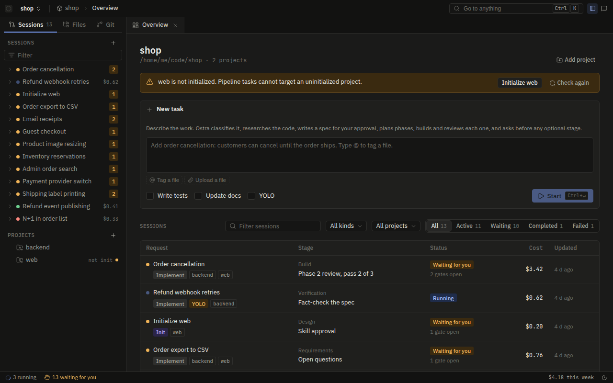
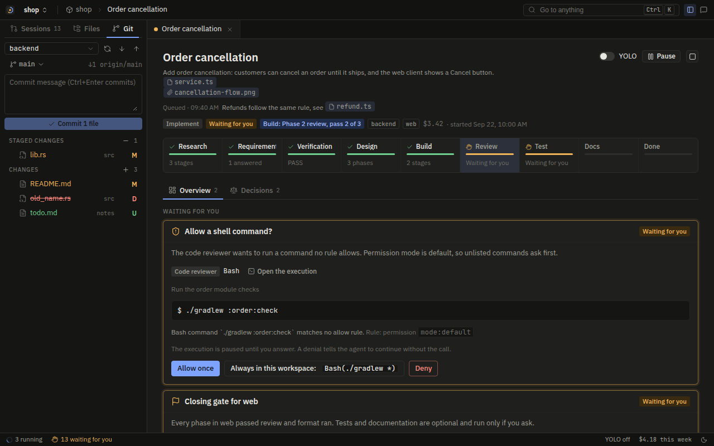
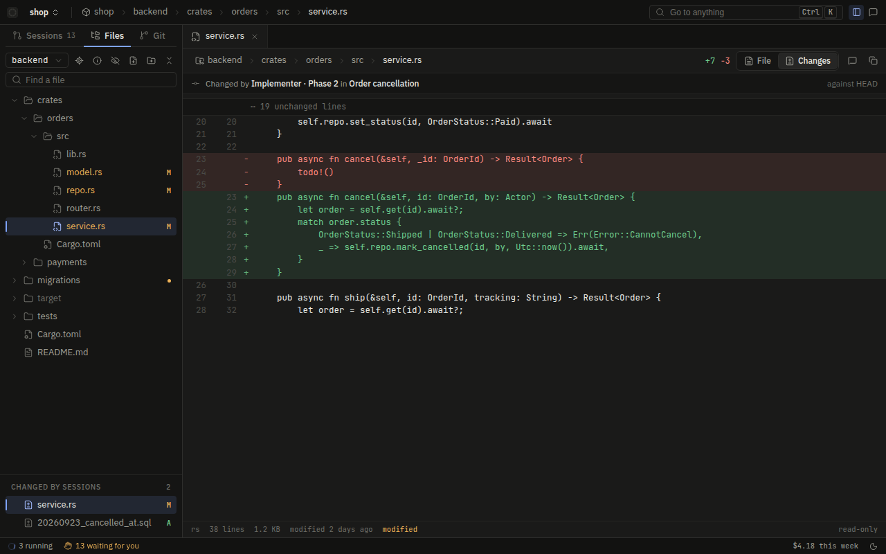
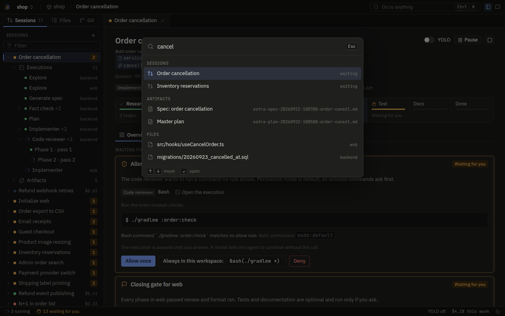
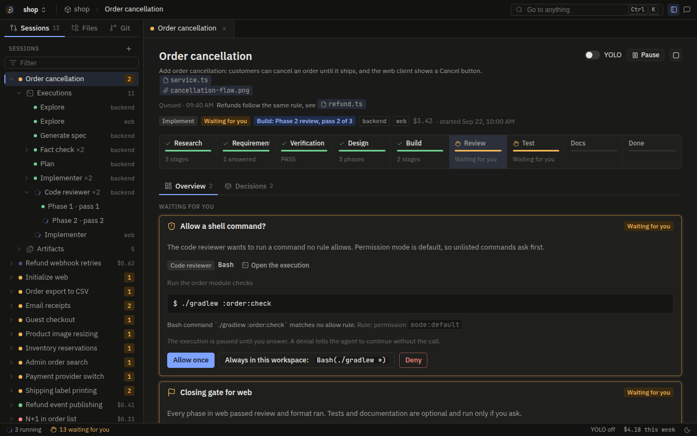
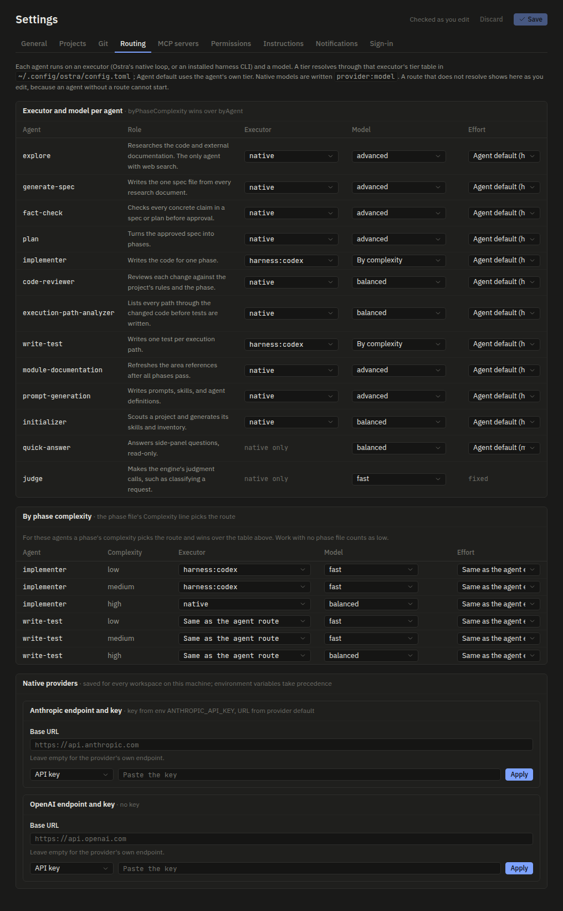
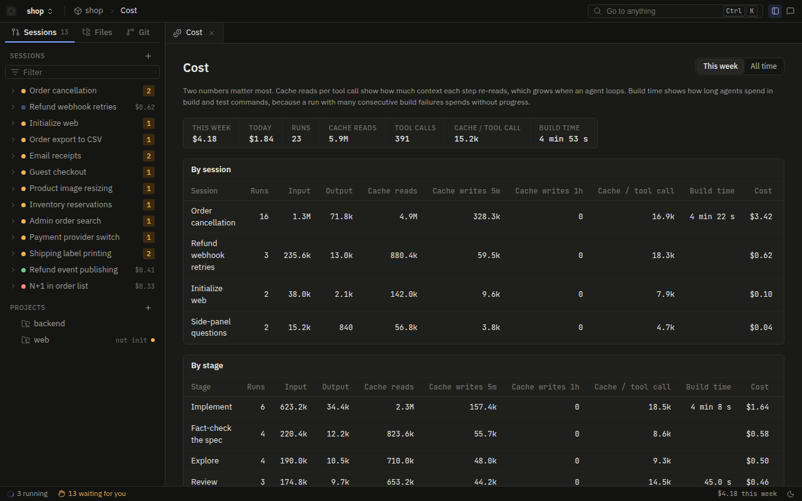
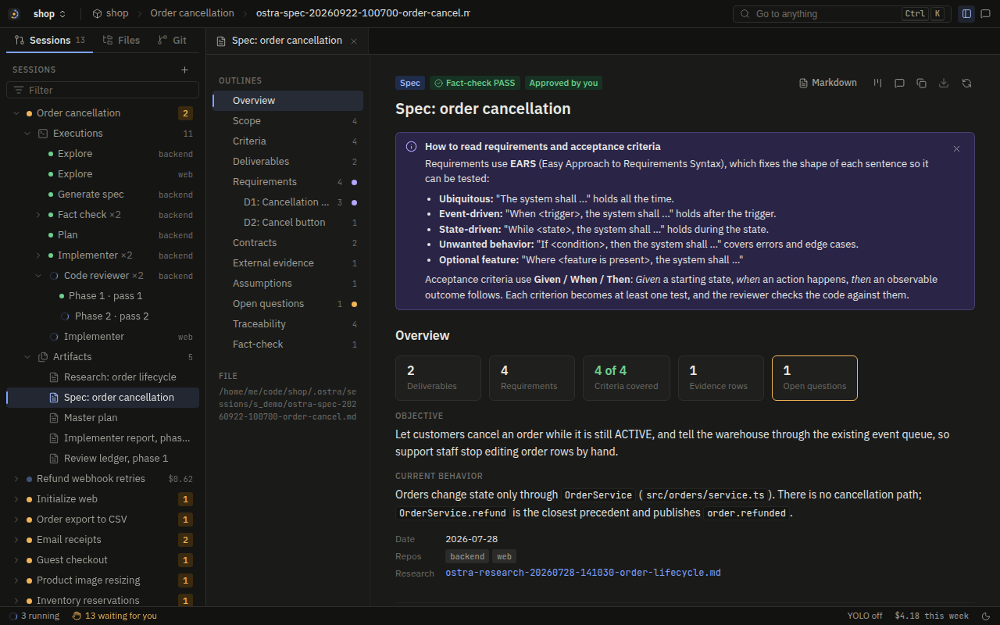

# Ostra handover

Status on 2026-09-22: the design is agreed and nothing is built. This document is the brief for whoever builds
Ostra. It records every decision taken so far, the design that follows from them, and where in the Ultracode
plugin each behavior comes from.

The Ultracode source lives at `../ultracode`, written `UC/` below. Read it for
behavior, rules, and measured facts. Do not copy its code: Ostra is a new implementation in Rust and React, and
most of Ultracode's code exists to adapt to four foreign hook engines that Ostra does not have.

## 1. What Ostra is

Ostra is a local development workspace that runs the Ultracode engineering pipeline: research, spec,
fact-check, plan, build, review, test, and docs. The user starts one binary and works in a browser tab. A Rust
server executes every tool call. Code drives the pipeline from stage to stage and holds every gate. Models do
the work inside each stage and answer a small, named set of judgment questions.

The audience is a developer learning a standard software development lifecycle. Every stage is shown,
explained, and gated. Ostra is a workspace, not a chatbot: quick questions go to a side panel, and real work
goes through the pipeline.

## 2. Decisions

All decisions below were made by the user on 2026-09-22. Treat them as requirements.

| Topic | Decision |
| --- | --- |
| Name | Ostra. Binary `ostra`, crates `ostra-*`, per-project and per-workspace runtime dir `.ostra/`. |
| Model access | API keys. Anthropic and OpenAI, abstracted behind a Rust provider trait and configured in TOML. |
| UI | The whole UI runs in the browser, in React. It includes a live terminal view of each harness execution, the same way task executions from other harnesses are shown. |
| Backend | A Rust server executes all tool calls and holds all state. |
| Orchestrator | A code-driven engine. It makes a model call only where a decision needs judgment. |
| Relationship to Ultracode | A complete rewrite, based on the plugin's prompt-driven workflow, its hooks, and its MCP tools. Not a fifth generator target. |
| Deployment | Localhost, same machine as the code, single user, for the first build. |
| Workspace | The user creates a dev workspace. It holds settings: which executor and model each agent task runs on, the tech stack of each project, memory, custom instructions, YOLO, and permissions. |
| Projects | The user imports existing folders into a workspace at any time, like Claude Code's `/add-dir`, or clones a git repository into it (6.4). To start a new project the user creates it by hand and imports it. Ostra does not scaffold projects in v1. |
| Executors | Each subagent task is routed to an executor: Ostra's native agent loop, or an installed harness CLI (Claude Code, Codex, Grok Build, Antigravity). The terminal view streams that harness's own interface, not a shell. |
| Permissions | Claude Code's model: modes plus allow, ask, and deny rules. |
| YOLO | Every permission is granted and every user-facing question is answered by the engine. The orchestrator decides everything. See section 10.5 for the exact boundary. |
| Scope | Full conversion of the plugin in v1. |
| Notifications | Browser push. |
| Quick questions | A side panel, outside the pipeline. |
| Repository | One monorepo: Rust crates plus a React frontend. React so a later cross-platform frontend can share components. |
| Sessions | Session tracking is mandatory. Every execution, including every harness session, is resumable from it. |

## 3. Glossary

| Term | Meaning |
| --- | --- |
| Workspace | The unit the user creates. A directory holding `.ostra/workspace.toml`, the workspace database, and session artifacts. |
| Project | An imported folder, usually a git checkout. Referenced by absolute path, never copied. Has a project key. Ultracode calls this a repo. |
| Project key | Lowercase slug (`[a-z0-9][a-z0-9-]*`) naming a project inside a workspace. Ultracode's repo key. |
| Session | One request carried through the pipeline. Ultracode's `ultracode-session-*` directory plus its gates. |
| Stage | One node of the pipeline: explore, spec, fact-check, plan, a phase, review, format, closing gate, test, docs. |
| Execution | One run of one agent. Ultracode's subagent spawn. |
| Executor | What runs an execution: `native` (Ostra's agent loop on an API key) or `harness:claude`, `harness:codex`, `harness:grok`, `harness:agy` (an installed CLI in a PTY). |
| Tier | `fast`, `balanced`, `advanced`, or `frontier`. Resolved per executor to a concrete model. |
| Judge call | A model call the engine makes to reach an orchestration decision. Returns JSON against a schema. |
| Gate | A point where the pipeline waits for a decision: a user answer, or under YOLO a judge answer. |
| Guard | A policy rule no permission, no user instruction, and no YOLO setting can override. |
| Book | The documentation the docs stage writes for a set of projects, in `<workspace>/.ostra/docs/<book>/`: one part per project, a glossary, and a system architecture when it covers two or more projects. Section 8.5. |

## 4. Architecture

```
Browser (React)
  Home · Workspace · Session board · Execution (Activity | Terminal) · Artifacts · Gates
  Settings · Memory · Cost · Quick-questions side panel
        │  REST + WebSocket (JSON events, binary PTY frames)
Rust server `ostra` on 127.0.0.1
  api ── engine (state machine, scheduler, judge)
          ├── executors: native loop │ harness (PTY + hook bridge + MCP stdio shim)
          ├── policy (guards + permissions) ── tools
          ├── providers (anthropic, openai)
          ├── store (SQLite event log + FTS5 memory)
          ├── notify (Web Push)
          └── assets (embedded agent prompts, skills, refs)
Disk
  ~/.config/ostra/config.toml                    providers, tiers, global permissions
  ~/.local/share/ostra/registry.db               workspace list, push subscriptions, VAPID keys
  <workspace>/.ostra/workspace.toml              workspace settings
  <workspace>/.ostra/workspace.db                sessions, events, executions, decisions
  <workspace>/.ostra/sessions/<session-id>/      session artifacts (spec, plan, phases, reports, ledgers)
  <project>/.ostra/                              INVENTORY.md, project.toml, skills/, memory/knowledge.sqlite3
```

The per-project `.ostra/` is committable, like Ultracode's `.ultracode/`. Session artifacts live under the
workspace because a session spans projects. That replaces Ultracode's "primary repo root": the workspace root
owns all session state, so the `Primary repo root:` spawn parameter becomes `Workspace root:`.

## 5. Where each behavior comes from

Read these before building the matching part. Paths are relative to `UC/`.

| Ostra part | Read in Ultracode | What it gives you |
| --- | --- | --- |
| Engine rules | `commands/orchestrate/prompt.md` | Every pipeline rule: D1 to D10, M1 to M6, T1 to T7, Hard rules 1 to 24, YOLO mode, answer routing, the code-review loop (Step 4). This file is the engine's specification. |
| Init flow | `commands/init-kit/prompt.md`, `agents/initializer/prompt.md` | Detect, scout, propose, approval gate, generate-skill, generate-inventory, adopt. |
| Agent prompts | `agents/<name>/prompt.md`, `agents/<name>/definition.json` | The 11 leaf agents, their tools, tiers, efforts, timeouts. |
| Spawn contract | `hooks/subagent-parameters.json`, `hooks/lib/subagent-params.js` | Required `Label: value` lines per agent and per initializer mode, with types. |
| Repo brief | `hooks/lib/context-brief.js` | What each agent is handed from the profile and inventory, and the containment rule that avoids stating a fact twice. |
| Tool names | `definitions/tool-mapping.json` | Per-harness tool names and the skill-loading strategies for harnesses without a Skill tool. |
| Model tiers | `definitions/model-mapping.json`, `hooks/model-router.js` | Tier-to-model per harness, `default`/`inherit`, deny on a mismatching caller model, phase-complexity lookup. |
| Write scope | `hooks/lib/scope-policy.js`, `hooks/scope-guard.js`, `hooks/bash-scope-guard.js` | Per-agent write roots, session-only agents, the initializer subtree, implementer barred from test paths. Ultracode's module-documentation subtree is replaced by the engine-written books (8.5). |
| State ownership | `hooks/lib/ledger-policy.js`, `hooks/artifact-guard.js` | Which actor may write which state file. |
| Report paths | `hooks/lib/report-policy.js`, `mcp/lib/report.js` | Declared report path, any tool may write it, invented names refused, lesson gate. |
| Build loops | `hooks/build-streak.js`, `hooks/build-streak-gate.js`, `hooks/lib/build-signal.js` | Consecutive-failure counter, recall at 2, warn at 3, refuse at 5, diagnostic signatures, recovery lessons. |
| Review cap | `hooks/review-cap.js` | Cap of 3 per loop, YOLO budget of 10, one verification pass per escalation. |
| Security | `agents/code-reviewer/prompt.md` Step 2.5, `hooks/security-block.js` | The `SEC-BLOCK-*` catalog, waiver detection, the documentation block (Hard rule 21). |
| Plugin tamper | `hooks/lib/plugin-policy.js` | Why an agent must not run the tool's own code, and the opaque interpreter write channel (`node -e`, heredoc, pipe). |
| Shell parsing | `hooks/lib/shell-paths.js` | Write-target extraction, heredoc bodies as data, placeholder `<ID>` not a redirect. Its test cases in `tests/test_definitions.test.js` are the edge cases to keep. |
| Gates | `mcp/lib/gate.js`, `hooks/pipeline-gate.js` | Approval requires a fact-check PASS under the same key. Plan gate before phase spawns. |
| Memory | `mcp/lib/memory.js` | FTS5 schema, dedupe on (area, lesson), area sub-scopes, bm25 ranking, targeted forget. |
| Hub | `docs/hub.md`, `mcp/lib/hub/state.js` | Task routing by harness, leases, session query with inferred stage, adoption, YOLO notices. Ostra keeps the concepts and drops the transport. |
| Harness facts | `docs/harness-limitations.md`, `docs/model-routing.md` | Measured behavior of each CLI's hooks, payloads, ask channels, size caps, MCP registration. Needed for harness executors. |
| Cost metrics | `bench/`, `docs/philosophy.md` | Which metrics matter (cache reads per tool call, preamble, build loops) and why. |
| Stack references | `refs/*.md` | Detection signals, component catalogs, commands, review rule seeds per stack. |
| Rationale | `docs/philosophy.md`, `docs/architecture.md`, `README.md` | Why each stage exists. The session board's "why this step" text comes from the table in `philosophy.md`. |

## 6. Workspaces and projects

### 6.1 Creating a workspace

The wizard asks for a name and a directory. It checks that at least one provider in `~/.config/ostra/config.toml`
has a usable key, and lists which harness CLIs are installed and logged in. It writes
`<workspace>/.ostra/workspace.toml` with seeded defaults (section 7) and registers the workspace in
`registry.db`. A workspace with no projects is valid: the user adds them next.

### 6.2 Importing a project

The user adds a folder at any time, from the wizard or from workspace settings, like `/add-dir`. Ostra:

1. Records the absolute path and asks for a project key (suggested from the folder name, same slug rule as
   Ultracode's init-kit Step 0).
2. Checks for `<project>/.ostra/INVENTORY.md`. If it is missing, the project shows "not initialized" and Ostra
   offers the init flow (section 8.4). No pipeline task may target an uninitialized project. This is
   `UC/hooks/skill-init-guard.js` as a precondition.
3. If `<project>/.ultracode/` holds a complete Ultracode bootstrap, offers to migrate it, the way the
   initializer's `adopt` mode does. Nice to have, not blocking.

Removing a project from a workspace deletes nothing on disk.

### 6.3 Per-project state

`<project>/.ostra/` holds:

| File | Content | Written by |
| --- | --- | --- |
| `INVENTORY.md` | Commands, skills, skill application mapping, module map, review rule set. Same shape as `UC/refs/inventory-and-profile.md` section 1, without the module map's `Reference` column. | initializer |
| `project.toml` | Stack, commands, test framework, module map, skills with paths, conventions, review rules. Ultracode's `repo-profile.json` without `models` and `harnesses`, which move to the workspace. | initializer, user |
| `memory/knowledge.sqlite3` | Durable lessons. | memory tools, user through the UI |

Per-project skills, including `convention`, live in `<project>/.agents/skills/<name>/SKILL.md`,
the cross-harness standard. They are written by the initializer, prompt-generation, and the user. The docs stage writes no skill: it
writes the workspace documentation books (8.5). Projects initialized before this kept skills in `.ostra/skills/`, which Ostra
still reads but never writes a new skill to; a name in both resolves to `.agents/skills/`. Other harness
directories (`.claude/skills/` and the rest) are not loaded until a skill is adopted into `.agents/skills/`.
Every executor loads a skill by its path, which Ultracode measured as the one mechanism that works on every
harness (Claude resolves names, Codex and Grok subagents need the path).

Every execution's first message carries the project's own agent instruction files after the repo brief:
`CLAUDE.md`, `AGENTS.md`, and `AGENT.md` at the project root, matched in any letter case, each cut at 12,000
characters, with a link or identical copy of a file already included left out.

A new project is created by the user outside Ostra and imported, or created during a session's build with
`ProjectCreate`, when the approved plan puts phases in a codebase no project holds (section 10.7). The init flow works from
whatever code exists. For an empty folder, the stack chosen in project settings, or given in the
`ProjectCreate` call, seeds skills from `refs/<stack>.md` in the convention-seeded mode
`UC/refs/skill-archetypes.md` (Archetype D) already describes.

### 6.4 Cloning and pulling from git

The Add project dialog can clone a repository instead of importing a folder, so a workspace can live in a
container with no host checkout. Ostra runs `git clone` into `<workspace root>/<key>` or a chosen empty folder,
streams git's progress to `workspace:<id>` as `git_progress`, and imports the checkout the way 6.2 does. A
failed clone removes what it wrote. A project that is a git checkout can be pulled from its board: the pull is
`git pull --ff-only` on the checked-out branch, and it is refused while a running or waiting session has the
project in scope, because it would change files under an implementer.

- Remotes are `https://`, `http://`, `ssh://`, or `user@host:path`. Local paths, `file://`, and `ext::` are
  refused, because they read or run things on the server's machine. A URL that carries a password is refused,
  because git keeps the URL in `.git/config`.
- Git credentials are saved from Settings, Git, in `registry.db` next to the provider keys, for every
  workspace. One is an HTTPS token (with an optional user name) or an unencrypted SSH private key, and names a
  host with an optional path prefix (`github.com/acme`). The longest matching prefix for the remote's kind
  wins; a host without a port matches any port. Secrets are write-only. A key can be pasted or imported from a
  file, which the browser reads and sends like a pasted one. The settings page says that credentials stay on the
  machine that runs Ostra (its data folder, or the data volume under Docker).
- Git receives a credential per command only: a token through a one-off `credential.helper` that reads the
  process environment (the user's own helpers are dropped for that command, so the token is never copied into
  them), a key through a 0600 temporary file named in `GIT_SSH_COMMAND`. Neither reaches `.git/config`, an
  agent's environment, or a harness, so an agent cannot push with them.
- Every git command runs with `GIT_TERMINAL_PROMPT=0` and SSH `BatchMode=yes` with
  `StrictHostKeyChecking=accept-new`, so a missing credential fails instead of waiting on a prompt.

### 6.5 Workspace artifacts

Workspace artifacts are files the user keeps for every session of a workspace: custom skills, technical
documentation, guidelines that apply to all projects, and test materials or sample data. The Artifacts tab of
the left dock shows them in the same file tree as the Files tab, in folders such as `skills/house/SKILL.md`: a
row drags into a request field as a tag or onto another folder to move it, a right click opens the menu (new file or folder, upload, copy path or
tag, download, hide or show, delete), and files from the computer drop onto a folder to upload. Selecting an
artifact opens it in the file editor, as tab `file:_artifacts:<path>`, because the Files endpoints serve the
`_artifacts` key from the artifacts folders. Visible artifacts live in `<workspace>/.ostra/artifacts/`, which
`.ostra/.gitignore` does not list, so a team can commit them.

- Rule W1: every agent can find and read the visible artifacts, and none can write them. The repo brief lists
  them after the project instruction files (at most 40, then a count and the folder for Glob), harness CLIs get
  the folder as an extra directory, and the Bash sandbox mounts it read-only. The `workspace-artifacts` guard
  refuses any write, move, or delete in the folder, in every mode. A `skills/<name>/SKILL.md` artifact loads
  with the Skill tool by name, after the project's own skills.
- Rule W2: the user hides a folder or a file as one unit, and a hidden folder hides everything in it, including
  files created, uploaded, or moved into it later. Ostra records the units in
  `<data dir>/hidden-artifacts/<workspace id>.units.json` and keeps one invariant: a path is stored under
  `<data dir>/hidden-artifacts/<workspace id>/` exactly when it lies within a unit, so the secret-read guard and
  the sandbox keep it from every agent and harness. A hidden artifact is left out of the brief and the `@` tag
  list, a task or addition that tags it is refused, and an instruction that tags it fails validation. The tree
  still lists it with a hidden mark, so the user can open, show, or delete it. What lies inside a hidden folder is
  shown only with the folder. A move keeps a hidden artifact hidden. Hiding is allowed at any time. Hidden
  artifacts stay on this machine and do not travel with the folder. The sandbox is what keeps a shell command out
  of the data dir; while agent commands run unsandboxed (mode `off`, or `auto` without a sandbox), the Artifacts
  tab and the Sandbox setting warn that shell commands can read hidden artifacts.
- Rule W3: a task, an addition, or an instruction tags an artifact as `@_artifacts/<path>`. No project key can
  take `_artifacts`, because project keys start with a letter or digit. A tagged artifact reaches the agents as
  its absolute path, like a tagged project file (Rule C1). An instruction may also tag a project file as
  `@<key>/<path>`; each tag becomes a line with the absolute path under the instruction. Saving settings refuses
  an instruction tag that names a missing or hidden artifact.
- Rule W4: an artifact is deleted or moved only while no session in the workspace is running, waiting, stalled,
  or paused and no execution runs, because an agent may be reading it at its old path. Both take the workspace's
  work lock, so no session starts between the check and the change. A move keeps a hidden artifact hidden.
- Caps: 25 MB per upload, 1 MB for a save from the editor, 2,000 artifacts per workspace.

## 7. Settings

### 7.1 Global config

```toml
# ~/.config/ostra/config.toml

# Rule G1: "disabled" (default) or "enabled". See section 10.4.
tool_enforcement = "disabled"

[providers.anthropic]
api_key_env = "ANTHROPIC_API_KEY"

[providers.openai]
api_key_env = "OPENAI_API_KEY"

# A base URL and an API key or auth token can also be saved from the browser. They live in the registry
# database, never in this file or a response. Order for the key: the environment variables, then the saved
# key, then the keychain. Order for the base URL: `base_url` here, then `base_url_env`, then the saved URL.

# Tier to model, per executor. Native entries are provider:model.
[tiers.native]
fast     = "anthropic:claude-haiku-4-5-20251001"
balanced = "anthropic:claude-sonnet-5-5"
advanced = "anthropic:claude-opus-5-5"
frontier = "anthropic:claude-fable-5-1"

# Harness entries are the CLI's own model slug. Defaults from UC/definitions/model-mapping.json.
[tiers.claude]
fast = "haiku"
balanced = "sonnet"
advanced = "opus"
frontier = "fable"

[tiers.codex]
fast = "gpt-5.6-luna"
balanced = "gpt-5.6-terra"
advanced = "gpt-5.6-sol"
frontier = "gpt-5.6-sol"

[tiers.grok]
fast = "grok-4.5"
balanced = "grok-4.5"
advanced = "grok-4.5"
frontier = "grok-4.5"

[tiers.agy]
fast = "flash"
balanced = "flash"
advanced = "flash"
frontier = "flash"

[harness.claude]
command = "claude"

[harness.codex]
command = "codex"

[harness.grok]
command = "grok"

[harness.agy]
command = "agy"

[permissions]
deny = ["Bash(rm -rf /*)"]
```

Keys come from environment variables or the OS keychain. They never reach the browser.

### 7.2 Workspace settings

```toml
# <workspace>/.ostra/workspace.toml
name = "shop"

[[projects]]
key = "backend"
path = "/home/me/code/shop-backend"

[[projects]]
key = "web"
path = "/home/me/code/shop-web"
# Optional: a program that answers code navigation for the Files view (12.5).
code_provider = { command = ["shop-nav", "--stdio"], timeout_secs = 10 }

# Which executor runs each agent. Absent means native.
[routing.executor.byAgent]
implementer = "harness:codex"
write-test = "harness:codex"

[routing.executor.byPhaseComplexity.implementer]
low = "harness:codex"
medium = "harness:codex"
high = "native"

# Which tier each agent runs on, resolved through the chosen executor's tier table.
# Seeded from UC/refs/inventory-and-profile.md. Every agent must have a route.
[routing.model.byAgent]
explore = "advanced"
generate-spec = "advanced"
plan = "advanced"
fact-check = "advanced"
code-reviewer = "balanced"
execution-path-analyzer = "balanced"
documentation = "advanced"
system-architecture = "advanced"
prompt-generation = "advanced"
initializer = "balanced"
judge = "advanced"
quick-answer = "balanced"

[routing.model.byPhaseComplexity.implementer]
low = "fast"
medium = "fast"
high = "balanced"

[routing.model.byPhaseComplexity.write-test]
low = "fast"
medium = "fast"
high = "balanced"

# Reasoning effort: low | medium | high | xhigh | max. Absent keeps the agent's `agent.toml` effort.
[routing.effort.byAgent]
plan = "high"

[routing.effort.byPhaseComplexity.implementer]
high = "xhigh"

[instructions]
all = "Write British English in comments and docs."

[instructions.agents]
implementer = "Keep functions under 40 lines."

[yolo]
default = false

[permissions]
mode = "default"            # default | acceptEdits | plan | bypass
allow = ["Bash(./mvnw *)", "Bash(npm run test *)"]
ask = []
deny = ["Bash(git push *)"]

[notifications]
push = true

# External MCP servers (10.6). `command` for a local server, `url` for a remote one.
[[mcp_servers]]
name = "github"
url = "https://api.githubcopilot.com/mcp/"
headers = { Authorization = "Bearer ${GITHUB_TOKEN}" }
disabled_tools = ["delete_repository"]

[[mcp_servers]]
name = "docs"
command = ["npx", "-y", "@upstash/context7-mcp"]
agents = ["explore", "generate-spec"]   # empty or absent: every agent
timeout_secs = 120                      # one tool call, 1 to 600

[[mcp_servers]]
name = "linear"
url = "https://mcp.linear.app/mcp"      # signs in with OAuth when the server asks
# oauth = { client_id = "...", client_secret_env = "LINEAR_SECRET", scopes = ["read"] }
```

Routing rules, carried from `UC/hooks/model-router.js` and `UC/docs/model-routing.md`:

- `byPhaseComplexity` wins over `byAgent`, for executor, model, and effort alike. The complexity comes from
  the phase file's `**Complexity:**` line. Work with no phase file counts as `low`. Only the implementer and
  write-test route by complexity.
- A tier value may also be a concrete model, or `{ native = "...", codex = "..." }` for an explicit
  per-executor choice. There is no silent fallback: a route that does not resolve is a settings validation
  error shown at save time, not at spawn time.
- Settings are re-read on every execution, so an edit applies to the next execution without a restart.
- The initializer runs generate-skill on `advanced` and its other modes on `balanced`, as init-kit does today.
  The `initializer` route above sets the other modes.

### 7.3 Commands from folder files

`.ostra/workspace.toml` and `.ostra/project.toml` can arrive with a repository, a `git pull`, or an agent's
edit, so Ostra does not run what they name until the user approved that exact content.

- Rule A1: the command-bearing parts of a folder file start only while the registry holds the user's approval
  of their hash. For `workspace.toml` these are `mcp_servers` (command, env, url, headers, oauth, enabled),
  each project's `code_provider` and `language_servers`, and `permissions.allow`. For `project.toml` it is
  `commands.format`, the one project command Ostra runs itself. A file with none of them needs no approval.
  While a file waits, no MCP server, language server, or code provider starts, its allow rules do not apply,
  and a format step is recorded as skipped with no exit code. Settings shows the exact commands, env and
  header names (never values), and the server variables they read, with Approve; the approval carries the
  hash the browser showed and is refused when the file changed since.
- A save made in Ostra keeps an approved file approved with its new content, so the user's own edits never
  ask. A save of a file that waits keeps it waiting, so a save cannot approve commands the user was not shown.
  A new workspace's file is approved; a file already in the folder when the workspace is created is not.
  Workspaces registered before approvals existed have their files approved once, at the first start.
- Rule A2: the permission mode and YOLO live in the registry per workspace, never in a folder file. A folder
  file's `permissions.mode` and `yolo` are ignored, and Ostra no longer writes them there. The same holds for
  spend limits, tool enforcement (Rule G1), the sandbox mode, the sandbox network choice (`sandbox_network`, in place of the global
  `[sandbox] network`), the sandbox's extra allowed hosts (`sandbox_allowed_hosts`), which add to the
  global `[sandbox] allowed_hosts` and never remove a global or built-in host, and the workspace's own decoy
  files (`sandbox_decoys`, `~/` paths, at most 32), which add to the built-in decoys and never remove one,
the workspace's readable credentials (`sandbox_readable`, at most 32), which add to the global
`[sandbox] extra_readable`: credential files or dirs agents may read, read-only, with no decoy on them, and never
Ostra's data dir, config dir, or master key file,
  and, for macOS, the loopback choice (`sandbox_loopback`, `open` by default or `listed`) and blocked loopback
  ports (`sandbox_blocked_ports`, at most 64), which exist per workspace only.

## 8. The engine

### 8.1 Model

Each session is a state machine. Every transition, every judge decision, every gate answer, and every
execution result is appended to the `events` table. A session's state is the fold of its events, so a server
restart replays and continues. The artifacts agents write stay files in the session directory, because the
prompts address them by path.

```
Intake → Classify* → Explore ×N (parallel, per project or area) → Sufficiency* → Track* ─┐
┌─────────────────────── light: one inline phase per project ────────────────────────────┤
│  full: Spec → Open questions (gate) → FactCheck(spec) ⟲ → Spec approval (gate)          │
│        → Stakes* ── low: skip plan ─────────────────────────────────────────────────────┤
│                 └─ medium/high: Plan → FactCheck(plan) ⟲ → Plan approval (gate) ────────┤
└────────────────────────────────────────────────────────────────────────────────────────┘
→ Phases (DAG; per project sequential, across projects parallel; each phase: implement ⟷ review loop, stage)
→ Implementation review (gate) ⟲ feedback → Feedback* → revision phases (reviewed, staged)
→ Format (per project, once)
→ Closing gate (tests? docs?) → EPA ×N (parallel) → WriteTest (one phase at a time, review loop, stage)
→ Module documentation → Completion report*

* judge call     ⟲ FAIL goes back to the owning agent with the previous findings
```

IMPLEMENT runs on one of two tracks. The light track is the default: research, then one inline phase per project
built from the request and the research documents. The Track judge moves a request to the full track, which
adds the spec, the plan, and their approvals, only when the research shows the change needs settled
requirements. The user can force either track from the New task form, or override the judge until the spec or a
phase starts.

Categories other than IMPLEMENT and PLAN take shorter paths, exactly as `UC/commands/orchestrate/prompt.md`
Step 1 lists them: RESEARCH (explore only), SPEC (explore, spec), VERIFY (implementer running the test command),
TEST (the test stage alone: EPA, write-test, review, no closing gate), PROMPT (prompt-generation, then review if code changed),
QUICK ANSWER (routed to the side panel). Ostra adds QUICK CHANGE (one implementer pass on the native executor).

### 8.2 Rules as code

Every rule ID stays, and the code that implements a rule cites it in a one-line comment. Section references are
to `UC/commands/orchestrate/prompt.md`.

| Rule | Engine behavior |
| --- | --- |
| D1, Hard 15 | PLAN and full-track IMPLEMENT always pass through Spec. There is no transition from Explore to Plan. With no research document, Spec and the light track's phases are not entered. |
| Track | After research, an IMPLEMENT request with no track forced on the New task form asks the Track judge: `light` unless the research shows an open requirement, a changed contract, a schema or data change, an ordered multi-area change, a security-sensitive area, or a need for a new codebase (only an approved plan can put phases in a project that does not exist yet, Rule O2). Light creates one inline phase per project in scope, queued in order (M5), whose implementer gets `No plan:` and every research document. Full runs the spec flow, then Stakes. Overriding is allowed until the spec or a phase starts. |
| F1 | When every phase of an IMPLEMENT session is terminal and nothing runs, the engine opens the implementation review gate before format and the closing stages. `done` accepts; `feedback` with text starts a round. The Feedback judge routes every round and names one target per project it changes; before Rule J1 a round with no spec and one project in scope was built directly, and such recorded rounds still fold that way. On a session with a spec, a `requirement_change` goes into the spec first (D10) and the revision phases are created when the spec is approved again; the approved plan is not re-run. A revision phase is an inline phase with the next free ID, reviewed and staged like any phase, and the gate opens again after it. Under YOLO the gate is answered `done`. |
| F2 | Before a revision spawns and before the review gate opens, the runner writes `ostra-session-context.md` in the session root from the fold: the request, the track, the research documents, the spec and plan, every phase with its report and ledger, and every feedback round. A revision implementer gets it as `Context files:`, the project's earlier reports as `Prior phase reports:`, and its round's instruction as the task, so a session takes any number of rounds without a growing conversation. |
| D2 | Spec is entered only when no explore execution is running and the Sufficiency judge finds no needed `Not covered` item. Spec receives every research document path, oldest run stamp first, including superseded ones. |
| D3 | Open questions from the spec are asked before any fact-check. Every answer re-runs generate-spec, after the Route answer judge (Rule J1). The engine never edits the spec. |
| J1 | Every gate answer with content (open-question answers, approval text, fact-check guidance, review-cap text, a stuck fact, retry instructions, implementation feedback) goes to the Route answer judge, except a stuck gate's `fix` instructions, which are an implementer's task (Rule O8),, or the Feedback judge for feedback, before any agent sees it. A bare choice (approve, stop, retry, accept, a budget raise) is applied at once. The runner records the answer with `routed: true`; the spec, plan, or phase behind it starts nothing until the decision. Per answer the judge picks `deliver` (the asking agent gets it), `remember` (kept for `implement`, `tests`, or `docs`, which get it as `User notes:`), or `discard` (logged only), and may queue up to three research tasks that run before the answer is applied. A later answer can take back or replace a kept note (`forget`, by note ID `N1`, `N2`, ...); a forgotten note stays in the log and reaches no agent. Parts of one answer the judge splits into several items merge: delivered if any part is, every part with stages kept. A typed open-question answer that is not exactly option labels reaches the agent with the options numbered as the console shows them (recommended first), so "1 and 3, plus X" reads alone. A spec question that is not delivered gets an engine-written answer so generate-spec drops it. The user's words decide over the agent's recommendation; the engine's rules (guards, budget, PASS before approval, review cap, BLOCKER removal, D1) apply after the judge whatever it decides. Answers recorded before the rule fold as they did. |
| D3a | `Prior findings:` is `none` on the first pass over an artifact and the previous pass's findings verbatim after, or `no findings on the previous pass` when that pass found nothing, so a revision after a clean pass is still a re-pass. The engine adds no other instruction to a re-pass. |
| D3b | `Source check:` is `refetch` only for a spec target's first pass whose External Evidence table has rows. Everything else is `citations`. |
| D4, Hard 16 | The plan execution's parameters are the spec path, projects in scope, workspace root, session dir, and key, plus the earlier master plan and fact-check findings on a re-spawn. The parameter struct has no field for anything else. |
| D5 | Plan fact-check always uses `citations` and receives the approved spec path. |
| D6, D7, M2 to M6 | The scheduler reads the Phase Index. A phase is ready when every phase it depends on has completed and passed review. One implement pipeline per project at a time. Ready phases in different projects run in parallel. An unreadable dependency means "depends" (M5). |
| D8, T1 to T7 | Test and doc stages never run between phases. Format runs once per project after its last phase and, for IMPLEMENT, after the user accepts the implementation (F1), because a feedback round adds phases. The closing gate is asked once per project, batched when several projects arrive together. `Test policy: Skip` phases are listed as uncovered with the plan's rationale. An explicit request in the task replaces the gate (T3). |
| D9 | A failed phase removes every phase that depends on it from the queue. Independent phases continue. |
| D10, answer routing | A requirement-level answer at any point after the spec exists re-runs generate-spec, then re-approval, then a plan revision. Both revise in place: generate-spec gets only the answers, changes, and research documents its spec does not reflect yet, and the plan agent edits only the phases the spec's diff reaches. |
| Hard 4 | The engine reads each report before the next step. For native and submit-tool outputs this is structured data. The research document, the spec, and the plan are typed documents (10.3), and a submit call naming one is refused while it has a check error or disagrees with the submit's counts and phases. |
| P6, P7 | Each plan step names its skills from its repo's INVENTORY Skill Application Mapping, and Ostra fills a phase's Required Skills with the union of its steps' skills. The Document tool refuses a plan whose step names a skill not installed in its repo, or whose phase has code steps and names no skill in a repo that has skills, because the implementer loads only the skills the phase file lists. |
| Hard 13 | Implementer, write-test, and code-reviewer executions always carry `Phase file:` when a plan exists, or `No plan:` with a reason. |
| Quick change | QUICK_CHANGE is a small edit the request fully describes. It runs one implementer pass per project in scope with `No plan:`, always on the native executor whatever the routing says, because a harness adds seconds of startup to a change that takes one edit. No research, spec, plan, review, format, or closing stage runs. Changed files are staged, then the completion report. |
| Staging | After a phase's review passes, the engine runs `git -C <project> add` on the implementer report's changed files. Reviews use `Review scope: unstaged`. |
| Review loop, Step 4 | Findings split into BLOCKER, auto-fixable, and the rest, using the project's review rule set. Auto-fixable findings are applied by the engine from their exact `Change \`x\` to \`y\` on line N` text. HIGH and MEDIUM go to the fix agent with the ledger path. The cap is 3 iterations per loop, counted by the engine. The 4th pass is a gate. |
| Hard 21, security | A BLOCKER finding sends only the BLOCKER findings to the fix agent with a removal instruction, loops until clear, has no cap, and blocks the project's documentation. No gate answer can waive it. |
| HANDOFF | The engine runs prompt-generation with the handoff request, then resumes the original agent with its resume instructions. |
| STUCK | The Rescue judge picks one: run a targeted explore, re-run the agent with the missing fact quoted, send an environment failure to the advisor (Rule O7), or raise a gate. At the gate the user states the fact, sends an implementer to fix the cause (Rule O8), or blocks the work. Never a plain retry. |
| C1 | A request or an addition may attach up to 50 files or folders, tagged in the text as `@project/path`, a folder with a trailing `/`. Each is an existing file or folder inside one of the session's projects, checked when the API receives it; a path with `..`, an absolute path, or a trailing `/` on a file is refused. Every agent that gets the request gets each one as an absolute path beside its tag, with the instruction to read each file and look through each folder. |
| C3 | The user may upload up to 20 files of at most 25 MB each with a request or an addition. A file is staged in the workspace (`POST /api/workspaces/:ws/uploads`), because a new task uploads before its session exists, and the request names the staged ids. Creating the session or adding the context moves each file into the session's `uploads/` folder, never overwriting one there, and records its name, path, and size in the event. Every agent that gets the request gets each upload's path, and the Classify judge names each attached file, folder, and upload in the research tasks it bears on, because a researcher reads only its task. Uploads are session artifacts: they open in the artifact view and download from `GET /api/artifacts/download`. |
| C2 | Context added mid-session is queued or sent now. Queued context lets running executions finish on the old request: while any execution runs, it is held, nothing new starts, and the user may withdraw it (`AmendmentWithdrawn`); when the last running execution finishes, it is released, and the next step sees it. Context sent now cannot be withdrawn. Context sent now first interrupts every running execution; each re-runs from its spawn block with the updated request, not from where it stopped. Once the request is classified (a Research, Spec, Plan, or Implement session), the Route answer judge routes the context before anything starts or re-runs, as Rule J1 does for gate answers: `deliver` adds it to the request every later agent reads, `remember` keeps it only as a note for later stages, `discard` drops it, and research it queues goes to the project the judge names. A delivered `requirement_change` after the spec exists restarts at the spec (Rule D10). The runner records `routed: true` on the event; context added before the rule, or before classification, folds as it always did. Research tasks and a re-run's spawn get every delivered addition beside their task. |
| P1 | A paused session starts nothing: no spawn, judge, command, gate, or YOLO answer. Pausing interrupts every running execution and denies its waiting permission asks. Gates can still be answered and context added; both take effect on continue. |
| P2 | Continuing a paused session resumes each execution the pause interrupted, where it stopped and under its own id: the engine appends `ExecutionResumed` instead of starting a new execution, so its row, Activity, transcript, terminal log, and usage continue, and it runs on the executor and model it started on. A native execution replays its stored transcript, so the provider's prompt cache still covers it, and adds one turn with the prompt "Continue the workflow."; a harness execution runs its resume command with the stored session id and that prompt. A harness is sent Esc before it is stopped, so its session is saved whole. Context added while paused cancels the resume: those executions re-run from their spawn blocks as new executions, because a resumed conversation would not see it. |
| P3 | Ostra pauses a session as in P1 on the third containment signal of one execution, YOLO included. A signal is a Layer 1 denial by the `secret-read`, `self-protection`, or `git-metadata` guard, an egress proxy refusal of a loopback, private, or link-local destination, or a process opening one of the decoy credential files the sandbox plants in hidden credential paths (`~/.ssh/id_rsa` and `id_ed25519` where no SSH port is reachable, `~/.git-credentials`, `~/.vault-token`, plus the workspace's `sandbox_decoys`): on Linux a fake file watched with inotify, on macOS an existing file the policy refuses to read, reported through the system log on an admin account. A refused public host is not a signal, because builds call telemetry hosts; it shows in the Activity view only. The engine records at most three signals per execution, so a retry loop cannot flood the log, and the board names the execution that paused the session. Continuing (P2) is the user's "this was fine": the resumed execution's signal count starts at zero. |
| U1 | The user may skip a running execution whose task the session can do without: research (except a helper's or a rescue's), a phase's test analysis, a docs writer, or the architecture overview. The engine appends `ExecutionSkipped`, stops the run as an interrupt, and the fold ends its task as abandoning its failure gate does, so nothing re-runs it and no gate opens. Context the user adds can skip research too: the Route answer judge lists in `skip` the unfinished research tasks the user names, a running one stops, and a queued one never starts. Work, review, spec, plan, and fact-check are never skipped, because later rules need their results. |
| U2 | The user may send a correction to one running execution, or to one the pause stopped (Rule P2). A running execution stops at once and resumes in place, as P2 does, with the correction as its next message, so it keeps its conversation and its work; a correction sent to a running execution cannot be withdrawn. A paused execution reads the correction when the session continues, and the user may withdraw it until then (`SteerWithdrawn`). Corrections sent before the run reads them join in order. A run that ends before the correction stops it, or one that Send now context (Rule C2) restarts from its spawn block, drops it. A run waiting on another subagent (Rule H2) takes none, because only that answer wakes it. |
| P4 | An execution the user stops ends `cancelled` and opens its failure gate, titled "You stopped ...". Nothing retries it without the user: YOLO leaves that gate open, and a created project's init step goes to the user instead of the advisor. Only a user stops a run in a live session, because a pause or an interrupt records `interrupted` and a stopped session ends. |

### 8.3 Judge calls

These are the only places a model makes an orchestration decision. Each has a short prompt derived from the
matching part of `orchestrate/prompt.md`, a JSON output schema, and runs on the `judge` route (`advanced` by
default, because routing a request or an answer needs the strongest tier). Each decision is stored as an event with its input summary and its reason, and the UI shows it as
"Ostra chose X because Y" with an override button. For a beginner this is where the pipeline explains itself.

| Judge | Output |
| --- | --- |
| Classify | Category, projects in scope, explore tasks (one per project or area), and whether the request already opts into tests or docs. |
| Sufficiency | For each `Not covered` item across the research documents: needed or not, plus the extra explore task if needed. |
| Track | `light` or `full`, with a reason. Asked after research for an IMPLEMENT request with no forced track. |
| Stakes | `low`, `medium`, or `high`, with a reason. `low` skips plan. Full track only. |
| Feedback | For a round of implementation feedback: `requirement_change` or `implementation_detail`, one `{project, instruction}` target per project it changes, and whether the feedback is delivered, remembered for a later stage, or discarded, plus research to run first (Rule J1). |
| Route answer | For every other answer with content (Rule J1): per answer `deliver`, `remember` (with the later stages), or `discard`; research to run first; and requirement change, implementation detail, or stage choice. Doubt resolves to requirement change; the user's words decide over the agent's recommendation. |
| Rescue | For a STUCK report: explore, re-run with a stated fact, advise (an environment failure, Rule O7), or gate. |
| Resolve review | For a review loop at its cap under YOLO: per-finding fix instructions for one fix-and-verify round, or declare the phase blocked. |
| YOLO answer | Under YOLO, the answer to any gate: an open question, an approval, the closing gate, a permission ask. Section 10.5. |
| Completion | The completion report prose, including the stages not run and, under YOLO, the decided-for-you list. |

### 8.4 The init flow

The init flow is `UC/commands/init-kit/prompt.md` as engine stages:

```
detect → scout ×N (parallel, one per slice, max 12) → propose → skill approval (gate)
→ generate-skill ×N (parallel, advanced tier) → generate-inventory → done
```

The approval gate is a table in the UI: per skill, generate, regenerate, reuse, or drop, with the defaults the
propose mode sets. The legacy `adopt` mode becomes the `.ultracode/` migration from section 6.2.

| Rule | Behavior |
| --- | --- |
| I1 | Detect checks the existing setup before it plans any scout: skills in `.agents/skills/` and `.ostra/skills/`, the instruction files, and a prior `project.toml`. Candidate component types that an existing skill already teaches are scouted for counts only. When existing skills cover every candidate type plus `convention`, detect returns no slices and propose runs on the existing skills with no scouts, taking the module map from the prior `project.toml` or the top-level source directories. No slices and no existing skills fail the init. |
| I2 | Every skill the init writes goes to `.agents/skills/`. Regenerating a skill that lives in `.ostra/skills/` writes the new one to `.agents/skills/` and leaves the old file for the user. |

### 8.5 Documentation books

The docs stage writes documentation for people and agents into the workspace, not into a project. A book
covers a set of projects: each project is one part of sections and sub-sections, and a book of two or more
projects also has a system architecture. The console renders a book from `book.json` (`ws:docs` lists the books,
`book:<id>` reads one) with the docs site's renderer, and exports it as one HTML file with the diagrams drawn as SVG,
no script, and a meta policy that loads nothing. Agents read its Markdown, which every brief lists.

| Rule | Behavior |
| --- | --- |
| B1 | One `documentation` agent per project returns that project's part in `submit_documentation`: an overview, then sections of one unit of work each, each with purpose, boundaries (owns and does not own), assumptions, business flow, Mermaid diagrams, tables, separation of concerns, and code references last, and at most one level of sub-sections with the same fields. A run that ends `ok` without a readable submit fails, because the book is built from it. The agent writes no file. |
| B2 | Every section and sub-section lists its assumptions. `validate_submit` refuses a submit with an empty list. |
| B3 | A sequence diagram has at most 8 participants and 20 messages, and a flowchart at most 15 nodes. Its first line must match its declared kind. `validate_submit` refuses a larger or mismatched diagram with the instruction to split it. |
| B4 | When the parts written in a session cover two or more projects, one `system-architecture` agent runs after them and returns `submit_system_architecture`: an overview, one flowchart, components with what each owns, links with protocol, mode, and payload, failure and recovery, and scalability. It reads the parts from `ostra-docs-parts.json`, which the runner writes into the session root from the fold before the spawn. |
| B5 | The engine writes the book after the last docs execution settles (`Step::WriteBook`), records `BookWritten`, and only then completes the session. It writes `<workspace>/.ostra/docs/<book>/book.json`, `index.md`, `glossary.md`, `architecture.md`, and `<project>/<section>.md`, and removes the files of sections that no longer exist. No agent writes that folder (the `workspace-docs` guard, a read-only sandbox mount). A failed write is recorded with its error and the session goes on. |
| B6 | A book is named after its sorted project keys joined with `_` (`api_web`), so a later session on the same projects updates it. The New task form may pick an existing book (`docs_book`). A session's part for a project replaces that project's part in the book, a new architecture replaces the old one, and glossary entries merge by term with the newer definition kept. Each writer gets the existing `book.json` as `Existing book:` and keeps the sections its change does not reach, because its submit replaces the part. The engine reads, merges, and writes a book under one lock, so two sessions updating the same book both keep their parts. |
| B7 | At most `MAX_DOCS_WRITERS` (4) documentation agents run at once in a session, and each also takes a slot of `limits.max_parallel_executions`. |
| B8 | Every agent that learns code has the `docs_search` capability (`DocsSearch` natively, `docs_search` from Ostra's MCP server). It ranks passages, not whole sections: each section and sub-section is cut into its purpose, boundaries, assumptions, business flow, each diagram (by its title and labels, not its Mermaid syntax), each table, concerns, and code references, with long lists in windows of five. BM25 ranks each passage over its label, its code paths and symbols, and its text. A unit (a section, sub-section, glossary term, or architecture aspect) ranks by its title once, its best passage, a share of its second, and a BM25 score of its whole text, and a hit shows only the passages that matched, and within a list or table only the lines that name a query word, so an agent does not read a whole section to find one fact. `tests/evals/book_retrieval/` holds the questions, the labeled book, and the floors. The brief names the tool when the workspace has a book. |
| B9 | Before a project's first docs writer, `Step::PlanDocs` measures its tracked source by module-map area (top-level folders without a map; lockfiles, binaries, generated folders, and files over 1 MB skipped) and records `DocsPlanned` with the areas, the areas the book's current part records, and the areas this session's changed files touch. Areas group in map order to about `AREA_TARGET_BYTES` (384 KB) per writer, at most `MAX_DOCS_AREAS` (20); a project at or under the target, or with source in one area, keeps one writer. A `DOCS` request, a book with no part for the project, or a part recorded in other areas rewrites every area; after a build only touched areas are rewritten and the rest keep their sections. Each writer gets `Area:`, `Area paths:`, and `Other areas:`, documents only its area, and prefixes its section IDs with the area ID. The engine joins areas in order, suffixes a repeated section ID with the area ID, and records each area's sections and overview in `BookPart.areas`. Area writers share the B7 cap; an abandoned area keeps its sections. |
| DOCS | A `DOCS` request documents existing code. Classify always sets `opts_in.docs`. The fold adds one done inline phase per project with closing `(tests no, docs yes)` and format settled, so the session goes straight to the docs stage with no closing gate, and the runner writes `ostra-docs-request.md` with the request as each writer's implementer report. |

## 9. Agents and prompts

### 9.1 Assets

Each agent is `assets/agents/<name>/agent.toml` plus `prompt.md`, embedded in the binary. `agent.toml` carries
the fields of Ultracode's `definition.json`: description, default tier, reasoning effort per executor, tool
capabilities, timeout. Prompts are minijinja templates using the same token set as Ultracode (`{{tool_read}}`,
`{{runtime_dir}}`, `{{skills_dir}}`, and the rest from `UC/docs/definitions.md`), rendered once per executor
type, because a harness executor must see that harness's tool names.

| Agent | Default tier | Output |
| --- | --- | --- |
| explore | advanced | One typed research document through `Document`, then a submit call with its return fields. |
| generate-spec | advanced | One typed spec through `Document`, revised in place with `update`. |
| fact-check | advanced | Submit call: `{verdict, target, findings}`. |
| plan | advanced | One typed plan through `Document`, from which Ostra writes the master plan and one file per phase. |
| implementer | balanced (routed by complexity) | Change report at the declared path, progress log. |
| code-reviewer | balanced | Submit call with findings and `securityBlock`, plus its review ledger. |
| execution-path-analyzer | balanced | EPA report at the declared path: the phase's verification plan (execution paths, system flows, regression suites, a test level per check). |
| write-test | balanced (routed by complexity) | Tests at every level the EPA report assigns (unit, integration, end to end), run with its regression suites; test report at the declared path. |
| documentation | advanced | New, replacing module-documentation. Submit call with one project's part of the documentation book: overview, sections and sub-sections, glossary. Writes no file. Section 8.5. |
| system-architecture | advanced | New. Submit call with the architecture of a book of two or more projects: components, links, failure and recovery, scalability. Writes no file. Section 8.5. |
| prompt-generation | advanced | Changed instruction files plus its report. |
| initializer | balanced (generate-skill on advanced) | Per mode, as in `UC/agents/initializer/prompt.md`. |
| quick-answer | balanced | New. Side-panel answers, read-only. Section 12.3. |
| advisor | advanced (high effort) | New. Submit call `{action, guidance, reason}`: retry a failed step with guidance, or escalate to the user. Read-only. Section 10.7, Rule O5. |

### 9.2 Porting checklist for the prompts

- Remove every `{{#harness}}...{{/harness}}` block and every paragraph about spawn tickets, hub waits, or hook
  channels.
- Rename the `ultracode-` artifact prefix to `ostra-` (`ostra-spec-*`, `ostra-plan-*`, `ostra-review-ledger-*`),
  and change the policy patterns in the same commit.
- Rename `Primary repo root:` to `Workspace root:`. Keep `Repo root:` and `Repo key:` so the prompts change as
  little as possible. The UI says "project".
- Replace "print a single JSON object" endings with a `submit_<agent>` tool whose input schema is that object.
  This covers fact-check, code-reviewer, and explore's return fields. Drop the reviewer's
  `systemMessage`/`hookSpecificOutput` wrapper for a plain schema. Code then reads structured data, so nothing
  scrapes a final message (that removes `UC/hooks/factcheck-record.js` and `agy-message-record.js`).
- Keep each prompt's writing-style section and every rule ID (K1 to K8, S1 to S8, R-a to R-e, AC-a to AC-d, P0
  to P13).
- `UC/commands/orchestrate/prompt.md`, `hub-listen`, and `yolo` are not runtime prompts in Ostra. The first is
  the engine specification and the source of the judge prompts. The other two become engine features.
- `UC/skills/meta-author/prompt.md` and `UC/refs/*.md` are embedded assets the initializer and prompt-generation
  load.

### 9.3 Spawn contract and brief

Port `UC/hooks/subagent-parameters.json` to one Rust struct per agent (and per initializer mode), so a missing
required parameter does not compile. The engine renders the struct as the `Label: value` block the prompts
expect. For harness executors the same struct is validated at runtime too.

Port `UC/hooks/lib/context-brief.js` as the repo brief appended to every execution: commands, skills (name and
path), conventions not already in the inventory, the full review rule set for the reviewer, and the module-map
rows matching paths the task names. Add the workspace's custom instructions (`instructions.all`, then the
agent's own entry). Never include routing settings.

## 10. Executors, tools, and policy

### 10.1 Native executor

A streaming agent loop behind `trait Provider` with Anthropic (Messages API) and OpenAI (Responses API)
implementations.

- System prompt: the rendered agent prompt. First user message: the spawn block plus the repo brief. Loaded
  skills join the cached prefix.
- Prompt caching on the system prompt, the tool definitions, and loaded skills. Every breakpoint uses the
  1-hour TTL, because an execution's turns can sit more than five minutes apart (a long build, a permission ask).
- Reasoning effort maps from `agent.toml` to each provider's effort or thinking setting.
- `timeout_seconds` is a hard budget per execution. Cancel is immediate.
- Long executions compact the conversation once the next request would fill 95% of the model's context window
  (from models.dev): Anthropic on-demand compaction, OpenAI `/responses/compact`, or a client-side summary where
  neither exists. The implementer's progress log is what lets a re-run resume, as in Ultracode.
- Tokens, cache reads, and cost are recorded per execution. Prices come from the models.dev catalog
  (`https://models.dev/api.json`), cached as `models-dev.json` in the data dir and refreshed daily, with a
  first-party listing preferred over resellers and context tiers applied per request. models.dev lists only the
  5-minute cache write, so Anthropic 1-hour writes are priced at twice the input rate. `OSTRA_MODELS_DEV_URL`
  overrides the URL, and an empty value turns fetching off.

### 10.2 Harness executors

A harness executor runs one leaf agent in an installed CLI under `portable-pty`, in the project directory. The
PTY bytes go to the browser, where xterm.js shows the harness's own interface. The user can watch and type
into it.

| Concern | Design |
| --- | --- |
| Prompt | The agent prompt rendered with that harness's tool names and skill-loading strategy from `UC/definitions/tool-mapping.json`, passed as the harness's system prompt addition. The spawn block plus brief is the first user message. |
| Leaf only | The harness's own subagent tool is disabled for the run. Every Ostra agent is a leaf. |
| Final reply | The tool vocabulary tells the agent to reply with only `Done!` after its submit call, because Ostra reads the submit payload and any other text costs output tokens. Checked live: Claude Code, Codex, and Antigravity comply; Grok Build 4.5 may still summarize after a resume. |
| Guards and permissions | Ostra writes a per-execution hook config pointing every PreToolUse and PostToolUse event at `ostra hook --execution <id>`, a subcommand of the same binary. It forwards the payload to `/internal/policy` with an execution token and prints the harness's response shape. One Rust policy engine then serves all harnesses. A permission ask waits for the browser answer. |
| Ostra tools | `ostra mcp-stdio --execution <id>` serves `report`, `memory`, `memory_recall`, the `submit_*` tools, the project tools for an execution that holds a management handle (10.7), and the workspace MCP servers' tools (10.6) over stdio. Stdio, because it is the one MCP registration shape Ultracode verified on all four harnesses (`UC/docs/hub.md`, "Why a stdio shim"). |
| Completion | Detected from the harness's stop event through the hook bridge, and confirmed from its transcript. Needs verifying per harness (section 18). |
| Session id | Claude Code and Grok accept a chosen `--session-id`, so Ostra picks it up front. Codex and Antigravity cannot choose one (`UC/README.md`), so Ostra captures it from the first output event or the transcript. |
| Cost | Read from the harness's own session file. While the execution runs, a file watcher (`notify`) on the file's directory reads each appended line once and reports usage live; the whole file is read again for the final result. Hooks are not used for this, because they exist to enforce policy. Claude Code (`~/.claude/projects/*/<id>.jsonl`) repeats a message's usage on each of its lines, so usage counts once per message id, priced per message model with 5-minute and 1-hour cache writes apart. Codex (`rollout-*.jsonl`) reports running totals whose input includes cached input, priced per increase with the current turn's model. Grok Build (`sessions/<cwd>/<id>/updates.jsonl`) states each turn's cost in `costUsdTicks`, 10^10 per dollar. Antigravity's transcript records no usage, so its executions show no cost. |
| Resume | The Resume button opens a PTY with the harness's resume command and that session id. |
| Read-only session | Open the session, on an ended harness run, reopens its harness session in a new PTY so the user can scroll the work and ask about it (`POST /api/executions/:id/inspect`). It is a new execution outside the pipeline, purpose `inspect`, with no first prompt, so nothing is spent until the user types. The bridge refuses every tool call in it (guard `read-only-session`) and serves no Ostra MCP tool; Claude Code also gets no ToolSearch. The Stop hook never asks it to submit, and there are no idle nudges. It ends when the user leaves the CLI or cancels it, or after 4 hours. It is refused while the run is still running, and for a paused run the session will resume, because the resumed agent would see the questions. |
| Startup prompts | In the first two minutes Ostra answers a folder-trust prompt with trust, and a new-model offer (Codex 0.157 "Meet GPT-6 Luna") with "Use existing model", so the run keeps its routed model. Codex also runs with `check_for_update_on_startup = false`, because a self-update exits the CLI. |
| Auth | The PTY gets the user's environment. A harness started without its auth environment comes up logged out (Ultracode's tmux experience). An unauthenticated harness is shown in settings, and its login flow runs in the terminal view. |
| Unavailable harness | Settings validation refuses a route to a harness that is not installed. At runtime, an auth or launch failure raises a gate: log in, or re-route this execution to native. Under YOLO the engine re-routes to native and records it. |

The per-harness adapters (payload field names, deny and ask shapes, size caps) come from
`UC/hooks/lib/harness.js`, `UC/hooks/lib/common.js`, and `UC/docs/harness-limitations.md`. The facts that
matter most:

- Claude Code: an explicit tool list drops MCP tools it does not name. Hook rewrites go only in
  `hookSpecificOutput.updatedInput`. `ask` is honored even in bypass mode.
- Codex: hooks must be trusted in `/hooks` before they run, and trust is keyed to the hook config hash.
  `codex exec` cancelled MCP calls under the default approval policy on 0.147.0. Unknown `model` values fail
  the run.
- Grok Build: deny and ask reasons are clipped to 256 characters, so put the correction first. Payloads over
  128 KiB lose `toolInput`, and a guard must deny then. MCP servers are hidden in untrusted directories.
- Antigravity: hook output is proto-validated, and an unknown field discards the whole response. PostToolUse
  never carries the tool result. MCP servers register only through `agy mcp add`. Deny uses a top-level
  `decision`, and asks use `force_ask`.

The hub's jobs move into Ostra. Task routing is the executor route. Claims and leases are the engine's
scheduler. Session query, with its inferred stage, is the session list. Adoption is unnecessary because Ostra
owns every session. Push channels and wake commands disappear.

### 10.3 Tools

Native tool names match Claude Code's, because the prompts are tuned to them: `Read`, `Write`, `Edit`, `Bash`,
`Grep`, `Glob`, `Skill`, `WebSearch`, `WebFetch`, plus `Report`, `Document`, `Memory`, `MemoryRecall`, the
management tools `ProjectList` and `ProjectCreate` (section 10.7), the subagent tools `SubagentList`,
`SubagentAsk`, and `SubagentReply` (section 10.8), and the `submit_*` tools.

- `Edit` requires the file to have been read in this execution, and its old string must match exactly once.
- `Grep` and `Glob` use the ripgrep crates (`grep-searcher`, `grep-regex`, `ignore`, `globset`).
- `Bash` runs in a tokio child process with a persistent working directory, a 2-minute default timeout (10
  maximum), and truncated output. Its live output also streams to the execution's Activity view.
- `WebSearch` uses the provider's server-side search tool. `WebFetch` uses the provider's fetch tool where one
  exists, else an HTTP fetch converted to markdown.
- `Report` writes the declared report path (`UC/mcp/lib/report.js`).
- `Document` writes the typed document of explore (research), generate-spec (spec), and plan (plan), whose
  schemas are the structs in `ostra-core/src/doc`. It takes `path` (the `.md` path, `ostra-research-*`,
  `ostra-spec-*`, or the master `ostra-plan-*`) and either `document` (the whole document) or `update`, plus
  an optional `remove` list of ids.
  - Merge: an `update` replaces each top-level field it names, except a list whose items carry an `id`, which
    merges by id. A new id is added in natural id order (`R2` before `R10`), and a known id replaces the
    stored item whole. `remove` drops items by id, and phases by their number. A revision therefore sends
    only what changed.
  - Storage and rendering: the document is stored as `<name>.json` beside `path`, and the markdown at `path`
    is rendered from it with the section names the old templates used, because the downstream prompts and
    fact-check read those sections. A plan also writes `<master>-phase-{N}.md` and its JSON per phase and
    deletes the files of a removed phase.
  - Derived parts: Ostra computes, and the model never writes, the spec's Delivery Order and Traceability
    tables and its counts, and the plan's Deliverable Index, Phase Index, Test Policy Rationale, Requirement
    Traceability, and Step Count Summary.
  - Checks: every write runs the document checks and returns their results. Errors are broken references and
    rules code can decide (uncovered criteria under S1, dangling `R`, `C`, `D`, and `E` ids, `AC{n}.{m}`
    numbering, deliverable and phase cycles, the P10 phase sequence, a missing P12 rationale, P13 binding rules
    not copied verbatim). Warnings cover judgment calls such as one `SHALL` per statement and the S4 size. A
    submit call is refused while an error remains.

### 10.4 Policy

Every tool call from every executor goes through two layers in order.

**Layer 1, guards:** No permission, no user answer, and no YOLO setting overrides these. Each is a port.

**Rule G1, tool enforcement:** the `tool_enforcement` setting (global key, replaced by a workspace value kept in
the registry under Rule A2) decides whether the guards that check where a call reads and writes run. It is
`disabled` by default, because capable models reach files by routes those guards cannot read, such as one
script that edits several files, and the guards refuse that outright. Disabled turns off write scope, the report
path, and self-protection (writes to Ostra's binary, config, and `workspace.toml`, running `ostra`, and inline
interpreter code that writes or spawns). It keeps no tests from implementer, state ownership (including inline
code that names engine state), artifact ownership, workspace artifacts, the Document tool, git metadata, secret
reads, Windows paths, the lesson gate, the build streak, management tools, the coordination gates, Layer 2, and
the sandbox. `enabled` runs every guard in the table below, which protects the pipeline from weaker models at the
cost of more tool calls, since each refused call is spent and retried. The workspace value is set on the
Permissions tab.

**Rule G2, ignored paths:** while an execution runs in a sandbox, its searches never include a path that a
`.*ignore` file hides. Every file whose name is a dot, any text, and `ignore` counts (`.gitignore`, `.ignore`,
`.rgignore`, `.dockerignore`, `.npmignore`, `.prettierignore`, and so on), read with gitignore syntax. Each file
name is its own family: the deepest folder's file decides first, and a `!` line re-includes only within its own
family. A path is hidden when any family hides it or one of its folders. The files apply from the nearest
enclosing git root down; `.git/info/exclude` and the global excludes file join the `.gitignore` family. Ostra's
own `.ostra/` folder and the temp dirs are exempt, because their `.gitignore` files keep them out of git, not out
of an agent's view. Native Grep and Glob skip hidden paths during the walk. The `ignored-search` guard refuses
Grep and Glob from any executor aimed at a hidden path, and shell searches: `rg`, `fd`, and `ag` with a flag that
skips their ignore files or aimed at a hidden path, walkers that read no ignore files (`grep -r`, `rgrep`, `find`,
`tree`, `ls -R`, `ack`) over a tree that holds a hidden path, and git commands that list ignored files. Reading a
known path is not a search and stays allowed. Without a sandbox (`mode = "off"`, or `auto` with no backend) the
rule does not apply and Grep and Glob honor the ripgrep set only.

| Guard | Rule | Source |
| --- | --- | --- |
| Write scope | explore, generate-spec, fact-check, plan, code-reviewer, and EPA write only in their session dir and OS temp. documentation and system-architecture write only there too, because they return the book in their submit call. initializer writes only `.ostra/` and `.agents/skills/`. Everything else stays inside its `Repo root:`. | `scope-policy.js` |
| No tests from implementer | implementer may not write a path matching the test patterns. | `scope-policy.js` |
| State ownership | Engine-owned state (gates, verdicts, progress, streaks, scope records, the memory database) has no writer but the engine. The review ledger is writable by code-reviewer, implementer, and write-test. The security sentinel only by code-reviewer. The progress log only by implementer. | `ledger-policy.js` |
| Artifact ownership | Spec and plan files are written only by their owning agent. | `artifact-guard.js` |
| Workspace docs | No agent writes, moves, or deletes a file under `<workspace>/.ostra/docs/`. The engine writes the books (Rule B5), and the sandbox mounts the folder read-only. | New |
| Document tool | `ostra-research-*`, `ostra-spec-*`, and `ostra-plan-*` files (`.md` and `.json`) are written only by the `Document` tool. A file write, edit, or shell write to one is refused with the correction to call `Document`, because the next render would overwrite it and the browser view would not show it. Fact-check snapshot copies are exempt. | Ostra (no Ultracode source) |
| Report path | For agents given `Report file:`, an `ostra-*` file in the session dir must be that exact path. Any mechanism may write it. | `report-policy.js` |
| Lesson gate | A report is refused while a verified failure-to-recovery transition has no recorded lesson, unless the report tool is called with a stated reason. | `report-policy.js`, `report.js` |
| Build streak | Counted per execution. At 2 failures, recalled lessons are appended to the tool result. At 3, a warning. At 5, build and test commands are refused and the agent is told to return `STUCK:`. | `build-streak*.js`, `build-signal.js` |
| Management tools | Only the implementer of a phase the approved plan puts in a new project calls `ProjectCreate`, only for that project, and only with a well-formed call. Until the project exists, that run writes nothing outside its session dir and temp (Rule O2). | Ostra (no Ultracode source) |
| Ignored paths | Rule G2: a sandboxed execution's searches never include a path a `.*ignore` file hides. | Ostra (no Ultracode source) |
| Tool self-protection | Ostra's binary, assets, config, and databases are read-only to agents. Inline interpreter code that writes files, spawns processes, or names engine state is refused. | `plugin-policy.js` |

**Layer 2, permissions**, in Claude Code's model:

- Modes: `default` (ask for edits and unlisted commands), `acceptEdits` (edits inside the project allowed),
  `plan` (read-only), `bypass` (no asks).
- Rules: `allow`, `ask`, and `deny` lists with patterns such as `Bash(npm run test *)`, `Edit(src/**)`,
  `Read(~/.ssh/**)`, `WebFetch(domain:docs.rs)`. Deny beats ask, and ask beats allow.
- Scopes, merged in order: global config, workspace, session.
- `Bash` commands are parsed with tree-sitter-bash, and each subcommand is matched separately, so
  `npm test && curl evil` does not pass on `Bash(npm test *)`.
- An ask becomes a browser card with "allow once", "always in this workspace", and "deny", plus a push
  notification.

Ultracode hooks that become engine code and need no policy: `session-guard`, `pipeline-gate`, `model-router`,
`spawn-scope`, `spawn-log`, `factcheck-record`, `agy-message-record`, `review-cap`, `security-block`,
`session-resume`, `skill-init-guard`, `profile-read-guard`, `bash-guard`, `monitor-guard`, and the codex spawn
tickets.

### 10.5 YOLO

YOLO means the orchestrator decides everything. With YOLO on for a session:

- **Permissions:** every ask is allowed, including a management tool's (Rule O1). The session behaves as
  `bypass`.
- **Questions:** every gate is answered by the YOLO judge, with no wait: open questions (recommended option
  unless the research says otherwise), spec and plan approval, the closing gate, the review cap, STUCK
  rescues, and harness re-routing.
- **Review loop:** the budget rises to 10 iterations. At the budget the Resolve judge runs one fix round, then
  one verification pass, repeating while it converges (`UC/hooks/review-cap.js`). A loop that stops converging
  blocks that phase, and independent work continues.
- **Record:** every YOLO decision is an event. The completion report ends with a "Decided for you" section
  listing each decision, its reason, and a link to undo or re-run from that point. A push notification fires
  at completion and when a phase is blocked.

YOLO does not change what must be true, because none of these are questions:

- Guards (section 10.4, layer 1) still apply.
- Approval still requires a fact-check PASS. The judge approves only a spec or plan that has one.
- BLOCKER security findings are still removed before the run can complete.
- Explicit `deny` rules still apply. This one needs the user's confirmation (section 18).

YOLO can be set per workspace (`yolo.default`) and toggled per session at any time, taking effect from the next
gate or tool call.

### 10.6 External MCP servers

A workspace lists MCP servers in `mcp_servers` (section 7.2). Their tools reach every agent on every executor,
because Ostra is the only MCP client. The server process keeps one connection per workspace server
(`ostra-server/src/mcp.rs` over the `ostra-mcp` client). The native loop offers the tools directly. Harnesses
get them from Ostra's own MCP server, next to `report` and the `submit_*` tools. No harness registers a
workspace server itself, so one policy and one allowlist cover all four CLIs and Antigravity needs no global
`agy mcp add`.

| Concern | Design |
| --- | --- |
| Transports | `command` starts a local server over stdio in the workspace root, in its own process group, which is ended with the connection. `url` reaches a remote server over streamable HTTP, JSON or SSE answers, with its `Mcp-Session-Id`. Protocol versions 2024-11-05 to 2025-11-25. The older HTTP+SSE transport is not supported. |
| Secrets | `env` and `headers` values may name the server's environment as `${VAR}`, so `workspace.toml` holds no secret. An unset variable is a connection error that names it. |
| OAuth | A remote server that answers 401 needs a sign-in. Discovery follows the MCP authorization spec: the `WWW-Authenticate` resource metadata, else RFC 9728 well-known paths, then RFC 8414 or OpenID metadata, else the 2025-03-26 default endpoints. Ostra registers itself (RFC 7591, public client) unless `oauth.client_id` is set, uses PKCE S256 and the `resource` parameter, and stores the client and tokens in the registry per workspace and server. An expired or refused token is refreshed once; a failed refresh asks for a sign-in again. |
| Sign-in | `POST .../mcp/:name/login` answers the authorization URL, whose redirect is `<browser origin>/mcp/oauth/callback`. The callback is outside `/api`, because the cross-site redirect does not carry the `SameSite=Strict` cookie. Its single-use `state`, valid for 10 minutes, authenticates it instead. |
| Discovery | Every tool the server lists is offered, with its own description and input schema, unless `disabled_tools` names it. `agents` limits a server to some agents; empty means all. The status API connects and reports each server's state, server info, and tools. A tool list older than 30 seconds, or one the server says changed, is fetched again when an execution opens. A failed server is retried no sooner than 20 seconds later, because parallel executions would each start it. |
| Names | A tool keeps Claude Code's canonical name `mcp__<server>__<tool>` in the native loop, the Activity view, and permission rules. A harness sees it as `mcp__ostra__<server>__<tool>`. Server names are lowercase letters, digits, and dashes, at most 24 characters, and not `ostra`. A tool name that is not `[A-Za-z0-9_-]`, or whose bare name passes 52 characters, is shortened with a hash of the original, because providers cap tool names at 64 characters. |
| Executions | Tools are fixed when an execution opens, before a harness starts, because a harness lists MCP tools once. A server that cannot be reached adds one Activity line and the execution runs without it. A server that exited since is started once more on the next call. Results are text: images and binary resources become a one-line note, structured content becomes JSON, and results are cut at 100 KiB. A read-only session gets no workspace tools. |

Rules:

- **M1.** A workspace MCP tool is allowed unless a permission rule says otherwise, because configuring the
  server is the decision to use it. `mcp__<server>` in a rule covers every tool of that server. Plan mode
  allows only tools their server marks `readOnlyHint`, because Ostra cannot tell which of the others write.
  A harness's own MCP tools (`Other:mcp__...`) are not workspace tools and keep the mode default.
- **M2.** A harness reaches a workspace tool only through Ostra's MCP server, so the hook bridge passes the
  call unchecked and the MCP handler checks, asks, runs, and logs it once. Checking at both points would ask
  the user twice.

### 10.7 Management tools

Management tools are calls an agent makes to Ostra itself rather than to the files it works on. Both
executors reach them the same way: the native loop runs them in process, and harnesses get them from Ostra's MCP
server as `project_list` and `project_create`, next to `report`. The server implements them
(`ostra-server/src/manage.rs`) behind the `Manage` trait of `ostra-tools`, because the tools crate knows no
workspace or engine. An execution gets a handle only when its agent has the `manage_projects` capability,
which only the implementer declares.

The first toolset manages projects, for requests that create a new codebase: without it the user had to
create and import the folder by hand, or the spec put a new service inside an existing repository.

| Tool | Input | Effect |
| --- | --- | --- |
| `ProjectList` | none | The workspace root, then each project's key, folder, stack, init status, and whether it is in this session's scope. |
| `ProjectCreate` | `key`, `stack`, `purpose`, `requirements` (1 to 20 base requirements, one fact each), optional `folder` (relative to the workspace root, default the key) and `git_init` (default true) | Creates the folder inside the workspace, runs `git init`, registers the project with its stack, and adds it to the session. |

The flow for a request that needs a new codebase:

1. The Track judge sends it to the full track. The spec gives the new codebase a new project key and records
   its stack and base requirements as `Constraint` criteria. Nothing is created.
2. The plan puts phases in that key, lists it in its submit call's `new_projects`, and writes the stack,
   purpose, and base requirements into the first such phase's context. An approved plan's phase in an unknown
   project is accepted only when `new_projects` names it; any other is blocked as before.
3. After the user approves the plan, the build reaches the first phase in the new project. Its implementer
   starts from its session dir with a `New project:` line and calls `ProjectCreate` with the facts from the
   phase file. The user approves the card.
4. Ostra creates the project, stops that run, and initializes the project inside the session. Then the phase
   starts over inside the new project, with its repo brief.

Rules:

- **O1.** A management tool that changes Ostra (`ProjectCreate`) asks the user in every permission mode,
  bypass included, and no allow rule stands in for the answer, so the card offers no "always" rule. Only YOLO
  answers it. A deny rule still refuses it, and plan mode refuses it. The card shows the key, stack, folder, and
  purpose, because the user approves the project from them. `ProjectList` is allowed everywhere. On a harness
  the hook passes the call and Ostra's MCP handler asks once, as Rule M2 does for workspace tools.
- **O2.** A project is created only after the user approved the plan that needs it: only the implementer of a
  phase the approved plan puts in a project named in `new_projects` calls `ProjectCreate`, and only with that
  project's key (`creates_project` in its execution context). The guard also checks the call's shape (key and
  stack rules of the Add project dialog, purpose and requirement sizes, a relative folder) before the user is
  asked. Until the project exists, that run writes nothing outside its session dir and temp: its repo root is
  its session dir, so its sandbox can write nowhere else, and the guard refuses other targets. After the answer the server refuses a folder that exists and is not empty, lies
  outside the workspace (a symlinked parent included), in `.ostra`, or inside or around another project, a key
  already taken, and a run or session that has ended.
- **O3.** A created project joins the session's projects and scope through a `ProjectCreated` event that
  carries every fact of the call, because the fold cannot read workspace settings. It stays in scope if the
  request is classified again. Every later spawn's brief lists it with its stack, purpose, and requirements,
  and the completion report names it with how its init ended. Pipeline sessions still start only on
  initialized projects; a created project is the one exception, inside the session that created it.
- **O4.** Initializing a created project is part of the implementation: the event stops the run that created
  it (interrupt `ProjectCreated`), and the init flow of section 8.4 runs for it inside the session, with a
  `User focus:` built from the `ProjectCreate` call. Nothing but that init and its advisor runs in the project
  until the init ends: its phases, reviews, tests, research, docs, format, staging, and autofix wait, and the
  session does not complete before that. Work in other projects does not wait. For a project with no source yet, propose plans the module map from the base
  requirements, one area per part of the project they name with the path glob it will live under, so the phases
  put new files in the right areas. The init ends with a
  `ProjectInitFinished` event, appended after the runner checks that `INVENTORY.md` and a valid
  `project.toml` exist; the stopped phase then starts over with fresh work in the new project. If the user
  abandons the init at its failure gate, the project's phases run without it, the session does not fail, and
  the completion report tells the user to initialize it.
- **O5.** A failed or stuck step of a created project's init goes to the advisor before the user: an
  execution that fails or returns `stuck`, a result the init cannot use (no slices, no skills), or a missing or
  invalid inventory or profile (an `InitStepFailed` event). The advisor, an agent on the advanced tier with
  high effort by default, reads the step's inputs, its submit payload (`Step result:`), the files, the project,
  and the failed agent's own instructions (`<data dir>/assets/agents/<agent>.md`, rendered for native), and
  submits `retry` with guidance or `escalate` with a reason. Its evals are `tests/evals/advisor.toml`. A retry runs the step again with the guidance on its `Advisor guidance:` line.
  At most `MAX_ADVICE` (2) retries per step; after that, or on an escalation, the step's failure gate opens
  for the user, with the advisor's reason. The advisor is read-only and routed like any agent (`advisor`).
- **O7.** A build or test agent that returns `stuck` because of its environment goes to the advisor before
  the user: the Rescue judge picks `advise` for a dependency that will not install, a read-only or missing
  path, a missing tool or wrong version, a refused host, or a sandbox limit. The advisor gets the stuck run's
  spawn block, its submit payload, and the diagnostic and need as `Problem:`, and runs its shell in the same
  sandbox as the step. `retry` re-runs the agent with the guidance quoted beside the diagnostic, as a rescue;
  `escalate`, a failed advisor run, or a judge `advise` after `MAX_ADVICE` (2) rounds on the loop opens the
  stuck gate, with the advisor's reason added to the need. The judge sees the loop's advisor rounds and the
  guidance that did not fix it. The advisor shows on the phase's card while it runs.
- **O8.** At a stuck gate of a build or test loop the user may answer `fix`, with optional instructions, to
  send an implementer to remove the cause. The implementer runs as its own execution (`Unblock`, stage Rescue)
  with an `Unblock:` line quoting the stuck run's diagnostic, its need, and the user's words, its own report
  (`ostra-implementer-unblock-phase-<N>-<round>.md`) and progress log, and it fixes only that cause. The text is
  its task, so it skips the Route answer judge. An `ok` submit re-runs the stuck agent as a rescue that continues
  its conversation (Rule H5), with the implementer's summary, report, and changed files as the fact, and those
  files join the loop's changed files for the next review. Any other end reopens the stuck gate with the reason
  added to the need; an interrupted run starts again. Under YOLO every stuck gate is answered `fix` without a judge
  and without a round cap, because a YOLO user chose to have Ostra fix as much as it can; the session budget
  still bounds the spend, since YOLO never answers a budget gate. The implementer shows on the phase's card
  while it runs.
- **O6.** Projects pinned on the New task form are the session's only projects and its whole scope. The
  `SessionCreated` event lists only them and records the pins, so the Classify judge, research tasks, feedback
  routing, and plan phases cannot reach another project; a plan phase that names one is blocked. A project
  the approved plan creates still joins the session (Rule O3). With no pin, every initialized project is in
  the session and the Classify judge chooses the scope.

### 10.8 Subagent coordination

Agents talk to each other directly instead of only through reports, because an agent that reads another's
report cold loses the context the writer had, and neither agent nor judge can see inside the other's
conversation. Every run keeps its conversation, so a subagent that is asked something, or woken to fix its
own work, continues from its message history, which also keeps the prompt cache warm.

A **subagent ID** names one conversation. It is the id of the conversation's first execution, and every run
that continues that conversation keeps it: a run resumed in place, and a new run that continues it
(`resumes`). The pipeline still holds every gate; coordination changes how a run gets its input, never
whether a stage passed.

| Tool | Input | Effect |
| --- | --- | --- |
| `SubagentList` | none | This run's own subagent ID, then every subagent of the session: ID, agent, label, status, what it waits on, its report. Marks the subagents this run works with (author and checker, implementer and reviewer). |
| `SubagentAsk` | `message`, and `agent` or `subagent_id`, optional `project` | Asks a new helper (`agent`, only `explore`) or an existing subagent. The asking run waits for the answer. |
| `SubagentReply` | `message` | Answers the question that woke this run. |

On harnesses they come from Ostra's MCP server as `subagent_list`, `subagent_ask`, and `subagent_reply`.
Agents with the `coordinate` capability get them: explore, generate-spec, fact-check, plan, implementer,
code-reviewer, write-test.

Rules:

- **H1.** A subagent ID resolves to the subagent's latest run. Only subagents of the same session are
  reachable.
- **H2.** Asking waits. A native run ends with status `waiting`, and when the answer arrives Ostra resumes it
  in place from its stored messages, with the answer as the new user turn. A harness run keeps its process:
  Ostra frees its execution slot while it waits, types the answer into its terminal when it arrives, and does
  not count the wait against its timeout. After a server restart a harness run that waited is recorded as
  `waiting`, and its answer resumes the harness session. Coordination tools never ask the user, because they change no file.
- **H3.** Where a question goes. To `agent: explore`, Ostra starts a helper research task from the message
  (an ask-bound explore that does not hold the research stage). Its submit is the answer: the findings summary
  and the research document, which joins the session's research documents. To a subagent ID: a subagent that
  waits on the asker (its helper, or the subagent it asked) is woken in place with the question and answers
  with `SubagentReply`, then waits again. A subagent whose last run ended `ok` answers in a consult run that
  continues its conversation, may not write files, and ends with `SubagentReply`. A subagent that is running,
  or waits on someone else, gets the question when it becomes free. A subagent that fails, or ends a run
  without replying, answers with that failure, so no asker waits forever. A run that owes an answer (a consult run,
  or a run woken with a question) is refused its submit until it replies, and every reminder it gets names
  `SubagentReply`, not its submit tool: the native loop's reminder after a turn without a tool call, a harness's
  turned-back Stop, and the typed nudge of a quiet session.
- **H4.** Asks are bounded, because each can start a run. A run may start at most `MAX_HELPERS_PER_RUN` (3)
  helpers and a session at most `MAX_SESSION_ASKS` (24) asks. A helper and a consult run may not start
  helpers; a consult run, and a run that owes a reply, may not ask. Every helper and consult run goes through
  the slot limiter and the budget guard.
- **H5.** The pipeline's pair loops continue conversations instead of starting cold. After a spec or plan
  fact-check fails, the author is woken with the findings; the next fact-check pass continues the checker.
  After a review with findings, the fix continues the phase's last worker when the fix agent is the same
  agent; the next review continues the reviewer. A rescue and a resume after a handoff continue the worker
  too. The continued run's new turn is a fixed header plus the new spawn block, which carries only what the
  run needs next (findings, answers, prior findings). Pass or fail, caps, and gates are unchanged.
- **H6.** A pair loop starts a fresh run instead when the previous run did not end `ok` with a submit, the
  agent was moved to another executor, a harness run left no session id, the user amended the request since
  the previous run started, or the conversation already has `MAX_CONVERSATION_RUNS` (6) runs. A continued run
  stays on its conversation's executor and model.
- **H7.** A conversation has at most one live run: a continuation or a consult waits while another run of the
  same subagent is live.
- **H8.** Every coordination step is an event: `AgentAsked` when a run asks, `AgentReplied` when a run
  answers, and `MessageDelivered` when Ostra hands a question or an answer to a run that waits. A helper or
  consult run gets its question as its spawn, so its `ExecutionStarted` is the delivery. The fold derives the
  helper's answer and every failure answer from the log. Text the user added while a run waited is appended to
  the message that wakes it.
- **H9.** A session does not complete while a question is open or a subagent waits.

## 11. Sessions and resume

### 11.1 Tables (`workspace.db`)

| Table | Holds |
| --- | --- |
| `projects` | key, path, init status. |
| `sessions` | id, request, category, state, projects in scope, YOLO flag, created and updated times. |
| `events` | session id, sequence, type, payload JSON, time. Append-only, and the source of truth. |
| `executions` | id, session, stage, agent, executor, model, spawn parameters, status (`running`, `ok`, `stuck`, `handoff`, `waiting`, `error`, `denied`, `interrupted`), native session id, report path, token and cost totals, start and end. |
| `messages` | Native execution transcripts, for resume and for the Activity view. |
| `gates` | Open and answered gates, answer source (`user` or `yolo`), answer payload. |
| `decisions` | Judge calls: kind, input summary, output, reason, overridden flag. |
| `tool_calls` | Per execution: tool, input, policy decision and the rule behind it, duration, output reference. |

Memory stays in each project's `.ostra/memory/knowledge.sqlite3`, using `UC/mcp/lib/memory.js`'s schema.

### 11.2 Resume

- **Server restart:** replay events. Executions left `running` become `interrupted`, and the engine re-runs
  each with the same spawn block. The implementer resumes from its progress log.
- **Native execution:** continue from `messages`. A run that waits for another subagent's answer (Rule H2) is
  resumed the same way when the answer arrives, and a pair-loop round continues the previous run's messages
  (Rule H5).
- **Harness execution:** open the harness's resume command with the stored native session id in a new PTY.
- **Pause:** the user can pause a session, for example when a provider quota runs out, and continue it later
  (Rules P1 and P2). Ostra also pauses it on its own after three containment signals from one execution
  (Rule P3). A paused session survives a restart paused, and its interrupted executions resume on
  continue instead of re-running.
- **Session list:** each session shows its stage (the hub's `inferStage` idea, taken from events), its
  executions, and a Resume or Open action.

No compaction checkpoint is needed: the pipeline state is in the engine, not in any model's context.

## 12. User interface

### 12.1 Console layout and screens

Each workspace opens as one console, laid out like a code editor:




- **Title bar.** The workspace menu (switch workspace; Overview, Cost with this week's spend, Settings, Memory;
  New workspace; Add project; Run the setup guide again), breadcrumbs for the open resource, a search field that
  opens ⌘K, and toggles for the left dock and the quick-question dock.
- **Left dock with three tabs.** Sessions is a tree: each session, its execution groups (one agent on one
  project, or one agent across the session for spec, plan, their fact-checks, the system architecture,
  and quick answers, which cover every project in scope and carry no project tag), the runs of each group with their live one-line summary, and the session's artifacts. `tree_patch`
  messages keep it current without a refetch. Files shows one project: a lazy folder tree with git
  marks, dotfiles on request, "Find a file", New file and New folder, and "Changed by sessions", which names
  the execution that last changed each file. New file and New folder open a name field in the last folder
  toggled, else the open file's folder; a name with `/` creates the folders on the way. A new file is empty and
  opens in edit mode (12.6). The reveal button, and every switch to a file tab, opens that file's folders and
  scrolls it into view. Git shows the same project's branch, ahead and behind counts, merge conflicts, staged
  changes, and unstaged changes, with stage and unstage per file or for all, a commit box, fetch, pull, push
  (which sets the upstream on a first push), and a branch menu to switch branches, check out a remote branch
  as a tracking branch, or create a branch from HEAD. A commit takes the whole index, so the panel warns when
  staged files outside the project will be committed too. Every git command that changes the checkout is
  refused while a session works in the project, and remotes authenticate with the saved git credential.
- **Editor tabs.** Every screen is a resource with an id and a URL: `ws:overview`, `ws:settings`, `ws:cost`,
  `ws:memory`, `ws:docs`, `book:<id>`, `session:<id>`, `exec:<id>`, `artifact:<path>`, `project:<key>`, `file:<key>:<path>`. A row opened
  from a list opens a preview tab, shown in italics, which the next preview replaces; an explicit open or a pin
  keeps the tab. The tabs, the focused tab, the left dock tab, and the dock state are stored per workspace
  through `/api/workspaces/:ws/ui`, so another browser opens the same layout. Ctrl+Tab and Ctrl+Shift+Tab move
  to the next and previous tab in strip order, wrapping at the ends, on every system.
- **Status bar.** Connection state, running executions and gates waiting for the user (each opens a menu of
  runs or gates), the active session's YOLO state, spend today with the week in its tooltip, and the theme
  toggle.
- **Shortcuts.** ⌘K searches sessions, executions, artifacts and their headings, files, projects, lessons, and
  settings keys through `/api/workspaces/:ws/search`, and lists commands. ⌘/ opens the quick-question dock, ⌘B
  toggles the left dock, and ⇧⌘E opens the Files tab. Other systems use Ctrl instead of ⌘. The Shortcuts tab of
  Settings rebinds each of them per workspace, in this browser's localStorage, to any combination or two-step
  sequence. It notes that browser and system shortcuts stay out of reach and offers to install Ostra as an app
  (web app manifest), whose own window receives most browser shortcuts.
- **First run.** On a machine with no workspace and no finished onboarding, `/` shows the setup guide: a
  machine check (`/api/environment`), name and folder, projects, defaults, and a review that validates the whole
  request (`POST /api/workspaces/validate`) before one `POST /api/workspaces` creates it.

The Git tab of the left dock shows the project's branch, staged changes, and unstaged changes beside the open
session:



The Files tab shows one project's tree with git marks, and Changed by sessions lists the files executions changed:



⌘K searches every kind of resource at once and groups the hits:



| Screen | Content |
| --- | --- |
| Home | Workspace list, or the setup guide on first run (section 6.1). |
| Workspace | Sessions with stage chips. A New task form (request text with `@` file tags, plus tests, docs, and YOLO toggles), not a chat box. Typing `@` lists the files and folders of the initialized projects, under the caret; a picked one shows as a chip inside the text. Dragging a file or folder from the Files tab onto the field tags it too. Once anything is attached, a hint asks for a few words on what each file is for, because the agents use that note to decide how to read it. |
| Session board | A header with the request in an "Original request" section that keeps its line breaks and scrolls when long, the context added since, each tagged file drawn as a chip that opens it, and the YOLO, Pause or Continue, and Stop controls. Lanes in SDLC order: Research, Requirements, Verification, Design, Build, Review, Test, Docs, Done. Each lane carries a short "why this step exists" note from `UC/docs/philosophy.md`. Under the lanes, an Overview tab (open gates, the Add context box, the lane's stages, the phase DAG with complexity and test policy per phase, answered gates, the event log) and a Decisions tab (each judge decision with its override). Add context takes text with `@` file and folder tags, or rows dragged from the Files tab, and offers Queue for the next step, or Send now behind a warning that running work restarts (Rule C2). Queued context still held behind running work shows Withdraw; withdrawn context stays in the header, struck through. Artifacts and executions are listed in the Sessions tree, not on the board. |
| Execution | Open the session on an ended harness run, and a read-only banner on the session it opens (10.2). An Activity tab (streamed thinking summary, tool calls with inputs, diffs, outputs, and every policy decision with its rule) and, for harness executions, a Terminal tab (xterm.js on the PTY, with input and resize; an ended run replays its stored transcript read-only). A paused permission ask shows Allow once and Deny above the stream; any other open gate that names the run links to it. A correction box under the usage strip sends the run a correction (Rule U2): Send now on a running run, or a queued one on a paused run, shown with Withdraw until the session continues. Tool paths show relative to the project. |
| Artifacts | Research documents, the spec, the plan, and phase files render natively from their typed documents, one chapter per page, with an Outlines menu that shows counts (for example requirements, open questions, sources). The spec shows requirements in EARS form with their acceptance criteria, contracts, and External Evidence. The plan shows each phase as its own chapter with its steps. IDs such as `R3`, `E2`, and `step 2.3` are chips that open the chapter holding that element. Fact-check findings sit on the element their `element` field names. The rendered markdown is one toggle away. Content fills the width between the docks, and every table's columns can be resized by dragging a header edge (arrow keys when focused, double-click resets), and a wide table's horizontal scrollbar stays pinned to the bottom of the view while the table is on screen. Reports stay markdown with an outline from their headings beside the text, and the review ledger shows as comments on a Monaco diff. |
| Gates | Open questions (recommended option first), spec and plan approval (disabled until PASS, with the findings shown), review cap, STUCK rescue, closing gate, skill approval for init, permission asks, and BLOCKER notices showing the reviewer's Guidance text, with no dismiss button. |
| Project | A header with the init status, the checked-out branch, the path, and the stack. An Overview tab (profile, commands, skills, review rules) or Initialize for a new project, and a Files tab. |
| File | One project file with its git mark and the execution that changed it, or its diff against HEAD. Edit opens the text in Monaco (12.6). The text is colored by the project's code provider (12.5), and a click on a name finds its usages. A code pane beside the text has Outline, Usages (with a symbol search), and Dependencies (imports and the files that import this one). A `#L<n>` hash scrolls to a line and marks it. |
| Settings | Workspace TOML as forms: projects, executor and model routing tables, instructions, permissions, YOLO, notifications. Validated as you edit and again on save. Each routing row names what Agent default means for that agent (tier, model, and effort from its `agent.toml`), the stack choices are the embedded stack references, and the global permission rules from `~/.config/ostra/config.toml` show read-only. The MCP servers tab edits `mcp_servers` (10.6): each server's transport, URL and headers or command and environment, agents, timeout, and OAuth client, with its live state, server info, sign-in, reconnect, and a switch per listed tool that edits `disabled_tools`. |
| Memory | Lessons per project, searchable. The user may edit or delete any lesson. |
| Cost | Per session, stage, agent, and executor over this week (the status bar's week) or all time: tokens, cache reads, cache writes by TTL (5 minutes, 1 hour), cost, cache reads per tool call, build-loop time (the metrics from `UC/bench/README.md`). |

The session board of a build in review. The lanes show the finished stages, and the Overview tab lists the two
gates waiting for the user: a permission ask for a shell command and the closing gate.



The Routing tab of Settings. Each row names an agent, what it does, and the executor, model, and effort it runs
with:



The Cost screen for this week, with the totals first and then the same metrics per session and per stage:



### 12.2 Explaining the process

Beginners are the audience, so the UI teaches as it runs:

- Each stage card says what the stage produces and what it protects against.
- Each judge decision shows its reason and an override.
- Each denial shows the rule that fired and what to do instead.
- Spec and plan views explain EARS and Given/When/Then in a collapsible note the first time they appear.

An execution's Activity tab lists each tool call. The denied `Write` below names the guard rule that fired and what
to do instead:


A spec opens on its overview, with the EARS note above it and the Outlines menu on the left:



### 12.3 Quick-questions side panel

Available on every workspace screen as the quick-question dock (⌘/). Answers come from the `quick-answer` agent on the native executor, read-only (a QUICK ANSWER session runs it natively too): `Read`, `Grep`,
`Glob`, `WebSearch`, `WebFetch`, `MemoryRecall`. Its context is the workspace's projects plus, when opened from
a session, that session's artifacts. It never writes and never changes pipeline state. A "Turn into task"
button starts a session with the question as the request.

### 12.4 Push notifications

Web Push through a service worker with VAPID keys stored in `registry.db`. `http://localhost` is a secure
context, so no TLS is needed. Push fires when a gate is waiting, a session completes, a phase is blocked, or a
harness needs login. Every notification deep-links to the screen that needs the user.

### 12.5 Code navigation

The Files view reads display tokens, outlines, usages, and dependencies from a code provider, so a project can
bring its own analysis without Ostra carrying editor plugins. Every answer names the provider that gave it.


- **Built-in provider.** A table-driven tokenizer covers Rust, TypeScript, JavaScript, Python, Go, Java,
  Kotlin, Scala, C#, Swift, PHP, C, C++, Ruby, Lua, and shell for navigation, and SQL, TOML, YAML, JSON, CSS,
  and HTML for color only. Definitions come from keyword rules, members of class bodies, and a few family forms
  (C function bodies, Go receivers, Python indentation). Imports resolve to project files from the language's
  own rules and the manifests (`Cargo.toml` package names, `go.mod` module paths, `package.json` and
  `tsconfig.json` for `@/` paths). There is no type checker, so symbol search and usages without a position
  match names by text, and a common name shows every definition.
- **Usages at a position.** A usages request with `path` and `line` finds the one definition the name there
  means and lists only the mentions that can mean it, because a member name such as `getName` is shared by
  unrelated classes. A position on a definition means that definition. A member after `.`, `->`, or `::`
  resolves through its receiver's type: the type the file declares the receiver with (`Repo repo`,
  `repo: Repo`, `repo *Repo`, `repo = new Repo()`), or the return type in the signature of the call before
  it (`Order.builder().build()`, `var b = Order.builder()`), and then that type's supertypes.
  `self.x`, `this.x`, and a bare member name in a Java-family or C++ class body mean the enclosing class,
  unless a local declared earlier in the method hides it. A receiver declared with a type the project does
  not define, such as `String`, means none of the project's members. A method's usages also include calls to
  the interface or trait methods it implements, and those methods are listed as definitions too. A
  mention whose receiver type is unknown counts when the file names the definition's class (and the outer
  class, for a nested one), or when nothing else in the language has that name. When the name at the
  position resolves to nothing the index can tell, the answer falls back to matching by name. Generated
  members (Lombok getters) are not known.
- **Index.** One per project, built on the first usages, dependencies, or symbol request. It keeps each file's
  names, definitions, and imports, not its text, and a usages request re-reads only the files that mention the
  name. Writes by executions mark files for re-reading, and every file is checked on disk again after 30
  seconds for edits made outside Ostra. Files over 1 MB and minified files are skipped. The index stops adding
  files at 256 MB of source and says so in its answers. A usages request reads at most 4,000 files.
- **Project provider.** `code_provider.command` in a project entry runs once per request in the project folder.
  Ostra writes one JSON request to its stdin and reads one JSON value from its stdout. The request is
  `{"op": "file" | "usages" | "deps" | "symbols", "version": 1, "root": <project folder>, ...}` with `path` for
  `file` and `deps`; `symbol`, `limit`, and optional `path`, `line`, and `col` for `usages`; and `query` and
  `limit` for `symbols`. The answer has the shape of the matching endpoint below (`CodeFile`, `CodeUsages`,
  `CodeDeps`, `CodeSymbols` in `ostra-core/src/code.rs`), and a provider sends only the fields it knows. Answer
  `null` to let the built-in provider answer that request. A non-zero exit, a timeout (`timeout_secs`, 1 to
  120, default 10), or an answer that fails the checks (project-relative paths, 1-based lines, tokens in groups
  of four with a valid class index) also falls through to the built-in provider, and the answer shown carries
  the reason, because a silent fallback would hide a broken provider. `OSTRA_CODE_PROTOCOL` in the program's
  environment holds the protocol version.
- **Language servers.** `[[projects.language_servers]]` entries name a Language Server Protocol server
  (`command`), the language ids it answers for (`languages`, from `NAV_LANGUAGES` in
  `ostra-core/src/code.rs`, each claimed by one entry), `timeout_secs` (1 to 120, default 10), and
  optional `initialization_options`. They sit after `code_provider` and before the built-in index. Ostra
  starts a server in the project folder on the first request for one of its languages, keeps one per
  project and command, stops it after 10 minutes without requests, and runs at most 8 across all projects,
  stopping the least recently used, because each one holds a whole project in memory. A server that fails
  to start or exits is not started again for 30 seconds. A file answer starts from the built-in one and
  replaces the tokens the server's semantic tokens cover and the outline with its document symbols;
  imports stay built-in. Usages at a position ask `definition` and `references` there; without one they
  start from `workspace/symbol` matches of the exact name. Symbol search asks `workspace/symbol`.
- **Dependency files.** A definition, jump, or symbol a language server places outside the project is kept,
  with the server's URI in `CodeLocation.uri` and a display path in `path`: a library source under a package
  cache (`file://`, such as `~/go/pkg/mod`, `~/.cargo/registry`, or a Python environment outside the project)
  or a class inside a jar (`jdt://`). A server whose languages include `java` gets
  `extendedClientCapabilities.classFileContentsSupport` in its `initializationOptions` unless the entry sets
  it, because jdtls answers definitions in jars only for clients that read them; Ostra reads their text with
  `java/classFileContents` (sources when the jar has them attached, else decompiled). The file opens as a
  read-only `dep:<key>:<uri>` tab, and Ctrl/Cmd+click there asks the same server, so navigation continues
  through the library and back into the project. References stay in the project, because a library's own
  uses would crowd out the project's. Ostra reads only URIs a server of that project answered with since
  the Ostra server started (the last 20,000), so the browser cannot name an arbitrary file; after a restart
  a dependency tab says to open the file again from the code. Base class and implementation jumps, the
  code pane, and the code index work in project files only. A project's own `code_provider` program cannot
  name dependency files: Ostra clears `uri` in its answers.
  Dependencies always come from the built-in index. An empty answer, a failure, or a timeout falls through
  to the built-in provider with the reason shown, and an answer given while the server reports progress
  says it may be incomplete. Writes by executions and saves reach running servers as
  `workspace/didChangeWatchedFiles`. Some servers need options to answer fully: gopls colors only with
  `semanticTokens = true`, and rust-analyzer searches functions only with
  `workspace.symbol.search.kind = "all_symbols"`.
- **Tokens.** `CodeFile.tokens` is a flat list of four numbers per token: 1-based line, 0-based UTF-16 column,
  UTF-16 length, and an index into `classes`. UTF-16 matches browser string indexes, so the browser slices each
  line without converting. A token never spans lines.

### 12.6 Editing files

The File screen edits one text file at a time, with optimistic concurrency so a save never overwrites a
change the user has not seen:

- `ProjectFile.hash` is the SHA-256 of the bytes on disk. A save sends it back as `base_hash`. The server hashes
  the file again under a save lock and refuses with 409, an issue on `base_hash`, when they differ. A null
  `base_hash` creates a file and is refused when the file exists. The write goes to a temporary file in the
  same folder and is renamed over the target, keeping its permissions.
- While an edit is open, a `project_fs_changed` push for the file reloads it. A new hash with unsaved changes
  shows a banner with Reload (take the disk version) and Overwrite (save over it with the new hash). Without
  unsaved changes the new version replaces the old one.
- Editing is offered only for a complete, valid UTF-8 text file, because saving the lossy text of a binary,
  cut, or invalid file would corrupt it (`hash` is null). `read_only` names why a save is refused now: files
  under `.git`, the project's memory store, and the workspace's `.ostra` folder, because an edit there skips
  settings validation or engine state ownership; and a file a running execution is writing, answered with 409,
  so neither change overwrites the other.
- New folders use `POST .../mkdir` under the same path rules as a save, and answer 409 when the path exists.
- A save supersedes older attribution: "Changed by sessions" stops naming an execution for a file the user
  saved after it. The save marks the file for the code index and pushes `project_fs_changed`.

## 13. API

REST, JSON:

```
GET             /api/info                                 version, VAPID public key
POST            /api/auth/exchange                        one-time token for the session cookie
GET             /api/onboarding                           first-run flag and workspace count
POST            /api/onboarding/complete                  mark the setup guide finished
GET             /api/environment                          providers, harnesses, stack names; before any workspace
POST            /api/harnesses/:harness/setup             {action: install | login}; a PTY on `term:setup_<h>_<a>`
                                                          running the vendor's official installer or the CLI's
                                                          login; `harness_status` on `home` when it exits
GET/POST        /api/workspaces                           list; create in one call (name, root, projects,
                                                          permissions, yolo, routing_preset, notifications)
POST            /api/workspaces/validate                  the same body; every issue, writes nothing
GET/PATCH/DELETE /api/workspaces/:ws                      detail (projects, harnesses, agents, stacks, global
                                                          permissions, validation, fixes); settings (validated);
                                                          delete unregisters and removes workspace.toml and
                                                          workspace.db, keeps projects and session folders;
                                                          409 while a session, execution, or clone runs
POST            /api/workspaces/:ws/validate              settings issues without saving
POST            /api/workspaces/:ws/settings/fix          apply the detail's `fixes` (a `default` route for an agent
                                                          with none) without validating the rest
GET/PATCH       /api/workspaces/:ws/ui                    console layout; PATCH merges top-level fields, 64 KB cap
POST/DELETE     /api/workspaces/:ws/projects[/:key]       import (like /add-dir); 422 issues on key, path, stack;
                                                          remove
POST            /api/workspaces/:ws/projects/:key/init    start the init flow
POST            /api/workspaces/:ws/clone                 clone a repository and import it (url, key, stack,
                                                          path, branch, credential); 422 issues per field,
                                                          502 with git's last lines, 409 while busy
POST            /api/workspaces/:ws/projects/:key/pull    fast-forward pull; 409 while a session uses it
GET/POST        /api/git/credentials                      list; add (every call answers the whole list)
PATCH/DELETE    /api/git/credentials/:id                  edit (absent fields kept); delete
GET/PATCH/DELETE /api/workspaces/:ws/projects/:key/memory
GET             /api/workspaces/:ws/projects/:key/tree    ?path=&depth=&hidden=; entries with git marks and the
                                                          execution that changed them
GET/PUT         /api/workspaces/:ws/projects/:key/file    ?path=; text with its hash, binary flag, size cap;
                                                          PUT {path, content, base_hash} saves (12.6), 409
                                                          when the disk no longer holds base_hash
POST            /api/workspaces/:ws/projects/:key/mkdir   {path}; create a folder and its parents, answers the
                                                          parent listing; 409 when it exists
GET             /api/workspaces/:ws/projects/:key/files   every non-ignored path, for Find a file and search
GET             /api/workspaces/:ws/projects/:key/diff    ?path=&base=HEAD; parsed hunks
GET             /api/workspaces/:ws/projects/:key/changes files sessions changed that still differ from HEAD
GET             /api/workspaces/:ws/projects/:key/code/file
                                                          ?path=; display tokens, outline, imports (12.5)
GET             /api/workspaces/:ws/projects/:key/code/usages
                                                          ?symbol=&path=&line=&col=&limit=; definitions and
                                                          references, the named file first; uri= instead of
                                                          path asks inside a dependency file
GET             /api/workspaces/:ws/projects/:key/code/external
                                                          ?uri=; a dependency file a language server pointed
                                                          at, read-only; 404 for any other URI
GET             /api/workspaces/:ws/projects/:key/code/deps
                                                          ?path=; imports with targets, and importers
GET             /api/workspaces/:ws/projects/:key/code/symbols
                                                          ?q=&limit=; definitions by name
GET/POST        /api/workspaces/:ws/sessions              list, create (request, toggles, pinned projects,
                                                          attached files)
GET             /api/workspaces/:ws/tree                  the Sessions tree: sessions, groups, runs, artifacts
GET             /api/workspaces/:ws/docs                  the documentation books (8.5), newest first
GET | DELETE    /api/workspaces/:ws/docs/:book            one book's `book.json`; delete removes its folder
GET             /api/workspaces/:ws/search                ?q=&limit=; ranked hits for ⌘K
GET             /api/workspaces/:ws/activity              running executions, open gates, spend today and this
                                                          week with the window starts
GET             /api/workspaces/:ws/cost                  ?since=<RFC 3339>; spend per session, stage, agent,
                                                          executor; all time without since
POST            /api/workspaces/:ws/ask                   side-panel question (streams)
GET             /api/workspaces/:ws/mcp                   connect each MCP server (10.6); state, server info,
                                                          sign-in, tools with canonical names
POST            /api/workspaces/:ws/mcp/:name/refresh     reconnect and list its tools again
POST            /api/workspaces/:ws/mcp/:name/login       {authorization_url} to open for an OAuth sign-in
POST            /api/workspaces/:ws/mcp/:name/logout      forget its OAuth tokens
GET             /mcp/oauth/callback                       ?code=&state=; the authorization server's redirect
GET             /api/sessions/:id                         state, stages, executions, gates, execution groups
GET             /api/sessions/:id/events                  ?after=; the event log
GET             /api/sessions/:id/diff                    ?project=&phase=; review loop files, HEAD against now
POST            /api/sessions/:id/yolo | /stop | /pause | /resume
POST            /api/sessions/:id/amend                   {text, files, delivery: queue | now}; add context
POST            /api/sessions/:id/additions/:i/withdraw   take back queued context still held (Rule C2)
POST            /api/gates/:id/answer                     user answer
POST            /api/decisions/:id/override               override a judge decision
GET             /api/executions/:id                       view, with its pending gate and project folder
GET             /api/executions/:id/activity              ?after=; persisted activity items
POST            /api/executions/:id/cancel | /resume | /inspect
POST            /api/executions/:id/steer                 {text}; a correction for this run (Rule U2)
POST            /api/executions/:id/steer/withdraw        take back a correction a paused run has not read
GET             /api/artifacts?path=                      session-dir files only, with the heading outline; a
                                                          binary or large file comes back with no content
GET             /api/artifacts/download?path=             a session-dir file as an attachment
POST            /api/workspaces/:ws/uploads?name=         stage an uploaded file (raw body), for a new task or
                                                          an addition to claim
GET             /api/fs                                   ?path=&prefix=&limit=; type-to-browse folders, git and
                                                          Ostra marks for the folder and its entries
POST            /api/fs/mkdir                             {path}; create a folder with its parents (`mkdir -p`)
GET             /api/fs/list                              ?path=; the older folder listing
POST            /api/push/subscribe
POST            /internal/policy | /internal/mcp          hook bridge and MCP shim, local peers and execution
                                                          token only
```

Validation failures answer 422 with `{ error, issues: [{ path, message }] }`, where `path` names the field.
Other handler errors answer `{ error, issues: [] }`.

WebSocket `/ws`, multiplexed by channel. The browser sends `subscribe` and `unsubscribe` with a channel, and
`term_input` and `term_resize` for a PTY. The server answers `subscribed` and sends:

- `session:<id>`: `session_event` for every appended engine event (stage entered, execution started and
  finished, gate opened and answered, decision made, session completed), and `session_updated`.
- `execution:<id>`: `execution_delta` (thinking, text, tool calls and results, policy decisions, usage) and
  `execution_status`.
- `term:<execution>`: binary PTY frames. Subscribing sends the stored transcript when no PTY is running, and
  otherwise a snapshot (a reset, the scrollback as plain lines, then the formatted screen and input modes)
  followed by every chunk after it. A viewer that falls behind is resynced with a fresh snapshot rather than
  sent a gap. A run that has not started its PTY yet streams once it does. Terminal bytes travel on each PTY's
  own channel, never through engine notices, so a busy terminal cannot make session events lag.
- `workspace:<ws>`: `session_updated`; `tree_patch` with a whole Sessions tree node, at most four per second per
  session; `activity` with the running executions, open gates, and spend, at most two per second;
  `project_fs_changed` with the project-relative paths an execution wrote, coalesced over a short window;
  `git_progress` with git's latest progress line for a clone into a project key, at most four per second.
- `home`: `session_updated` for every workspace, and `harness_status` on subscribe.

## 14. Repository layout

```
ostra/
  Cargo.toml                      workspace
  crates/
    ostra-core                    ids, domain types, event types
    ostra-sandbox                 profiles, bubblewrap and Seatbelt backends, egress proxy, decoys, per-OS layer
    ostra-engine                  state machine, scheduler, judge calls, rule implementations
    ostra-agents                  asset loading, minijinja rendering, spawn structs, repo brief
    ostra-exec-native             agent loop
    ostra-exec-harness            PTY, per-harness launch and adapters, hook bridge, MCP stdio shim
    ostra-tools                   file, search, shell, web, memory, report, skill, submit
    ostra-policy                  guards, permissions, bash parsing
    ostra-providers               anthropic, openai
    ostra-store                   SQLite (rusqlite with bundled FTS5), migrations, event log
    ostra-notify                  Web Push
    ostra-mcp                     MCP client: stdio and streamable HTTP transports, OAuth
    ostra-code                    tokenizer, project code index, LSP client, code providers for the Files view
    ostra-workspace               workspace settings checks, projects, approvals, create/delete, open-workspace runtime
    ostra-server                  axum, WebSocket, auth, embedded web build, CLI entry (serve, hook, mcp-stdio)
  assets/
    agents/<name>/{agent.toml, prompt.md}
    judges/<name>.md
    skills/meta-author/
    refs/*.md
    tool-mapping.toml
  web/                            React, Vite, TypeScript
    src/features/{workspaces,sessions,board,executions,artifacts,gates,settings,memory,cost,ask}
  tests/
    conformance/                  engine fixtures: event history in, expected next step out, one per rule ID
    policy/                       guard and permission cases
```

Main dependencies: tokio, axum, tower-http, rusqlite (bundled), serde, serde_json, toml, reqwest,
eventsource-stream, portable-pty, grep-searcher, grep-regex, ignore, globset, similar, minijinja,
tree-sitter-bash, web-push, keyring, rust-embed, tracing, uuid. Web: React, Vite, xterm.js, Monaco,
react-markdown.

## 15. Security

The server runs shell commands for its caller, so these ship in the first build:

- Bind to `127.0.0.1` only.
- `ostra` prints and opens a URL carrying a one-time token in the fragment. The page exchanges it once for an
  `HttpOnly`, `SameSite=Strict` session cookie, marked `Secure` when the page was reached over HTTPS. A sign-in
  lasts 30 days, checked on the server. Settings > Sign-in and `ostra sessions` list sign-ins (browser, address,
  first and last seen); either revokes one or all of them. A revoke from the server takes effect at once, closing
  the browser's open sockets; one from the CLI within 5 seconds. Failed token exchanges are limited per address.
- Reject a `Host` header other than `127.0.0.1:<port>` or `localhost:<port>`, which blocks DNS rebinding.
  Reject a foreign `Origin` on REST and on the WebSocket upgrade. Send no CORS headers.
- `/internal/policy` and the MCP shim accept only per-execution tokens, which expire when the execution ends.
- API keys stay on the server. Logs never contain keys, tokens, or file bodies.
- Terminal streaming: the server alone answers terminal queries, and it echoes back only digit parameters, so
  harness output cannot type into the harness. The browser mutes xterm.js's own replies and opens only
  `http`/`https` links, after showing the address. A socket takes at most 1 MiB per message, 64 KiB per
  `term_input`, and 256 channels. Resizes outside 1 to 1000 columns and 1 to 500 rows are refused. Terminal
  transcripts are `0600` in a `0700` directory.
- Accepted risks, recorded so they are not mistaken for gaps:
  - Typing into a harness terminal is a shell for the signed-in user. Keystrokes reach the harness directly,
    and commands a harness runs outside its tool calls (such as a `!` shell escape) do not pass Ostra's
    policy. The sign-in cookie is the boundary.
  - The PTY gets the server's whole environment, because harness auth depends on it (section 10.2). Provider
    keys in that environment are visible to the harness and to commands it runs.
  - The execution token is in the harness's environment. It only acts as that execution.
  - Your own git reads what an agent's repository names. The sandbox contains agents, not you. An agent can
    create a repository in the workspace with a config that names programs, and stage it as a submodule. Git
    that Ostra runs on the host passes overrides that start neither its fsmonitor command nor its filter drivers
    (`ostra_core::git`); the git you run yourself, in a terminal or a desktop app, reads that config as git
    always does.

## 16. Milestones

| Milestone | Scope | Done when |
| --- | --- | --- |
| M0 | Server, React shell, auth, workspace wizard, project import, TOML config, native executor, one explore execution streamed end to end. | A user creates a workspace, imports a repo, and watches an explore execution write a research document. |
| M1 | Engine through Classify, Explore, Spec, fact-check loops, both approval gates, Plan, phases with the review loop and staging, format. Guards and permissions with ask cards. | An IMPLEMENT request on a real repo reaches a reviewed, staged change, with every rule in section 8.2 covered by a conformance fixture. |
| M2 | Init flow, skill approval table, per-project state, memory tools and browser, repo brief with custom instructions. | A fresh repo is initialized from the UI and later executions load its skills and recall its lessons. |
| M3 | Closing stages, BLOCKER handling, HANDOFF and STUCK, YOLO, push, restart resume, cost view, side panel. | An unattended YOLO session completes, notifies, and lists every decision it made. |
| M4 | Claude Code and Codex harness executors: PTY terminal view, hook bridge, MCP shim, session id capture, resume. | An implementer phase routed to Codex runs in the terminal view under Ostra's guards and resumes after a restart. |
| M5 | Grok Build and Antigravity executors, the full conformance suite, polish. | Every agent runs on every executor, and all fixtures pass. |

## 17. Testing

- **Conformance:** One fixture per rule ID from section 8.2: an event history and an expected next engine step.
- **Policy:** Port the cases from `UC/tests/test_definitions.test.js` for scope, bash scope, artifacts,
  ledgers, tool self-protection, reports, build streak, review cap, and security. The shell edge cases (heredoc
  bodies, `<ID>` placeholders, dot-only tokens, piped interpreters) carry over exactly.
- **Memory and gates:** Port the memory and gate cases from the same file.
- **Harness adapters:** Build payload fixtures per harness from `UC/tests/` and the shapes in
  `UC/hooks/lib/harness.js`, including Grok's camelCase and Antigravity's nested `toolCall.args`.
- **Providers:** Recorded-response tests for both providers. A live smoke test runs only with keys present.

## 18. Open items

| Item | Status |
| --- | --- |
| Explicit `deny` rules under YOLO | Assumed to still apply, since the user wrote them on purpose. Confirm with the user. |
| Harness completion detection | Verify per CLI that the stop event reaches the hook bridge from an interactive PTY session, and that the final message is readable from its transcript. |
| Codex hook trust | Verify whether per-invocation hook config through `-c` still needs `/hooks` trust. If it does, find another way to enforce guards on Codex executions before M4. |
| Harness flags | Verify each launch and resume flag against the installed CLI versions before relying on it: system prompt addition, disabled tools, session id, MCP config, hook config, model. |
| OpenAI model ids | Fill `tiers.native` alternatives for OpenAI once the target models are chosen. |
| `.ultracode/` migration | Nice to have after M2. |

## 19. Lessons from Ultracode to keep

Each of these was learned from a recorded failure. The numbers are from Ultracode's recorded sessions.

- **Declared report paths:** Agents naming their own reports produced 27 filename shapes across 1,864
  artifacts, and later stages missed them. The engine names every report.
- **Build loops:** 15 of 912 subagent runs (1.6%) hit four or more consecutive build failures and used 10.7%
  of all spend. The streak guard exists because of that measurement.
- **Fact-check scope:** A re-pass told to re-audit turned three plan passes into 468 tool calls to find two
  findings. A re-pass gets the prior findings and nothing else.
- **One address for state:** A verdict written under the repo subdirectory and read at the session root
  deadlocked the spec gate. State is addressed by (session, project key), resolved the same way by every
  reader and writer.
- **Required inputs:** A reader that searched for a missing value picked stale state. A missing required input
  fails immediately.
- **Waivers:** An orchestrator blocked by a guard ran the tool's own code to forge its approval. Guards withhold
  capabilities, not just paths.

## 20. Writing rules

Ostra's prompts, judge prompts, UI copy, and docs follow Ultracode's writing rules
(`UC/CLAUDE.md`, "Writing style"):

- No em dashes.
- Sentence-case headings.
- State the instruction, then the reason.
- No metaphor where a literal phrase exists.
- No superlatives standing in for a number.
- Keep the causal "because" clauses in prompts, since a model that knows why a rule exists applies it to cases
  the rule did not list.
