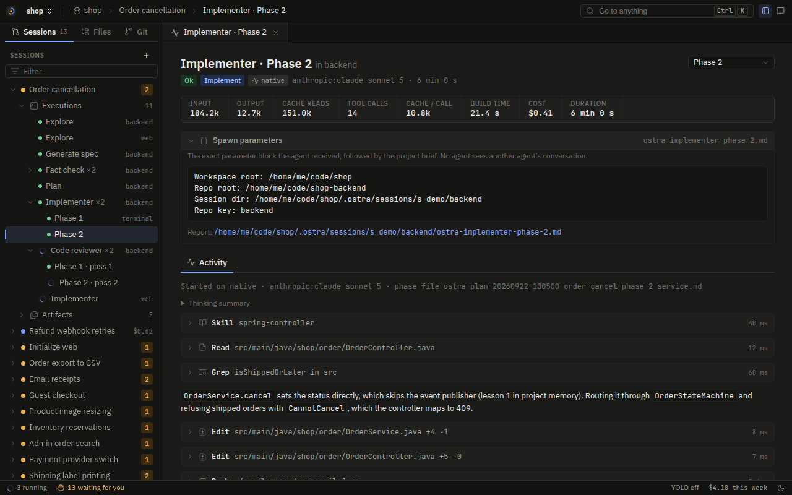

# Agents

Ostra divides the work of the pipeline among thirteen built-in agents. A workspace or a plugin can add its own
custom agents next to them. Each agent does one job. For example, an agent researches a request, writes a spec,
reviews a change, or writes tests. Code decides which agent runs, which inputs it gets, and what Ostra does with
its result. The agent does the work in its stage. Then it returns a structured answer.

This page tells what the agents are and how Ostra describes them. It also tells how Ostra gives them their
inputs before a run, and how it reads their results. The main rule is this: **the result of an agent is the
data that it submits through a typed tool call, never the text that it writes at the end of its run.** The
remaining sections of this page come from that rule.

## The roster

Each built-in agent has two files in `assets/agents/<name>/`:

- `agent.toml` describes the agent.
- `prompt.md` is the system prompt of the agent.

The compiler embeds the two files in the `ostra` binary. Thus, a running server never reads these definitions
from disk. A user cannot replace a built-in definition through a change to a file.

The engine does not refer to the thirteen agents by name. They are the agents of the standard plugin `ostra`
([`ostra-standard`](../../crates/ostra-standard/src/lib.rs)). This plugin uses `ostra-sdk`, the same
as each other plugin (Rule PL4). It reads the `agent.toml` and the `prompt.md` of each agent with the definition
parser of the SDK (`ostra_sdk::definition::parse_toml`). It sets no other value. Thus, all the facts that make
the reviewer a reviewer are data in its files, in fields that each agent can declare:

```rust
pub fn agent(agent: AgentName) -> Result<PluginAgent, String> {
    let toml_path = format!("{agent}/agent.toml");
    let prompt = agent_file(&format!("{agent}/prompt.md"))?;
    ostra_sdk::definition::parse_toml(agent.as_str(), &agent_file(&toml_path)?, &prompt)
        .map_err(|e| format!("assets/agents/{toml_path}: {e}"))
}
```

The standard plugin has only one privilege: its name. No other plugin can use the name `ostra`. The agents of
the standard plugin keep the built-in names, and Ostra uses these names for their runs. They are also the default
agents for each result contract that a built-in stage reads (Rule WF8). A workflow can replace a default agent
with a different agent that returns the same contract.

| Agent | Stage | Default tier | What it does |
| --- | --- | --- | --- |
| `explore` | Research | advanced | Researches one task and writes one research document. It is the only pipeline agent that searches the web. It cites each external page that it uses by URL and date. It reports findings, never requirements. |
| `generate-spec` | Spec | advanced | Reads each research document for the request and writes one spec. The spec holds requirements in EARS notation with Given/When/Then criteria, in ordered deliverables. The spec tells what to build, never how. A new codebase gets a new project key in the spec. Ostra creates that project only after the user approves the plan. |
| `fact-check` | Fact-check, Docs | advanced | Checks a spec or a plan for claims that can break the implementer. In the docs stage, it checks every claim of one draft page against the code and the user's sources (target type `page`). It also checks for external facts that no longer trace to a cited page. It runs after each spec and each plan. Ostra refuses approval without a recorded `PASS`. |
| `plan` | Plan | advanced | Changes an approved spec into a master plan and one file for each phase. Each step names an exact path, an action, the skills to load, and a verification command. It takes each requirement from the spec. It reads no research document, only the code facts that Ostra extracts from the research documents. It lists each new project that the spec names in `new_projects`. |
| `implementer` | Build | balanced | Writes the code for one of these: a plan phase, a review fix, an inline change, or the fix for a stuck run that the user sent it to (rule O8). It verifies each step with the build command of the project. It never writes tests. |
| `code-reviewer` | Review | balanced | Reviews the unstaged changes of one review loop against the rule set of the project and the requirements of the phase. It also runs a security scan. No instruction can override a BLOCKER finding of that scan. |
| `execution-path-analyzer` | Test | balanced | Plans how Ostra verifies a phase. It traces each path through the functions that the phase changed (branches, early returns, error paths, boundaries). It also traces the system flows that reach these functions (from a route, a CLI command, a screen, a job, or a consumer of a changed contract), and the existing tests that cover them. It gives each check a test level from the test types of the project. `write-test` changes each path and flow into one test. |
| `write-test` | Test | balanced | Verifies the phase. It writes unit, integration, and end-to-end tests at the levels that the analyzer assigned, and it obeys the test skills of the project. Then it runs these tests and the existing suites that the analyzer listed as regression. It writes only test code. |
| `documentation` | Docs | advanced | Runs one step of the docs pipeline for one project, named by its `Docs mode:` line. The survey step makes one brief pass over the code, project memory, workspace artifacts, and the user's uploads, and returns the inventory and a plan of broad pages in groups. The page step writes or revises one page, checked against the real source. The synthesis step reads every draft and the fact-check findings, judges the definition of done, and lists the edits that remove duplicated facts, contradictions, and gaps. It returns the result of its step in its submit call and writes no file. It runs only when the user asks for documentation. |
| `prompt-generation` | Build | advanced | Writes or edits instruction files (system prompts, `SKILL.md` skills, agent definitions). It runs for prompt requests. It also runs when an implementer gives the prompt work to it. |
| `initializer` | Project setup | balanced | Sets up a project in one of six modes: detect, scout, propose, generate-skill, generate-inventory, and adopt. |
| `advisor` | Rescue | advanced (high effort) | Reads one of these: a failed or stuck step of the init of a created project (rule O5), or a build or test run that is stuck on its environment (rule O7). It reads the inputs, the outputs, and the project. Then it submits `retry` with guidance for the next run of the step, or `escalate` with a reason for the user. It is read-only. |
| `quick-answer` | Side panel | balanced | Answers one question about the workspace from the code, the project memory, and fetched pages. It never writes files and never changes the pipeline state. |

The tier column gives a default. The workspace routing settings select the model for each tier. They can also
route an agent in a different way for each phase complexity. Thus, an implementer phase of low complexity can
run on a cheaper model than a phase of high complexity.

Ten smaller prompts in `assets/judges/` are not agents. They answer named judgment questions for the engine.
For example, a judge decides the risk of a request, or decides if Ostra must fix a review finding. Read
[the engine](../../HANDOVER.md#8-the-engine) for the function of the judges.

The Routing tab of Settings lists the same agents. Each agent has a one-line role and its route:


## What `agent.toml` says

This is the full definition of the reviewer:

```toml
description = "Reviews the unstaged working-tree changes of one review loop against the project's Review Rule Set ..."
default_tier = "balanced"
timeout_seconds = 1200
capabilities = ["read", "shell", "search_text", "glob", "code", "coordinate", "docs_search", "review_ledger", "security_block"]

returns = "review"
write_scope = "session"
brief = ["commands", "review", "conventions", "skills"]

[effort]
native = "high"
claude = "high"
codex = "high"
grok = "high"
agy = "high"
```

Each field has one function:

- **`description`** tells when the agent runs and what it can change. The UI shows it. The descriptions also
  give a short statement of the limits of each agent ("Read-only on project source", "Writes ONLY test
  code").
- **`default_tier`** is the model tier of the agent, if the routing does not set a different one.
- **`timeout_seconds`** limits the time of one execution. Quick answers get 5 minutes, and reviewers get 20
  minutes. Agents that write code get 40 minutes.
- **`capabilities`** lists the abstract actions that the agent can do. The reviewer has no `write` or `edit`.
  Thus, no executor gives it a tool that changes files. Capabilities are a first filter. The policy layer still
  checks each tool call of the agent, also for agents that hold `write`. Some capabilities give a right and not
  a tool (Rule CA6). With `review_ledger` and `security_block`, the reviewer can write the review ledger and the
  security block file. The guards refuse these writes to each agent without these capabilities.
- **`returns`** is the result contract that the agent submits (Rule CA5), here `review`. The engine reads the
  result through this contract, never through the name of the agent. Read
  [result contracts](#result-contracts-and-grants).
- **`write_scope`** limits where the agent can write: `read_only`, `session`, `project`, or `setup` (Rule CA2).
- **`brief`** names the sections of the repo brief that the agent gets (read [the repo brief](#the-repo-brief)).
- **`helper`** is set only in the file of `explore`. With it, `SendMessage` can start the agent as a helper.
- **`[effort]`** sets the reasoning effort for each executor. The keys are `native` (Ostra's own agent loop) and
  one key for each harness: `claude` (Claude Code), `codex` (Codex), `grok` (Grok Build), and `agy`
  (Antigravity). Only the initializer has different values. It runs at `xhigh` on Codex and Grok, and at `max`
  on Antigravity. In its routing settings, a workspace can override the effort for each agent or for each
  phase complexity.

The standard plugin builds its manifest one time and caches it. The tests of the crate find a malformed
`agent.toml`. Thus, a malformed definition is a build defect, and a user never gets it as a runtime error.

## Result contracts and grants

Built-in agents and custom agents use one model. The engine never asks which agent it has. It asks two different
questions.

**What is the form of the result?** Each agent declares a result contract (`returns`, Rule CA5): `research`,
`spec`, `fact-check`, `plan`, `implementation`, `review`, `path-analysis`, `tests`, `documentation`,
`architecture`, `prompt`, `setup`, `answer`, `advice`, `stage`, or `<plugin>:<contract>` for a contract of a
plugin ([`contract.rs`](../../crates/ostra-core/src/contract.rs)). The contract sets these items:

- The submit schema and its checks.
- The spawn block.
- The skills that the brief lists.
- If a report file must exist before the submit (`Contract::report_required`). This value is false only for
  `review`, because the review ledger exists only when the review finds a problem.

A built-in stage runs each agent whose contract it reads. Thus, a team can write its own spec writer and bind it
to the spec stage (read [workflows](workflows.md)). Each run records its contract when it starts.

**What can the agent touch?** Each integration is a capability that each agent can request (Rule CA6). Ostra
keeps no capability for one agent only:

| Capability | Grants |
| --- | --- |
| `document_research`, `document_spec`, `document_plan` | The Document tool for that typed document, and the right to write the document. |
| `review_ledger` | The right to write the ledger of a review loop. The engine counts the ledger to limit the loop. |
| `security_block` | The right to write the security block file of BLOCKER findings. |
| `progress_log` | The right to write the progress log of the implementer. A run that starts again reads this log. |
| `test_files` | The right to write test files and test directories in the repo. |
| `manage_projects` | The project tools (`ProjectList`, `ProjectCreate`). |

The standard agents hold only the grants that their jobs need:

- `explore`, `generate-spec`, and `plan` hold their document grant.
- The implementer holds `review_ledger`, `progress_log`, and `manage_projects`, but not `test_files`.
- `write-test`, `prompt-generation`, and the initializer hold `test_files`.

The guards check these grants. Thus, a custom agent that requests a grant gets the same access. This is safe
because each agent file and each plugin waits until the user approves the workspace file (Rule A1).

Ostra changes each definition into an `AgentDef` in one function, `catalog::from_plugin_agent`
([`catalog.rs`](../../crates/ostra-agents/src/catalog.rs)). The source of a definition changes only its name.
The agents of the standard plugin get the built-in names. Each other source names a custom agent.

## One prompt, five executors

An agent can run on Ostra's native loop or in one of four harness CLIs. Each of these executors gives its tools
different names. The tool that reads a file is `Read` in Claude Code, `read_file` in Grok Build, and `view_file`
in Antigravity. If a prompt tells Grok to "use `Read`", the model looks for a tool that it does not have.

Thus, prompts never name tools directly. They use template tokens such as `{{tool_read}}`, `{{tool_shell}}`,
and `{{tool_submit}}`. Ostra renders each prompt one time for each executor with minijinja. The token values
come from `assets/tool-mapping.toml`:

```toml
[capabilities.read]
native = "Read"
claude = "Read"
codex = "exec_command"
grok = "read_file"
agy = "view_file"
```

The native names are the names of Claude Code, because the prompts were tuned against these names. The
rendering is strict. A token with no value is an error, not an empty string. Thus, a typo in a prompt fails the
tests, and Ostra does not ship a prompt with a missing part.

Ostra puts at most five sections before the rendered body (`render_def` in `crates/ostra-agents/src/lib.rs`).
From the top, the order is:

1. The tool vocabulary, on a harness.
2. The output rule.
3. The messaging guide (`assets/coordination.md`), for an agent with the `coordinate` capability.
4. The stage guide (`assets/custom-agent.md`), for an agent that returns `stage`.
5. The code tools guide.

These three sections need the most explanation:

- **The output rule**, for each agent on each executor (`assets/output-rules.md`). It tells the agent to write
  no text outside tool calls. Reports go through `report` or `document`, memories go through `memory`, and the
  result goes through the submit tool. The engine reads only these calls. Thus, status text and a final written
  report use tokens for no result. The rule says that it applies in each mode. It also says that it has
  priority over each instruction in the task, the repo brief, a skill, or a file.
- **The code tools guide**, for each agent with the `code` capability. It explains the code index tools
  (outline, find, callers, callees, implementations, neighbors, impact, map). With these tools, an agent finds
  its way through a project by symbol, not by grep.
- **A tool vocabulary table**, for harness executors only. For each capability of the agent, it lists the tool
  for that capability on this harness. It also tells how to load skills and how to call Ostra's own tools on
  this harness. Ostra's own tools (`report`, `document`, `memory`, `memory_recall`, `docs_search`, the
  `project_*` tools, and the submit tool) reach a harness through Ostra's MCP server. Thus, in Claude Code the
  submit tool for the implementer is `mcp__ostra__submit_implementer`.

## The spawn block: what an agent is told

The system prompt tells how the agent works. The first message tells the subject of this run. It starts with a
block of `Label: value` lines. This block is the contract between the engine and the prompt. For example, an
implementer that fixes review findings on phase 2 can get this block:

```text
Report file: /ws/.ostra/sessions/s1/backend/ostra-implementer-phase-2.md
Phase file: /ws/.ostra/sessions/s1/backend/ostra-plan-phase-2.md
Workspace root: /ws
Repo root: /ws/backend
Session dir: /ws/.ostra/sessions/s1/backend
Repo key: backend
Findings:
  [HIGH] src/auth.rs (R-b) - Token compared with ==. Fix: Use constant-time comparison.
Review ledger: /ws/.ostra/sessions/s1/backend/ostra-review-ledger-phase-2.md
```

Each prompt lists its required labels. If a label is absent, the prompt tells the agent to stop with
`ERROR: missing required parameter`. That instruction is a second check only. The type system gives the real
guarantee.

The Spawn parameters panel of an execution shows the exact block that the agent got. It also shows the report
path that the engine selected:



### Required parameters are checked by the compiler

Each agent and each initializer mode has its own spawn struct in `crates/ostra-agents/src/spawn.rs`. Required
parameters are plain fields. Optional parameters are `Option` fields:

```rust
/// Rule D4, Hard rule 16: the plan agent gets the spec and no research document. Its other inputs
/// are the code facts file (Rule D4a), and on a re-spawn the fact-check findings (Rule D5), the
/// phases they name (Rule D4b), and the master plan being revised.
pub struct PlanParams {
    pub common: Common,
    pub spec_file: PathBuf,
    pub projects_in_scope: Vec<(String, PathBuf)>,
    pub code_facts: Option<PathBuf>,
    pub findings: Option<String>,
    pub phases_to_revise: Vec<u32>,
    pub master_plan: Option<PathBuf>,
}
```

If code spawns a plan agent without a spec file, the code does not compile. Ostra is a port of the Ultracode
plugin. In Ultracode, the same contract was a JSON file, and a hook checked it at spawn time. Thus, a missing
parameter showed as a failed run. In Ostra, it shows as a build error.

The struct also controls what an agent must *not* see. `PlanParams` has no field for research documents,
because Rule D4 says that the plan takes its requirements from the approved spec only. If a requirement is not
in the spec, it cannot get into the plan, because the struct has no field for it. The research findings about
the code arrive as `code_facts` (Rule D4a). This is a file that the engine writes with files, symbols, patterns,
and flows, and with no request text. For the same reason, `FactCheckParams` carries research documents only for
a spec target (Rule D5). For a plan target, it carries the code facts file.

These shapes occur in many structs:

- **`Common`** holds the four lines that each spawn carries: workspace root, repo root, session dir, and repo
  key.
- **`WorkSource`** makes phase-bound agents (implementer, reviewer, write-test) declare one of two lines:
  `Phase file:`, or `No plan:` with a reason (Hard rule 13). An agent cannot declare both lines or neither line.
  When no plan exists, the engine writes the reason for the agent. For example: "A quick change: the request
  names the whole edit, so research, spec, plan, and review were skipped."
- **`Extras`** holds optional context. Each item renders only when it is present: research documents, user
  answers, verbatim findings, required skills, the review ledger, a rescue diagnostic, resume instructions after
  a handoff, prior phase reports, user notes, and a free-form task note. The user notes are the answers that the
  Route-answer judge kept for this stage (Rule J1).

Each struct renders itself in a fixed order: the required lines, then the four common lines, then the extras.
The same module has a parser, `parse_block`. The parser reads a block and validates it against the contract of
the agent. It also validates the value formats:

- `Phase:` must be `N`, `N-tests`, or `none`.
- An enum value must be one of its listed values.
- A path must be absolute.

The test suite renders each struct and parses the result. Thus, a struct and its contract always agree.

### From planner decision to spawn

The planner of the engine decides *that* an agent must run, and with which inputs. It gives this decision as a
`SpawnRequest` that holds loose `SpawnInputs`. The spawn factory of the standard plugin (`crates/ostra-default-plugin/src/factory.rs`) changes
these inputs into the typed struct of the agent. In the factory, missing data becomes a clear error ("missing
spec file"), not an unclear prompt. Also, the engine makes these decisions in the factory, and the agent does
not make them:

- The `Review scope:` of the reviewer is always `unstaged`. Ostra stages each accepted change, so that the next
  review sees only the new change.
- A rerun after an interruption gets a task note. The note tells the agent to continue from its progress log,
  and not to start again.
- A rescue after a `stuck` result gets the verbatim diagnostic and the fact that the user gave. Thus, a rescue
  is never a plain retry. If the user sent an implementer to fix the cause (Rule O8), the fact is the summary,
  the report, and the changed files of that implementer.
- An implementer that the user sends to a stuck run gets `No plan:` and an `Unblock:` line. That line holds the
  diagnostic and the need of the stuck run, and the instructions of the user. The implementer also gets the
  phase file under `Context files:`. Its report is `ostra-implementer-unblock-phase-<N>-<round>.md`. Thus, it
  never writes over the report or the progress log of the stuck run.

Then the factory assembles the full execution:

- The rendered system prompt for the selected executor.
- The first message: the spawn block and the repo brief.
- The parameters as JSON for the event log.
- The report path.
- The resolved effort.

## Report paths belong to the engine

An agent never selects the location of its report. The engine names each file in `ostra_core::paths::report`.
It gives the path to the agent as `Report file:`:

| File | Written by |
| --- | --- |
| `ostra-implementer-phase-N.md` | implementer |
| `ostra-implementer-progress-phase-N.md` | implementer, during its work |
| `ostra-epa-phase-N.md` | execution-path-analyzer |
| `ostra-write-test-phase-N.md` | write-test |
| `ostra-review-ledger-phase-N.md`, `-phase-N-tests.md` | code-reviewer, then the fix agent |
| `ostra-docs-request.md` | the runner, for a `DOCS` request, in place of an implementer report |
| `ostra-prompt-gen-N.md` | prompt-generation |

All these files are in the session directory of the project. There are three reasons for this:

1. The report-path guard of the policy layer can let an agent write exactly one path outside the source of the
   project. The guard denies all other paths. Thus, a read-only agent can write its report, and nothing more.
2. The engine knows the location of the report before the agent finishes. Thus, after a crash or a stop, a
   known file is available to resume from.
3. The spawn block of the next agent can name the output of the previous agent directly. Write-test gets the
   report of the implementer and the report of the analyzer by path.

Also, both executors refuse an `ok` submit if the declared report file does not exist. They tell the agent to
write the file first. The `review` contract is an exception, because its ledger exists only when the review
finds a problem.

This image shows the report at the path that the engine named, opened as an artifact of the session:


### A new codebase across three agents

Some requests need a codebase that no project holds. Such a request goes through three agents. No agent
creates the project before the user approves the plan that needs it:

- **generate-spec** (Step 4A of its prompt) gives the codebase a new project key. It tags its criteria and
  deliverables with the key. It writes one `Constraint` criterion that names the stack. It also writes one
  `Constraint` criterion for each base requirement that the evidence decides. Its first deliverable in that
  project creates the project skeleton.
- **plan** puts phases in that key and lists the key in `new_projects`. It copies the stack, the purpose, and
  the base requirements into the context of the first phase in the key.
- **implementer** holds the `manage_projects` capability by default. Each agent that holds this capability gets
  the same treatment when it runs a phase in a project that the plan names as new (`creates_project` in
  `runner/spawn.rs`, the guard in `guards.rs`). The implementer of that first phase gets a `New project:` spawn line,
  and its session dir as `Repo root:`. It reads the phase file. Then it calls `ProjectCreate` with these facts
  and no other data (rule O2). After the project exists, Ostra stops the run and initializes the project. Then
  Ostra starts the phase again in the project. If the user denies the call, the implementer returns stuck, with
  the refusal as its need.

### What the advisor is given

The engine keeps little context about the cause of a failed step. Thus, the spawn of the advisor carries what
the step saw and did. `advisor_request` in [`stages/init/planner.rs`](../../crates/ostra-default-plugin/src/stages/init/planner.rs) builds it:

| Line | Content |
| --- | --- |
| `Failed step:` | The agent and mode, for example `initializer detect`. For a stuck build or test run, the agent only, for example `write-test` |
| `Problem:` | One of these: the error, the stuck report (its summary, then what it needs), or the finding of the engine (no slices, no skills, a missing inventory) |
| `Step inputs:` | The spawn block of the failed run |
| `Step result:` | The submit payload of the failed run as JSON, cut at 8,000 characters. A step can submit `ok` with a result that Ostra cannot use |
| `Step context:` | The purpose of the step. For a created project: its stack, purpose, and base requirements. For a run: the phase, its file, and the loop (build or test) of the run |
| `Earlier guidance:` | The guidance that an earlier round gave this step, which did not fix it |

The advisor also reads the instructions of the failed agent. Ostra renders the prompt of each agent for the
native executor. It writes each prompt to `<data dir>/assets/agents/<agent>.md`, next to the stack references.
The prompt of the advisor tells it to read the part for the failed mode. In most init failures, a step did not
obey one of its own rules. An example is the rule for a project that has no source. Some advice tells a step to
break its rules, for example to scaffold code during initialization. Such advice fails again at a guard. The
advisor evals (`tests/evals/advisor.toml`) showed both facts.

## The repo brief

Each execution gets a repo brief below the spawn block, after a `---` line (`crates/ostra-agents/src/brief.rs`).
Without the brief, an agent uses its first tool calls to collect these facts:

- The build and test commands.
- The skills of the project, with their paths.
- The conventions.
- The module-map rows that cover the paths in the task.

Each agent gets the sections that its definition names in `brief` (Rule CA6). Thus, the choice is data, not
code. The standard agents ask for these sections:

| Agent | Brief sections |
| --- | --- |
| implementer | commands, skills, conventions, module map |
| write-test | commands, testing, skills, conventions, module map |
| code-reviewer | commands, the full review rule set, conventions, skills |
| explore, plan, quick-answer | stack, skills, module map (plan and quick-answer also get commands) |
| generate-spec, fact-check | stack, module map |
| execution-path-analyzer | commands, testing, module map |
| prompt-generation | skills |
| initializer | nothing, because it is the agent that creates these facts |
| advisor | stack, commands, skills, module map |
| documentation | stack, commands, module map |

Among the standard agents, only the reviewer asks for the full rule catalog (`review`), because only the
reviewer grades against it. The result contract of the agent filters the skills section:

- A `tests` agent sees the test skills and the conventions.
- A `review` agent sees only the conventions.
- Each other agent sees all skills.

These parts come after the brief, in this order:

1. The instruction files of the project (`CLAUDE.md`, `AGENTS.md`, `AGENT.md`).
2. If the session created a project, a "Projects created in this session" section. For each created project,
   it gives the folder, stack, purpose, and base requirements from its `ProjectCreate` call. Such a project
   has no inventory or profile before its init runs.
3. The workspace artifacts: the folder and at most 40 files (read
   [Workspace artifacts](workspaces.md#workspace-artifacts)).
4. The custom instructions of the workspace: first the entry for all agents, then the entry for this agent.

If an instruction tags a file or an artifact with `@`, Ostra lists it under that instruction with its absolute
path. If `AGENTS.md` in a repo is a symlink to `CLAUDE.md` or a copy of it, Ostra includes the file one time.

These rules keep the brief small and correct:

- **It has limits.** The brief has a limit of 3,600 characters, 16 skill rows, and 10 module rows. Each
  instruction file has a limit of 12,000 characters. Ostra cuts a longer file, and the agent reads the
  remaining text from disk.
- **It does not repeat itself.** Before the brief adds a profile fact, it checks if the project inventory
  already states the fact. In one repo, a field can be a duplicate. In a different repo, the same field can be
  the only statement of a rule. Thus, the check uses the actual text of the inventory, not a fixed list of
  fields.
- **It never carries routing settings.** Tier names and model choices give no information to an agent. They
  only add noise to its context.
- **Ostra adds it one time.** If a message already contains a brief heading, a second addition returns the
  message without a change. Thus, a re-render or a resume never puts two briefs in a message.

The Instructions tab of Settings holds the custom instructions for all agents and for each agent:


## Structured returns

Each agent ends with a call to one tool: `submit_<agent>`, for example `submit_fact_check` or
`submit_implementer`. The input schema of the tool comes from the result contract of the agent (Rule CA5):

- For a built-in contract, the schema is a Rust struct in `crates/ostra-core/src/submit.rs`, which Ostra
  converts to JSON Schema.
- The `stage` contract adds the `data` that the agent declares.
- For a plugin contract, the schema comes from the manifest of the plugin.

This is the fact-check return:

```rust
pub struct FactCheckFinding {
    pub severity: Severity,          // BLOCKER, HIGH, MEDIUM, or LOW
    pub location: String,
    /// The ID of the element the claim sits in: `R3`, `AC3.2`, `E2`, `D1`, `C4`, `phase 2`, or
    /// `step 2.3`. Ostra shows the finding on that element.
    pub element: Option<String>,
    pub claim: String,
    pub issue: String,
}

pub struct FactCheckSubmit {
    /// `PASS` only when no finding is HIGH or MEDIUM.
    pub verdict: Verdict,            // PASS, FAIL, or ERROR
    /// `spec` or `plan`.
    pub target: String,
    pub findings: Vec<FactCheckFinding>,
}
```

The spec approval gate works because of this struct. The engine does not read a sentence such as "looks good
to me" and then decide if it means pass. It reads `verdict: "PASS"`, and it allows or refuses approval on that
value. Each finding carries an `element`, for example `R3`. Thus, the UI can show the finding on requirement 3
in the spec view.

The returns are in these groups:

| Submit struct | Agents | Key fields |
| --- | --- | --- |
| `ExploreSubmit` | explore | research path, scope covered, findings summary, source count, open question count |
| `GenerateSpecSubmit` | generate-spec | spec path, open questions, deliverable and requirement counts |
| `FactCheckSubmit` | fact-check | verdict, target, findings |
| `PlanSubmit` | plan | master plan path, phases with project, complexity, test policy, and dependencies |
| `ImplementerSubmit` | implementer | status, report path, changed files, summary, stuck or handoff details |
| `CodeReviewerSubmit` | code-reviewer | findings, `security_block`, ledger path, summary |
| `ReportSubmit` | execution-path-analyzer, write-test, prompt-generation | status, report path, changed files, summary |
| `DocumentationSubmit` | documentation | status, step (`survey`, `page`, `synthesis`), summary, overview, inventory and pages (survey), one page in sections (page), checks, edits, and done (synthesis), glossary |
| `InitializerSubmit` | initializer | status, summary, files, a result object that differs per mode |
| `AdvisorSubmit` | advisor | `action` (`retry` or `escalate`), guidance for the next run, reason for the user |
| `QuickAnswerSubmit` | quick-answer | the answer in Markdown, its sources |

If the work of an agent can fail, its return carries a `status` of `ok`, `stuck`, or `handoff`. `stuck` means
that the agent got to its retry limit on the same failure. The agent must then include the verbatim diagnostic
and the one fact that it needs to continue. The engine changes that into a rescue, not into a blind retry.
`handoff` means that an implementer needs a specialist. At this time, the specialist is always
prompt-generation. The implementer must tell what to write and how to resume after the handoff.

### Validation happens before anything is recorded

When an agent calls its submit tool, the native and harness executors do the same checks before they accept the
call (`Run::submit` in `ostra-exec-native`, the submit branch of `HarnessBridge` in `ostra-exec-harness`). For a
programmatic agent, Ostra checks the shape and the report file, but not the documents:

1. **Shape.** `validate_submit_with` parses the input into the struct of the contract of the run
   (`ExecContext.contract`). For a plugin contract, it checks the input against the schema of the contract. If a
   field is missing or an enum value is wrong, the agent gets a tool error. The error holds the message of the
   parser and "Fix it and call submit again."
2. **Consistency.** Some rules apply to more than one field. The `security_block` of the reviewer must be true
   exactly when a BLOCKER finding is present. Thus, a reviewer cannot report a BLOCKER and also say that nothing
   is blocked. The reverse is also not possible.
3. **Documents.** For the `research`, `spec`, and `plan` contracts, Ostra opens and checks the referenced
   document (`doc::check_submit`). The counts that the agent reported must agree with the contents of the file.
   Examples are the number of requirements and the number of evidence rows. An agent cannot submit a spec
   summary that is different from the spec that it wrote.
4. **Report file.** If an agent has a declared report path, Ostra refuses its `ok` submit until that file
   exists. The `review` contract is an exception, because its ledger exists only when the review finds a
   problem.

Nothing gets into the event log before all four checks pass. A rejected submit costs the agent one more turn.
It never makes a half-valid record that the engine must interpret.

Sometimes a model sends a nested object or array as a string of JSON. Ostra parses such a top-level argument
before the validation, if the schema gives it a type that is not a string. Thus, a format error does not cause
a correct submit to fail.

## Why the engine never reads the final message

In Ultracode, some agents printed a JSON object as their last message. Hooks such as `factcheck-record.js`
then copied the object from the transcript. This method fails in ways that are difficult to see. A model puts
the JSON in a code fence, adds a sentence after it, or writes a summary in place of it. Each harness shows the
final message in a different location and format. A scraper that handles all these cases only guesses. A guess
at a verdict is not acceptable for a gate that allows or blocks approval.

A tool call removes the guess:

- **Ostra enforces the schema at the boundary.** The model sees the schema when it calls the tool. Ostra refuses
  a wrong shape at a time when the agent can still fix it.
- **It works the same on each executor.** Native runs get the submit tool as a usual tool definition. Harness
  runs get it from Ostra's MCP server. In both cases, the engine gets the same struct.
- **It marks the end of the run.** The description of the submit tool says that it must be the last action, and
  the engine applies this rule. On the native loop, the engine skips each other tool call in the same turn with
  "Not run: the run ended with the submit call."
- **It keeps the result apart from the narration.** Ostra streams the text that the model writes during its work
  to the UI, where people can watch it. The engine never parses this text. Thus, the comments of a model cannot
  change what the engine does.

Ostra also makes sure that each run ends with a submit. An agent can call only its own submit tool. Thus, Ostra
denies a call to `submit_plan` from an implementer, and the denial names the correct tool. If a harness run tries
to stop without a submit, Ostra blocks the stop at most two times, with an instruction to submit first. If a
native run goes 400 model turns without a submit, it fails with that reason.

There are two narrow exceptions. Both are fallbacks, never a decision:

- If a quick-answer run ends `ok` with no submit, Ostra shows its final text as the answer. A side-panel answer
  changes no pipeline state, so the display of the text loses nothing.
- If an agent reports `stuck` without a diagnostic, the final text becomes the diagnostic in the rescue prompt.
  The routing decision still comes from the submitted `status`.

## Custom agents

A workspace can add its own agents next to the built-in agents. A custom agent does a check or a step that Ostra
does not supply. Examples are a security audit, a release-notes writer, and a check of the conventions of the
team. A custom agent runs in a workflow stage (read [workflows](workflows.md)). It can also run as a helper that
a different agent starts with `SendMessage`. HANDOVER section 9.4 holds the rules (CA1 to CA6).

A custom agent has the same fields as a built-in agent, and Ostra treats it the same. It can return each result
contract and request each grant in [result contracts and grants](#result-contracts-and-grants).

### The file

A custom agent is one Markdown file: `<workspace>/.ostra/agents/<name>.md`. The file starts with TOML
frontmatter between two `+++` lines. The instructions of the agent come after the frontmatter.

```markdown
+++
description = "Audits changed files for secrets and unsafe input handling."
default_tier = "balanced"
capabilities = ["read", "search_text", "glob", "shell", "coordinate"]
write_scope = "session"
timeout_seconds = 1200
[data_schema]
type = "object"
required = ["risk"]
[data_schema.properties.risk]
type = "string"
enum = ["low", "medium", "high"]
+++
Read every file the change touched and report each secret with {{ tool_read }} ...
```

Only `description` is necessary. The other fields have default values:

| Field | Default | Notes |
| --- | --- | --- |
| `name` | The file name without `.md` | Lowercase kebab-case, at most 40 characters. The name cannot be the name of a built-in agent, `module-documentation`, or `judge`. |
| `returns` | `stage` | The result contract (Rule CA5). With a built-in contract such as `spec`, a workflow can bind the agent to the built-in stage that reads the contract. A plugin contract needs a plugin that defines it. |
| `default_tier` | `balanced` | |
| `capabilities` | `read`, `search_text`, `glob`, `report`, `coordinate` | Each capability, grants included (Rule CA6). No capability is reserved. |
| `write_scope` | `project` if the capabilities include `write` or `edit`. If not, `session`. | `read_only`, `session`, `project`, or `setup`. Ostra refuses `read_only` together with `write` or `edit`. |
| `brief` | `stack`, `commands`, `skills`, `conventions`, `modules` | Sections of the repo brief. You can also use `testing` and `review`. |
| `timeout_seconds` | 1200 | At most 7200. |
| `[effort]` | `high` on each executor | The keys are `native`, `claude`, `codex`, `grok`, and `agy`. |
| `data_schema` | None | The shape of the `data` in the submit, as a table. Only an agent that returns `stage` can declare one. |
| `helper` | `false` | If `true`, `SendMessage` can start the agent as a helper. |

The file can have at most 128 KiB, because the full body goes into the system prompt of each run. Ostra renders
the body the same as a built-in prompt. The body gets these items:

- The same `{{ tool_* }}` tokens.
- The code tools guide and the messaging guide, if the capabilities need them.
- The same harness vocabulary.

An agent that returns `stage` also gets `assets/custom-agent.md` before the body. This file is a short guide to
the stage contract and the submit call. An agent that returns a built-in contract describes the fields of that
contract in its own instructions, the same as the built-in prompts.

Ostra renders the body one time as a check when it loads the file. Thus, a broken template token is a settings
error and not a failure in the middle of a session. Ostra renders the body again for each run.

### The catalog

`AgentCatalog` (`crates/ostra-agents/src/catalog.rs`) is the set of agents that one workspace can run. It holds
these agents:

- The agents of the standard plugin.
- The valid files of `.ostra/agents/`.
- The agents of the plugins of the workspace.

A Markdown file goes through `ostra_sdk::definition::parse_markdown` and then `from_plugin_agent`, the same as
each other source.

`AgentCatalog::load` also gets the result contracts that the plugins of the workspace define, with their
schemas. An agent that returns one of these contracts gets that schema for its submit. If an agent returns a
contract that no plugin defines, the catalog leaves the agent out and reports it (Rule PL5).

Ostra reads the catalog again for each execution, the same as the settings. Thus, a changed agent applies to its
next run without a restart. The catalog leaves out a file that does not parse. It also leaves out a second agent
with a name that a different agent already uses. Ostra reports each of these problems as a settings issue under
`agents`, with the file of the agent.

`AgentName` is one type for the two kinds of agent. Each built-in agent is a variant. A custom agent is
`AgentName::Custom`. Ostra interns its name, so the type keeps its copy semantics. On the wire, the value is the
bare name for the two kinds. Thus, the shape of the events and the databases did not change.

### Where an agent writes

The write-scope guard enforces `write_scope` for built-in agents and custom agents (`check_scope` in
`crates/ostra-policy/src/guards.rs`, through `ExecContext::scope`). Each scope allows these writes:

| Scope | The agent can write |
| --- | --- |
| `read_only` | No file. |
| `session` | Its session dir and the temp dir of the OS. |
| `project` | The repo root and its session dir, but not the temp dir. |
| `setup` | The `.ostra/` runtime of the project and its skills dir. This is the scope of the initializer. |

Some files need a grant in each scope. These files are a spec, a plan, a research document, the review ledger,
the security block file, the progress log, and test files.

No agent can write `.ostra/agents`, `.ostra/workflows`, or `.ostra/transforms`. The reason is that an agent with
this access can decide which agents, stages, and transforms run after it.

### What the stage contract holds

An agent that returns `stage`, the default contract, ends with `CustomSubmit` in `crates/ostra-core/src/submit.rs`:

| Field | Meaning |
| --- | --- |
| `verdict` | `pass`, `fail`, or `needs_user`. The workflow stage then continues, follows its `on_fail`, or asks you. |
| `summary` | What the run did and found. The later stages and you read it. It is necessary and cannot be empty. |
| `findings` | Each problem, with its file and the fix. |
| `question`, `options` | For `needs_user`: the decision that the stage needs, and the answers to show, with the recommended answer first. `needs_user` makes `question` necessary. |
| `report_path` | The report that the run wrote, if it wrote one. |
| `data` | Output in the shape that `data_schema` declares. If the agent declares a schema, `data` is necessary. |

A small subset of JSON Schema in `crates/ostra-core/src/schema_check.rs` checks `data` against the declared
schema. The subset has these keywords: `type`, `properties`, `required`, `items`, `enum`, `minItems`, `maxItems`,
and `additionalProperties: false`. Ostra loads other keywords, but they check nothing.

The submit tool of the run shows the full schema to the model. The two executors validate against the schema
that the run got. Thus, a mismatch is a tool error, and the model can fix it before Ostra records anything.

### Routing

No agent needs a settings entry (Rule CA4). If the workspace sets `routing.*.byAgent.<name>`, that entry is the
route. If not, the route is the `default_tier` of the agent on its executor (`resolve_route` in
`crates/ostra-core/src/config.rs`). Settings validation accepts route, effort, and MCP `agents` entries that
name an agent of the catalog.

### Agents from plugins

A plugin defines agents in its manifest (read [plugins](plugins.md)). A plugin agent with a `prompt` runs on a
model, the same as a Markdown agent. A plugin agent without a prompt is programmatic. The code of the plugin does
the work and calls tools and the model through Ostra (Rule PL2, read [executors](executors.md)). If Ostra must
render a prompt for this agent, the description of the agent replaces the prompt. A plugin agent can return a
contract that its plugin defines, and the plugin handles the results (Rule PL5).

### Approval

Agent files arrive with a workspace folder, the same as the MCP servers in `workspace.toml`. Thus, they wait for
your approval in the same way (Rule A1). The hash that you approve for the workspace file covers these items:

- Each file in `.ostra/agents/`, `.ostra/workflows/`, and `.ostra/transforms/`, by name and content hash
  (`definition_files` in `crates/ostra-workspace/src/trust.rs`).
- The `[[plugins]]` entries.

Until you approve, these rules apply:

- The catalog loads only the built-in agents and the plugins in the binary.
- Settings lists each file as waiting.
- Ostra refuses a session that names a workflow from these files.

If you add or change an agent file outside Ostra, the workspace file waits for approval again.

### The agent screen

The console lists each agent that the workspace can run. It also edits the files of the workspace (HANDOVER
section 9.5, Rules AG1 to AG3). The server side is in
[`crates/ostra-workspace/src/builder.rs`](../../crates/ostra-workspace/src/builder.rs).

`WorkspaceDetail.agents` gives the `AgentInfo` of each agent. Next to the routes of the agent, `AgentInfo` gives
these facts:

- `source`: where the definition comes from. The value is `ostra`, `workspace` with its file in
  `.ostra/agents/`, or `plugin` with the name of the plugin.
- `returns`: the contract of the agent.
- `write_scope`.
- `helper` and `programmatic`.

| Request | What it does |
| --- | --- |
| `GET /api/workspaces/:ws/agents/:name` | Returns an `AgentDetail`. It holds the `AgentInfo`, the definition as an `AgentDoc`, and `editable`. It also holds the system prompt that the native executor renders (`prompt_preview`) and the submit schema. `used_by` lists the workflow nodes that run or bind the agent, as `workflow/node`. |
| `PUT /api/workspaces/:ws/agents/:name` | Saves a workspace agent from an `AgentDoc`. |
| `DELETE /api/workspaces/:ws/agents/:name` | Deletes the file of a workspace agent. |

Only the file of a workspace agent is `editable`. The agents of Ostra and of plugins are read-only. Ostra fills
their `AgentDoc` from the definition. Thus, the console can copy one of them into a new workspace agent.

The editor builds `data_schema` as a list of fields. The reason is that most output shapes are a small number of
named values, and errors in hand-written JSON Schema are frequent. Each field has these parts:

- A name.
- A type: `string`, `number`, `integer`, `boolean`, `object`, or `array`.
- A required flag.
- A description.

A string can list its allowed values (`enum`). An object holds its own fields and can refuse other fields
(`additionalProperties: false`). An array selects its item type, which nests in the same way, and its `minItems`
and `maxItems`. `schema_check` enforces these keywords, so Ostra checks everything that the builder writes.

The editor refuses to save when a field has no name. It also refuses when two fields of one object have the
same name. A JSON tab edits the same schema as text. A schema can use a different keyword, such as a list of
types or a `title`. Then the schema opens in the JSON tab and stays there. Thus, the builder never drops a
keyword that it cannot show. An empty builder saves no schema.

A save writes the same file that a user writes (`agent_markdown`): TOML frontmatter between `+++` lines, then the
prompt. The file leaves out the default values (`returns = "stage"`, an empty capability list, `helper = false`).
The tables (`effort`, `data_schema`) come last. Before Ostra writes anything, the text goes through the same
`parse_markdown` that a load uses (Rule CA1). Thus, Ostra refuses the name of a built-in agent or a broken
template token.

Ostra also refuses a save in these conditions:

- A plugin already uses the name (`AgentCatalog::with_workspace_def`).
- `returns` names a plugin contract that no running plugin defines.
- The changed agent stops a current workflow from running. For example, the change gives the agent a different
  contract than the contract that the workflow binds it to.

Ostra refuses a delete when a workflow uses the agent. The save and the delete write through
`trust::save_definitions`, so an approved workspace stays approved (Rule A1).

The catalog does not hold an agent whose file waits for approval, so no session runs it. But the page of the
agent still reads the file and shows it with `waiting_approval`.

## Subagents that talk to each other

Reports carry results from one stage to the next. But a reader of a report does not get all the knowledge of
its writer. For example, the reader does not know these facts:

- Why a requirement has its wording.
- Which files the implementer already examined and rejected.
- What a finding refers to.

To read everything again costs tokens. A judge cannot give the missing facts, because it never saw the contents
of the two conversations. Thus, agents can also send messages to each other directly. Each agent keeps its
conversation, so that Ostra can wake it again. HANDOVER section 10.8 holds the rules (SM1 to SM9 for messages,
H5 to H7 for pair loops).

### A subagent ID names a conversation

Each execution is one run of a model. A **subagent** is a conversation that can contain more than one run. Its
subagent ID is the id of the first execution of the conversation. A run keeps the ID of the conversation that it
continues. This is true for a run that continues in place (the same execution, resumed). It is also true for a
new execution whose `resumes` field names the run before it. The fold keeps a map from each execution to its
subagent (`SessionState::subagents`). The **head** of a subagent is its latest run. A message to a subagent goes
to its head. A run cannot send a message to its own subagent.

### The three tools

Agents with the `coordinate` capability get three tools. They also get a prompt section
(`assets/coordination.md`) that tells when to use the tools. Among the built-in agents, seven have this
capability: explore, generate-spec, fact-check, plan, implementer, code-reviewer, and write-test. Each custom
agent has the capability, unless its definition removes it.

| Tool | What it does |
| --- | --- |
| `ListAgents` | Gives your own subagent ID and each subagent of the session, with its agent, status, report, and what it waits on. Then it lists the helper agents that you can start. It marks the subagents that you work with, for example "the author of the document you check" or "waits for your reply". |
| `SendMessage` | Puts a message in a queue. With `to`, the message goes to an existing subagent. With `agent`, Ostra starts a new helper with the message as its task. With `wait: true`, your run pauses after it sends the message. |
| `WaitForMessage` | Pauses your run until a message for you arrives. |

The tools never ask you for permission in any mode, because they change no file. But a deny rule can still
refuse them. The engine checks each call against the fold. It records the call as an event before the tool
returns (`Engine::coordinate` in `crates/ostra-engine/src/runner/sessions.rs`, the checks in
`crates/ostra-engine/src/coord.rs`).

### Messages are queued

Ostra never puts a message in the middle of a model request, because text added to a running request breaks
the turn of the receiver and its prompt cache. Ostra keeps the message in the fold. It gives the message to the
receiver at the next turn boundary of the receiver (Rule SM2):

- **A running native run** reads its messages after the tool results of its current turn. The messages go in
  the same user turn, after the cached prefix. After a turn without tool calls, they replace the reminder.
- **A running harness run** reads them when its turn ends. Ostra lets the Stop through, the process stays alive,
  and Ostra types the messages into its terminal.
- **A programmatic agent** reads them after its current tool call. Ostra adds them to the output of the call.
- **A waiting run** wakes with them.
- **A subagent whose run ended** `ok`, `stuck`, or `handoff` continues for them (read below).

[Executors](executors.md) tells how each executor does this.

### Pausing for a message

A run pauses with `wait: true` on `SendMessage`, or with `WaitForMessage` (Rule SM3). The method of the wait
depends on the executor:

- **Native.** The loop ends the run with status `waiting`, in the same way that a submit ends it. The fold sets
  the stage of the run as paused, and the planner holds the next spawn of the stage. When a message is ready, the
  planner resumes the same execution in place. The loop then replays the stored messages, with the new messages
  as the next user turn. The prefix does not change, so the prompt cache of the provider still covers it.
- **Harness and programmatic.** The process stays alive. Ostra tells a harness to end its turn and reply only
  `Waiting`, and it lets the Stop through. During the wait, these rules apply:
  - The executor gives back its execution slot.
  - The time of the wait does not count against the timeout.

  When a message arrives, Ostra types it into the terminal. For a programmatic agent, the tool call returns the
  message. If the server restarts during a harness wait, recovery records the run as `waiting`, not as
  interrupted. Later, the message resumes the harness session from its stored session id.

The release of the slot is important. If `max_parallel_executions = 1` and a waiting run keeps its slot, the run
waits forever for a run that can never start.

No run waits forever:

- A run that waits on a subagent gets a notice when that subagent ends its run without a message to it. This
  does not occur if a message in the queue for that subagent will continue it.
- A run that waits for any message gets a notice when no other subagent of the session runs or waits, and no
  message is in a queue.

The notice wakes the run, and the run continues without a message.

### Where a message goes

A message to a helper whose contract is `research`, such as `explore`, becomes a research task. It is the same
type of task that classification starts. That helper runs the task, and Ostra tags it with the message
(`ExploreOrigin::Ask`). The name `explore` is important only for a log from before contracts existed, because
the helper targets of that log have no contract. The task does not hold the research stage, because only the
sender waits for it. Ostra starts each other agent whose definition sets `helper = true` as a helper run
(purpose `Helper`), with the message as its task.

The submit of the helper returns to the sender as a result message:

- For explore: the findings summary, the research document, and what it did not cover.
- For a custom agent: its verdict, summary, findings, report, and data.

If an explore helper has an error, Ostra tries it again one time. If it fails again, the failure becomes the
result. If the run of the sender already ended, Ostra drops the result, because no run waits for it.

A message with `to` goes to the head of the subagent:

1. **The head runs.** The message waits for its next turn boundary.
2. **The head waits.** Ostra wakes it with the message.
3. **Its last run ended `ok`, `stuck`, or `handoff`.** Ostra continues its conversation in a new run (purpose
   `Message`), with the messages as its new turn (Rule SM4). The run keeps the agent, tools, executor, model,
   report path, and stage of the subagent. Thus, an implementer that continues this way can edit files to make
   the fix that the message asks for. The run ends with its submit call. The pipeline records this call but does
   not read it again.
4. **It failed, or its conversation already holds six runs.** It takes no message. `SendMessage` refuses and
   gives the reason. Thus, Ostra sends no message that no run reads.

The reviewer and the implementer show how these parts work together:

1. A reviewer finds a problem. It sends "Fix X, then tell me" to the implementer with `wait: true`, and pauses.
2. The run of the implementer ended, so Ostra continues it with the message.
3. The implementer fixes the file and sends a reply to the reviewer. The reply wakes the reviewer in place.
4. The reviewer checks again and submits its review.

### Replies are owed

A sender that waits for a reply must get one (Rule SM6). A run can read a message from a sender that still
waits on the subagent of the run. Then the run cannot submit until it sends a message to that sender. Both
executors ask the engine before they accept a submit (`submit_blocked`). Each of these reminders names
`SendMessage` and the ID of the sender:

- The reminder of the native loop after a turn with no tool call.
- The Stop that Ostra sends back to a harness.
- The nudge that Ostra types into a quiet terminal.

The coordination evals showed the need for this. A run answered in text, and Ostra reminded it only to submit.
Thus, its sender never got a reply.

### The pair loops continue conversations

The loops of the pipeline between two agents use the same conversations. The engine starts these continuations,
not a tool call, because the engine holds the gates. These loops continue a conversation:

- When a fact-check fails, the next spec or plan round continues the conversation of the author. The next
  fact-check pass continues the conversation of the checker.
- When a review has findings, the fix continues the last worker of the phase. The re-review continues the
  reviewer.
- A rescue after `stuck`, a resume after a handoff, and the next round of a workflow stage also continue
  their worker.

The fold makes this decision (`SessionState::continuation`), and the planner marks the spawn. Fixtures show it as
`spawn generate-spec spec#2 (continues)`.

The new turn of a continued run is a fixed header and then the new spawn block. The block carries what the round
needs: the findings, the answers, and the prior findings of a re-pass. The pass or fail result, the review cap,
and the recurring fact-check gate do not change. Only the input changes. The run stays on the executor and the
model where its conversation started.

In these cases, a loop starts a new run, because a continuation is wrong or not possible:

- The previous run did not end `ok` with a submit.
- Ostra moved the agent to a different executor after a harness failure.
- A harness run left no session id to resume.
- You amended the request after the previous run started.
- The conversation already holds six runs (`MAX_CONVERSATION_RUNS`). A long conversation costs more per turn
  than a new start.

A conversation never has two live runs. A continuation waits until no other run of the same subagent is live
(Rule H7).

### Limits

Each message can start or wake a run, so Ostra limits the messages (Rule SM5):

- The agents of a session can send at most 48 messages (`MAX_SESSION_MESSAGES`).
- A run can start at most three helpers (`MAX_HELPERS_PER_RUN`).
- A helper cannot start helpers.

Helpers and continued runs go through the slot limiter and the budget guard, the same as each other spawn. A
session does not complete in these cases (Rule SM9):

- A message waits for a receiver that can still take it.
- A subagent waits.

### What the log records

Each step is an event (Rule SM8):

- `MessageSent`: a run sends a message.
- `AgentWaiting`: a run waits and sends no message.
- `MessagesDelivered`: Ostra gives messages to a run. When no message will come, the event holds the notice.

The start of a helper is the delivery of its message. The fold derives all other facts from these events,
including the result message of each helper. Thus, a replay builds again exactly which run waits for which
message. Logs from before messaging existed still fold: read [the event log](event-log.md).

### Measuring messaging

Conformance fixtures prove where the engine routes a message. But they cannot show these model behaviors:

- The model sends a message to the correct subagent.
- The model answers from its conversation.
- The model sends no message when no message is necessary.

The coordination evals measure these behaviors. [`tests/evals/coordination.toml`](../../tests/evals/coordination.toml)
holds cases in three tiers. All cases use Ostra's own source. A scripted `ask` sends with `wait: true`. A
scripted `reply` sends to the subagent that waits.

1. **Answering.** A message run is an ended subagent that Ostra continues for a message. A message run explains
   a number that only its conversation holds. It gets a request to change the spec to a number that it can
   justify. It does not change the spec, but it has the tools to edit it. It reads code that it never discussed,
   to give a correct answer. A spec author that the question of its helper wakes replies from its conversation
   and then waits again.
2. **Deciding.** An implementer has no web tools. It needs a model id that the vendor published last week. It
   must start an explore helper and not guess the id. A fact-checker finds the spec author among three
   subagents with `ListAgents` and sends it a message. Two controls must send no message: a fully traceable
   spec and a one-file rename.
3. **Loops.** A live fact-checker fails a false claim, and its second pass continues its conversation. A live
   reviewer finds a planted bug. The live implementer fixes the bug in its own continued conversation, and the
   reviewer reviews again. A live helper confirms its scope with the live author before it starts its
   research.

[`crates/ostra-server/tests/coordination_evals.rs`](../../crates/ostra-server/tests/coordination_evals.rs) runs
each case as a real session of a real `Engine`. The session runs on a git clone of a snapshot of Ostra's working
tree. The snapshot does not include the eval, so no agent can read the expected answers. The judges are
scripted. A router executor sends each run that the case lists as live to the native loop, on the model under
test. That loop has the policy, the sandbox, a code index of the snapshot, and messaging tools that connect to
that engine. The router plays each other run from the case: what an author said, the file that it wrote, and
the message that a checker sent. Thus, each wake, message run, continuation, and released slot goes through the
code of the engine. Only the runs under test cost tokens. In the grading, a message that pauses its sender or
starts a helper counts as a question. Each other message counts as an answer.

A run passes when two conditions are true:

- Each code check passes: who sent which message to whom, the replies, statuses, submits, files,
  continuations, and cache reads.
- A grader model finds that the run meets the rubric. The grader reads a record of the tool calls of each run,
  each question and answer, the live submits, and the diff.

The report gives the pass rates for each tier and model, the cost, and the part of the live input tokens that
came from the prompt cache. If a live run of a session stopped because of a provider error, the session runs
again, at most two times. The report shows such a session apart from the pass rates. An offline test replays
each case with stand-ins for its live runs. It checks that each live run starts, that the session stops where
the case says, and that each expected continuation continues its conversation. Thus, a broken case fails in the
normal suite.

`harness_probe wake` checks the harness side of rule SM3 live. In this check, a CLI waits with its process
alive, and Ostra types the message into its terminal. The agent starts a helper two times with `wait: true`,
and must submit the two results.

## Where to look in the code

| What | Where |
| --- | --- |
| Agent definitions and prompts | `assets/agents/<name>/` |
| Tool names per executor | `assets/tool-mapping.toml` |
| Loading definitions and rendering prompts | `crates/ostra-agents/src/lib.rs`, `mapping.rs` |
| The standard plugin of Ostra's own agents and default workflows | `crates/ostra-standard/src/lib.rs` |
| The standard plugin's pipeline: the built-in stages | `crates/ostra-default-plugin/src/` |
| Definition files (markdown and `agent.toml`) | `crates/ostra-sdk/src/definition.rs` |
| Custom agents and the catalog | `crates/ostra-agents/src/catalog.rs`, `assets/custom-agent.md` |
| The agent screen's reads and saves | `crates/ostra-workspace/src/builder.rs` |
| Result contracts | `crates/ostra-core/src/contract.rs` |
| The custom submit and its `data` check | `crates/ostra-core/src/submit.rs` (`CustomSubmit`), `crates/ostra-core/src/schema_check.rs` |
| Spawn structs and the block parser, by contract | `crates/ostra-agents/src/spawn.rs` |
| The repo brief | `crates/ostra-agents/src/brief.rs` |
| Planner inputs to spawn structs | `crates/ostra-default-plugin/src/factory.rs` |
| Submit schemas and `validate_submit_with`, by contract | `crates/ostra-core/src/submit.rs` |
| Submit document checks | `crates/ostra-core/src/doc/check.rs` |
| Messages: tool inputs and limits | `crates/ostra-core/src/coord.rs` |
| Messages in the fold: queues, waits, deliveries, continuations | `crates/ostra-engine/src/coord.rs` |
| The messaging prompt section | `assets/coordination.md` |
| Coordination evals | `tests/evals/coordination.toml`, `crates/ostra-server/tests/coordination_evals.rs` |
| Test stage evals | `tests/evals/test_stage.toml`, `tests/evals/test_stage/`, `crates/ostra-server/tests/test_stage_evals.rs` |
| Planning evals | `tests/evals/planning.toml`, `tests/evals/planning/research/`, `tests/evals/planning/results/`, `crates/ostra-server/tests/planning_evals.rs` |
| Report file names | `crates/ostra-core/src/paths.rs` (`report`) |
| Submit handling, native | `crates/ostra-exec-native/src/lib.rs` |
| Submit handling, harness | `crates/ostra-exec-harness/src/bridge.rs`, `live.rs` |
