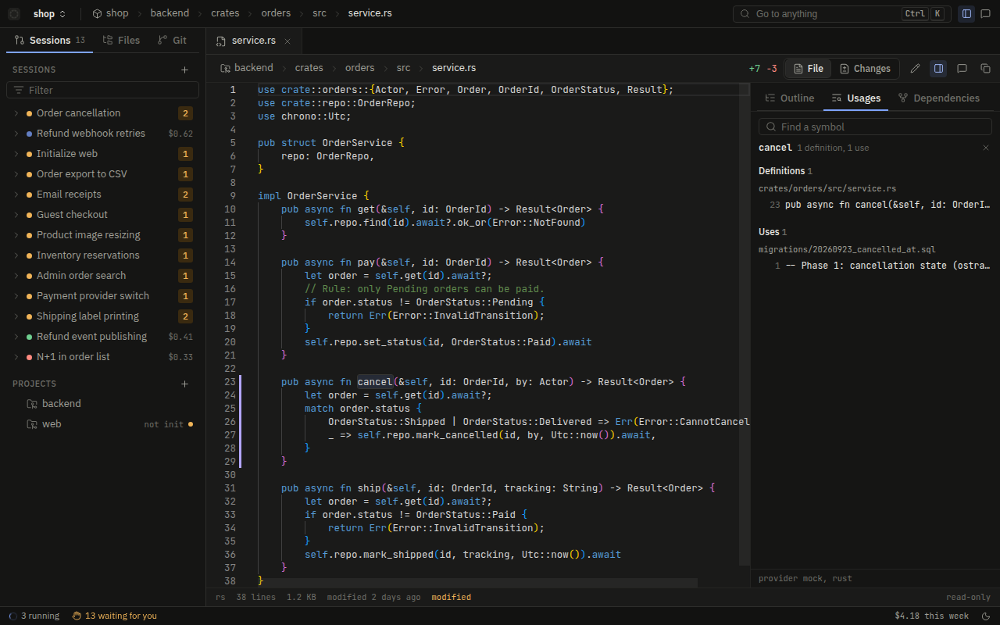
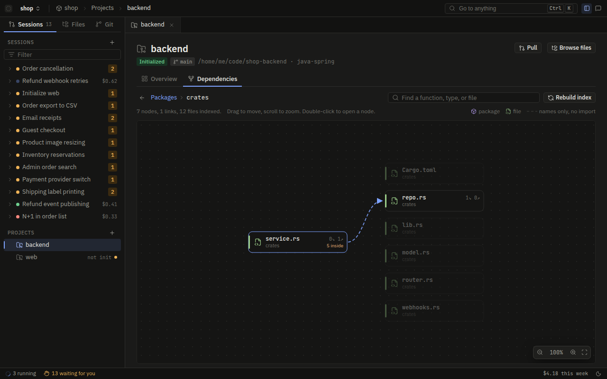
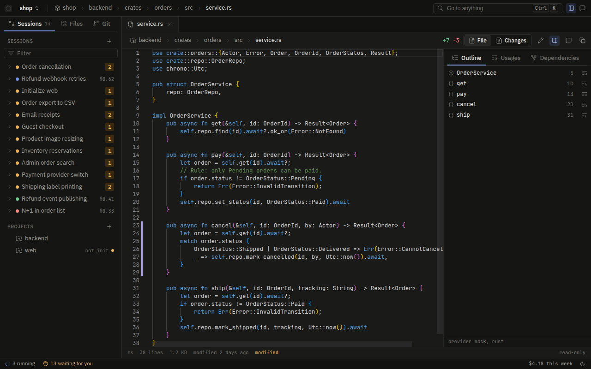

# Code index

Ostra reads the code of every project it works on and keeps an index of it: the names each file defines, the
names it mentions, and the files it imports. Two things read that index. The Files view in the browser uses
it to color code, draw an outline, jump to a definition, and list usages. Agents use it through eight code
tools, so they can ask "who calls this" or "what breaks if I change this" without reading dozens of files.

The index lives in the `ostra-code` crate. It has no compiler and no type checker inside it. It uses a
table-driven tokenizer, a set of definition and import rules per language family, and a resolver that knows
how each language maps an import to a file. This page explains what that gets right, where it stops, and how
a project can plug in a language server or its own program when it needs more.

## Why Ostra has its own index

Agents spend most of their tokens finding their way around a codebase. A model that wants to know where a
function is used runs `grep`, reads every hit, discards the ones that mean a different function with the same
name, and then opens each caller to see what it is. On a large repository that costs many tool calls before
any real work starts.

The index answers those questions in one call, in a compact text form a model reads quickly. It also works the
same way on every executor. A native run calls the tools directly, and a harness run (Claude Code, Codex, and
the others) reaches the same tools through Ostra's MCP server. No harness needs an editor plugin or a language
server of its own.

The index does not need a build to succeed. It reads source text, so it answers while the project fails to
compile, which is exactly when an implementer needs it most.

## Languages

The tokenizer covers these languages for navigation (outline, definitions, usages, and imports):

| Family | Languages | Family-specific rules |
| --- | --- | --- |
| Rust | Rust | `impl` blocks as containers, `impl Trait for Type`, `mod` declarations, `use` paths |
| JavaScript | TypeScript, JavaScript | `export * from` re-exports, `tsconfig.json` paths such as `@/` |
| Python | Python | Indentation decides what a class body holds, base classes in the `class` line |
| Go | Go | Receivers (`func (r *Repo) Save`), `go.mod` module paths, interface satisfaction by method set |
| JVM and friends | Java, Kotlin, Scala, C#, Swift, PHP | Class bodies with members, dotted imports, `extends` and `implements` |
| C | C, C++ | Function bodies, `#include` |
| Others | Ruby, Lua, shell | Keyword definitions |

SQL, TOML, YAML, JSON, CSS, and HTML are colored for display and take no part in navigation.

Each language is one entry in a table (`crates/ostra-code/src/lang.rs`): its comment and string syntax, its
keywords, its built-in types and constants, and the keywords that introduce a definition along with the kind
of thing they define. Adding a language means adding a row and, if its family is new, a small set of
definition and import rules. The lexer and the index do not change.

## What the index keeps

There is one index per project. It is built on the first request that needs it and then kept up to date
incrementally.

For each file the index keeps:

- the set of names the file mentions,
- its definitions, each with a kind (function, method, class, field, and so on), a line range, the enclosing
  type, and a one-line signature,
- its imports, each resolved to a project file when the language's rules allow it,
- its supertype declarations (`extends`, `implements`, `impl Trait for Type`, Python base classes).

It never keeps a file's text. A usages query re-reads only the files whose name set contains the name it is
looking for. This keeps memory small on large repositories and means the answer always reflects what is on disk
now.

Imports resolve from the language's own rules plus the project's manifests: `Cargo.toml` package names,
`go.mod` module paths, and `package.json` and `tsconfig.json` for aliased paths. An import that leaves the
project, such as `std::path::Path` or a third-party package, is marked `external`.

### Staying current

Two mechanisms keep the index in step with the files:

1. **Writes by executions.** When an agent writes or edits a file, Ostra marks that file for re-reading. The
   same happens when the user saves a file in the browser.
2. **A periodic check.** Every file's size and modification time are compared with the disk again after 30
   seconds, so edits made outside Ostra (an editor, a `git pull`, a formatter) are picked up. Only files whose
   stamp changed are analyzed again, in parallel.

### Limits

The index has fixed limits, because an unbounded index on a monorepo would take the server's memory with it:

| Limit | Value | Where |
| --- | --- | --- |
| Largest file indexed | 1 MB | `MAX_FILE_BYTES` in `crates/ostra-code/src/lib.rs` |
| Source read per project | 256 MB | `MAX_INDEX_BYTES` in `index.rs` |
| Files one usages query reads | 4,000 | `MAX_SCAN_FILES` in `index.rs` |
| Files a transitive walk visits | 5,000 | `MAX_REACH` in `graph.rs` |

Minified files and files the project's ignore rules exclude are skipped. When the index stops adding files at
the 256 MB mark, its answers say so, so nobody mistakes a partial answer for a complete one.

## Finding the right definition

The hard part of "who uses this" is names that repeat. `getName` exists on many unrelated classes, and a text
search lists all of them. The index narrows this down in several steps.

When a request names a position (a file and a line), the index first finds the one definition that name means
there:

- A position on a definition means that definition.
- A member after `.`, `->`, or `::` resolves through the type of its receiver. The index reads the type from the
  way the file declares the receiver (`Repo repo`, `repo: Repo`, `repo *Repo`, `repo = new Repo()`) or from the
  return type in the signature of the call before it (`Order.builder().build()`), and then walks that type's
  supertypes.
- `self.x`, `this.x`, and a bare member name inside a class body mean the enclosing class, unless a local
  declared earlier in the method hides it.
- A receiver whose type the project does not define, such as `String`, means none of the project's own members.

It then lists only the mentions that can mean that definition. A method's usages also include calls to the
interface or trait method it implements. A mention whose receiver type is unknown still counts when the file
names the definition's class, or when nothing else in the language has that name. When the name resolves to
nothing the index can tell apart, the answer falls back to matching by name.

This is a heuristic, not type checking. Members that code generation adds, such as Lombok getters, are not seen.
A project that needs exact answers can add a language server (below).

Clicking a name in the Files view asks for its usages at that position. The code pane lists the one definition and
the mentions that can mean it:



## The dependency graph

On top of the per-file data the index builds a graph of the project (`crates/ostra-code/src/graph.rs`), without
reading any files. It has two kinds of edge:

- **Import edges** come from resolved imports.
- **Reference edges** link a file to the files that define the names it mentions. The index looks for a
  definition the way a reader would: the file itself, the files it imports, its folder, its package, and then
  the packages its package imports.

Some care goes into keeping the graph honest:

- A name defined in more than three files links none of them, unless the mentioning file imports the defining
  file directly, because a common name would otherwise connect everything to everything.
- A Rust `mod` declaration is containment, not use, so a transitive walk does not follow it.
- Index modules (`lib.rs`, `mod.rs`, `index.ts`, `__init__.py`, and files with `export * from`) re-export
  names. A walk does not step through them on an import alone, because the names already link to the files that
  define them.
- Test files are recognized by folder (`tests/`, `__tests__/`, `spec/`, `fixtures/`) and by name
  (`_test.go`, `.spec.ts`, `Test.java`, and others), so answers can separate code from its tests.

Ostra checks this graph against its own source tree in `crates/ostra-code/tests/graph_ostra.rs`. One test
asserts that `ostra-engine` depends on none of the server, executor, provider, or tool crates, which is the
dependency rule in the contributor notes. If the index got the graph wrong, that test would fail.

The Dependencies tab of a project draws this graph. Double-clicking a package opens its files and the imports
between them:



## The code tools agents use

Every agent that reads code has the `code` capability, which gives it eight tools. Their descriptions tell the
model when to reach for each one instead of `Grep` or `Read`.

| Tool | What it answers |
| --- | --- |
| `CodeOutline` | A file's imports (with the project file each resolves to) and its definitions with line ranges, without reading the file |
| `CodeFind` | Definitions by name across the project, ranked exact match, then prefix, then substring, then initials (`pn` finds `parse_name`) |
| `CodeCallers` | Every place a symbol is used, grouped by the enclosing function or type |
| `CodeCallees` | What one function or type body uses: the functions it calls, the types it names, the fields it touches |
| `CodeImplementations` | What a type implements or extends and what implements it; for a method, the interface method it implements and the methods that implement it |
| `CodeNeighbors` | The files one file uses and the files that use it, with the import lines and the names linking each pair |
| `CodeImpact` | What a change can break, hop by hop, and the list of files to change or recheck |
| `CodeMap` | The project's packages and their dependencies, the most depended-on files, and import cycles |

The tool definitions are in `crates/ostra-tools/src/defs.rs`, and the answers are formatted in
`crates/ostra-code/src/tools.rs`. On a harness, the same tools appear as `mcp__ostra__code_outline`,
`mcp__ostra__code_callers`, and so on, and they run the same code.

The code tools always read the built-in index, even when the project has a language server, because an agent's
question should get the same answer whether or not an external server happens to be running.

### What an answer looks like

These are real answers from the index run over Ostra's own repository.

`CodeOutline` on the project memory store lists imports and definitions, with methods indented under their type.
An agent reads this first and then opens only the line range it needs:

```text
crates/ostra-store/src/memory.rs (rust, 314 lines)
imports:
  L5 crate::StoreError -> crates/ostra-store/src/lib.rs
  L6 ostra_core::api::Lesson -> crates/ostra-core/src/api.rs
  L7 rusqlite::Connection -> external
  ...
symbols:
  L11 const DEFAULT_RECALL_LIMIT
  L38-40 class MemoryStore
    L39 field path in MemoryStore
    L90-99 method record in MemoryStore
    L103-163 method recall in MemoryStore
  ...
```

`CodeCallers` groups each use by the function that contains it:

```text
defined at:
  crates/ostra-policy/src/guards.rs:654 fn lesson_denial
used by (2 places in 2 files):
  crates/ostra-policy/src/guards.rs  fn check_write  lines 507
  crates/ostra-policy/src/policy.rs  method layer1 in ExecutionPolicy  lines 386,400
```

`CodeImpact` follows names, not whole files. A file that only uses something else from the same file is left
out, which is the difference between this and "every file that imports this file":

```text
changing crates/ostra-store/src/memory.rs:103 method recall in MemoryStore affects:
hop 1 (uses it directly):
  crates/ostra-exec-native/src/lib.rs  method tool in Run  lines 808
  crates/ostra-server/src/bridge.rs  method policy_observe in ServerBridge  lines 345
  crates/ostra-tools/src/misc.rs  fn memory_recall  lines 122
  ...
hop 2 (uses something in hop 1):
  crates/ostra-exec-native/src/lib.rs  method run_tools in Run  lines 627,635  via tool
  crates/ostra-server/src/bridge.rs  method mcp_call in ServerBridge  lines 401  via policy_observe
  crates/ostra-tools/src/lib.rs  fn execute  lines 253  via memory_recall
files to change or recheck (5): ...
```

## The provider chain in the Files view

The browser's Files view asks a chain of providers for each request and shows the first answer. Every answer
names the provider that gave it.

```text
code_provider program  ->  language servers  ->  built-in index
```

The code pane's footer names the provider that answered. This screenshot comes from the console's demo data, so the
provider is `mock`:



### A project's own program

A project entry can set `code_provider.command`. Ostra runs it once per request in the project folder, writes
one JSON request to its standard input, and reads one JSON value from its standard output:

```json
{"op": "usages", "version": 1, "root": "/home/me/src/shop", "symbol": "Order", "limit": 40, "path": "src/order.rs", "line": 12}
```

The operations are `file`, `usages`, `deps`, and `symbols`. The answer has the shape of the matching API type
(`CodeFile`, `CodeUsages`, `CodeDeps`, `CodeSymbols` in `crates/ostra-core/src/code.rs`), and the program sends
only the fields it knows. It answers `null` to leave a request to the next provider.

A program that exits non-zero, times out (10 seconds by default, up to 120), or returns an answer that fails
Ostra's checks also falls through to the next provider. The answer shown then carries the reason, because a
silent fallback would hide a broken provider. `OSTRA_CODE_PROTOCOL` in the program's environment holds the
protocol version.

### Language servers

`[[projects.language_servers]]` entries name a Language Server Protocol server, the languages it answers for,
a timeout, and optional initialization options:

```toml
[[projects.language_servers]]
command = ["rust-analyzer"]
languages = ["rust"]
initialization_options = { workspace = { symbol = { search = { kind = "all_symbols" } } } }
```

Ostra starts a server in the project folder on the first request for one of its languages. It keeps one server
per project and command, stops it after 10 minutes without requests, and runs at most 8 across all projects,
stopping the least recently used, because each one holds a whole project in memory. A server that fails to
start is not tried again for 30 seconds.

A language server improves the Files view without replacing the built-in answer:

- A file answer starts from the built-in one and overlays the server's semantic tokens and document symbols.
  Imports stay built-in.
- Usages at a position ask the server for `definition` and `references`.
- Symbol search asks `workspace/symbol`.
- Writes by executions and saves in the browser reach running servers as `workspace/didChangeWatchedFiles`.

A server can also answer with a definition outside the project, such as a library in `~/.cargo/registry`, in
`~/go/pkg/mod`, or inside a Java jar. Ostra opens it as a read-only tab and asks the same server when the user
follows a link from there, so navigation continues through the library and back. The browser cannot name an
arbitrary file this way: Ostra reads only URIs a server of that project returned since the Ostra server started.

Some servers need options to answer fully. gopls colors only with `semanticTokens = true`, and rust-analyzer
searches functions only with `workspace.symbol.search.kind = "all_symbols"`.

## Safety

The index and its helpers run code only when the user approved it:

- A `code_provider` or `language_servers` entry in a `workspace.toml` that arrived with a repository or a
  `git pull` does not start until the user approves that exact content (Rule A1). Settings shows the commands
  to approve.
- Language servers run under the same sandbox as agent commands, where the platform supports it.
- A project's `code_provider` cannot point the browser at files outside the project: Ostra clears the `uri`
  field in its answers.

## Where to read next

- [Agents](agents.md): the `code` capability and which agents have it.
- [Tools](tools.md): the rest of the native tool set, which the code tools sit beside.
- [MCP servers](mcp.md): how harness runs reach the code tools through Ostra's MCP server.
- [Settings and routing](settings-and-routing.md): where `code_provider` and `language_servers` go in a project entry.
- [Agent containment](../security/agent-containment.md): the sandbox language servers run under.
