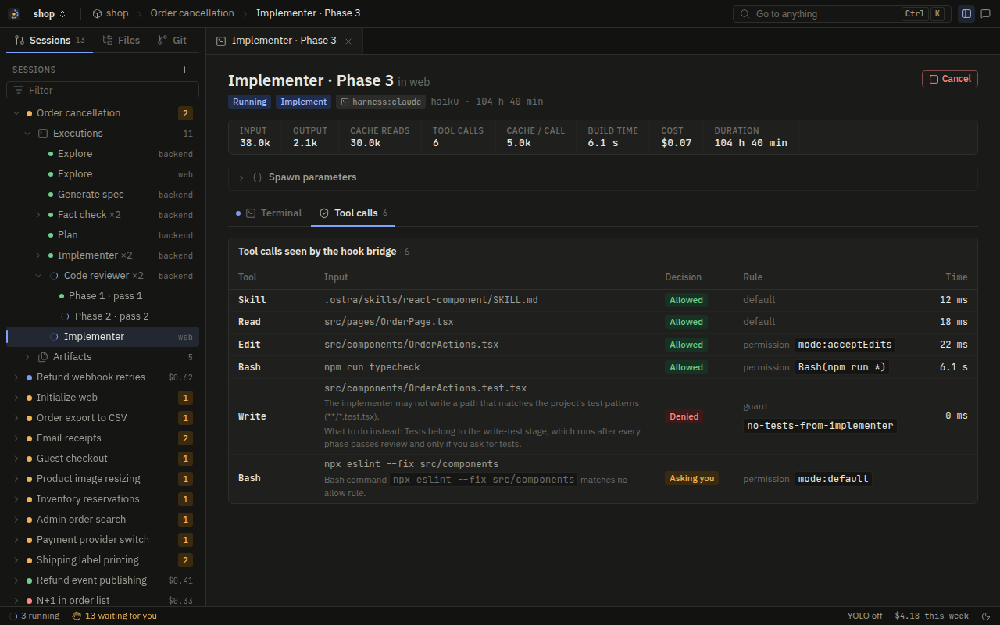
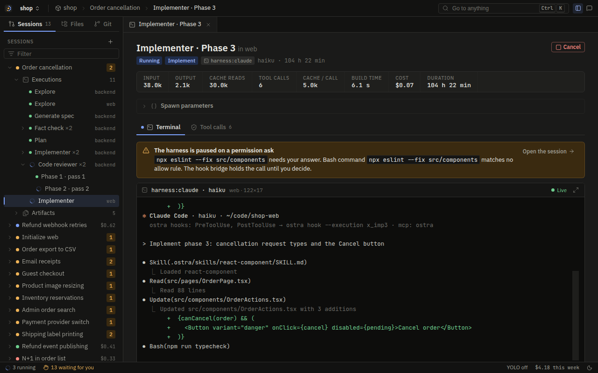
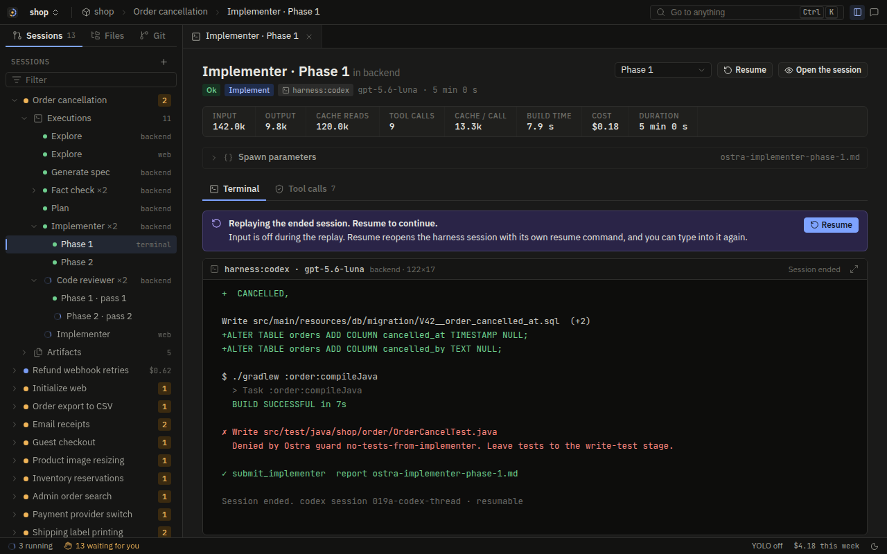

# Executors

An executor is the part of Ostra that runs one agent from its first message to its `submit_<agent>` call. The
engine decides what to run and when, and it never runs a model itself. It hands an executor a finished
execution spec and gets one result back. Everything between those two points, including the model calls,
the tool calls, the permission asks, the streaming output, and the timeout, belongs to the executor.

Ostra has two kinds of executor:

- **Native.** Ostra runs the agent loop itself. It calls the provider's API with your API key and runs its own
  tools.
- **Harness.** Ostra starts an installed coding CLI (Claude Code, Codex, Grok Build, or Antigravity) in a
  terminal and lets that CLI run the loop. Ostra still checks every tool call, serves the tools only Ostra has,
  and reads the result.

Both kinds sit behind the same two traits, so the engine never needs to know which one it is talking to. The
route in your settings picks one per agent ([Settings and routing](settings-and-routing.md)), and
[Provider usage](../providers/README.md) lists which credentials each path takes.

## The contract

The whole interface lives in `crates/ostra-core/src/exec.rs`. It has two traits:

```rust
pub trait Executor: Send + Sync {
    async fn run(&self, spec: ExecutionSpec, host: Arc<dyn ExecutionHost>, cancel: CancellationToken)
        -> ExecutionResult;
}

pub trait ExecutionHost: Send + Sync {
    fn emit(&self, delta: ExecutionDelta);
    async fn ask_permission(&self, call: &ToolCall, reason: &str, rule: &RuleRef) -> PermissionAnswer;
    fn record_message(&self, role: &str, content: &serde_json::Value) {}
    fn transcript(&self, execution: &ExecutionId) -> Vec<(String, serde_json::Value)> { vec![] }
    fn yolo(&self) -> bool { false }
}
```

`Executor` is what an executor provides. `ExecutionHost` is what the engine gives the executor back while it
runs. `run` never returns an error type: every way an execution can end becomes an `ExecutionResult` with a
status. That keeps the runner simple, because the runner only ever handles one shape of answer.

### What goes in

An `ExecutionSpec` carries everything the run needs, already resolved:

| Field | What it holds |
| --- | --- |
| `route` | The executor and model, resolved from settings when the spec was built. |
| `system_prompt` | The agent's prompt, rendered with this executor's tool names. |
| `first_message` | The spawn block, the repo brief, and any custom instructions. |
| `capabilities` | Which tools the agent may have, from its `agent.toml`. |
| `submit_schema` | The JSON schema of `submit_<agent>`. |
| `timeout_secs` | The hard time budget for this execution. |
| `ctx` | What the policy needs: repo root, session dir, report path, permission mode and rules, protected paths, the memory database, the sandbox mode. |
| `resume` | Set when this run continues an earlier one. |
| `harness_session_id` | A session id chosen up front, for the CLIs that accept one. |

The executor does not read settings to decide what model to use or which tools to offer. That decision was
made once, when the engine built the spec. Settings the executor does read fresh, such as the sandbox table,
are read at the start of each execution, so a change applies to the next one.

### What comes out

An `ExecutionResult` has a status, the submit payload when there is one, the last assistant text, usage, the
harness session id, and an error message. The statuses are:

| Status | Meaning |
| --- | --- |
| `ok` | The agent called its submit tool. |
| `stuck` | The agent submitted with `status: "stuck"`, which asks the engine for a rescue. |
| `handoff` | The agent submitted with `status: "handoff"`. |
| `error` | The run ended without a usable submit: a timeout, a crash, a refusal, a launch failure. |
| `denied` | The engine could not start it: the route did not resolve, no executor serves it, or the spawn block could not be built. No executor ran. |
| `cancelled` | You or the engine stopped it. |
| `interrupted` | It was stopped so it could be resumed, or the server restarted while it ran. |

The engine reads only the submit payload. The final text is kept for display and for the transcript, and
nothing downstream parses it. This is why every prompt ends with the instruction to call the submit tool, and
why both executors chase an agent that stops without calling it.

### What streams while it runs

`ExecutionHost::emit` takes an `ExecutionDelta`, and the engine stores and broadcasts each one to the Activity
view. The deltas are the same for both executors:

- `text` and `thinking`: model output, buffered into readable chunks.
- `tool_call`, `policy`, `tool_result`: one tool call, the decision the policy made on it, and what came back.
- `tool_output`: live output of a running shell command, so you can watch a long build scroll.
- `usage`: a running total of tokens and cost.
- `status`: a one-line note, such as "Bash runs without a sandbox" or "The session went quiet; Ostra reminded
  it to submit."
- `native_session_id`: the harness CLI's own session id, once it is known.

Because both executors emit the same deltas, the Activity view does not have a native mode and a harness mode.
A harness run also has a Terminal tab with its raw screen, which the native executor has no equivalent for.

## The native executor

The native executor lives in `crates/ostra-exec-native/src/lib.rs`. It is a streaming agent loop over the
`Provider` trait, with Anthropic (Messages API) and OpenAI (Responses API) implementations in
`ostra-providers`.

A native run's Activity tab streams each tool call as the loop dispatches it, with its timing:


### Setup

Before the first model call, a run does the following, in order:

1. Resolves the model to a provider. A missing API key fails here with a message that says which variable to
   set.
2. Opens the workspace's MCP servers for this execution ([MCP servers](mcp.md)). A server that cannot be
   reached adds one status line, and the run continues without it.
3. Builds the policy for this execution from the spec's context and the project profile's build and test
   commands. The build-streak guard uses those commands.
4. Builds the tool environment: the persistent shell directory, the set of files read so far, an HTTP client,
   and the list of environment variables every child process must not inherit.
5. Decides the sandbox. The `[sandbox]` table is read fresh. If it asks for a sandbox, Bash runs under
   bubblewrap on Linux or Seatbelt on macOS with a per-execution scratch `/tmp`. If it allows running without
   one and none is available, the run says so in the Activity view. [OS compatibility](../platforms/os-compatibility.md)
   lists which backend each platform has.
6. Assembles the tool list from the agent's capabilities (see [Tools](tools.md)), adds the typed `Document`
   tool for the agents that write one, adds the workspace MCP tools, and appends `submit_<agent>` last.
7. Builds the message list. A fresh run starts with the first message. A resumed run rebuilds the stored
   transcript and adds a resume turn (below).

The system prompt is marked for caching, and so is the last tool definition, the submit tool. That places one
cache breakpoint after the system prompt and one after the tool list, so every turn after the first reads both
from cache. Every breakpoint uses the 1-hour TTL, because the turns of one execution can sit more than five
minutes apart: a long build or a permission card you have not answered yet would otherwise expire the cache.

### The loop

Each turn sends the whole conversation and streams the answer back. Text and thinking deltas are buffered and
flushed every 160 characters or at a newline, so the Activity view shows sentences instead of one row per token.
When the provider runs a server-side tool (web search, or the provider's fetch), that shows up as a status line.

What happens next depends on why the model stopped:

| Stop reason | What the loop does |
| --- | --- |
| Tool calls present | Runs them (below), appends the results, and starts the next turn. |
| `pause_turn` | The provider paused a long server-side tool turn. The loop continues it. |
| Refusal | Ends the run as `error` with the refusal category and text. |
| Output limit, no tool call | Asks the model to continue from where it stopped, at most 3 times. |
| Plain end of turn, no tool call | Reminds the model once to call the submit tool. A second turn with no tool call ends the run as `ok` with no submit, which the engine treats as a failed step. |

The loop has a ceiling of 400 turns. A run that reaches it without submitting ends as an error, because an
agent that has not submitted after 400 turns is looping.

### Tool dispatch

The model often asks for several tools in one turn. The loop runs them in order, with one exception: a run of
consecutive read-only calls (`Read`, `Grep`, `Glob`, `WebFetch`, `MemoryRecall`, `Skill`, and the code
navigation tools) runs concurrently. Writes and shell commands always run one at a time and in the order the
model gave, because the second call may depend on the first.

Every single call follows the same path:

1. **Canonicalize.** Relative paths become absolute against the shell's current directory, `Bash` gets its
   `cwd`, and a `WebFetch` URL is replaced with its parsed form. The policy then checks this call and the tool
   runs this call, so the check and the run cannot disagree about the target. A URL such as
   `https://evil.example\@docs.rs/x` is judged by the host it actually reaches.
2. **Check.** `ExecutionPolicy::check` runs the guards and then the permission rules. The decision goes to the
   Activity view.
3. **Deny or ask.** A denial becomes an error result that leads with the correction. An ask goes to
   `ExecutionHost::ask_permission`, which shows a card in the browser and waits. "Always in this workspace"
   also adds a session allow rule, so the same call does not ask again in this execution.
4. **Run.** The tool runs with a live-output callback, so Bash output streams while the command runs.
5. **Observe.** The policy sees the outcome. That is how the build-streak guard counts failures: after two
   failed builds it appends the project's recorded lessons to the tool result, and after five it refuses build
   commands and tells the agent to return `STUCK:`.

Guards and permissions are covered on their own page, [Agent containment](../security/agent-containment.md).
The point here is that the native loop has no path to a tool that skips step 2.

### The submit call

The submit call is not a tool that does something. It is how the run ends. When the model calls
`submit_<agent>`, the loop:

1. Coerces stringified JSON fields back into objects, because models sometimes send a nested object as a
   string.
2. Runs the policy on it like any other call.
3. Validates it against the agent's submit schema (`validate_submit`) and runs the document checks.
4. Refuses an `ok` submit when the agent has a declared report file that does not exist yet, because the engine
   reads that file next. The code reviewer is exempt.

A refused submit is an error result, and the model tries again. An accepted submit ends the run at once: any
other tool calls in the same turn are answered "Not run" and never execute. The submit's `status` field decides
between `ok`, `stuck`, and `handoff`.

### Long runs

An implementer can run for hundreds of turns. Once the conversation passes 300,000 characters (about 75,000
tokens), old tool results are cleared. On Anthropic the API clears them server-side. On other providers the loop
keeps the 12 newest tool results and replaces the rest. The implementer's progress log is what makes this safe:
it records what has been done, so the agent does not need its old tool output to know where it is.

### Provider errors

The provider clients retry rate limits and server errors with exponential backoff and jitter, up to 4 retries
with the delay capped at 60 seconds, and they honor a `Retry-After` header. They never retry once output has
started streaming, because a retried turn would repeat text the Activity view already showed. A call that still
fails ends the run with the provider's error.

### Transcript and resume

Every message the loop sends or receives goes to `ExecutionHost::record_message`, which stores it. A resumed
execution reads that transcript back with `rebuild_transcript`:

- If the last stored message is the assistant's, its open tool calls are answered "Interrupted: this call did
  not finish.", because the provider refuses a conversation with tool calls that have no results.
- The resume note is then added: either the note the engine supplied (for example, context you added while the
  run was going) or "The previous run was interrupted. Continue from where it stopped."

### Cost

Each response's usage is added to a running total and emitted at once, so the cost in the header moves while
the agent works. Prices come from the models.dev catalog, cached in the data dir and refreshed daily. Anthropic
1-hour cache writes are priced at twice the input rate, because models.dev lists only the 5-minute write price.
[Spend and limits](spend-and-limits.md) explains how these numbers turn into the session budget.
Wall time spent in build and test commands is tracked separately as `build_ms`, which feeds the build-loop
metric.

## Harness executors

The harness executor lives in `crates/ostra-exec-harness`. It runs one agent inside an installed CLI, under a
real pseudo-terminal, in the project directory. The PTY bytes go to the browser, where xterm.js shows the CLI's
own interface. You can watch it work and type into it.

The four supported CLIs:

| Harness | Binary | Session id | Cost source |
| --- | --- | --- | --- |
| Claude Code | `claude` | Chosen by Ostra (`--session-id`) | `~/.claude/projects/*/<id>.jsonl` |
| Codex | `codex` | Captured from the first event or transcript | `rollout-*.jsonl` |
| Grok Build | `grok` | Chosen by Ostra (`--session-id`) | `sessions/<cwd>/<id>/updates.jsonl` |
| Antigravity | `agy` | Captured from the screen or transcript | None: its transcript records no usage |

The binary name can be changed per harness with `[harness.<name>].command`, and extra arguments go in
`[harness.<name>].args`. The launch flags were checked against claude 2.1.280, codex 0.153.4, grok 1.0.30, and
agy 1.2.6.

### Why run a harness at all

A harness route bills the run to the account that CLI is signed into, through the provider's own sign-in and
the provider's own client. That is the only way Ostra uses a subscription: it never copies a token or signs in
for you. The harness also brings its own tool implementations and its own model-specific tuning.

The cost of that is control. Ostra did not write the loop and cannot change it. So the design goal of the
harness executor is to put three things around a loop Ostra does not own:

1. Every tool call the CLI makes passes Ostra's policy, the same one the native loop uses.
2. The CLI gets Ostra's own tools (submit, report, document, memory, code navigation, and the workspace MCP
   servers) and nothing that would let it route around them.
3. The run ends when the agent submits, and Ostra finds out.

The next sections describe the parts that do each of these.

### The launch plan

`launch.rs` turns an execution spec into a `LaunchPlan`: a program, arguments, environment, working directory,
and the files to write before start. Each CLI takes its configuration differently, so each has its own planner.
They share these steps:

- **The prompt.** The agent prompt, rendered with that harness's tool names, becomes the CLI's system prompt
  addition (`--append-system-prompt-file` for Claude Code, `developer_instructions` for Codex, `--rules` for
  Grok, an agent file for Antigravity). The first message becomes the CLI's first user message. A first message
  over 96 KiB is written to a file and the CLI is pointed at it, because command lines have a length limit.
- **Hooks.** Every PreToolUse, PostToolUse, Stop, and SessionStart event is pointed at
  `ostra hook --execution <id> --harness <name> --event <event>`, a subcommand of the same `ostra` binary. The
  hook timeout is 24 hours, because a permission ask waits for you and must not time out first.
- **The MCP server.** One stdio MCP server named `ostra` is registered: `ostra mcp-stdio --execution <id>`.
- **No subagents.** The CLI's own subagent tool is turned off (`--disallowed-tools Agent,Task` for Claude Code,
  `--disable multi_agent` for Codex, `--no-subagents` for Grok). Every Ostra agent is a leaf, because a delegated
  task would run outside Ostra's view and its result would never reach the engine.
- **No questions in the terminal.** Claude Code's `AskUserQuestion` and plan-mode tools are disabled, because
  nobody watches the terminal for questions. An agent that needs you puts the question in its submit call, and
  the engine turns it into a gate.
- **The model and effort.** The routed model is passed explicitly, and the effort from `agent.toml` is mapped to
  the CLI's word for it, clamped to what that CLI accepts.
- **Environment.** The CLI gets your environment, so it comes up signed in. Ostra removes the credential
  variables its own config names, except the ones that CLI reads to sign in (for example Claude Code keeps
  `ANTHROPIC_API_KEY`). Variables that would make the CLI a nested child of the Claude Code session Ostra itself
  was started from are removed too, because Claude Code does not save a nested session and it could never be
  resumed. [Secrets and data](../security/secrets-and-data.md) covers which variables count as credentials.

Config files that hold the bridge token are written owner-only.

### Keeping the repository's own config out

A coding CLI started in a folder reads that folder's own settings, and those can carry hooks and MCP servers.
Those would run outside Ostra's guards. Each planner shuts that door in its CLI's own way:

- **Claude Code** loads only your user settings and Ostra's (`--setting-sources user`), and only Ostra's MCP
  config (`--strict-mcp-config`). Ostra's hooks are passed as flag settings, which a user settings file cannot
  turn off. Its folder-trust prompt is answered yes, because trust adds nothing from the repository in this mode.
- **Codex** gets a per-execution profile that marks the repository, and every folder up to its git root,
  `untrusted`. It opens restricted: the repository's `.codex/` config, hooks, and exec policies stay off, and
  your saved trust is untouched. If its prompt ever offers only "Trust and continue", the run stops and tells you
  to remove `-p`/`--profile` from your extra args, because trusting would load the repository's config. The
  profile file is deleted when the execution ends. Codex also runs with `check_for_update_on_startup = false`,
  because a self-update exits the CLI and ends the run before it starts.
- **Grok Build** gets a per-execution `GROK_HOME` that links to your real one except for its config, its trust
  list, and its leader socket, which are private copies. Ostra trusts only the session dir. If Grok asks to
  trust the repository, the run stops and asks you to trust it in Grok yourself, because Grok runs a trusted
  folder's hooks and MCP servers and Ostra does not make that decision for you.
- **Antigravity** reads hooks and MCP servers only from global config. Ostra installs one global integration
  whose hook and MCP commands do nothing unless `$OSTRA_EXECUTION` is set, so it is inert in your own
  Antigravity sessions.

### The hook bridge

The CLI runs `ostra hook` for every hook event and pipes the event payload to it on stdin. That process is thin:
it forwards the payload to the running server at `POST /internal/policy` with the execution's bearer token,
prints what the server answers, and exits. The server's `HarnessBridge` (`bridge.rs`) does the work:

```
harness CLI ── stdin ──> ostra hook ── POST /internal/policy ──> HarnessBridge
                                                                   │ adapter.parse_pre
                                                                   │ ExecutionPolicy::check
                                                                   │ (ask: wait for the browser)
harness CLI <── stdout ── ostra hook <──── adapter.pre_response ───┘
```

The bridge fails closed. If `ostra hook` cannot reach the server, cannot read the answer, or is missing its URL
or token, a PreToolUse answers with a denial that tells the agent to stop. An unknown execution, a stale token,
or a hook whose harness does not match the execution also denies. Tokens are compared in constant time.
`/internal/*` accepts local peers only.

A Stop event goes through the bridge too, and that is how Ostra keeps an agent from stopping without a result.
If the agent stops before it has submitted, the bridge blocks the stop and tells it to call its submit tool. It
does that twice. On the third stop the run ends as an error ("The agent ended its turn three times without
calling submit").

A harness run's Tool calls tab lists every call the hook bridge saw, with the policy decision and the rule behind
it:



### Adapters

Each CLI names its tools differently and expects a different answer shape. `adapters/` has one adapter per CLI.
Each one turns its CLI's payload into a canonical `ToolCall` (Claude Code's tool names and input shapes), and
turns Ostra's decision back into the exact response that CLI accepts. The policy engine sees only canonical
calls, so a guard is written once and holds for all four CLIs.

| CLI | Tool names it uses | Answer shape and its quirks |
| --- | --- | --- |
| Claude Code | Already canonical. `MultiEdit` and `NotebookEdit` map to `Edit`, `LS` to a read. | Decisions and rewrites go only in `hookSpecificOutput`, because a top-level field fails its schema. |
| Codex | `exec_command`/`shell` to `Bash`, `apply_patch` to the files the patch touches. | Rejects an `allow` without `updatedInput`, and rejects `ask`, so an allowed call answers `{}`. Its hooks get no exit status, so the policy judges the output text. |
| Grok Build | `read_file`, `write_file`, `search_replace`, `run_terminal_command`, `grep`, `list_dir`, `web_fetch`, and others. | Reasons are clipped to 256 characters, so Ostra refits them keeping the correction and the final instruction. Payloads over 128 KiB lose their tool input, and such a call is refused, because it cannot be judged. |
| Antigravity | `view_file`, `write_to_file`, `replace_file_content`, `run_command`, `grep_search`, `find_by_name`, `read_url_content`, `search_web`. | Output is proto-validated and an unknown field discards the whole response, so it answers only `decision` and `reason`. PostToolUse carries no tool result. |

Some calls are refused before the policy sees them. A subagent spawn is refused with the leaf rule. A question to
the user in the terminal is refused with the instruction to put it in the submit call. An input the adapter
cannot read is refused rather than let through.

### The MCP stdio shim

`ostra mcp-stdio` is a stdio MCP server that forwards each JSON-RPC message to `POST /internal/mcp` and prints
the answer. Stdio, because it is the one MCP registration shape that works on all four CLIs. It speaks MCP
protocol versions 2024-11-05 through 2025-11-25. Started outside an Ostra execution, it answers the handshake
with no tools, so a global registration stays inert.

It serves:

- `submit_<agent>`, the only submit tool this agent may call.
- `report`, `document`, `memory`, and `memory_recall`, as the agent's capabilities allow.
- `code_outline`, `code_find`, and the rest of the code navigation tools.
- Each workspace MCP server's tools, as `<server>__<tool>`. The CLI sees them as `mcp__ostra__<server>__<tool>`.

A `tools/call` goes through the same policy check as a hook, because the hook bridge lets calls to Ostra's own
MCP server pass unchecked (rule M2). Checking in both places would ask you twice.

The submit call is where the result arrives. The bridge validates it against the schema and the document
checks, records it, and answers "Recorded. Your run is complete: end your turn now, without further tool calls."
A second submit is refused. The prompt's tool vocabulary tells the agent to reply only `Done!` afterwards,
because any other text costs output tokens and nothing reads it.

### Supervising the terminal

While the CLI runs, the executor's `supervise` loop wakes on every hook event or MCP call, and at least every
half second. On each pass it checks the following:

- **Submitted.** Once a submit is recorded, the run ends at the CLI's next Stop event, or 20 seconds later if no
  Stop arrives. Antigravity has no Stop hook, so for it 4 seconds of terminal quiet after the submit ends the
  turn.
- **Startup screens.** In the first two minutes, and only until the first tool call, it reads the screen:
  - It answers folder trust as described above.
  - It declines a new-model offer (Codex's "Meet GPT-6 Luna") by choosing "Use existing model", because
    accepting would switch the run's model and your default model.
  - Sign-in text such as "please log in", "select login method", or "finish signing in" ends the run at once as
    a sign-in failure, because otherwise the CLI would sit on its sign-in screen for the whole budget.
  - "unknown model" or "failed to construct executor" ends the run as a launch failure.
- **Quiet.** A session with no hook event and no terminal output for 4 minutes is nudged: Ostra types the
  submit instruction into the terminal, as if you had. After two nudges it ends the run as an error.
- **The budget.** Past `timeout_secs`, the run ends.

The terminal itself is a `vt100` screen model kept in the server (`pty.rs`). A browser that attaches in the
middle of a run is sent the current screen and its scrollback. Ostra alone answers the terminal queries TUIs send
(cursor position, device attributes, colors) and the browsers mute theirs, so the CLI gets exactly one answer
whether zero or five tabs are watching. The raw bytes are also written to an owner-only file capped in size, so
the Terminal tab can replay an ended run.

A harness run's Terminal tab shows the CLI on its PTY. This Claude Code run is paused on a permission ask that the
hook bridge holds:



### Failures that are not the agent's fault

A CLI that is not installed, is not signed in, or exits within 20 seconds without a single tool call has not
failed at the task. It never started. Those errors carry a `harness-auth:` or `harness-launch:` prefix, and the
planner opens a `HarnessFailure` gate for them instead of the generic "execution failed" gate. The gate offers
to log in and retry, or to run this one execution on the native executor. Under YOLO the engine re-routes to
native and records that it did ([Gates and judges](gates-and-judges.md)). Settings validation already refuses a route to a harness that is not installed,
so this gate mostly catches expired sign-ins.

A harness that fails to start opens a harness failure gate with its exit message, and an error in the run itself
opens an execution failed gate:


### Usage and cost

Harnesses do not report cost through hooks, and Ostra does not use hooks for it, because hooks exist to enforce
policy. Instead `usage_watch.rs` follows the CLI's own session file with a file watcher and reads each appended
line once, so cost shows live. When the run ends, the whole file is read again for the final number. Each CLI's
file is read differently: Claude Code repeats a message's usage on every line of it, so usage counts once per
message id. Codex writes running totals whose input includes cached input. Grok states each turn's cost in
units of 10^-10 dollars. Antigravity records no usage at all, so its runs show no cost.

### Sandbox

When the sandbox is on, the CLI itself runs inside it, so its shell tool and everything it starts inherit it.
Ostra tells the CLI not to start its own sandbox, because macOS cannot nest Seatbelt profiles. Under bubblewrap
your home folder is overlaid so the CLI can write its state dirs without leaving files your later shells or CLI
sessions would run. Under Seatbelt there is no overlay, so the rest of the home stays read-only. Harness
executors use POSIX PTYs and process groups, so they run on Linux and macOS.

### Resume and read-only sessions

Resuming a harness run starts the CLI with its own resume flag (`--resume`, `codex resume`, `--conversation`)
and the saved session id, so the agent continues in the conversation it had.

On an ended run, "Open the session" starts a read-only copy: the CLI reopens that session in a new terminal so
you can scroll through the work and ask about it. It has no first prompt, so nothing is spent until you type.
Every tool call is refused (guard `read-only-session`), no Ostra MCP tool is served, the Stop hook never asks it
to submit, and there are no idle nudges. It ends when you leave the CLI, cancel it, or after 4 hours.

An ended harness run replays its stored transcript with input off. Resume reopens the CLI's own session:



## Timeouts and cancellation

Each agent's `agent.toml` sets `timeout_seconds`, which becomes `timeout_secs` in the spec:

| Agent | Budget |
| --- | --- |
| quick-answer | 5 minutes |
| code-reviewer, execution-path-analyzer | 20 minutes |
| explore, generate-spec, fact-check, plan, module-documentation, prompt-generation | 30 minutes |
| implementer, write-test, initializer | 40 minutes |

The budget is a hard limit on wall time, including time spent waiting on a permission card. The native executor
enforces it with a `tokio::select!` around the whole run. The harness executor checks it in the supervise loop,
with a floor of 30 seconds.

Cancellation is immediate. The runner holds a `CancellationToken` per execution, and Stop on the board or
`POST /api/sessions/<id>/stop` cancels it.

- **Native.** The loop sees the cancel at once, including in the middle of a streaming response, and returns
  `cancelled`. Running tools get 3 seconds to shut down. A Bash command is killed with its whole process group,
  so a build that spawned a dozen compilers leaves none behind.
- **Harness.** Ostra first sends Esc, which ends the CLI's turn so its session is saved whole and can be
  resumed. Then it signals the process group, waits 3 seconds, and kills what is left, including anything the
  CLI started inside its sandbox.

In both cases the usage spent so far is kept in the result.

The engine sometimes cancels a run on purpose, for example to deliver context you added mid-run. The runner
records the reason, and the `cancelled` result becomes `interrupted` with that reason, which the planner reads as
"resume this" rather than "this failed". A server that restarts while executions run marks each one
`interrupted` with "The server restarted while this execution ran." and keeps what they already spent, so
recovery can resume them (see [The event log](event-log.md)).

## Where to look in the code

| Concern | File |
| --- | --- |
| The traits and result types | `crates/ostra-core/src/exec.rs` |
| The native loop | `crates/ostra-exec-native/src/lib.rs` |
| Retries | `crates/ostra-providers/src/retry.rs` |
| Harness start, supervise, and end | `crates/ostra-exec-harness/src/executor.rs` |
| Per-CLI command lines and config | `crates/ostra-exec-harness/src/launch.rs` |
| Hook bridge and MCP shim | `crates/ostra-exec-harness/src/bridge.rs` |
| Per-CLI payload translation | `crates/ostra-exec-harness/src/adapters/` |
| How a harness run ended | `crates/ostra-exec-harness/src/outcome.rs` |
| Terminal and screen model | `crates/ostra-exec-harness/src/pty.rs` |
| Live harness cost | `crates/ostra-exec-harness/src/usage_watch.rs`, `transcript.rs` |
| Running an execution | `crates/ostra-engine/src/runner.rs` |

Next: [Tools](tools.md) describes every tool an agent can call.
