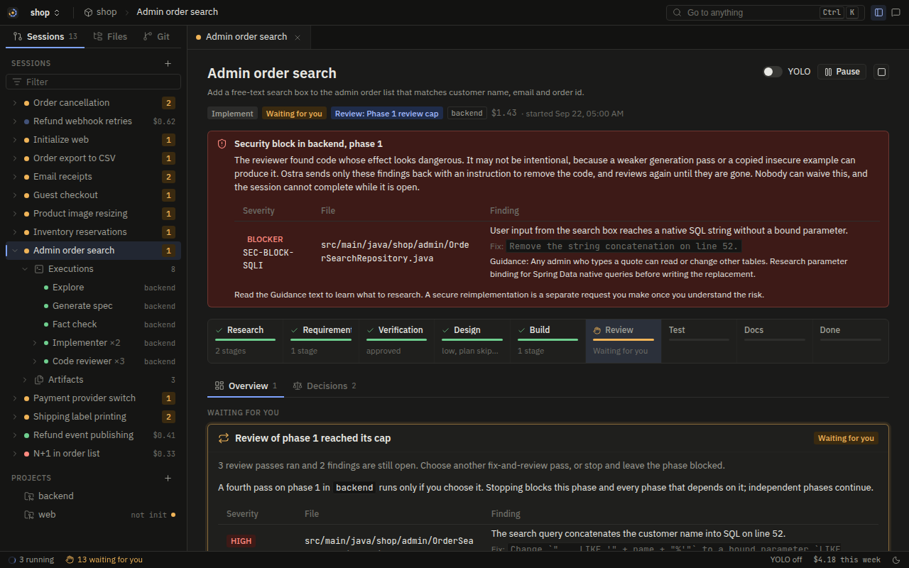
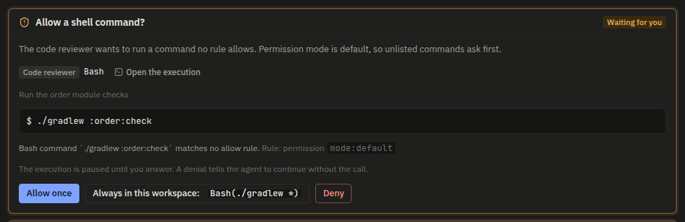
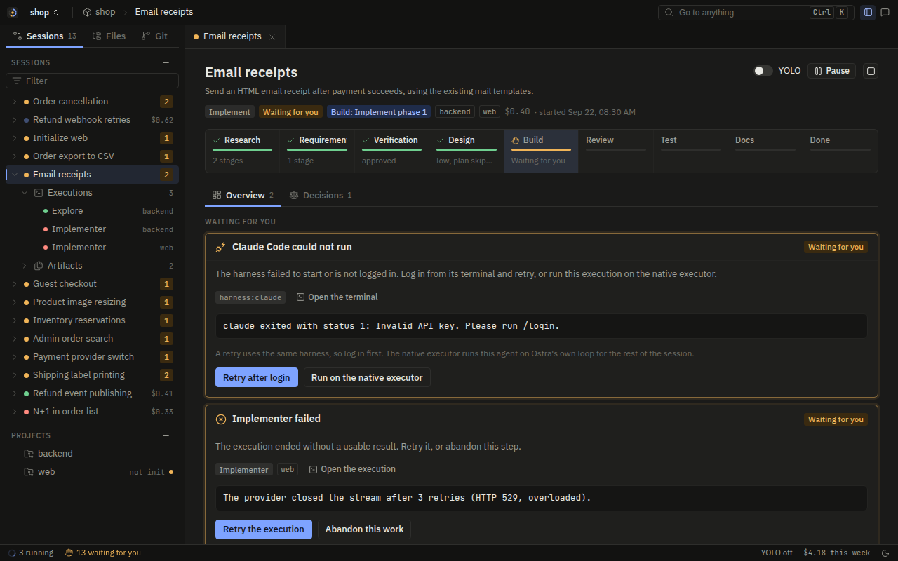
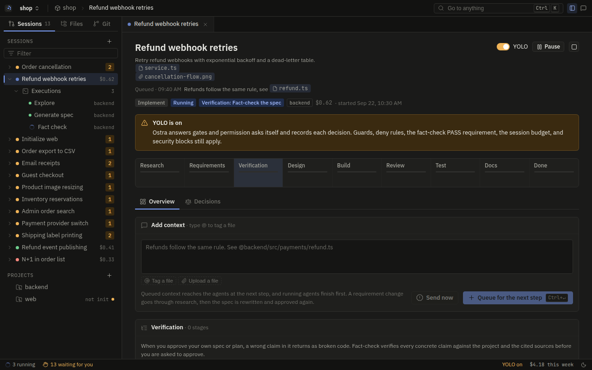

# Gates and judges

Code drives the pipeline of Ostra, but code alone cannot make two kinds of decisions:

- **Gates** are decisions that need the user. Examples are the approval of a spec, the choice to write tests,
  and a raise of the budget.
- **Judges** are decisions that need judgment about text. Examples are the category of a request, whether
  research is complete, and what to do with a stuck agent.

This page describes every gate kind and every judge. It also tells how YOLO mode answers gates without the
user, and which gates YOLO must never answer.

## How a gate works

A gate is a question that the session waits on. The planner emits an `OpenGate` step with a title, an
explanation, and a typed payload (`GatePayload` in
[`crates/ostra-core/src/event.rs`](../../crates/ostra-core/src/event.rs)). The runner records a `GateOpened`
event, and the board shows a card. The part of the pipeline behind the gate stops. Other work continues. For
example, a review-cap gate on phase 2 does not stop an independent phase in a different project.

The runner checks the answer of the user before it records the answer. `runner::validate_answer` refuses these
answers:

- An answer whose shape does not fit the gate ("That answer does not fit this gate.").
- An open-questions answer that leaves a question blank.
- A rejection of a spec or plan with no feedback ("Say what to change.").

A valid answer becomes a `GateAnswered` event. The fold in [`state.rs`](../../crates/ostra-engine/src/state.rs)
(`on_gate_answered`) changes it into new state, and the planner acts on that state. An answer with content, for
example the answer to a question or any text, goes to a judge first. The judge decides where the answer goes
(Rule J1, [below](#every-answer-goes-through-a-judge-first)).

Gates are events, and two properties come from this:

- **A stale answer does nothing.** If the spec changed after the approval gate opened, the fold ignores an
  approval of the old card. The reason is that the fold checks that the gate still belongs to the current
  version. An approval also requires that the current version passed its fact-check. The fold enforces this.
  Thus no client, script, or judge can approve a spec that has no fact-check.
- **Gates stay after restarts.** An open gate is part of the folded state. After a server restart, the card is
  still there, and an answer to it continues the session.

A paused session starts nothing, but the user can still answer its gates. The answers apply when the session
continues (Rule P1).

A gate shows on the session board under Waiting for you. This spec approval gate shows the fact-check result and
the LOW findings. It also accepts an optional change request:


## Every gate kind

| Gate | Opens when | The user answers |
| --- | --- | --- |
| `open_questions` | The spec or the plan lists questions that it could not settle | Every question. The user chooses an option or writes text, and the text can combine numbered options |
| `spec_approval` | The spec passed its fact-check | Approve, or reject with what to change |
| `plan_approval` | The plan passed its fact-check | Approve, or reject with what to change |
| `fact_check_recurring` | The spec or plan fact-check failed three times in a row | `another-round` (with optional guidance) or `stop` |
| `review_cap` | A review loop used all its passes, and HIGH or MEDIUM findings are open | `another-pass` (with optional guidance), or leave it blocked |
| `stuck` | The Rescue judge decided that only the user has the missing fact. Or the advisor escalated an environment failure (Rule O7) | `fact` with the fact as text, `fix` with optional instructions for an implementer (Rule O8), or `block` |
| `phase_blocked` | A phase ended blocked | `retry` (with optional instructions) or `leave` |
| `implementation_review` | Every phase of an `IMPLEMENT` session finished, and nothing runs | `done`, or `feedback` with what to change as text |
| `closing_gate` | The phases of a project are done. For `IMPLEMENT`, the user also accepted the implementation | Tests yes or no, and docs yes or no, for each project |
| `permission` | A tool call needs approval under the permission rules | Allow once, allow always in this workspace, or deny |
| `harness_failure` | A harness CLI did not start or is not signed in | `retry` after sign-in, `native` to run it again on the native executor, or abandon |
| `execution_failed` | An execution failed after its automatic retry, or you stopped it | `retry` or `abandon` |
| `skill_approval` | The init flow proposed skills. This occurs in an init session or in the build of a project that the session created | For each skill: generate, regenerate, reuse, or drop |
| `budget_reached` | The session spent its budget | `raise` (with the added dollars as text) or `stop` |
| `stage_review` | A custom stage of a workflow failed and its `on_fail` asks, or the stage needs a decision from you (Rule WF5) | After a failure: `retry` (with optional guidance), `continue`, or `stop`. For a question: one of its options, `other` with your answer as text, or `stop` |

### Open questions

The session asks the open questions of the spec before any fact-check (Rule D3). The Route-answer judge reads
the answers first (Rule J1). The engine adds the answers that the judge delivers to the pending input of the
spec. Then generate-spec runs again to write them into the spec, after any research that the judge queued.

The clarifying questions of the plan follow a different path. The engine uses the delivered answers as a
requirement change, and puts them into the spec first (Rule D10). The reason is that the plan agent takes
requirements only from the spec.


### Spec and plan approval

An approval records the approved version. For the plan, an approval also changes the Phase Index into the build
queue.

An approval with text waits for the Route-answer judge:

- If the judge delivers the text, the text is a change, and the approval does not stand. The reason is that the
  user asked for something that the approved version does not have.
- If the judge keeps the text for a later stage or discards it, and queues no research, the approval stands.

A rejection with feedback adds the feedback to the spec as a change. For a plan, that is a requirement change.
The engine revokes both approvals, revises the spec, and approves the spec again. Then it revises the plan in
place.


### Fact-check recurring

The fact-check loop between an author and its checker can fail to converge. After three FAILs in a row
(`FACTCHECK_RECURRING_LIMIT`), the engine asks the user. It does not spend money on one more round.
`another-round` allows three more FAILs before the next ask. Any guidance text goes through the Route-answer
judge, and then goes to the author as a change. `stop` stops the stage, and the session fails.


### Review cap

Each loop runs three review passes (`REVIEW_CAP`). If HIGH or MEDIUM findings are still open, the card shows them
with the ledger path. `another-pass` adds one pass and sends the open findings to the fix agent. It also sends
any text that the user wrote, after the Route-answer judge delivers it. Any other answer marks the phase
blocked. The reason contains the finding count and the ledger path.

BLOCKER findings never get to this gate. They loop with no cap until the fix removes them (Hard rule 21). No
answer can waive them.

A review cap gate lists the findings that are still open after the last pass. Above it, a BLOCKER from the
reviewer shows its Guidance text and has no dismiss button:



### Stuck

The card shows the diagnostic and the need of the stuck agent. A `fact` answer goes to the Route-answer judge
first, for two reasons:

- A stated fact can be a requirement change and not a detail.
- "I don't know, look it up" is a request for research, not a fact.

A `block` answer blocks the phase. A fact that the judge discards also blocks the phase.

A `fix` answer sends an implementer to remove the cause (Rule O8). If the answer has text, that text is the task
of the implementer. The implementer gets the exact text of the user, so the text does not go through the
Route-answer judge. The implementer runs with an `Unblock:` line. That line quotes the diagnostic of the stuck
run, its need, and the words of the user. The implementer fixes only that cause. Thus the stuck run finds its own
work in the same condition that it left it in.

When the implementer submits `ok`, the stuck agent continues its conversation as a rescue. The engine tells it
what the implementer changed. The files that the implementer changed go into the next review of the loop. If the
implementer does not finish, the stuck gate opens again, with its reason under the need.

A stuck gate names the execution and asks for the missing fact. Above it is a phase blocked gate for a different
phase:


### Phase blocked

A blocked phase removes its dependents from the queue (Rule D9). The gate asks whether to try again. `retry`
resets the review budget and runs the fix agent again. If the answer has instructions, they go through the
Route-answer judge. If the answer has no instructions, the fix agent gets the BLOCKER, HIGH, and MEDIUM findings
of the last review.

### Implementation review

The review gate is between the last phase and the closing stages (Rule F1). `done` accepts the implementation.
Then format, the closing gate, tests, and docs can run. `feedback` needs text. It starts a feedback round that
builds revision phases. After those phases finish, the gate opens again as round 2, then round 3, and so on.

Before the gate opens, the runner writes a session context file (Rule F2). The card links that file and every
implementer report. It also lists each phase that ended blocked. Under YOLO, the fixed answer is `done`. For how
the engine routes and builds a round, see
[Implementation review](pipeline.md#implementation-review-feedback-until-you-accept).

### Closing gate

The engine opens one gate for each batch of projects that finished together (Rule T6). If the request already
opted a project in or out of a stage, the gate does not ask about that stage for that project (Rule T3). The
answers decide which of the test and docs stages run. They never change requirements (Rule T5).


### Permission

A permission gate comes from layer 2 of the policy, which is the permission model of Claude Code. It does not
come from the planner. It holds a tool call of a live execution. The card shows these items:

- The canonical tool call.
- The reason.
- The rule that asked.
- The rule that "always in this workspace" adds, for example `Bash(cargo test *)` or `Edit(src/api/**)`.
  `runner::suggest_rule` builds this rule.

Layer 1 guards never make a gate. They deny, and no answer can override them.



The implementer of a phase in a planned new project calls `ProjectCreate` to create that project. This call
opens the permission gate in every permission mode, also in bypass. The exception is a session under YOLO,
because the YOLO policy allows the call without a gate (rule O1). The reason on the card names the key, the
stack, the folder, and the purpose. Thus the user decides on the card whether the new project must exist.

The card has no suggested rule, and "always in this workspace" adds no rule. The reason is that an allow rule
must not replace the answer of the user to a call that changes Ostra. Nothing is created on disk until the user
answers.

In a session that created a project, the build runs the init of that project. Thus its `skill_approval` and
`execution_failed` gates open in the pipeline session itself. A failed init step gets to the user only after the
advisor agent tried to help (rule O5):

- The advisor can send the step back with guidance, a maximum of two times.
- If the advisor cannot help or escalates, the `execution_failed` gate opens with its reason.

A step that you stopped does not go to the advisor. It opens that gate immediately, because the advisor sends it
back (rule P4). If you abandon the step at that gate, the session does not fail. The init ends with a note, and
the phases of the project run without it (rule O4).

The execution shows the same ask above its activity when the call waits:


### Harness failure and execution failed

Both gates hold a failed execution. `retry` runs it again from its spawn block. For a harness failure, `native`
runs it again on the native executor. That agent then stays on native for the rest of the session. Abandon marks
the step abandoned, so that the pipeline can continue where possible.



### Budget reached

Every spawn goes through a budget check in `Planner::push`. When the money spent gets to the budget plus any
raises, the planner opens this gate in place of the spawn. Executions that run continue to the end, and nothing
new starts.

`raise` adds the dollars written in the answer. The gate accepts a `$` at the start. If the text is empty or is
not a positive number, `raise` adds the original budget again. `stop` fails the session with the amount spent.


### Stage review

A custom stage of a [workflow](workflows.md) opens this gate in these cases:

- Its agent submits `needs_user` with a question and options.
- Its agent submits `fail`, and the `on_fail` of the stage is `gate`.
- Its agent submits `fail`, the `on_fail` of the stage is `retry`, and the stage used all its rounds.

The stage logic of a [plugin](plugins.md) opens the gate in the same way when it decides `ask` or `fail`. The card
shows these items:

- The stage and the scope (`phase:<n>` or `project:<key>`).
- The round and its limit.
- The summary and the findings.
- For a question, its options, with the recommended option first.

After a failure, `validate_answer` accepts `retry`, `continue`, or `stop`. After a question, it accepts one of the
options, `other` with text that is not empty, or `stop`. The fold (`stage_gate_answered` in
[`workflow.rs`](../../crates/ostra-engine/src/workflow.rs)) applies the answer:

- `stop` stops the session. The error names the stage.
- `continue` records the failure, and the stages after it run.
- `retry` runs the stage again with its last findings. Your guidance goes to the stage as a user note.

The fold keeps each answer to a question as a user note, and the stage runs again with it. Each new round
continues the conversation of the agent (Rule H5). For a plugin stage, the plugin decides again.

These answers go to the stage directly, not through the Route answer judge, because only that stage reads them.

## YOLO: the engine answers

YOLO means that the orchestrator makes all decisions. YOLO can be the workspace default (`yolo.default`). The
user can also turn it on or off for a session at any time. The change applies from the next gate or tool call.

With YOLO on, the planner emits a `YoloAnswer` step for every open gate, with three exceptions:

- The budget gate.
- The failure gate of an execution that you stopped.
- The gate of a custom stage that failed in each round that it can run.

`judge_input::yolo_leaves_open` lists these exceptions. These gates stay open for you.

The planner also emits no `YoloAnswer` step for a permission ask, because the runner answers it first. Under
YOLO, the policy changes each ask into an allow, and the runner records an `AllowOnce` answer. When you turn on
YOLO, the runner also allows each permission ask that waits.

For each gate, `judge_input::yolo_plan` in
[`judge_input.rs`](../../crates/ostra-engine/src/judge_input.rs) returns one of three things:

- A fixed answer with a stated reason.
- A call to the YOLO-answer judge, with a JSON schema for the answer of that gate.
- Nothing.

| Gate | YOLO answer |
| --- | --- |
| `open_questions` | YOLO judge. It takes the recommended option of each question, unless the research gives a specific reason for a different option. |
| `spec_approval`, `plan_approval` | YOLO judge. It approves only with a fact-check PASS. It rejects with feedback when the artifact clearly does not include part of the request. |
| `stuck` | Fixed: `fix`. An implementer goes to remove the cause, and the stuck agent continues (Rule O8). There is no round cap, because a YOLO user chose to let Ostra fix as much as it can. The session budget stops it, because YOLO never answers a budget gate. |
| `closing_gate` | Fixed: no tests and no docs, unless the request already asked for them (Rules T2, T3). |
| `fact_check_recurring` | Fixed: `another-round` when there are fewer than six FAILs in a row, then `stop`. |
| `review_cap` | Fixed: `another-pass`. In practice, the loop almost never gets here. The reason is that the YOLO review budget is ten passes, and after that the Resolve judge decides. |
| `phase_blocked` | Fixed: `leave`. Independent work continues (Rule D9). |
| `execution_failed` | Fixed: `retry`, until the same agent failed three times. Then `abandon`. None for an execution that you stopped: the gate stays open for you, because a retry cancels your stop (Rule P4). |
| `harness_failure` | Fixed: `native`. |
| `skill_approval` | Fixed: the default dispositions of the proposal. |
| `permission` | The execution answers it: the session acts as `bypass`, so the ask never waits. This includes `ProjectCreate`, which asks in every mode without YOLO. |
| `budget_reached` | None. The gate stays open for the user. |
| `stage_review` | A question takes its first option, which the agent lists as recommended. If the question has no options, the answer is `other` with "Decide as you recommend and go on." A failure gets `retry` when the stage has rounds left. After the last round, the gate stays open for you, because only you can accept a check that fails again and again. |

The engine does not trust the answer of the judge without checks. `yolo_answer_from_judge` changes it into a
gate answer and enforces the conditions that must stay true:

- Every question has an answer.
- An approval stands only when the fact-check passed.

Then the fold applies the same checks that it applies to an answer from a person.

YOLO changes who answers. It never changes what must be true:

- Layer 1 guards still deny. These are state ownership, lesson gate, and build streak. With tool enforcement
  on, they also include write scope, report path, and self-protection.
- The explicit deny rules of the user still apply.
- An approval still requires a fact-check PASS.
- The session cannot complete until the fixes remove BLOCKER security findings.
- YOLO never raises the budget, because the decision to spend more belongs to the user.
- YOLO never retries an execution that the user stopped, because the stop is the decision of the user.

Every YOLO answer is an event with its reason. The completion report ends with a "Decided for you" section that
lists each one. A push notification goes out at completion and when a phase is blocked.

A session with YOLO on shows a banner. The banner names the rules that still apply:



At the end, the completion report lists each decision that YOLO made:


### The YOLO review loop

Under YOLO, a review loop gets ten passes (`YOLO_REVIEW_BUDGET`), not three. At the budget, the planner asks the
Resolve-review judge, and does not open a gate. The judge reads these inputs:

- The phase file.
- The full review ledger.
- The open findings.
- The counts of recent passes.

Then the judge picks one decision:

- `fix`: it writes one exact instruction for each open finding. The instruction gives the file, the line, the
  change, and why earlier attempts failed. The engine runs one fix pass with only those instructions, and allows
  one verification review.
- `block`: the findings do not converge, or they need a fact that only the user has. The phase is blocked.

After a `fix` round, if findings are still open, the engine compares the count with the count before the round.
If the count decreased, the engine asks the judge again. If it did not decrease, the engine blocks the phase with
the ledger path, and independent work continues. This follows Ultracode's `hooks/review-cap.js`.

## Every judge

Judges are the only places where a model makes an orchestration decision. Each judge has three parts:

- A short prompt in [`assets/judges/`](../../assets/judges/).
- An output struct with a JSON schema in
  [`crates/ostra-engine/src/judge.rs`](../../crates/ostra-engine/src/judge.rs).
- An input builder in `judge_input.rs` that decides exactly what the judge sees.

Judges run on the `judge` route, which resolves to the `advanced` tier by default. The engine stores each
decision as an event with its input summary and reason. The board shows it as "Ostra chose X because Y".

| Judge | Asked when | Decides | Prompt |
| --- | --- | --- | --- |
| Classify | The session starts | Category, projects in scope, research tasks, opt-ins, title | `classify.md` |
| Sufficiency | Research finished with `Not covered` items | For each item: needed or not, and a research task when needed | `sufficiency.md` |
| Track | Research for an `IMPLEMENT` request finished, and no track was forced | `light` (build from the research) or `full` (spec and plan first) | `track.md` |
| Stakes | A full-track `IMPLEMENT` spec is approved | `low` (skip the plan), `medium`, or `high` | `stakes.md` |
| Feedback | The user sends feedback at the implementation review gate | `requirement_change` or `implementation_detail`, one `{project, instruction}` target for each project that it changes, and what happens to the feedback (Rule J1) | `feedback.md` |
| Route answer | Any other answer with content: open questions, approval text, guidance, a stuck fact, retry instructions, and context added during the session | For each answer: `deliver`, `remember`, or `discard`, research to run first, research tasks that the user tells it to skip, and `requirement_change`, `implementation_detail`, or `stage_choice` | `route-answer.md` |
| Rescue | An agent returned `stuck` | `rerun` with a stated fact, `explore` to find it, `advise` to send an environment failure to the advisor (Rule O7), or `gate` to ask the user | `rescue.md` |
| Resolve review | A review loop got to its budget under YOLO | `fix` with instructions for each finding, or `block` | `resolve-review.md` |
| YOLO answer | A gate opens under YOLO, and its plan is `Judge` | The answer of the gate, in the schema for that gate | `yolo-answer.md` |
| Completion | Nothing is left to run | The completion report in Markdown | `completion.md` |

Each prompt tells the judge which decision to prefer when it is not sure, and why:

- **Classify** picks the category that runs more of the pipeline. The reason: a needed stage that the session
  skipped costs a wrong result, but an unnecessary stage costs one round.
- **Sufficiency** marks an item needed only when the item names behavior that the request changes or an outside
  technology. The reason: a dependency that research did not find there shows as a wrong spec after approval.
  Any other item that a later agent can find during its work is not needed, because each research pass is a full
  agent run.
- **Track** prefers `light`. The reason: the user reviews the built result and can send feedback, but a spec
  round costs many approvals. It picks `full` only on a research finding that it can name.
- **Stakes** prefers the higher level, because a skipped plan removes the phase review that finds a wrong
  sequence.
- **Feedback** prefers `requirement_change` when a spec exists. The reason: a spec that does not agree with the
  code gives wrong information to every later stage.
- **Route answer** prefers `requirement_change`, because a stale spec makes every later stage wrong. It delivers
  an answer unless the words of the user keep it for later or drop it. The reason: if the judge drops an answer
  that the user wanted to give, the decision of the user is lost.
- **Rescue** never picks a plain retry. After two rescues of the same phase with the same diagnostic, it picks
  `gate`, because neither rescue changed the failure. For a failure in the environment of the agent, it picks
  `advise` and not `gate`. The reason: the advisor can frequently find a workaround inside the sandbox. After the
  loop used its two advisor rounds, an `advise` opens the gate.
- **YOLO answer** never invents a requirement, business rule, or fact. It prefers an answer that puts work aside
  to an answer that guesses.

The fold guards the output of judges in the same way that it guards the output of agents. If a Classify result does not match its
schema, the session fails with a clear message. If a Rescue or Resolve decision arrives for a loop that moved on
after the request, the fold ignores it.

### Every answer goes through a judge first

An answer is not always content for the agent that asked. In one session, the spec agent asked "No research
document covers a Rust PostgreSQL client. Run another research pass before planning?" The user picked "Run a
research pass". That label went directly back to generate-spec. Generate-spec cannot start research, so it asked
the same question again.

Rule J1 puts a judge between every answer with content and the agent:

- The Route-answer judge, for open questions, approval text, fact-check guidance, review-cap text, a stuck fact,
  and retry instructions.
- The Feedback judge, for implementation feedback.

`state::answer_needs_route` decides which answers wait. A bare choice with one meaning applies immediately,
because there is nothing to route. Examples are approve, stop, retry, accept, and a budget raise. The runner
calculates the flag when it records the answer, and stores it on the event as `routed`. Thus the fold stays a
function of the log. An answer that the runner recorded before the rule existed has no flag. It folds in the same way that it did
before, so older sessions replay to the same state.

Context that you add from the Add context box of the board goes to the same judge (Rule C2). Its subject is
`amendment:N`, not a gate. After the engine classifies the request, the runner records `routed: true` on
`RequestAmended`.

Queued context gets to the judge only after the engine releases it. The engine releases it after the executions
that ran at the time of the queue finish (`Amendment.held`). Until then, the user can withdraw it, and the judge
never sees it. When the context waits for the judge (`Amendment.pending`), the planner asks the judge and starts
nothing else. Thus work that Send now interrupted does not run again on the old request.

The judge sees these inputs:

- The added text.
- The work that Send now stopped.
- The projects in scope.
- The projects that the session created.

Its research tasks go to the projects that it names. Thus a correction such as "this is for the new project" gets
to that project, and not to the first project in scope. A delivered addition joins the request (`full_request`)
and every explore spawn. A remembered addition becomes a note. A discarded addition gets to no agent. A delivered
`requirement_change` after the spec exists starts again at the spec (Rule D10).

When an answer waits, the spec or plan behind it (`ArtifactTrack.routing`) starts nothing. The phase behind it
(`LoopNext::AwaitRoute`) also starts nothing. The judge makes a decision for each answer. It returns one item for
each question ID, or one item `answer` for a text:

| Disposition | What the engine does |
| --- | --- |
| `deliver` | The agent that asked receives it as written. This is the default, and an answer that the judge did not name gets it. |
| `remember` | The agent that asked does not receive it. The engine keeps the `note` of the judge for the stages that the note names. |
| `discard` | No agent receives it. The answer of the gate stays in the log for traceability. |

A model sometimes splits one answer into many items, one for each part. Sometimes it uses an ID that it made up.
`judge::item_for` merges these items. The engine delivers the answer when it delivers any part, because the user
gave it. It keeps each part that names stages as a note. On a gate with one text, every item is about that text.

The fold keeps a remembered note (`user_notes`) with an ID: `N1`, `N2`, and so on. The note gets to later agents
as a `User notes:` line:

- `implement` notes go to the implementer and to fix passes.
- `tests` notes go to the path analyzer and to the test writer.
- `docs` notes go to the documentation writers and to the system architecture agent.

The engine cannot keep a note for the plan agent, because the plan agent takes requirements only from the spec
(Rule D4). The engine delivers an answer that the plan needs, so the answer goes into the spec. A delivered answer
can also name stages, when part of it is an instruction for later.

A later answer can cancel a note or replace it. Examples are "forget what I said about the timestamps" and "use
sqlx, not tokio-postgres". The judge sees each kept note with its ID, and lists the notes to drop in `forget`. A
forgotten note stays in the fold and in the log for traceability. The fold marks it `forgotten`, and it gets to
no agent. A decision that arrives for a gate that no longer waits forgets nothing.

An answer or added context can also drop research, for example "skip the deadpool research". The judge sees each
unfinished research task with a number, as "Research task N". It lists the tasks that the user names in `skip`.
It never adds a task of its own choice (Rule U1). The fold marks these tasks abandoned. The engine stops a running
task as an interrupt, and a queued task never starts. The judge discards context that only asks for the skip. The
reason is that an agent that reads it looks for research that does not exist.

The open-questions card gives a number to each option of a question, with the recommended option first. Its Other
field accepts a typed answer. A typed answer can do these things:

- Name options by number or label.
- Combine options of a single-choice question.
- Add requirements: "1 and 3, plus an audit log".

The agent that reads the answer sees only the text. Thus a typed answer that is not exactly option labels gets to
the agent with the numbered options next to it (`Question::answer_in_context` in
[`crates/ostra-core/src/pipeline.rs`](../../crates/ostra-core/src/pipeline.rs)). `Question::display_options`
sets the numbers, and it must match `orderedOptions` in the console. A picked option goes without change.

A spec question that the judge does not deliver must still leave the spec. If it does not, generate-spec asks it
again. Thus the engine writes an answer for it:

- For a discarded question, the answer tells the agent that the user chose not to answer. It tells the agent to
  settle the point from the research.
- For a remembered question, the answer tells the agent that a later stage has the answer.

At the gate of a phase, an answer that the judge does not deliver takes the plain path of the gate. A stuck fact
blocks the phase. A retry or one more review pass runs with only the review findings.

The judge can also queue research: a maximum of three explore tasks (`MAX_ANSWER_RESEARCH`), each in a project of
the session. For a spec or plan answer, they are normal research. Thus Rule D2 holds the spec until they finish,
and the Sufficiency judge reads their Not covered items. Then the spec revision gets the new documents with the
answers. For the answer of a phase, the research belongs only to that loop (`LoopNext::AnswerResearch`), the same
as for a rescue explore. The next pass of the loop gets the path and the findings of each document with its
instructions.

The route still decides where a delivered answer at a phase goes:

- `requirement_change`: the phase stops, the answer goes into the spec, and Rule D10 runs. Rule D10 does spec
  revision, spec approval, and plan revision. If the session has no spec, there is nothing to change first, so
  the answer goes to the phase.
- `implementation_detail`: the text goes to the implementer or the fix agent as an instruction. The spec does not
  change.
- `stage_choice`: the text only selects stages. The spec does not change (Rule T5).

The words of the user decide. The prompt tells the judge to follow the answer, and not the recommendation of the
agent or its own view. It also tells the judge to use `discard` only when the user says to ignore something.

The one limit is the rules of Ostra. No decision can change them, because the engine applies them after the
judge:

- Guards.
- The budget.
- Fact-check PASS before approval.
- The review cap count.
- BLOCKER removal.
- A plan built only from an approved spec.

The judge delivers an answer that asks for one of those as written, for example "skip the BLOCKER and ship it".
The reason tells which rule still applies.

YOLO answers go through the same judge. The reason: a YOLO answer to "Run a research pass?" needs the research as
much as an answer from the user does.

## Overriding a judge

The user can override some decisions from the board with a replacement answer, until an override is no longer safe.
`SessionState::can_override` decides:

| Judge | Can be overridden until |
| --- | --- |
| Classify | The first research task starts and before any phase has done work |
| Track | The spec has run or any phase has started |
| Stakes | The plan stage has run or any phase has started |
| Sufficiency | The spec has run |
| All others | Never |

The limits exist because an override replays the decision into the fold. Assume that the user replaces the
category after research started, or the stakes after the engine built phases from them. Then the log contains
work that the new decision does not allow. The fold checks the same condition again when the override event
arrives. Thus the fold ignores a late override, also if a client sent it.

An override of Track to `full` clears the inline phases that the light track created. An override to `light`
creates them. An override of Stakes clears the inline phases that a `low` decision created. An override of
Sufficiency removes the research tasks that the earlier decision added and that did not start.

The Decisions tab of a session lists each judge decision with its reason and its input:


## Measuring the judges

A conformance fixture proves what the engine does with the answer of a judge. It cannot tell whether a model
gives the correct answer. The routing evals do that.

[`tests/evals/judges.toml`](../../tests/evals/judges.toml) holds cases for the Classify, Sufficiency, Track,
Stakes, Feedback, and Route-answer judges. Each case is a request about the source of Ostra, with the route that a
careful engineer picks. Track and Feedback cases contain research documents, a spec, and phase reports written
from the real code. Some cases are counter-cases that push to the opposite decision. Thus the evals show a prompt
change that fixes one case and breaks its opposite.

[`crates/ostra-server/tests/judge_evals.rs`](../../crates/ostra-server/tests/judge_evals.rs) folds each case into
the session state that the engine has when it asks the judge. It builds the input with the same `judge_input`.
Then it calls the judge many times for each model, because one run of a model tells little about the next run:

```bash
OSTRA_EVAL_MODELS=anthropic:claude-opus-5-5,anthropic:claude-sonnet-5-5 OSTRA_EVAL_RUNS=3 \
  cargo test -p ostra-server --test judge_evals -- --ignored --nocapture
```

For each case and model, the test prints the pass count and the spread of answers. For each model, it then
prints accuracy, the number of cases on which every run agreed, and cost. It writes the answers, with the reasons
of each judge, to `target/evals/`.

The live test is ignored by default, because it calls paid models. It fails only when calls fail, because the
answers of a model change from run to run. An offline test in the same file checks that every case still builds
its session. Thus the normal suite fails on a case that an engine change breaks. `OSTRA_EVAL_CASES` runs the
cases whose id contains its value.

## Measuring the advisor

The advisor (rule O5) is an agent, not a judge. It reads files before it decides, so its evals run the real
agent loop. [`tests/evals/advisor.toml`](../../tests/evals/advisor.toml) holds failed steps of the init of a
created project. Each case has these parts:

- The files that the engine leaves on disk.
- The decision that a careful engineer makes.
- The real cause of the failure.
- A rubric.

Some cases are pairs with the same problem text and opposite answers:

- A detect step that returned zero slices because the folder is empty, against a detect step that planned the
  slice but submitted it under the wrong key.
- A private registry that a creation skill cannot work without, against the same registry that a convention
  skill does not need.

[`crates/ostra-server/tests/advisor_evals.rs`](../../crates/ostra-server/tests/advisor_evals.rs) does these
steps for each case:

1. It puts the files of the case under the target dir. It never uses `/tmp`, because the sandbox replaces `/tmp`.
2. It renders the spawn block of the failed step with the spawn factory.
3. It builds the spawn of the advisor with the same `advisor_request` that the planner uses.
4. It runs the advisor in the native loop with the policy and the sandbox.

The test refuses every permission ask. A user who is not present does the same. A run passes when these conditions
are true:

- The action matches.
- The text of the advisor names each required fact.
- A grader model (`OSTRA_EVAL_GRADER`, Opus by default) finds that every rubric point is met.

```bash
OSTRA_EVAL_MODELS=anthropic:claude-opus-5-5,anthropic:claude-sonnet-5-5 OSTRA_EVAL_RUNS=5 \
  cargo test -p ostra-server --test advisor_evals -- --ignored --nocapture
```

The test starts the runs one at a time, and alternates the models and the cases. Thus the runs that execute at
the same time are spread out. The report in `target/evals/` holds these items for each run: the guidance, the
reason, the verdict of the grader, the tool calls, the refused asks, and the cost. Each scenario folder keeps the
`first-message.md` that the advisor read. An offline test checks that every case puts its files on disk and builds
its spawn with the problem text that the engine writes. Thus the normal suite fails on a case that an engine
change breaks.

## Where to look in the code

| To see | Read |
| --- | --- |
| Where each gate opens | `Planner` methods in [`plan.rs`](../../crates/ostra-engine/src/plan.rs): `spec_flow`, `plan_flow`, `loop_steps`, `closing_stages`, `exec_failed_gate`, `push` for the budget |
| What an answer does | `on_gate_answered` in [`state.rs`](../../crates/ostra-engine/src/state.rs) |
| What a judge decision does | `on_decision` in `state.rs` |
| YOLO answers per gate | `yolo_plan` and `yolo_answer_from_judge` in [`judge_input.rs`](../../crates/ostra-engine/src/judge_input.rs) |
| Answer validation | `validate_answer` in [`runner.rs`](../../crates/ostra-engine/src/runner.rs) |
| Fixtures | `yolo_answers_gates_and_extends_review_budget`, `t2_yolo_answers_the_closing_gate`, `d9_blocked_phase_removes_dependents`, and `approval_without_pass_is_ignored_by_the_fold` in [`tests/conformance/main.rs`](../../tests/conformance/main.rs) |
