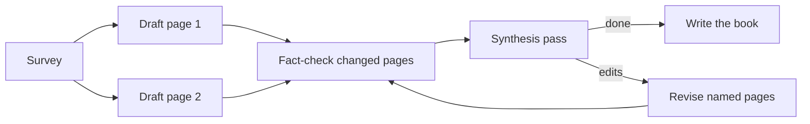

# The pipeline

Ostra sends a request through the stages that a careful team uses. First, it finds out how the code works now.
Then it builds the change in reviewed steps. Then the person who asked tries the change and can ask for
changes. Last, it can write tests and update the docs.

A change that needs its requirements settled first also gets a written spec, a check of the spec against the code, and a sequenced plan. The user approves each of these before Ostra builds anything. This page
follows one request through every stage. For each stage, it tells what the stage produces and which part does the work. It also tells how many items run at the same time, and what happens when the stage fails.

Two facts apply to every section below.

- **Code runs the pipeline, not a model.** The planner decides which stage comes next, when a loop stops, and
  how many agents run at the same time. The engine's planner in
  [`crates/ostra-engine/src/plan.rs`](../../crates/ostra-engine/src/plan.rs) walks the workflow. The rules of
  each built-in stage on this page are in the standard plugin's pipeline, one folder for each stage in
  [`crates/ostra-default-plugin/src/stages/`](../../crates/ostra-default-plugin/src/stages/)
  ([Plugins](plugins.md#the-pipeline)). The planner is a pure function from the
  session's state to a list of next steps. Models do the work inside a stage and answer a small set of named
  questions. These questions are the judges, which [Gates and judges](gates-and-judges.md) describes. No agent
  can decide to skip the review.
- **Every stage hands off through files and structured data.** An agent ends when it calls its
  `submit_<agent>` tool with a typed payload. It writes its long output (research document, spec, plan,
  report) to a path that the engine chose. The next stage gets those paths. No step depends on the text of an
  agent's final message.

Rule IDs such as D2 or T4 come from Ultracode's orchestrator and from HANDOVER section 8.2. The code that
implements a rule cites the ID in a comment. Every rule has a conformance fixture in
[`tests/conformance/main.rs`](../../tests/conformance/main.rs). Search for the ID to find both.

## The whole path at a glance

```
Intake → Classify* → Explore ×N (parallel) → Sufficiency* → Track*
  light: one inline phase per project
  full:  Spec → Open questions (gate) → Fact-check(spec) ⟲ → Spec approval (gate)
         → Stakes* ── low: one inline phase per project
                  └─ medium/high: Plan → Fact-check(plan) ⟲ → Plan approval (gate)
→ Phases (a dependency graph; one at a time per project, parallel across projects;
          each phase: implement ⟷ review loop, then stage)
→ Implementation review (gate) ⟲ feedback → Feedback* → revision phases
→ Format (once per project)
→ Closing gate (tests? docs?) → EPA ×N (parallel) → Write-test (one phase at a time, reviewed)
→ Book stage: Scan → Survey → Page writers ×N (parallel) → Fact-check and synthesis rounds ⟲ → Book write
→ Completion report*

* judge call     ⟲ a FAIL goes back to the author with the findings
```

Not every request goes through the whole path. The Classify judge first picks a category, and the category sets
the route:

| Category | Route |
| --- | --- |
| `QUICK_ANSWER` | One quick-answer agent. The side panel shows the answer. No files change. |
| `RESEARCH` | Explore and sufficiency, then the completion report. |
| `SPEC` | Research, then the spec and its fact-check. No approval gate, because Ostra builds nothing from the spec. |
| `PLAN` | Research, the spec with approval, and the plan with approval. Ostra builds nothing. |
| `IMPLEMENT` | Research, then the light or the full track, the phases, the implementation review, and the closing stages. |
| `VERIFY` | One implementer pass per project. The pass runs the project's test command and reports the result. |
| `TEST` | Directly to the test stage: EPA, write-test, review. No closing gate, because the request asked for tests. The stage verifies at each level that has a test type in the project (unit, integration, end to end). It also runs again the existing tests that cover the code. |
| `DOCS` | Directly to the docs stage: the docs pipeline for each project, then the book write. No closing gate, because the request asked for documentation. No project file changes. |
| `PROMPT` | Prompt-generation. A review runs only when a changed file is code and not an instruction file. |
| `QUICK_CHANGE` | One implementer pass per project on the native executor, with no research, spec, plan, or review. |

The route of each category is its built-in workflow: the chain of built-in stages that it runs (`builtin_chain` in
[`crates/ostra-core/src/workflow.rs`](../../crates/ostra-core/src/workflow.rs)). When the judge is not sure which
of two categories applies, its prompt tells it to pick the one that runs more of the pipeline. It picks that one
because a skipped stage that the request needed gives a wrong result, but an unneeded stage costs one round.

### Your own stages: workflows

A workspace can change the route with workflow files in `.ostra/workflows/`. A workflow extends a built-in
workflow. It adds stages between the stages of Ostra. Each added stage runs a custom agent or the stage logic of a plugin. For
example, a workflow can add a security audit after the build and before the closing stages. A workflow can also
leave out these parts:

- The implementation review.
- The closing stages.
- The book stage.
- The Track judge. A fixed track replaces it.

Built-in stages keep their order and their rules. Thus, each gate on this page still applies. The session records
its workflow when it starts. Thus, a change to a file never changes a session that runs. A custom stage that fails or
needs a decision opens a `stage_review` gate ([Gates and judges](gates-and-judges.md#stage-review)).
[Workflows](workflows.md) describes the file format, the rules, and how the planner goes through the stages.

On the session board, the lanes follow the same path. In this session, the stages from research through build
are done, and the session waits for the user in review:


## Classify: choosing the route

The first step of every session is a judge call. The Classify judge reads the request, the New task toggles
(tests, docs), the pinned projects, and the stack and module map of each project. It returns:

- the category,
- the projects in scope,
- the first research tasks, one per project or per area, each written as a self-contained instruction,
- whether the request already asks for tests or docs (Rule T3),
- a title of two to five words for the session.

The research tasks carry the paths of all files that the user attached or uploaded (Rules C1, C3). They carry
the paths because a researcher reads only its own task and never sees the attachment list of the original
request.

If you pin projects on the New task form, the session uses only those projects (Rule O6). The session starts
with only the pinned projects. The fold sets the scope to exactly those projects, whatever the judge returns. So
research tasks, feedback, and plan phases cannot go to another project. A plan phase that names an unpinned
project is blocked.

A project that the approved plan creates still joins the session (Rule O3). Without a pin, every initialized
project is in the session, and the judge chooses the scope.

The fold guards the output of the judge. It drops the projects that are not in the session. If the scope is
empty, the fold uses the first project. If a category that needs research has no tasks, the fold gives it one task per project in scope. The task text is the full request (Rule D1: the spec always has research to start from). You can override the classification from the session board until the first research task or phase
starts.

The Decisions tab of the session board shows the Classify decision with its reason and the inputs that it used:


## Explore: research in parallel

Each research task spawns one `explore` agent. Explore is read-only, so all ready tasks spawn at the same time
(Rule M1). The only limit on this fan-out is the slot limiter for the workspace's `limits.max_parallel_executions`
in the runner. Every execution in Ostra goes through this limiter.

An explore agent writes a research document. It submits its scope and a `Not covered` list: the items that it
touched but could not investigate.

When explore writes the document, the Document tool records a content hash of every repo file that the document
names (Rule D2a). These files are the document's files, the files that its patterns use and copy from, its
data-flow hops, and the precedents of its approaches. The hashes are in the document's JSON, in a `snapshot`
field. Ostra writes this field, and the model's schema does not include it. The stages after research compare
the hashes with the current files. For an unchanged file, they take what the research says as current and do
not read the file again.

The same write checks that each of those paths exists in the repo. Ostra refuses the submit if one of the paths
does not exist (Hard rule 4).

Explore tasks can also start later in a session. When a user adds context to a running session, the Route answer
judge decides which research the context needs and in which project (Rule C2). The Rescue judge can also start
a targeted explore in the middle of a build. Every explore spawn gets the context that the user added, next to
its task. So a task that was written before the addition sees the context. A task that runs again after Send now
interrupted it also sees the context.

The image shows the Add context box on the session board (Rule C2). Queue for the next step waits until the
running agents finish, and holds back new work until then. You can withdraw it during this wait. Send now
restarts the running work, and you cannot withdraw it:


When a task fails, the engine retries it automatically one time (`ERROR_RETRIES = 1` in
[`data.rs`](../../crates/ostra-default-plugin/src/data.rs) of the standard plugin). Then it opens an execution-failed gate. If every task
fails or is abandoned, the session fails with the message "there is no research document to write a spec from".
The reason is Rule D1, which forbids a spec without research.

A research document shows as chapters. Its overview counts the files, patterns, sources, and open questions. It
also counts the Not covered items, which the Sufficiency judge reads next:


## Sufficiency: is the research enough?

The spec can start only when no research runs and no open `Not covered` item remains that the request depends on
(Rule D2). The planner collects every finished task that has `Not covered` items with no judgment yet. It asks
the Sufficiency judge about all of them in one call. For each item, the judge answers needed or not needed. For a
needed item, it also gives one more research task.

The judge often gives the same task to several related items. For example, six gaps about the law of one country
become one "research these statutes" task. So the engine keeps one task for each project and task text. It skips
a copy of a task that is still queued or in progress. One round adds at most three tasks
(`MAX_SUFFICIENCY_RESEARCH` in [`judge.rs`](../../crates/ostra-default-plugin/src/judge.rs)), the first three that the
judge names. Those tasks spawn, and the cycle repeats.

The engine allows three sufficiency rounds (`SUFFICIENCY_ROUNDS`). After the third round, it continues to the
spec with the research that it has. So a request that continues to open new questions still moves forward.

Each research pass is a full agent run. So the judge asks for a pass only when both of these conditions are true:

- The answer changes what Ostra specifies or builds.
- No later agent finds the answer during its own work.

The judge sees the category of the request and the track, when the track is decided. It also sees whether the request asked for tests and docs, and how many rounds it already judged. It marks these items not needed:

- A detail that a later agent finds during its work, such as the API of a library that the project already
  uses, or whether a type can be built in a test. The implementer and the test writer read and run the code.
- A check that the researcher did not run, such as a lint or a build. The build stage runs the project's own
  checks.
- A second look at a fact about the projects' own code that the researcher says it did not read again.
- A comparison with code or a deployment outside the scope of the request.
- For a request that only adds tests or docs: behavior that the request does not change.

This rule came from a session that asked for tests and docs for one crate. The judge queued a pass to check
whether a library's error type "taken from memory" could be built in a test. The test writer finds this out when
it writes the test. When the judge is not sure, it marks an item needed only in two cases. The item names behavior that the request changes, or an outside technology that the request brings in. It does this because a missed dependency
in these areas shows as a wrong spec after the user approved the spec.

### Skipping research

Exploration is the user's stage (Ultracode Rule D2). So you can drop a research task that the session does not
need (Rule U1):

- **Skip** on a running research execution stops it. The runner records `ExecutionSkipped`, and the fold marks
  the task abandoned. The stop opens no failure gate, so the spec does not wait for the task.
- **Add context** that asks for the skip ("skip the deadpool research") goes to the Route answer judge. The judge
  sees each unfinished task numbered as "Research task N", and it lists the tasks that you name in `skip`. A
  running task stops. A queued task never starts, even when its spawn already waits for an execution slot.

  Queued context reaches the judge only after the running executions finish. So only Send now stops a running
  research task in this way. Ostra discards context that only asks for the skip. So no later agent reads it and
  looks for research that does not exist.

A skipped task leaves no research document. If every task ends without one, Rule D1 still fails the session.

## Track: light or full

After research, an `IMPLEMENT` request asks the Track judge how much of the pipeline the request needs. The light
track is the default. It skips the spec, the fact-check, the plan, and both approvals. In their place, the engine
creates one inline phase per project in scope, queued in order. Each implementer gets `No plan:` with the request
and every research document. The full track runs the spec flow below, then Stakes, then the plan when stakes are
not low.

The judge ([`assets/judges/track.md`](../../assets/judges/track.md)) reads every research document. It picks
`full` only for a finding that it can name:

- a behavior that the request leaves open,
- a contract that other code consumes,
- a schema or data change,
- a change across several modules that must come in a fixed order,
- a security-sensitive area,
- a need for a new codebase that no project in scope holds.

The last finding sends the request to the full track. Only an approved plan can put phases in a project that does not exist yet (rule O2). The light track builds only in projects that exist. When the evidence is weak,
the judge picks `light`, because the user reviews the built result and can ask for changes (next sections). A
spec round costs the user several approvals.

The New task form has a Track selector. Auto asks the judge. Light and Full skip the judge. You can override the
Track decision from the Decisions tab until the spec or a phase starts. A switch to full drops the inline phases,
and a switch to light creates them.

The rest of the page follows the full track through the spec and the plan. Then it follows both tracks through
the phases.

## Spec: what should change

One `generate-spec` agent runs for the whole session, in the primary project. It receives the full request,
every research document (oldest first, with superseded documents included), and the projects in scope. It also
gets the `Changed since research:` line (Rule D2a). This line lists the cited files whose content changed, or that
are gone, after the newest document that names them, or `none`. For every file that the line does not list, the prompt tells the agent to take current behavior from the research documents. The agent does not read the code again.

The agent writes the spec file and submits its summary, counts, external evidence rows, and open questions.

The spec is a typed document. The Document tool checks its structure and the code that it cites. Every criterion
grounding that names a `path:Symbol`, and every consumed contract source, must name a file in its repo that
contains the symbol. Ostra refuses the submit call if the file has a check error, or if its counts do not agree
with the submit (Hard rule 4). So the agent that wrote a wrong reference fixes it in the same run, and a
fact-check round does not need to send it back. The checks are in
[`refs.rs`](../../crates/ostra-core/src/doc/refs.rs).

The browser view does not run the checks, because a build later creates and deletes the files that they name.
The engine never edits the spec itself. Every change goes back through the agent.

The console renders the spec from its typed document. Each requirement shows its EARS type, the deliverable and
the criterion that it covers, and its Given/When/Then acceptance criteria:


### A new codebase

Sometimes a request needs a codebase of its own: a new MCP server, CLI, or service next to the existing
projects. The spec does not create it. Before generate-spec groups deliverables, it gives the new codebase a new
project key. It tags the criteria and deliverables of the codebase with that key. It records the project's stack
and each base requirement that the research or the user's answers settle as `Constraint` criteria.

Nothing exists on disk yet, so if the user rejects the spec, nothing remains. The plan and the build continue
from there. The next sections describe them.

### Open questions before any fact-check

If the spec has open questions, Ostra asks them before the fact-check runs (Rule D3). It asks them first because
a check of a spec that will change is wasted work. Each answer runs generate-spec again. On a revision, the agent
receives only the answers, change requests, and research documents that its spec does not include yet. It also
gets the path of the current spec, so it edits the file in place and does not write it again.

The open questions gate shows each question with its options. The recommended option is first:


### Fact-check: the spec against the code

A `fact-check` agent checks every claim in the spec against the code and the research. Two parameters set its
behavior:

- **`Source check:`** is `refetch` only on the first pass of a spec that has External Evidence rows. On that pass,
  the agent fetches the outside claims again one time. Every other pass uses `citations` (Rule D3b).
- **`Prior findings:`** is `none` on the first pass. On a later pass, it is the findings of the previous pass,
  exactly as written. If that pass was clean, it is `no findings on the previous pass`. So a revision after a
  clean pass is still a re-pass (Rule D3a).

The checker does not verify again the references that Ostra checked when the agent wrote the document. On a spec
target, it gets the research documents and `Changed since research:`. On a plan target, it gets the code facts
file (below). So it checks a claim about an unchanged file against the research record before it opens the file.

A fact-check on the first pass of a spec runs with `Source check: refetch`, so it fetches the External Evidence
source again:


A FAIL sends the findings back to generate-spec, and the loop repeats. The round after a FAIL continues the
author's own conversation, with the findings as its new turn. The next pass continues the conversation of the
same checker. So neither agent reads again what it already knows (Rule H5, see
[Subagents that talk to each other](agents.md#subagents-that-talk-to-each-other)). Each of the two agents can
ask the other a direct question during its run. After three FAILs in a row (`FACTCHECK_RECURRING_LIMIT`), the
engine stops, opens a fact-check-recurring gate, and does not spend more.

The gate shows the findings that recur:


### Spec approval

After a spec passes its fact-check, it goes to the user for approval. The card shows the LOW findings of the
passing check. An approval records the version that the user approved. A change request becomes a spec change,
and the whole spec loop runs again. For the `SPEC` category, the flow ends at the PASS and skips approval.

The approval card shows the passing check and its LOW findings:


In the spec, the Fact-check chapter shows each finding on the element that the finding names:


## Stakes: is a plan worth it?

For `IMPLEMENT` on the full track, the Stakes judge reads the approved spec. It returns `low`, `medium`, or
`high`.

- `low` skips the plan. The engine creates one inline phase per project in scope, queued in order because there
  is no dependency graph to read (Rule M5). The implementer works from the spec.
- `medium` and `high` run the plan stage.

`PLAN` and full-track `IMPLEMENT` always go through the spec first (Rule D1, Hard rule 15). No path goes from
research directly to a plan.

## Plan: sequencing the work

One `plan` agent reads the approved spec and the projects in scope. It never reads a research document (Rule D4,
Hard rule 16). A request can have several research documents, and the user can change the request between them.
Only the spec reconciles them. The plan's parameter struct has no field for a research document, so the engine
cannot give one to the plan agent by accident.

In place of the research, the facts that research found about the code reach the plan as `Code facts:` (Rule
D4a). The runner writes `ostra-code-facts.md` in the session root just before the spawn. It builds the file from
every research document. For each repo, the file has each cited file with its purpose and symbols, the patterns
with their code, the traced flows, and the dependencies. Each file has a mark from a comparison with the hash
that its document recorded: `unchanged`, `changed`, `gone`, or `not checked` for a document older than the
hashes. Where documents overlap, the newest document applies.

The plan prompt tells the agent to plan from unchanged entries. The agent reads only the files that changed or
that the facts do not cover. The file holds no request text, asks, approaches, recommendation, or external fact.
So requirements still reach the plan only through the spec
([`facts.rs`](../../crates/ostra-core/src/doc/facts.rs)).

The Document tool checks the steps against the code (Hard rule 4):

- A `Modify` or `Delete` step must name a file that exists or that an earlier step creates.
- Each `read_first` path must exist in a repo of the plan, or an earlier step or the step itself must create it.

The tool does not check a phase in a project that does not exist yet.

When the plan runs again after a fact-check FAIL, it also receives its earlier master plan, the findings, and
`Phases to revise:` (Rule D4b). This line lists the phases of the plan that the findings' elements and locations
name, such as `step 2.3` or `...-phase-2.md`. The agent reads and changes only those phases. Its `update` sends
only the steps and fields that change. At every level, an item that an update names takes the fields that the
update sends and keeps its other fields. So a revision never sends a whole phase again to change one step.

The plan is a master plan plus one file per phase. Each phase has an ID, a project, a deliverable, a complexity,
a test policy (`Required`, or `Skip` with a rationale), and the phases that it depends on. Each step names the
skills that it needs from the repository's inventory. Ostra fills the Required Skills of a phase from the union
of its steps (Rules P6, P7). The Document tool refuses a plan that names a skill not installed in its repo, because the implementer loads only the skills in its phase file.

If a spec deliverable has a repo key that is not in scope, the deliverable names a new project. The plan puts the
phases of that deliverable in that key, with `{workspace root}/{key}` as the repo root of the phase. It lists the
key in the `new_projects` field of its submit call. It copies the project's stack, a one-sentence purpose, and the base requirements from the spec's `Constraint` criteria into the context of the project's first phase. When
the plan is approved, Ostra accepts a phase in a project that the session does not hold only if `new_projects`
names that key (`SessionState::project_to_create`). Every other phase of that kind stays blocked, the same as a
phase in an unknown project.

Then the plan goes through the same loop as the spec:

- clarifying questions,
- a fact-check that always uses `citations` and receives the approved spec and the code facts file (Rules D5,
  D4a),
- the limit on recurring FAILs,
- approval.

The master plan opens on its overview, with the phase count, the stakes, and the success criteria:


Each phase is its own chapter, with its deliverable, complexity, test policy, dependencies, and the requirements
that it delivers:


The plan approval gate lists the phases with their project, complexity, test policy, and dependencies:


### Changes after the plan exists

After the spec exists, a requirement-level answer at any point goes into the spec first (Rule D10). The engine
then does these steps:

1. It revokes both approvals.
2. It marks the plan invalidated.
3. It runs generate-spec again with the change.
4. It asks for spec approval again.
5. It revises the plan in place against the diff of the spec.

This includes the answers to the plan's own clarifying questions. These answers are requirement changes, because
the plan agent takes requirements only from the spec. An answer in any other place never reaches the plan agent.

### Measuring the planning stages

Conformance fixtures prove which inputs each planning stage gets. But they cannot show how much of the code a
model reads again with these inputs, or whether the plan is still correct. The planning evals measure this.
[`tests/evals/planning.toml`](../../tests/evals/planning.toml) holds 30 change requests against Ostra's own
source, in three tiers:

- a change in one place,
- a change across a small number of files or crates,
- a feature across several crates with more than one deliverable.

The file pins one upstream commit. Every run plans against the tracked files of that commit, which `git archive`
extracts into a new repository. So a result does not change when the code under development changes.

The eval records the research of each case one time. Explore runs live on the model under test, and Ostra saves
its typed documents under `tests/evals/planning/research/`. The scenario's paths become placeholders in the saved
documents. Every later run replays the documents through the native loop and the real Document tool, from a
scripted provider. So the engine under test records and checks a replayed document in the same way as any
research document. Two engines that are compared on one case read the same research.

[`crates/ostra-server/tests/planning_evals.rs`](../../crates/ostra-server/tests/planning_evals.rs) runs each case
as a real session of a real `Engine` on YOLO, with scripted judges. The scripted judges give the case's research
tasks, the full track, high stakes, every approval, and the recommended option for every open question.
Generate-spec, both fact-checks, and the plan run live on the native loop with the policy, the sandbox, and a code
index. They run until the plan is approved, just before the first implementer starts.

For each stage, the report gives the cost, the tool calls, the code files read, and how many of those files the research already described. It also gives the plan rounds, the fact-check FAILs, the
reference errors that the Document tool caught, and the size of the plan's Document calls. Then it checks the
approved plan against the approved spec:

- A step delivers every requirement.
- The plan covers every deliverable.
- Every `Modify` or `Delete` step names a file that exists or that an earlier step creates.

Each run writes its report, in Markdown and JSON, to
[`tests/evals/planning/results/`](../../tests/evals/planning/results/). The report name has the run's time, the
engine commit, and the model. So the results are committed next to the cases and the research that they
measured. The harness uses only engine APIs that exist at the pinned commit. So the same file runs on an
unchanged engine in a git worktree at that commit. A second test compares two reports case by case and writes the
result into the same folder.

An offline test in the normal suite replays every case with stand-ins for the live stages. Use these commands to
record, run, and compare:

```bash
OSTRA_EVAL_MODE=record cargo test -p ostra-server --test planning_evals planning_evals -- --ignored --nocapture
OSTRA_EVAL_MODEL=anthropic:claude-sonnet-5-5 OSTRA_EVAL_BUDGET=150 \
  cargo test -p ostra-server --test planning_evals planning_evals -- --ignored --nocapture
OSTRA_EVAL_BASELINE=<report.json> OSTRA_EVAL_CANDIDATE=<report.json> \
  cargo test -p ostra-server --test planning_evals planning_compare -- --ignored --nocapture
```

## Phases: building in reviewed steps

After the user approves the plan, its Phase Index becomes the build queue. The scheduler follows four rules:

- A phase is ready when every phase that it depends on is finished and passed review (Rules D6, M3).
- If Ostra cannot read the dependency list of a phase, the phase depends on every earlier phase (Rule M5).
- Each project runs one implement pipeline at a time (Rule M2), because two implementers in the same working tree
  overwrite the changes of each other.
- Ready phases in different projects run in parallel.

When a phase ends blocked, Ostra removes from the queue every phase that depends on it, directly or through other
phases. Independent phases continue (Rule D9). `removed_phases` calculates the removal again on every planner
pass.

A phase in a new project creates the project first (rule O2). Its implementer runs with `creates_project` set in
its execution context and its session dir as `Repo root:`. A `New project:` spawn line names the key and the
folder. The implementer reads the phase file and calls `ProjectCreate` with the stack, purpose, and requirements
from that file. Until the project exists, it can write nothing outside its session dir and temp.

The call asks the user ([Tools](tools.md#project-management-tools)), so the user approves the new project on the
permission card. If the user denies it, the implementer returns stuck, and the phase follows the usual stuck path.

After the server creates the project, a `ProjectCreated` event adds it to the projects and the scope of the
session (rule O3). The event also stops that implementer (interrupt `ProjectCreated`). The project is the one
uninitialized project that a pipeline session can target, and only in the session that created it. It stays in
scope if Ostra classifies the request again. The repo brief of every later spawn lists it under "Projects created
in this session", with the stack, purpose, and requirements from the call.

Then Ostra initializes the project inside the session, as part of the build (rule O4). The init flow at the end
of this page runs for it with a `User focus:` built from the `ProjectCreate` call. The focus holds the key, stack,
purpose, and base requirements, and a note that the folder is empty. The initializer creates its first skills
from the stack reference, because there is no code to learn from yet. Propose plans the module map from the base
requirements, with one area for each part of the project that they name. Each area gets the path glob under which
a project of that stack puts it.

The phases then put each new file in its area. So the implementer knows the location of a file before any
directory exists.

Until the init ends, only the init and its advisor run in that project. Its phases, reviews, tests, research,
docs, format, staging, and autofix wait, because every other agent routes its work by the inventory and profile of
the project. Work in other projects does not wait. The board shows the init as one "Initialize `<key>`" card in
the Build lane, before the phases.

The init ends with a `ProjectInitFinished` event. The runner appends this event after it checks that the
initializer wrote `.ostra/INVENTORY.md` and a valid `.ostra/project.toml`. The runner then marks the project
initialized. Then the stopped phase starts again with initial work inside the new project, with the project's own
repo brief.

If a step of that init fails, the step goes to the advisor before the user (rule O5). These failures go to the
advisor:

- an initializer run that fails or returns `stuck`,
- a result that the init cannot use (detect found no slices, propose found no skills),
- an inventory or profile that is missing or not valid at the end.

The engine finds the last two failures itself and records each one as an `InitStepFailed` event.

The advisor is a read-only agent on the advanced tier with high effort. It reads the spawn block of the failed
step, the problem, the project, and the earlier guidance. Then it submits `retry` with guidance or `escalate`
with a reason. A retry runs the step again with an `Advisor guidance:` line. After two retries of one step
(`MAX_ADVICE`), or after an escalation, the failure gate of the step opens for the user with the advisor's reason.

If you retry at this gate, the step starts again. If you abandon the step, the init ends with a note, and the
project's phases then run without the init. The session does not fail, because the rest of the work still needs
the phases.

The Phase graph on the session board shows each phase by step, with its project, complexity, test policy, and
state:


### The implement and review loop

Each phase is a loop, `WorkLoop` in
[`stages/build/data.rs`](../../crates/ostra-default-plugin/src/stages/build/data.rs):

1. The `implementer` runs with `Phase file:`, which points at its phase, or with `No plan:` and a reason (Hard
   rule 13). It edits the code and submits its changed files and report path.
2. The `code-reviewer` reviews the unstaged changes (`Review scope: unstaged`). It submits findings, each with a
   severity and a rule ID.
3. The engine sorts the findings:
   - **BLOCKER** (or a `security_block` flag): only the BLOCKER findings go back to the implementer, with an
     instruction to remove the problem. This loop has no cap, and no gate can waive it (Hard rule 21). Also, the
     project's documentation does not run when a BLOCKER is open.
   - **Auto-fixable**: the engine applies these findings itself
     ([`stages/build/autofix.rs`](../../crates/ostra-default-plugin/src/stages/build/autofix.rs)), with no agent run. A finding is auto-fixable
     when the project marks its rule ID auto-fixable and its fix text is exactly
     ``Change `x` to `y` on line N`` or ``Add `text` above line N: `anchor` ``.
   - **HIGH and MEDIUM** go to the fix agent exactly as written, with the path of the review ledger. For each
     finding, the fix agent writes a FIXED or WONTFIX line with its rationale. The reviewer reads the ledger on
     the next pass.
   - **LOW** findings stay for the completion report and do not stop the phase.
4. The loop repeats until no HIGH or MEDIUM finding is open. If the fix agent is the same agent as the last
   worker of the phase, a fix continues that worker's conversation. Each re-review continues the conversation of
   the reviewer. So both agents keep what they learned on the earlier pass (Rule H5).

The engine counts the passes. The cap is three review passes per loop (`REVIEW_CAP`). If findings are still open
after the third pass, the next step is a review-cap gate. The gate asks the user for another pass or to leave the
phase blocked. Under YOLO, the budget is ten passes (`YOLO_REVIEW_BUDGET`). After the tenth pass, the Resolve
judge decides (see [Gates and judges](gates-and-judges.md#review-cap)).

The implementer's report lists its changes, the verification that it ran, and the tests to write later:


The review ledger lists each finding with its pass and severity. It marks the lines that the finding points at on
the diff:


### Staging

When the review of a phase passes, the engine runs `git -C <project> add` on the files that the implementer
reported as changed. So the review of the next phase sees only the changes of the next phase, because reviews
look only at unstaged work.

### When an agent is stuck or needs help

The build loop has three exits other than success.

- **Errors.** If an execution ends in an error, Ostra runs it again one time from its spawn block. A second error
  opens an execution-failed gate. If a harness fails to start, Ostra does not retry it. It opens a
  harness-failure gate.
- **STUCK.** An agent returns `stuck` with a diagnostic and a specific need. The Rescue judge picks one action:
  - run the agent again with the missing fact quoted,
  - run a targeted explore, then run the agent again,
  - send the run to the advisor,
  - ask the user.

  A plain retry is not an option, because it gives the same failure again.

  - **Environment failures go to the advisor first (Rule O7).** When the failure is in the agent's environment, the
    judge picks `advise`. Examples are a cache in a read-only home folder, a tool that is not installed, or a
    refused host. The advisor agent reads the spawn block of the stuck run, its result, and the diagnostic. It
    checks the machine with read-only shell commands from inside the same sandbox, so it sees what the step saw.

    The advisor can submit `retry` with guidance. Then the agent runs again as a rescue, with the guidance quoted
    next to its diagnostic. Or the advisor can submit `escalate`. Then the stuck gate opens with the advisor's
    reason under the need, so the user gets a diagnosis and not a raw error.

    A loop gets at most two advisor rounds (`MAX_ADVICE`). After that, an `advise` decision opens the gate. The
    advisor shows on the card of the phase, or on the tests card, during its run.
  - **The user can send an implementer to fix the cause (Rule O8).** At the stuck gate, the user can state a fact
    or block the work. The user can also answer `fix`, with or without instructions. Then Ostra starts a separate
    implementer run. The only job of this run is the cause that the diagnostic names, such as a module to generate
    or a dependency to add. The run keeps its own report and progress log, and it leaves the steps of the phase to
    the stuck agent.

    When the fix run submits `ok`, the stuck agent continues its conversation as a rescue. Ostra tells it what
    changed and which files changed, and those files join the next review. When the fix run fails, the stuck gate
    opens again with the reason. The implementer shows on the card of the phase, or on the tests card, during its
    run. Under YOLO, Ostra answers every stuck gate with `fix`, with no round cap. The session budget is what stops
    a fix that never works.
- **HANDOFF.** If an agent needs a prompt or skill written, it asks for a handoff. The engine runs
  prompt-generation with that request. Then it resumes the original agent with its resume instructions.

Agents reach STUCK through the build-streak guard in
[`crates/ostra-policy/src/build.rs`](../../crates/ostra-policy/src/build.rs). The guard watches every build and
test command that an execution runs. After two consecutive failures, it recalls lessons for the diagnostic. From
the third failure, it tells the agent to state its root-cause theory before it tries again. It also warns that it
will refuse more failures. At five failures, the guard denies all more build and test commands and tells the
agent to submit `stuck`.

A build can pass after a streak of three or more failures. Then the lesson gate refuses the agent's submit until the agent records the fix in project memory. So the next session does not need to find the fix
again.

This Codex run reached the build streak limit. After five failed builds, the guard refused the next build, and
the agent returned STUCK with its diagnostic:


The stuck gate on the board asks for the missing fact. Above it, a phase blocked gate for a different phase
offers a retry:


## Implementation review: feedback until you accept

When every phase of an `IMPLEMENT` session is finished, passed or blocked, and nothing runs, the engine opens the
implementation review gate (Rule F1). Nothing after this gate runs yet: no format, no closing gate, no tests, no
docs. You try the change, and then you accept it or describe what to change.

The gate card links the session context file and each implementer report. It also lists each blocked phase with
its reason:

- **Accept the implementation** answers `done`. The session continues to format, the closing gate, tests, docs,
  and the completion report.
- **Send feedback** answers `feedback` with your text and starts a round. The Feedback judge
  ([`assets/judges/feedback.md`](../../assets/judges/feedback.md)) routes every round, for one project or
  several. It writes one instruction for each project that it changes. So feedback on a backend and frontend pair
  can build a revision in each project. The judge also decides what happens to the text (Rule J1):
  - If the feedback asks for a change, Ostra builds it.
  - If the feedback accepts the build and only instructs a later stage ("explain X in the docs"), it accepts the
    implementation. Ostra keeps the note for that stage.
  - If you tell Ostra to ignore the feedback, Ostra builds nothing, and the gate opens again.

  When the feedback asks for research first, the research runs before the revision. The revision reads the
  research in the session context file.

A revision phase is an inline phase with the next free phase ID and the title "Revision N". It runs the same
implement and review loop as any phase, and Ostra stages it when it passes. The phase scheduler treats it like
any other phase, so revisions in different projects build in parallel. When the phases of the round finish, the
gate opens again for the next round. Feedback can continue for any number of rounds.

On a full-track session, the Feedback judge also decides whether the round changes a requirement. A
`requirement_change` goes into the spec first (Rule D10): generate-spec revises the spec with the feedback, the
fact-check runs, and you approve the spec again. Ostra creates the revision phases at that approval. It does not
write the approved plan again, because the revision works from the updated spec and the context file. An
`implementation_detail` builds immediately and keeps the spec as approved. With a spec, if the judge is not sure,
it picks `requirement_change`, because a spec that does not agree with the code misleads every later stage.

### The session context file

A revision does not continue the conversation of an earlier agent. The runner writes `ostra-session-context.md`
in the session folder from the event log (Rule F2,
[`crates/ostra-default-plugin/src/context.rs`](../../crates/ostra-default-plugin/src/context.rs)). It writes the file before a
revision spawns and before the review gate opens. The file lists these items:

- the request with every amendment,
- the track,
- the research documents,
- the spec and plan,
- every phase with its status, implementer report, and review ledger,
- every feedback round with the phases that built it.

The revision implementer gets the file as `Context files:`. It gets the earlier reports of its project as
`Prior phase reports:`, and the instruction of the round as its task. Each revision starts with a prompt of the
same size, however many rounds came before. It reads only the files that it needs.

Under YOLO, Ostra answers the gate with `done`, because only you can say what you want changed.

## Format

After the last phase of a project is done, the project's format command runs one time (Rule D8). For
`IMPLEMENT`, it runs only after you accept the implementation. Acceptance comes first because a feedback round
adds phases to the project. The format step is a plain command, not an agent, and it has no gate. Ostra does not
format between phases, because the formatting changes then go into the review of the next phase.

## Closing gate: tests and docs

Tests and documentation never run between phases (Rules D8, T1). When all phases of a project are finished and at
least one passed, the engine asks one question per project. The question has four answers: write tests, write the
documentation book, both, or neither. Ostra asks the projects that reach this point together in one batched gate
(Rule T6). If the request already said whether it wants tests or docs, that choice replaces the question (Rule
T3). Neither answer changes the requirements (Rule T5).

The closing gate for one project, with both optional stages unchecked by default:


## Tests: analyze in parallel, write in order

The test stage verifies the implementation, not only its units. Ultracode's test writer wrote unit tests for the
paths through each changed function. Ostra's stage also checks that the changed code still works with the parts of
the system that reach it. It also checks that nothing that the code touches regressed. It checks these because a
change can break the route, the serializer, or the consumer between its functions, even when each function passes
alone. Unit, integration, end-to-end, and regression checks all run inside this one stage.

The stage covers each passed phase whose test policy is `Required`. If there was no plan, it covers the whole
change (Rule T4).

1. One `execution-path-analyzer` (EPA) runs per covered phase, all at the same time. Each EPA reads the
   implementer's report and writes an EPA report. This report is the verification plan of the phase:
   - **Execution paths** (`P1`, `P2`, ...): every branch, early return, error path, and loop edge through the
     changed public functions.
   - **System flows** (`S1`, `S2`, ...): each route from an entry point (an HTTP route, a CLI command, a UI
     screen, a job, a message consumer) to the changed code. Also each consumer of a changed contract (a public
     API, schema, event, config key, or file format).

     For a contract that another project can read, the analyzer searches the other projects in the workspace for
     the changed name. It also reads the README and docs of its own project for the clients that they name. It
     lists each consumer that it finds in the notes of the report. It analyzes only its own project, so the
     orchestrator decides whether to verify the other project too.
   - **Regression suites**: the existing tests that exercise the changed code, its callers, or its consumers,
     each with the exact command that runs it. The report marks an existing test whose assertion the phase
     changes on purpose, so its failure does not count as a regression.
   - A **test level** on every check. The levels come from the `[test_types.*]` table of the project in
     `project.toml` (for example `unit`, `integration`, `e2e`). Each level has its own runner, file patterns, and
     requirements. The analyzer picks the lowest level that observes the result with the crossed parts kept
     real. If a flow needs a level that the project has no test type for, the analyzer lists the flow as
     unverified. It does not mock the flow down to a unit test.

     If a flow starts at a page script or a UI event, the analyzer plans it at the browser level. It plans the API part behind it separately. It does this because an integration test of the API does not cover the page. Page code
     gets its own unit paths only when a test type runs tests in a DOM, such as jsdom.
2. When every EPA is done, `write-test` runs one phase at a time, in phase order, with its own review loop. It
   writes one test for each NEW path and flow at the assigned level. It runs each test with the command of that
   level. Then it runs the `test` command of the project and every regression suite. A test level can need something that write-test cannot start (a service, a database, a browser). Then the report lists the test as not run, with the reason. It never lists such a test as passed.

   If a regression failure is not an intended result of the phase, it is a source bug. Then write-test submits
   `stuck` and does not change the source. Write-test runs one phase at a time so that two test writers do not
   edit the same test files.

   A test phase can end blocked, by a stuck gate left blocked or by a review loop at its cap. Ostra then
   announces it like a blocked build phase. Outside YOLO, it also gets a phase blocked gate (Rule D9). The tests
   of the next phase and the completion report wait for both, because the report lists every blocked phase.

The test review checks that each NEW path and flow has a test at its level. It flags a flow test that uses stubs
for the parts that the flow crosses. It also flags a regression suite that the test report does not show as run
and passed.

A test loop is the same `WorkLoop` as the implement loop: it has reviews, a cap, and BLOCKER handling, and Ostra
stages it when it passes. The completion report lists the phases marked `Test policy: Skip` as uncovered, with the
rationale from the plan.

### Tests for code that already exists

A `TEST` session asks for tests directly, so no implementer runs and no change report exists. In its place, the
engine writes a test request, `ostra-test-request.md`, in the session folder of the project. The test request
holds the request and no changed files. The engine gives it to the analyzer as its implementer report. The
analyzer finds the code under test from the request, in this order:

1. the files, symbols, or behavior that the request names,
2. an earlier change that the request refers to, which the analyzer finds with `git log`, `git show`, and
   `git diff --cached`,
3. the entry points of a flow that the request names.

In its summary, the analyzer tells how it found the code. Write-test takes its file list from that analysis.

Use this method to add the tests that a finished session never wrote. An example is a session that YOLO took
through the implementation review before the test stage. You cannot amend a finished session. With the sandbox
on, agents cannot read the folder of a different session, because the sandbox hides it. But the earlier change is
still in git. Ostra staged each phase when it passed, so the change is staged or in the commits made after that.

### Measuring the test stage

Conformance fixtures prove when the analyzer and write-test run. But they cannot show whether a model finds the
flows that a change reaches, or writes tests that catch a real bug. The test stage evals measure this.
[`tests/evals/test_stage.toml`](../../tests/evals/test_stage.toml) holds cases in three tiers. The cases use small
projects under `tests/evals/test_stage/projects/`:

- a Python order service with unit, integration, and end-to-end test types,
- a Node notes app with a browser test type that cannot run in the sandbox.

The three tiers are:

1. **One function.** A new pure function after a light-track phase, for the analyzer and for write-test. Also a
   new session that names one function of existing code.
2. **Across layers.** A full-track phase adds a service rule and an HTTP route, so the plan needs a flow through
   the real route and repository. A new session asks for the tests that an earlier session skipped, and names
   only the feature. So the analyzer must find the commit in the history. A phase changes a format on purpose,
   and write-test must update the existing test that asserts the old format.
3. **Judgment.** A phase breaks an existing test by accident. Write-test must return it as stuck, and must not
   change the test to make it pass. A changed JSON field has consumers in the repository and in another project.

   The browser flow must be at the e2e level. Write-test must run it with a browser that the agent finds on the
   machine, or report it as not run. In a project with no browser level, the flow is listed as unverified. New
   sessions verify a change that is still staged, and a lifecycle that only a text description gives.

[`crates/ostra-server/tests/test_stage_evals.rs`](../../crates/ostra-server/tests/test_stage_evals.rs) runs each
case as a real session of a real `Engine`, with scripted judges and YOLO on. A router executor sends the
analyzer, write-test, or both to the native loop on the model under test. These runs have the policy, the
sandbox, a code index, and the coordination tools.

The router plays every other run. The implementer copies the change of the case into the repository, and the
engine then stages it. A golden analysis replaces an analyzer that is not live. So the first message that each
agent reads, the test request, the staging, and the sandbox all come from the engine itself.

An analyzer run passes when all of these conditions are true:

- Its report is at the declared path.
- It changed no project file.
- It names each fact that the case lists.
- A grader model finds the rubric met.

A write-test run passes when all of these conditions are true:

- Its status is the expected one.
- It changed only test files and listed every one in `changed_files`. Ostra stages exactly those files.
- Each expected level got a test.
- The test types of the project pass.
- The files that it must keep are unchanged.
- Every mutant fails the tests.

A mutant is a planted bug in the source. Examples are a wrong status code, a route under the wrong path, or a status that the code returns but never stores. The project's own tests do not catch it, so only the new tests can catch
it. The report gives pass rates per tier, per model, and per role. The roles are the analyzer, write-test on a
golden analysis, and the whole stage, which is write-test after a live analyzer.

An offline test in the normal suite replays every case with the golden analysis and the golden tests. It checks
these points:

- The engine reaches each live run.
- The analyzer gets the right report and plan lines.
- The project's own tests let every mutant survive.
- The golden tests pass every code check and catch every mutant.

So a case that cannot pass fails before it costs anything. Run the live evals with this command:

```bash
OSTRA_EVAL_MODELS=anthropic:claude-opus-5-5,anthropic:claude-sonnet-5-5 \
  cargo test -p ostra-server --test test_stage_evals -- --ignored --nocapture
```

## Documentation: a book in the workspace

The docs stage writes a documentation book. It does not write code comments or files inside a project. Comments
already explain the code line by line. A reader needs other facts: how a feature works end to end, what it assumes, where its boundaries are, and how the workspace's projects communicate. The book gives these facts to
a person who reads it in the console or as exported HTML. It also gives them to an agent that searches it.

The book is a guide, not a copy of the code. The writer chooses the topics that a reader cannot get quickly from
the code, and the user's instructions steer that choice. An earlier design gave each section the same eight
fields and split a large project among area writers that covered every unit of work. That design copied the code
into the book, repeated each fact in many places, and filled the search with passages that said the same thing.

The `documentation` prompt holds a copy of Ostra's writing standard. The
standard is Simplified Technical English (STE), the controlled English of the ASD-STE100 specification, adapted
for software. A writer uses one topic in each sentence, the active voice, and one meaning for each word. A description has at most 25 words, and an instruction has at most 20. It writes no metaphors, because an agent follows a
figure of speech literally. It writes an assumption that a change can break as a caution: the command first, then
what fails.

The standard is the same one that `CLAUDE.md` sets for this repository (HANDOVER section 20).

### Two ways in

- **After a build.** If you ask for docs (the New task toggle, the request itself, or the closing gate), the
  book stage runs after the closing stage. Each writer reads the implementer report of every passed phase and
  documents the code as the change left it.
- **A `DOCS` request.** Ostra classifies a request such as "Write the architecture docs for these services" or
  "document the billing flow" as `DOCS`. Like a `TEST` request, the fold adds one done inline phase per project,
  with the closing choice already set to docs only. So no implementer runs and no gate opens. The runner writes
  `ostra-docs-request.md` into the session folder of each project, with the request and no changed files. It
  gives this file to the writer as its implementer report.

  The writer documents what the request names. If the request names nothing, the writer writes the guide that a
  new engineer needs for the whole project. A request to change a README or a docs page inside a project changes project
  files. So that request is `IMPLEMENT`, not `DOCS`.

Documentation stays opt-in. A workspace whose projects have no relation to each other gets no book until you ask
for one. Each set of projects that you document gets its own book.

### The book stage

The docs run in their own workflow node, the built-in stage `ostra:book`. The default `implement`, `test`, and
`docs` workflows end with a node `docs` that uses it, after the `closing` node. The stage reads the choice of the
closing gate itself, because a built-in stage takes no `when` conditions (Rule WB5). For each project, it runs the
docs pipeline below when the closing gate chose docs and no BLOCKER is open (Hard rule 21). Then the engine
writes the book. The stage is done when the docs of each such project are settled and the book is written.

The book stage waits for the whole closing stage. So the docs of a project start after the tests of every project
end. Other nodes can read the choice as `closing.docs` and the book as `docs.book`, after the node IDs of the
default workflows
([Workflows](workflows.md#data-between-nodes)). A workflow can bind the agents of the stage with
`agents = { documentation = "...", fact-check = "..." }` (Rule WF8).

A workflow without an `ostra:book` node keeps the earlier behavior: the closing stage runs the docs pipeline and
the book write itself, and the docs of one project can run at the same time as the tests of a different project.
A session from a log without a recorded workflow does the same. This path is deprecated, and the workflow
carries a notice that tells you to add the node ([Workflows](workflows.md#a-workflow-without-the-book-stage)).

The code of the stage is in the standard plugin's
[`stages/book/`](../../crates/ostra-default-plugin/src/stages/book/): the planner in `planner.rs`, the state and
the docs track in `data.rs` and `track.rs`, how runs and gates change it in `runs.rs` and `gates.rs`, the checks
in `checks.rs`, and the scan in `scan.rs`. The book format and its storage stay in
[`crates/ostra-core/src/book.rs`](../../crates/ostra-core/src/book.rs), because the engine, the console, and the
book search all read them.

### The docs pipeline

The docs stage is a pipeline of runs, not one agent (Rule B10). One writer cannot write a thorough book of a large
project, because its whole result must fit in one reply. A measured run shows the limit: one Sonnet 5.5 writer at
high effort wrote 23 pages of about 1,000 words each, and the book answered 107 of the 221 eval questions. Many
writers fix the length, but writers that work at the same time cannot see each other's pages. A run with 16
parallel topic writers answered 211 questions, but it wrote 64 narrow pages, repeated the same rules on up to 5
pages, and linked to pages that no longer existed. So the stage writes in parallel and then reconciles the drafts
in rounds until the book meets a definition of done:

0. **Scan.** Before the survey, the engine reads the project's modules and its named constants from disk
   (`OstraStep::ScanDocs`, a `Step::Pipeline` step) and records them in `DocsScanned`, because the fold cannot read the file system. The
   modules come from the module map, or else from the source folders, with a folder of 3 or more source
   subfolders, such as `crates/`, split into one module per subfolder. The constants are the upper-case names
   that Rust, TypeScript, JavaScript, Go, Java, Kotlin, and Python code defines outside test files, at most 1500.
   The runner writes both as `reference.md` in the drafts folder, and every later run reads it.
1. **Survey.** A `documentation` run with `Docs mode: survey` makes one brief pass over everything that is
   available: the code, the project memory lessons, the workspace artifacts, the files that the user attached or
   uploaded, and the existing book. It returns the project overview, an inventory, and a page plan. The inventory
   lists everything that the book must cover, each item with exactly one owning page, or with an `out_of_scope`
   reason. Each mechanism that two or more pages use, such as the slot limiter, gets its own item. An item also
   lists its `settings` (the keys, environment variables, and CLI flags that a user sets) and its `names` (1 to
   4 code names that belong to it alone). The plan has 1 to 30 broad pages (`MAX_DOCS_PAGES` in
   [`stages/book/mod.rs`](../../crates/ostra-default-plugin/src/stages/book/mod.rs)) in groups such as `How it works` and `Security`,
   like the pages of this documentation.
2. **First drafts.** One run with `Docs mode: page` writes each planned page. A writer gets its page, the whole
   plan, and the inventory items that its page owns.
3. **Rounds.** Each round runs three steps:
   - A `fact-check` run with target type `page` checks each page that changed: every draft in round 1, then the
     pages that the last round revised.
   - One run with `Docs mode: synthesis` reads every draft, the inventory, the fact-check findings, and the
     engine's checks. It judges each check of the definition of done, and it lists edits for each page.
   - Each page that the edits, a failed fact-check, or an engine check names gets a revision run. The writer
     reads its draft and applies each item on its `Revise:` line.



Before each run after the survey, the runner writes the drafts into `ostra-docs-drafts/<project>/` in the session
root: one `<page id>.md` per draft, `index.md` with the page plan, and `inventory.md` with every item and its
owner. The fact-checks and the synthesis pass read the drafts there.

#### The definition of done

The synthesis pass judges nine checks, which copy what this documentation does:

| Check | Done when |
| --- | --- |
| Coverage | Every inventory item is covered by its owning page, or is out of scope with a reason. Every module of the reference sheet has an item, and each named constant is on a page or named as internal. |
| One owner | Each shared mechanism has one owner page that explains it. Every other page that uses it states what it needs in one sentence and links to the owner in the same `##` part. |
| Agreement | No two pages disagree about a name, a number, a count, a status name, a command, or a behavior. |
| Depth | Each page answers the page questions that its sources answer, with the reason for each rule that a source states. A page with code references shows a code excerpt. A security or spend page also states what it does not guarantee. |
| User view | Each `##` part that explains a behavior that a user can set has a `### For the user` block: a table with the setting, its default and unit, where it is stored, when a change takes effect, what shows the state, and how to stop or change the behavior. |
| Facts | No HIGH or MEDIUM fact-check finding is still open. A LOW finding does not block done. |
| Links | Every link to another page names a page of the plan. |
| Writing | Every page follows the writing standard. |
| Self-contained parts | Each `##` part answers the questions that a reader asks about its sub-topic in full, because the book search returns each part alone. |

The pipeline does not trust the pass alone. It runs its own checks on the drafts (`mechanical_issues` in
[`stages/book/checks.rs`](../../crates/ostra-default-plugin/src/stages/book/checks.rs)): a link
to `<page id>.md` that names no page, the words "would", "should", and "might", "e.g.", "i.e.", and "etc.", a
semicolon or an em dash in prose, an inventory item without an owning page, and a module of the reference sheet
that no inventory item covers. An item covers a module when one of its sources lies inside the module, or the
module lies inside one of its sources. Three more checks enforce the shape of a page:

- **The user block.** The owner page of an item must name each of the item's `settings` inside a
  `For the user` block. A dotted key also matches by its last segment, because a page that shows a `[limits]`
  table writes `max_parallel_executions` without the table name.
- **One explanation.** A page that is not the owner, and that names an item's `names` or `settings` in a `##`
  part, must link to the owner page in that part. If the page names the item in 3 or more paragraphs, the check
  asks the writer to cut the text to one sentence and a link. A page in the `Reference` group is a catalog that
  lists values, so it needs only the link. Split facts were the main defect of the parallel
  writers: in one eval book, the event append, the slot rules, and the budget guard each had full copies on 2 to
  5 pages. A name that more than half of the pages use is shared vocabulary, and the check ignores it.
- **A code excerpt.** A page with `code_refs` must hold a fenced code block that is not a diagram. In one eval
  book, the code question scored lowest of the eight page questions, because most pages listed files and showed
  no code.

A failed check on a page sends that page a revision, the same as a synthesis edit. The synthesis pass also gets each named constant that no page mentions,
and it either sends the constant to the page that owns its file or names it as internal.

The inventory grows during the loop. A synthesis pass can add an item, with its owning page or an
`out_of_scope` reason, and the owning page gets a revision that covers it. A pass that sets `done` ends the loop
only when no inventory item or module lacks an owner. Otherwise the next round runs another synthesis pass,
with no fact-checks, because no page changed.

Only HIGH and MEDIUM fact-check findings block done. A LOW finding reaches a writer only when its page needs an
edit for another reason. In one eval run, rounds 4 to 6 of 6 fixed only LOW findings and cost $26.70 of $148.48,
so the rule bounds the loop to the findings that matter. On a `page` target, a rule stated without the reason
that a comment, a test, or a rule ID gives is a MEDIUM finding. A re-check of a revised page diffs it against its
previous draft, which the runner writes as `<page id>.prev.md`, and checks only the changed lines and the prior
findings. When the synthesis pass
finishes, the fold fixes the pages to revise in this round: the pages that its edits name, each page with a
failed fact-check, and each page that an engine check names. The loop ends when a pass sets `done` and no page
needs a revision, or when a round revised nothing.

After each 3 rounds without done (`DOCS_ROUNDS`), a `docs_rounds` gate asks whether to run another round or to
accept the book as it is. YOLO always runs another round, so the session budget is the bound, as in the review
loop. All runs of the stage fan out at once, across every step and every project (Rule B7). The workspace's
`limits.max_parallel_executions` bounds how many run at the same time, through the slot limiter. Each submit names its `step` (`survey`, `page`, or
`synthesis`). A run that answers another step fails with the instruction to submit the right step, because the
fold must not read a page as a survey.

After a build, the survey sets `rewrite: false` for each page that the changed files do not reach, and that page
keeps its text from the book. The book also stores the inventory, so the next survey can update it.

#### What a page holds

A page has these fields:

| Field | What it holds |
| --- | --- |
| `id` | A lowercase slug, unique in the part. A later run keeps the ID, because other pages and agents link to it. |
| `group` | The group of the book's contents, such as `How it works` or `Security`. The console's sidebar shows the pages by group. |
| `title` | The topic in a few words, such as `Order cancellation` or `Add a route`. |
| `summary` | One or two sentences about what the reader learns on the page. The book index shows it. |
| `body` | The page in Markdown. The writer chooses the structure: paragraphs, lists, tables, and `mermaid` diagrams. |
| `code_refs` | Optional. Project-relative paths, symbols, and lines, with what the reader finds there. The page shows them last. |

The survey chooses the pages. Each page is broad: it covers an area that a reader looks for as a whole, such as
one `Executors` page for every executor, with one `##` part per sub-topic. The inventory lists the reference
facts too, such as each family of settings, limits, error messages, and UI rules, because a reader looks them up.

Each page answers eight questions where the sources answer them:

| Question | What the page states |
| --- | --- |
| The problem | What goes wrong or is missing without this part. The page starts with it. |
| The mechanism | How it works, step by step, with the component that does each step. |
| The reasons | Why each rule exists, from the code, its rule comments, its tests, or the history, never from a guess. |
| The cases | What each failure, timeout, cancellation, retry, concurrent request, restart, missing dependency, or run-time setting change does, as a list. |
| The groups | The classes that the code treats differently, with their members. |
| The user's view | Settings with defaults, units, storage, and when a change takes effect, where the state shows, and how to stop or change it. |
| The limits | Each cap, timeout, size, and default as a number with its unit and its constant or setting. |
| The code | Markdown links to the files, and 1 or 2 excerpts of at most 15 lines where they show a behavior. |

The prompt quotes a passage of this documentation, about the execution slots, as the depth to copy. It asks for
1,500 to 3,000 words on most pages, because a page that lists facts without the reasons and the cases is not
finished.

#### The user steers the part

The writer follows the user's instructions (Rule B2). It reads them in this order:

1. The docs-stage notes on the `User notes:` line. The judge keeps them from earlier gate answers (Rule J1).
2. The request: `ostra-docs-request.md` for a `DOCS` request, or the session request on the `The request:` line.
3. The `Workspace instructions` section at the end of the task. The brief adds `instructions.all` and
   `instructions.agents.documentation` from the workspace settings, read again for each execution.

The instructions can set the audience, the topics, the depth, and what to leave out. For example, set
`instructions.agents.documentation` to "Write for on-call engineers. Cover failure handling and recovery first.
Leave out the admin UI." The rules in the Constraints of the prompt win over the instructions: grounding in the
source, the writing standard, the diagram limits, and no file writes.

#### What the submit checks refuse

Two checks run on a `documentation` submit before the engine accepts it. The model gets each problem with its fix
in the tool reply:

- `validate_submit` in the core checks the book format of each page and of the glossary (`check_pages`).
- The standard pipeline checks the step of the docs stage (`Pipeline::check_submit`, which the executor calls
  through `ExecutionHost::check_submit`).

Together they refuse these items:

- a survey with no page or more than 30, a page without a title, a group, or what it covers, a page ID used twice,
  or an inventory item without an owning page or an `out_of_scope` reason,
- a page step that returns other than one page,
- a synthesis pass that sets `done` with a failed check or an edit, or that is not done and lists no edit,
- a duplicate or malformed page ID,
- a page with no title, no summary, or no body,
- a level-1 heading in a body, because the title is the only one,
- a code reference that is absolute or goes outside the project,
- a sequence diagram or a flowchart over its size limit (Rule B3).

The size limits are at most 8 participants and 20 messages in a sequence diagram, and 15 nodes in a flowchart.
Other Mermaid kinds, such as `stateDiagram-v2` and `erDiagram`, have no limit. The limits keep each diagram about
one piece of work, not one chart of everything. A run that ends without a readable submit fails, because there is
nothing to put in the book.

#### Books from before free pages

A book that an earlier version wrote still loads (Rule B9). Its sections have typed fields: purpose, boundaries,
assumptions, business flow, diagrams, tables, concerns, and sub-sections. When Ostra reads `book.json`, each such
section becomes a page. The purpose becomes the summary, each field becomes a `###` heading in the body, and each
sub-section becomes a `##` part with its fields under `####` headings. A session log with a `DocsPlanned` event
from the area split still folds: the fold ignores the event. A log whose whole-part writer already started
keeps that writer and runs no pipeline. The next docs run
for the project writes its part in the new shape.

### A book of two or more projects

A book of two or more projects is its parts and the glossary, and no agent writes a system architecture for it
(Rule B4). A single writer cannot check a cross-project architecture against every part, and an architecture
that a user wrote is a better source than one that an agent guessed from the code. If you want the book to cover
how the projects work together, attach or tag your architecture document in the request. Then each survey lists
it as a user source, and the pages that it reaches use it. A session log from before this rule can hold an
architecture run. The fold ignores it.

### Writing the book

The engine writes the book, not an agent (Rule B5). The planner emits `WriteBook` when the docs pipeline of every
documented project is settled. The runner asks the pipeline for the update of the session
(`Pipeline::book_update`). The update holds one `PartUpdate` for each documented project: the overview, the
glossary, the inventory, and every planned page in order. Each page is `PageUpdate::Write` with the page that
the session wrote, or `PageUpdate::Keep` with the ID of a page that the book keeps.

The runner merges the parts of the session into the book and writes these files:

```
<workspace>/.ostra/docs/<book>/
  book.json            the whole book, which the console renders and exports
  index.md             every part, with a link and the first sentence of the summary per page
  glossary.md
  <project>/<page>.md   the title, the summary, the body, and the code references
```

The runner records `BookWritten`. Only then does the session complete. Ostra records a failed write with its
error on the board, and the session continues. The `workspace-docs` guard and a read-only sandbox mount block
every agent from the folder. The brief of every agent lists the books, with a note to check them against the
code.

A book has the name of its projects, sorted and joined with `_` (`api_web`). So the next session that documents
the same projects updates the same book (Rule B6). The New task form can also pick an existing book. An update
makes these changes:

- The new part of a project replaces its old part.
- Glossary entries merge by term, and the newer definition stays.
- The part of another project stays as it was.

A part is replaced as a whole. So each writer gets the current `book.json` as `Existing book:` and copies the
pages that its change did not reach. The engine holds one lock from the read of `book.json` to the write. So if
two sessions finish on the same book at the same time, both keep their parts.

Ostra documents nothing in a project when a BLOCKER finding is open in that project (Hard rule 21). If the writer
of a project was abandoned, the book leaves the project out. The book has the name of the parts that were
written.

`GET /api/workspaces/{ws}/docs` serves the list of books, newest first. `GET /api/workspaces/{ws}/docs/{book}`
serves one `book.json`. A `DELETE` on the second route removes the folder of a book.

### Reading and exporting a book

The console lists the books under **Documentation** in the workspace menu (`/w/<ws>/docs`). Each book opens in its
own tab (`/w/<ws>/b/<book>`). The reader makes pages from `book.json` in the browser
(`web/src/features/docs/bookModel.ts`). So it always shows the stored book, never Markdown that an agent wrote.
The pages come in reading order:

- an overview with the introduction of each project,
- the glossary,
- the pages of each project.

A page shows its title, its summary, and the body that the writer wrote. The code references close the page,
because a reader needs the behavior before the files. The sidebar lists the pages, with the `##` headings of each
page under it. The right-hand column lists the headings of the page. Search covers every page, and Previous and
Next follow the reading order.

Text from a typed field is escaped before it becomes Markdown. A title or a table cell shows the characters that it
holds. A summary or an overview keeps inline code and emphasis, but it cannot start a heading, a fence, or a rule.
A body is Markdown as the writer wrote it, but a level-1 heading in it is escaped. So no field can add a second
title to the page.

The renderer is the same one that the Ostra docs site uses (`@ostra/design/docs`). It allows no raw HTML. It
allows links only to `http`, `https`, `mailto`, or another page of the book. It runs Mermaid in strict mode with
SVG text labels.

**Export HTML** writes one file, `<book>.html`, with every page on one page and a table of contents next to it.
The browser renders the whole book off screen and waits until it draws each diagram. Then it copies the result.
So the diagrams arrive as SVG, and the file needs no Mermaid and no script. The file is built with DOM calls and
serialized, so the export parses no book text as markup.

Before the serialization, the export drops each script, frame, form, and event handler attribute. It also drops
each link or image that goes to a different origin. It carries the design tokens and the docs styles inline. Its
own policy, `default-src 'none'; style-src 'unsafe-inline'; img-src data:`, lets the file load nothing. So the
file opens in the same way from a disk, a mail attachment, or a static host.

### How agents read a book

Agents read books through search, and do not open them whole (Rule B8). Every agent that learns code has the
`docs_search` capability, from explore to the reviewer and the documentation writer itself. When the workspace
has a book, the repo brief of each spawn lists the books. It tells the agent to search them before it reads code.
The search cuts each page at its `##` headings into units. The text above the first `##` heading belongs to the
page unit, with the summary and the code references. It cuts each unit into passages: each paragraph, each
diagram, each other code block, and lists and tables in windows of five rows. A `###` or deeper heading labels the
passages under it. It ranks the passages with BM25.

The search returns the best units, with only the passages that matched and the Markdown path of the page. So a
question about one fact does not pull a whole page into the agent's context, when most of the page is about other
things. A `##` heading that names its own topic, such as `## Refund a paid order`, makes a better result than
`## Details`, so the prompt tells the writer to name each `##` part for its topic. [Tools](tools.md#docssearch) covers the ranking.

## The completion report

When nothing runs and no gate is open other than a pending permission ask, the Completion judge writes the
report. The report lists these items:

- what Ostra built,
- each phase and its outcome,
- what the fact-checks and reviews established,
- every stage that did not run, and how to run it later (Rule T7),
- every blocked phase, with its findings and ledger path,
- under YOLO, a "Decided for you" list.

The engine then marks the session complete.

The report never comes before the init of every created project ends. The engine appends a "Projects created"
section to the report. This section lists each project that the session created, with its folder and stack, and
whether it was initialized. For a project that was not initialized, the section tells the user to initialize it
from the project list before its next session.

A completion report names the stages that did not run and how to run them. It also lists what YOLO decided:


## Fan-out caps and limits

| Limit | Value | Where |
| --- | --- | --- |
| Concurrent executions per workspace | `limits.max_parallel_executions` | Slot limiter in `runner/driver.rs` |
| Session spend | `limits.session_budget_usd` | Budget gate in `Planner::push` |
| Implement pipelines per project | 1 | Rule M2, `Planner::phases` |
| Sufficiency rounds | 3 | `SUFFICIENCY_ROUNDS` |
| Research tasks per sufficiency round | 3 | `MAX_SUFFICIENCY_RESEARCH` |
| Consecutive fact-check FAILs before a gate | 3 | `FACTCHECK_RECURRING_LIMIT` |
| Review passes per loop | 3, or 10 under YOLO | `REVIEW_CAP`, `YOLO_REVIEW_BUDGET` |
| Automatic retries after an error | 1 | `ERROR_RETRIES` |
| Failing builds before build commands are refused | 5 | `DENY_THRESHOLD` in `build.rs` |
| Pages one docs survey may plan | 30 | `MAX_DOCS_PAGES` in the standard plugin's `stages/book/mod.rs` |
| Init scouts | 6 | `init::MAX_SCOUTS` |
| Skills generated by default at init | 8 | `init::MAX_DEFAULT_GENERATE` |
| Attached files per request | 50 | `MAX_CONTEXT_FILES` |
| Uploads per request | 20, 25 MB each | `uploads.rs` |
| Helpers that one run can start | 3 | `coord::MAX_HELPERS_PER_RUN` |
| Questions between subagents per session | 24 | `coord::MAX_SESSION_ASKS` |
| Runs in one conversation before a pair loop starts fresh | 6 | `coord::MAX_CONVERSATION_RUNS` |

Every spawn passes the budget check. When the session spends its full budget (plus all raises), the planner emits
a budget gate in place of the spawn. Running executions finish. Nothing new starts until the user raises the
budget or stops the session.

## Why the planner cannot start the same step twice

The planner runs after every event, so it often proposes a step that is already in progress. Each `Step` has a
`key()`. The key of a spawn is its purpose (for example "review phase 2, iteration 3"). The key of a gate is its kind plus the item that the gate is about. The runner keeps the keys of in-flight steps and skips each repeat.

So the planner can stay a pure function of state. It describes the steps that must happen, and the runner
starts only the steps that are not already in progress.

The conformance fixtures test the planner in exactly this way: an event history goes in, and the list of step
summaries comes out. This fixture checks that research fans out and that the spec waits for the last explore:

```rust
#[test]
fn d2_spec_waits_for_running_explore() {
    let mut h = H::new(&["a", "b"], SessionOptions::default());
    h.classify("IMPLEMENT", &["a", "b"]);
    // Rule M1: both explores fan out at once.
    assert_eq!(
        h.summaries(),
        vec!["spawn explore explore#0", "spawn explore explore#1"]
    );
    h.run("spawn explore explore#0", explore_submit(0, &[]));
    h.start("spawn explore explore#1");
    assert_eq!(h.summaries(), Vec::<String>::new());
}
```

The last assertion is Rule D2: one explore still runs, so nothing new starts, and the spec waits.

## The init flow

The setup of a project is a session of its own kind, with a shorter pipeline (HANDOVER 8.4). The same flow also
runs inside a pipeline session for a project that the session created. The Phases section describes this case:

```
detect → scout ×N (parallel, max 6) → propose → skill approval (gate)
→ generate-skill ×N (parallel) → generate-inventory → done
```

Detect looks at existing skills, instruction files, and an earlier `project.toml`, if one exists, before it plans
scouts. So it only counts the component types that an existing skill already covers (Rule I1). Each scout studies
one slice of the codebase. By default, the proposal generates at most eight skills and drops the rest. The user
can change this at the approval gate. Every generated skill goes to `.agents/skills/` (Rule I2).

The skill approval gate of an init session lists each proposed skill, with the exemplar files that it was
grounded in and a decision per skill:


