# The pipeline

A request typed into Ostra goes through the same stages a careful team would use: find out how the code works
today, build the change in reviewed steps, let the person who asked try it and ask for changes, and then
optionally write tests and update the docs. A change that needs its requirements settled first also gets a
written spec, a check of that spec against the code, and a sequenced plan, each approved before anything is
built. This page follows one request through
every stage and explains what each stage produces, who does the work, how many things run at once, and what
happens when a stage goes wrong.

Two facts shape everything below.

- **Code runs the pipeline, not a model.** Which stage comes next, when a loop stops, and how many agents run
  at once are decided by the planner in
  [`crates/ostra-engine/src/plan.rs`](../../crates/ostra-engine/src/plan.rs), a pure function from the session's
  state to a list of next steps. Models do the work inside a stage and answer a few named questions (the
  judges, covered in [Gates and judges](gates-and-judges.md)). No agent can decide to skip the review.
- **Every stage hands off through files and structured data.** An agent ends by calling its `submit_<agent>`
  tool with a typed payload, and writes its long-form output (research document, spec, plan, report) to a
  path the engine chose. The next stage gets those paths. Nothing depends on what an agent said in its final
  message.

Rule IDs such as D2 or T4 come from Ultracode's orchestrator and from HANDOVER section 8.2. The code that
implements a rule cites it in a comment, and every rule has a conformance fixture in
[`tests/conformance/main.rs`](../../tests/conformance/main.rs), so you can search for the ID to see both.

## The whole path at a glance

```
Intake → Classify* → Explore ×N (parallel) → Sufficiency* → Track*
  light: one inline phase per project
  full:  Spec → Open questions (gate) → Fact-check(spec) ⟲ → Spec approval (gate)
         → Stakes* ── low: one inline phase per project
                  └─ medium/high: Plan → Fact-check(plan) ⟲ → Plan approval (gate)
→ Phases (a dependency graph; one at a time per project, parallel across projects;
          each phase: implement ⟷ review loop, then stage)
→ Implementation review (gate) ⟲ feedback → Feedback* → revision phases
→ Format (once per project)
→ Closing gate (tests? docs?) → EPA ×N (parallel) → Write-test (one phase at a time, reviewed)
→ Module documentation → Completion report*

* judge call     ⟲ a FAIL goes back to the author with the findings
```

Not every request takes the whole path. The Classify judge picks a category first, and the category picks the
route:

| Category | Route |
| --- | --- |
| `QUICK_ANSWER` | One quick-answer agent, answer shown in the side panel. No files change. |
| `RESEARCH` | Explore and sufficiency, then the completion report. |
| `SPEC` | Research, then the spec and its fact-check. No approval gate, because nothing is built from it. |
| `PLAN` | Research, spec with approval, plan with approval. Nothing is built. |
| `IMPLEMENT` | Research, then the light or the full track, the phases, the implementation review, and the closing stages. |
| `VERIFY` | One implementer pass per project that runs the project's test command and reports. |
| `UNIT_TEST` | Straight to the test stage: EPA, write-test, review. No closing gate, because the request asked for tests. |
| `PROMPT` | Prompt-generation, reviewed only when a changed file is code rather than an instruction file. |
| `QUICK_CHANGE` | One implementer pass per project with no research, spec, plan, or review, on the native executor. |

The route table is the `match category` block at the top of `Planner::run`. When the judge is unsure between two
categories it is told to pick the one that runs more of the pipeline, because a skipped stage that was needed
costs a wrong result while an unneeded stage costs one round.

On the session board, the lanes follow the same path. This session has finished research through build and waits
for the user in review:


## Classify: choosing the route

The first step of every session is a judge call. The Classify judge reads the request, the New task toggles
(tests, docs), any pinned projects, and each project's stack and module map. It returns:

- the category,
- the projects in scope,
- the first research tasks, one per project or per area, each written as a self-contained instruction,
- whether the request already opts into tests or docs (Rule T3),
- a two to five word title for the session.

The research tasks carry the paths of any files the user attached or uploaded (Rules C1, C3), because a
researcher reads only its own task and never sees the original request's attachment list.

The fold guards the judge's output. Projects that do not exist in the workspace are dropped, an empty scope
falls back to the first project, and a research-bearing category with no tasks gets one task per project in
scope with the full request as its text (Rule D1: the spec always has research to stand on). You can override
the classification from the session board until the first research task or phase starts.

The Decisions tab of the session board shows the Classify decision with its reason and what it was based on:

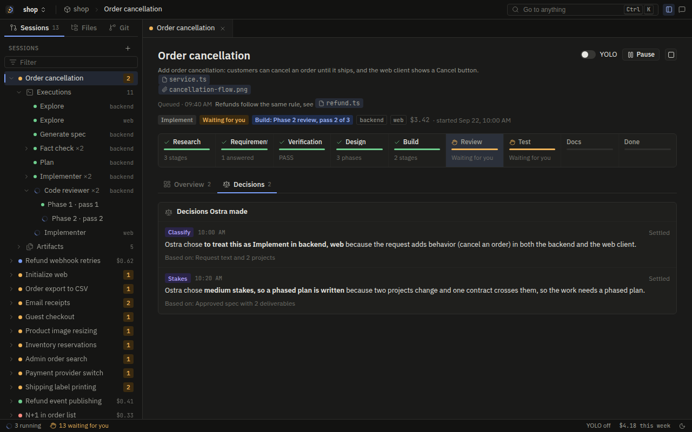

## Explore: research in parallel

Each research task spawns one `explore` agent. Explore is read-only, so every ready task spawns at once (Rule
M1). The only limit on fan-out here is the workspace's `limits.max_parallel_executions` slot limiter in the
runner, which every execution in Ostra goes through.

An explore agent writes a research document and submits its scope and a `Not covered` list: things it touched
but could not investigate. Explore tasks can also appear later. When a user adds context to a running session,
a new task researches the new part (Rule D2), and the Rescue judge can start a targeted explore in the middle
of a build.

The Add context box on the session board. Queue for the next step waits for the running agents to finish; Send now
restarts running work (Rule C2):

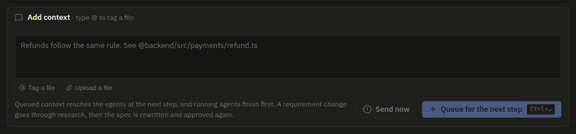

When a task fails, the engine retries it once automatically (`ERROR_RETRIES = 1` in
[`state.rs`](../../crates/ostra-engine/src/state.rs)), then opens an execution-failed gate. If every task fails or
is abandoned, the session fails with "there is no research document to write a spec from", because Rule D1
forbids a spec without research.

A research document renders as chapters. Its overview counts the files, patterns, sources, open questions, and the
Not covered items the Sufficiency judge reads next:

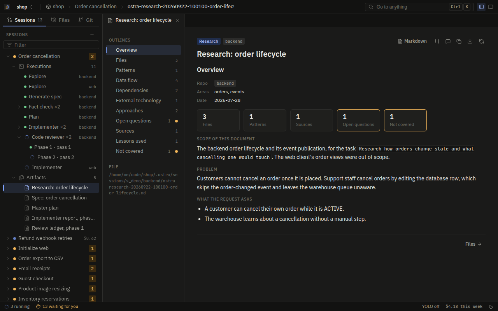

## Sufficiency: is the research enough?

The spec may start only when no research is running and no `Not covered` item the request depends on is left
open (Rule D2). The planner collects every finished task with unjudged `Not covered` items and asks the
Sufficiency judge about them in one call. For each item the judge answers needed or not needed, and a needed
item comes with one more research task. The judge often gives several related items the same task (six gaps
about one country's law become one "research these statutes" task), so the engine keeps one task per project
and task text and skips a copy of a task that is still queued or running. Those tasks spawn, and the cycle
repeats.

The engine allows three sufficiency rounds (`SUFFICIENCY_ROUNDS`). After that it proceeds to the spec with what
it has, so a request that keeps opening new questions still moves forward. When the judge is unsure it is told
to mark an item needed: an extra research pass costs one round, while a missed dependency shows up as a wrong
spec after the user approved it.

## Track: light or full

After research, an `IMPLEMENT` request asks the Track judge how much of the pipeline it needs. The light track
is the default. It skips the spec, the fact-check, the plan, and both approvals: the engine creates one inline
phase per project in scope, queued in order, and each implementer gets `No plan:` with the request and every
research document. The full track runs the spec flow below, then Stakes, then the plan when stakes are not low.

The judge ([`assets/judges/track.md`](../../assets/judges/track.md)) reads every research document and picks
`full` only on a finding it can name: a behavior the request leaves open, a contract other code consumes, a
schema or data change, a change across several modules that must land in order, a security-sensitive area, or
a need for a new codebase that no project in scope holds. The last one sends the request to the full track
because only an approved plan can put phases in a project that does not exist yet (rule O2), and the light
track builds only in projects that already exist. When the evidence is thin it picks `light`, because the user reviews the built result and can ask for changes
(next sections), while a spec round costs the user several approvals.

The New task form has a Track selector: Auto asks the judge, Light and Full skip it. The Track decision can be
overridden from the Decisions tab until the spec or a phase starts; switching to full drops the inline phases,
and switching to light creates them. The rest of the page follows the full track through the spec and the plan,
then both tracks through the phases.

## Spec: what should change

One `generate-spec` agent runs for the whole session, in the primary project. It receives the full request,
every research document (oldest first, including superseded ones), and the projects in scope. It writes the
spec file and submits its summary, counts, external evidence rows, and any open questions.

The spec is a typed document. The Document tool checks its structure, and the submit call is refused while the
file has a check error or its counts disagree with the submit (Hard rule 4). The engine never edits the spec
itself; every change goes back through the agent.

The spec renders from its typed document. Each requirement shows its EARS type, the deliverable and criterion it
covers, and its Given/When/Then acceptance criteria:

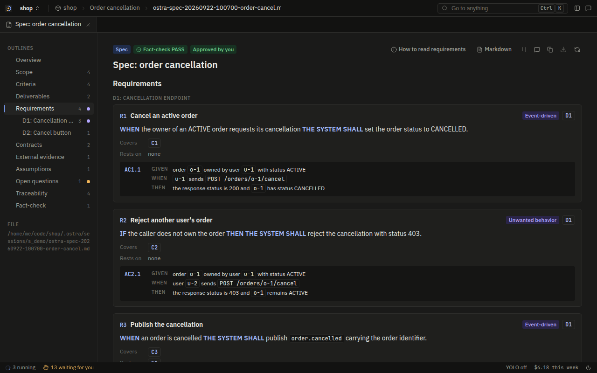

### A new codebase

A request sometimes needs a codebase of its own: a new MCP server, CLI, or service that sits beside the
existing projects. The spec does not create it. Before it groups deliverables, generate-spec gives the new
codebase a new project key, tags its criteria and deliverables with that key, and records the project's stack
and every base requirement the research or the user's answers settle as `Constraint` criteria. Nothing exists on
disk yet, so a spec the user rejects leaves nothing behind. The plan and the build take it from there, as the
next sections describe.

### Open questions before any fact-check

If the spec has open questions, they are asked before the fact-check runs (Rule D3), because checking a spec
that is about to change is wasted work. Each answer re-runs generate-spec. On a revision the agent receives
only the answers, change requests, and research documents its spec does not reflect yet, together with the
path of the current spec, so it edits the file in place instead of rewriting it.

The open questions gate shows each question with its options, the recommended option first:

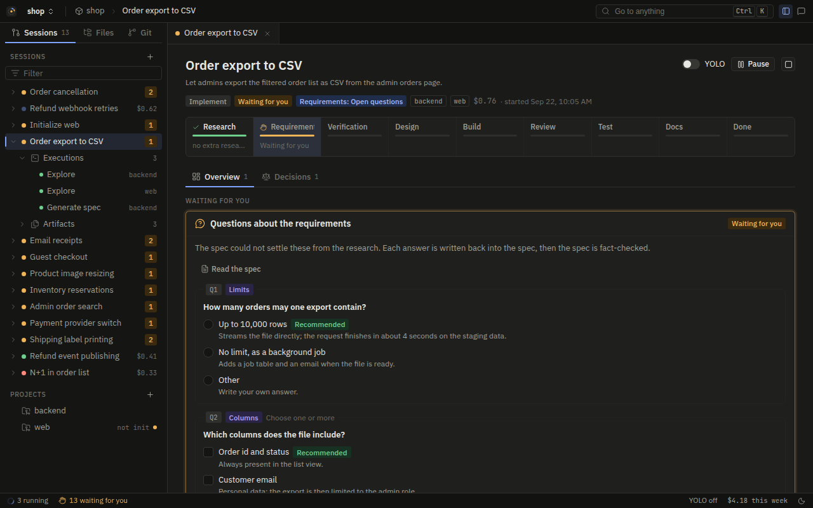

### Fact-check: the spec against the code

A `fact-check` agent checks every claim in the spec against the code and the research. Two parameters set its
behavior:

- **`Source check:`** is `refetch` only on a spec's first pass when the spec has External Evidence rows, so
  outside claims are fetched again once. Every other pass uses `citations` (Rule D3b).
- **`Prior findings:`** is `none` on the first pass. On a re-pass it is the previous pass's findings verbatim,
  or `no findings on the previous pass` when that pass was clean, so a revision after a clean pass is still
  treated as a re-pass (Rule D3a).

A fact-check on a spec's first pass runs with `Source check: refetch`, so it fetches the External Evidence source
again:


A FAIL sends the findings back to generate-spec, and the loop repeats. After three FAILs in a row
(`FACTCHECK_RECURRING_LIMIT`) the engine stops and opens a fact-check-recurring gate instead of spending more.

The gate shows the findings that keep coming back:

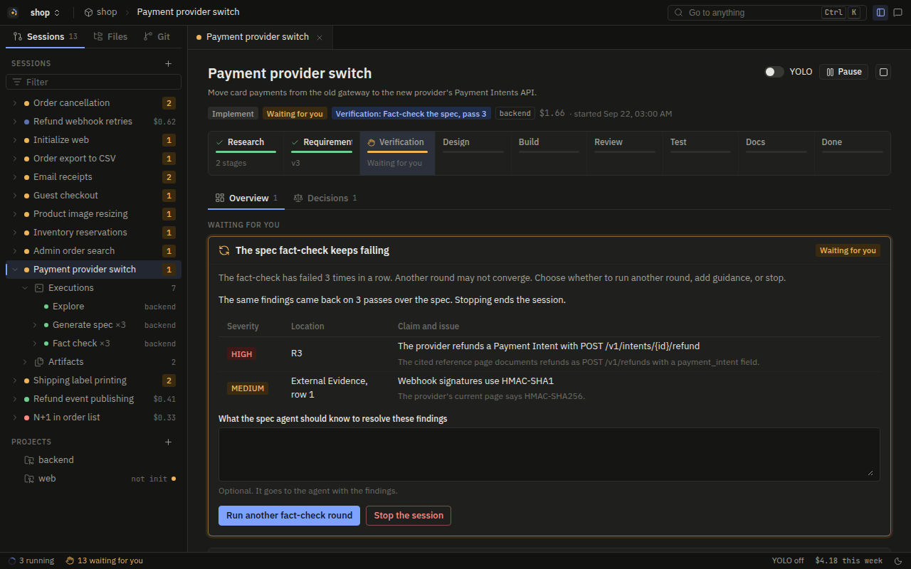

### Spec approval

A spec that passed its fact-check goes to the user for approval, with any LOW findings from the passing check
shown on the card. Approving records the version that was approved. A change request becomes a spec change and
the whole spec loop runs again. For the `SPEC` category the flow ends at the PASS and skips approval.

The approval card shows the passing check and its LOW findings:

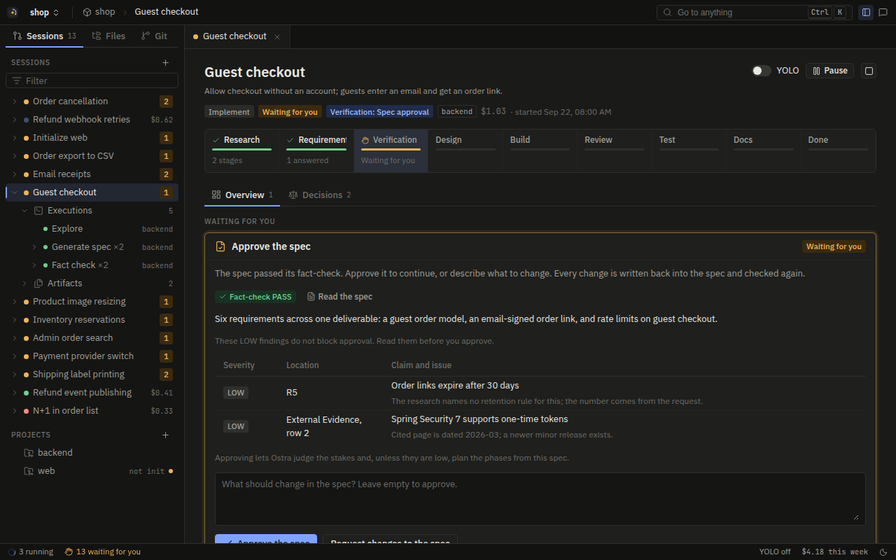

In the spec itself, the Fact-check chapter shows each finding on the element it names:

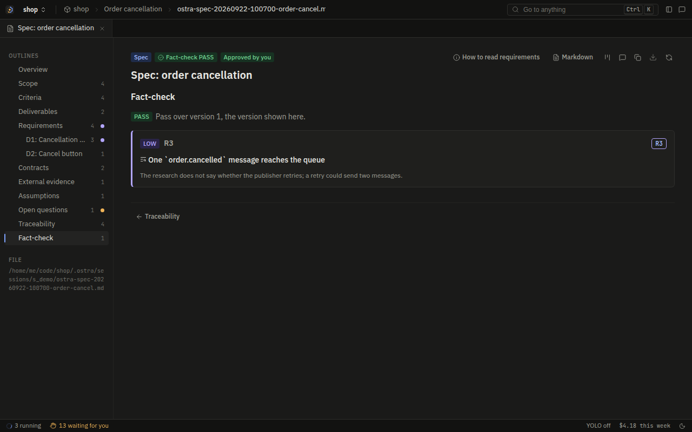

## Stakes: is a plan worth it?

For `IMPLEMENT` on the full track, the Stakes judge reads the approved spec and returns `low`, `medium`, or `high`.

- `low` skips the plan. The engine creates one inline phase per project in scope, queued in order because
  there is no dependency graph to read (Rule M5), and the implementer works from the spec.
- `medium` and `high` run the plan stage.

`PLAN` and full-track `IMPLEMENT` always go through the spec first (Rule D1, Hard rule 15). There is no path from
research straight to a plan.

## Plan: sequencing the work

One `plan` agent reads the approved spec and the projects in scope, and nothing else (Rule D4, Hard rule 16).
Its parameter struct has no field for anything more, so the engine cannot leak other context into it by
accident. On a re-run it also receives its earlier master plan and the fact-check findings.

The plan is a master plan plus one file per phase. Each phase has an ID, a project, a deliverable, a
complexity, a test policy (`Required` or `Skip` with a rationale), and the phases it depends on. Each step names
the skills it needs from the repository's inventory, and Ostra fills a phase's Required Skills from the union
of its steps (Rules P6, P7). The Document tool refuses a plan that names a skill not installed in its repo,
because the implementer loads only the skills its phase file lists.

A spec deliverable whose repo key is not in scope names a new project. The plan puts its phases in that key,
with `{workspace root}/{key}` as the phase's repo root, lists the key in its submit call's `new_projects`, and
copies the project's stack, a one-sentence purpose, and the base requirements from the spec's `Constraint`
criteria into the context of the first phase in it. When the plan is approved, a phase in a project the session
does not hold is accepted only when `new_projects` names that key (`SessionState::project_to_create`); any
other stays blocked, as a phase in an unknown project always was.

The plan then goes through the same loop as the spec: clarifying questions, a fact-check that always uses
`citations` and receives the approved spec (Rule D5), the recurring-FAIL limit, and approval.

The master plan opens on its overview, with the phase count, the stakes, and the success criteria:

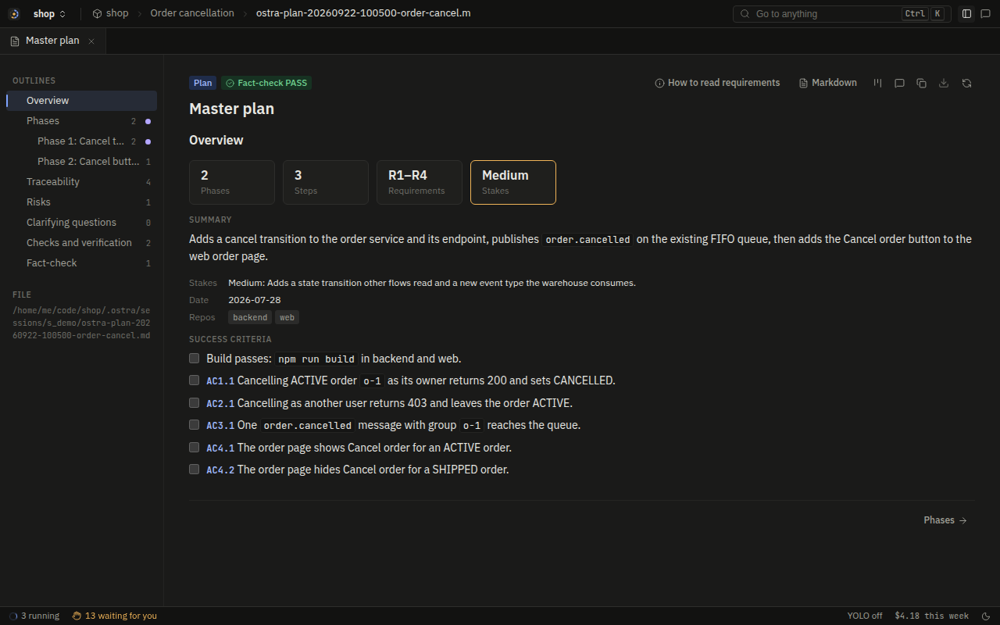

Each phase is its own chapter, with its deliverable, complexity, test policy, dependencies, and the requirements it
delivers:

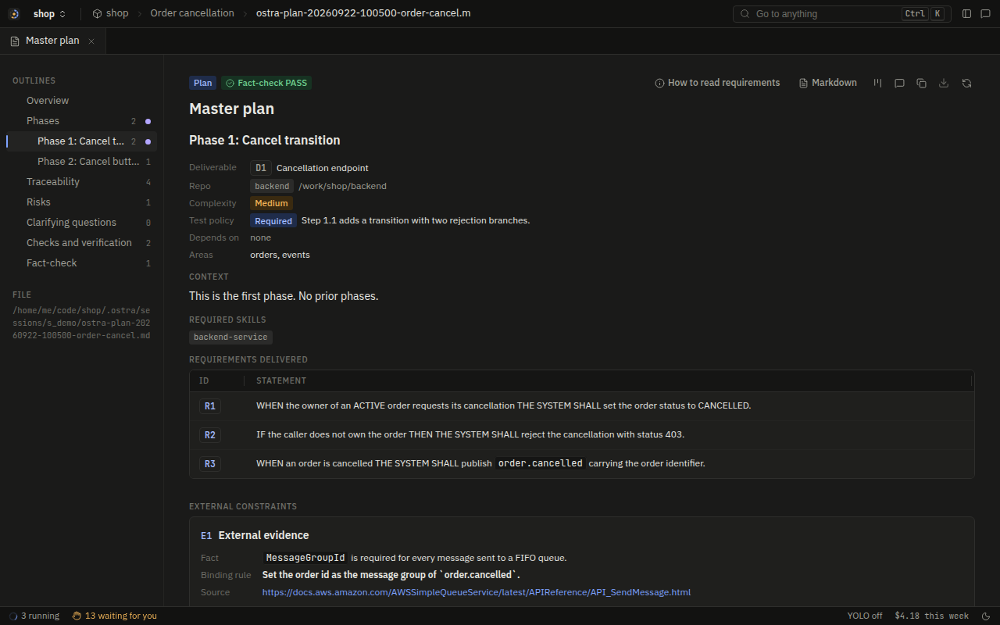

The plan approval gate lists the phases with their project, complexity, test policy, and dependencies:

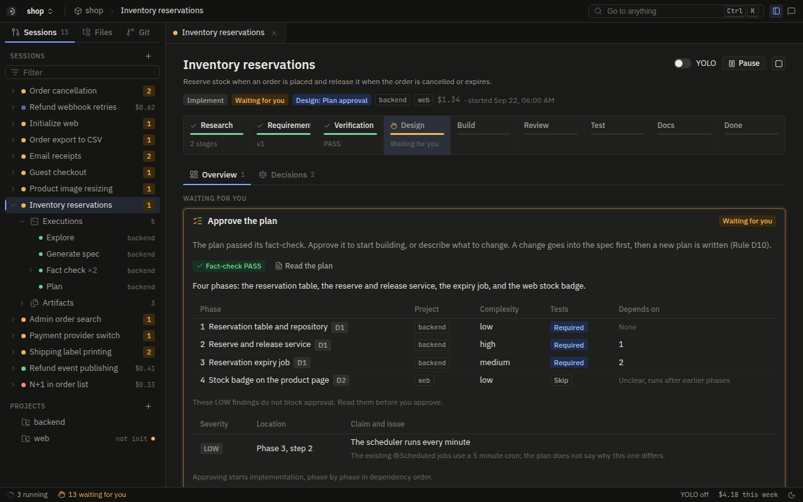

### Changes after the plan exists

A requirement-level answer at any point after the spec exists goes into the spec first (Rule D10). The
engine revokes both approvals, marks the plan invalidated, re-runs generate-spec with the change, asks for spec
approval again, and then revises the plan in place against the spec's diff. This includes answers to the
plan's own clarifying questions: they are requirement changes, because the plan agent reads only the spec, so
an answer that lives anywhere else never reaches it.

## Phases: building in reviewed steps

Once the plan is approved, its Phase Index becomes the build queue. The scheduler follows four rules:

- A phase is ready when every phase it depends on has finished and passed review (Rules D6, M3).
- A phase with an unreadable dependency list depends on every earlier phase (Rule M5).
- Each project runs one implement pipeline at a time (Rule M2), because two implementers editing the same
  working tree would overwrite each other.
- Ready phases in different projects run in parallel.

When a phase ends blocked, every phase that depends on it, directly or through other phases, is removed from
the queue, and independent phases keep going (Rule D9). The removal is computed fresh on every planner pass by
`removed_phases`.

A phase in a new project creates the project first (rule O2). Its implementer runs with `creates_project`
set in its execution context, its session dir as `Repo root:`, and a `New project:` spawn line naming the key
and folder. It reads the phase file and calls `ProjectCreate` with the stack, purpose, and requirements written
there, and it may write nothing outside its session dir and temp until the project exists. The call asks the
user ([Tools](tools.md#project-management-tools)), so the permission card is where the user approves the new
project. If the user denies it, the implementer returns stuck, and the phase follows the usual stuck path.

Once the server creates the project, a `ProjectCreated` event adds it to the session's projects and scope
(rule O3) and stops that implementer (interrupt `ProjectCreated`). The project is the one uninitialized
project a pipeline session may target, and only in the session that created it. It stays in scope if the
request is classified again. Every later spawn's repo brief lists it under "Projects created in this session"
with the stack, purpose, and requirements from the call.

The project is then initialized inside the session, as part of the build (rule O4). The init flow at the end of
this page runs for it with a `User focus:` built from the `ProjectCreate` call: the key, stack, purpose, and base
requirements, and a note that the folder is empty. The initializer seeds skills from the stack reference,
because there is no code to learn from yet. Propose plans the module map from the base requirements (one area per
part of the project they name), and the module-hub routes to those planned paths, marked planned, with no
reference files, which Archetype C allows only for a project with no source yet. The phases then put each new
file in its area, and the implementer knows where one belongs before any directory exists. Until the init ends, nothing but the init and its advisor runs in
that project: its phases, reviews, tests, research, docs, format, staging, and autofix wait, because every other
agent routes its work by the project's inventory and profile. Work in other projects does not wait. The board
shows the init as one "Initialize `<key>`" card in the Build lane, ahead of the phases.

The init ends with a `ProjectInitFinished` event. The runner appends it after it checks that the initializer
wrote `.ostra/INVENTORY.md` and a valid `.ostra/project.toml`, and marks the project initialized. The stopped
phase then starts over with initial work inside the new project, with the project's own repo brief.

A step of that init that fails goes to the advisor before the user (rule O5). That covers an initializer run
that fails or returns `stuck`, a result the init cannot use (detect found no slices, propose found no skills),
and an inventory or profile that is missing or invalid at the end. The last two the engine finds itself and
records as an `InitStepFailed` event. The advisor, a read-only agent on the advanced tier with high effort,
reads the failed step's spawn block, the problem, the project, and any earlier guidance, and submits either
`retry` with guidance or `escalate` with a reason. A retry runs the step again with an `Advisor guidance:`
line. After two retries of one step (`MAX_ADVICE`), or on an escalation, the step's failure gate opens for the
user, carrying the advisor's reason. Retrying there starts the step again. Abandoning it ends the init with a
note, and the project's phases then run without it; the session does not fail, because the rest of the work
still needs them.

The Phase graph on the session board shows each phase by step, with its project, complexity, test policy, and
state:

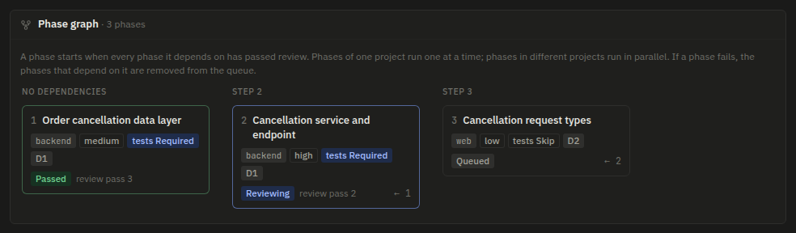

### The implement and review loop

Each phase is a loop, `WorkLoop` in [`state.rs`](../../crates/ostra-engine/src/state.rs):

1. The `implementer` runs with `Phase file:` pointing at its phase (or `No plan:` with a reason, Hard rule 13).
   It edits the code and submits its changed files and report path.
2. The `code-reviewer` reviews the unstaged changes (`Review scope: unstaged`) and submits findings, each
   with a severity and a rule ID.
3. The engine sorts the findings:
   - **BLOCKER** (or a `security_block` flag): only the BLOCKER findings go back to the implementer with an
     instruction to remove the problem. This loop has no cap and no gate can waive it (Hard rule 21). An open
     BLOCKER also prevents the module documentation stage from running.
   - **Auto-fixable**: findings whose rule ID the project marks auto-fixable and whose fix text reads exactly
     ``Change `x` to `y` on line N`` or ``Add `text` above line N: `anchor` `` are applied by the engine
     itself ([`autofix.rs`](../../crates/ostra-engine/src/autofix.rs)), without spending an agent run.
   - **HIGH and MEDIUM** go to the fix agent verbatim, with the path of the review ledger. The fix agent writes
     a FIXED or WONTFIX line with its rationale for each finding, and the reviewer reads the ledger on the next
     pass.
   - **LOW** findings are kept for the completion report and do not hold up the phase.
4. The loop repeats until no HIGH or MEDIUM finding is open.

The engine counts the passes. The cap is three review passes per loop (`REVIEW_CAP`). If findings are still
open after the third, the next step is a review-cap gate asking the user for another pass or to leave the phase
blocked. Under YOLO the budget is ten passes (`YOLO_REVIEW_BUDGET`), after which the Resolve judge takes over;
see [Gates and judges](gates-and-judges.md#review-cap).

The implementer's report lists its changes, the verification it ran, and the tests to write later:

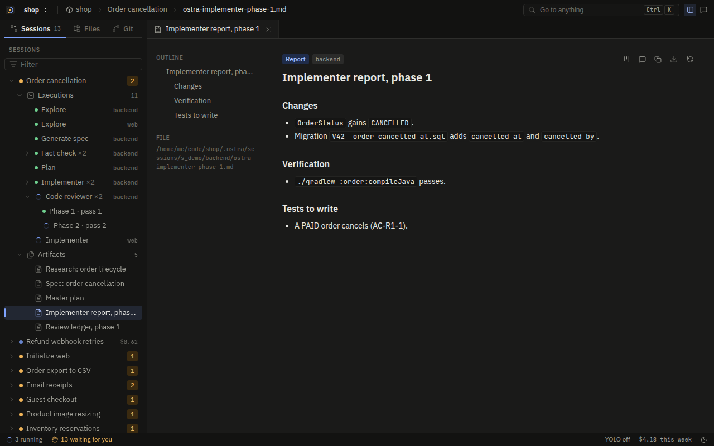

The review ledger lists each finding with its pass and severity, and marks the lines it points at on the diff:

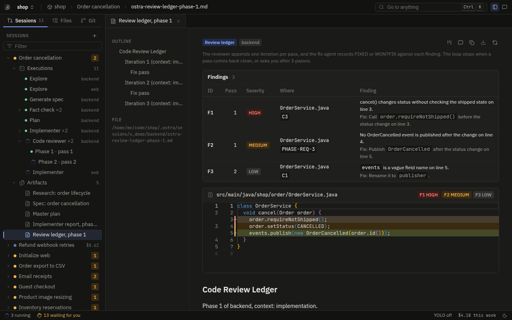

### Staging

When a phase's review passes, the engine runs `git -C <project> add` on the files the implementer reported
changing. That keeps the next phase's review focused on the next phase's changes, because reviews look only at
unstaged work.

### When an agent is stuck or needs help

The build loop has three exits besides success.

- **Errors.** An execution that ends in an error is re-run once from its spawn block. A second error opens an
  execution-failed gate. A harness that fails to start is not retried; it opens a harness-failure gate instead.
- **STUCK.** An agent returns `stuck` with a diagnostic and a specific need. The Rescue judge picks one action:
  re-run the agent with the missing fact quoted, run a targeted explore and then re-run, or ask the user. A
  plain retry is not an option, because it would reproduce the same failure.
- **HANDOFF.** An agent that needs a prompt or skill written asks for a handoff. The engine runs
  prompt-generation with that request, then resumes the original agent with its resume instructions.

Agents reach STUCK through the build-streak guard in
[`crates/ostra-policy/src/build.rs`](../../crates/ostra-policy/src/build.rs). It watches every build and test
command an execution runs. After two consecutive failures it recalls lessons for the diagnostic. From three it
tells the agent to state its root-cause theory before trying again and warns that more failures will be
refused. At five, further build and test commands are denied and the agent is told to submit `stuck`. When a
build passes after a streak of three or more, the lesson gate refuses the agent's submit until it records what
fixed the problem in project memory, so the next session does not have to work it out again.

This Codex run hit the build streak limit. After five failed builds the guard refused the next one, and the agent
returned STUCK with its diagnostic:

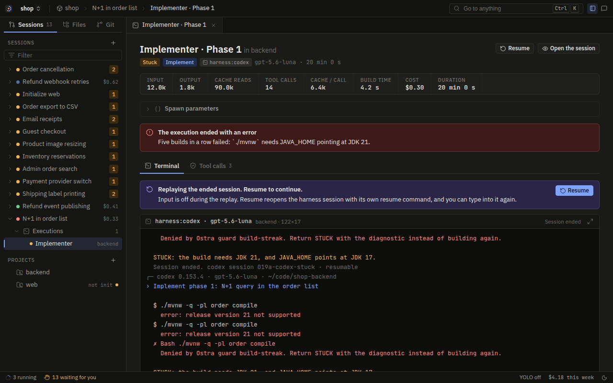

The stuck gate on the board asks for the missing fact. Above it, a phase blocked gate for another phase offers a
retry:

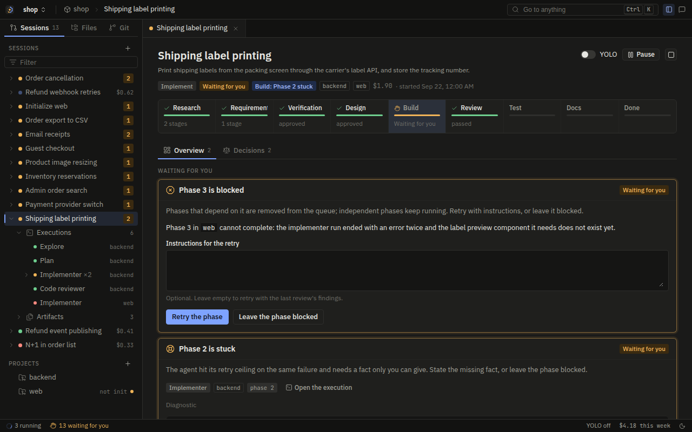

## Implementation review: feedback until you accept

When every phase of an `IMPLEMENT` session has finished, passed or blocked, and nothing is running, the engine
opens the implementation review gate (Rule F1). Nothing after it runs yet: no format, no closing gate, no tests,
no docs. You try the change and either accept it or describe what to change.

The gate card links the session context file and each implementer report, and lists any blocked phase with its
reason:

- **Accept the implementation** answers `done`. The session moves on to format, the closing gate, tests, docs,
  and the completion report.
- **Send feedback** answers `feedback` with your text and starts a round. The Feedback judge
  ([`assets/judges/feedback.md`](../../assets/judges/feedback.md)) routes every round, one project or several,
  and writes one instruction per project it changes, so feedback on a backend and frontend pair can build a
  revision in each. It also decides what happens to the text (Rule J1): feedback that asks for a change is built;
  feedback that accepts the build and only instructs a later stage ("the docs should explain X") accepts the
  implementation and keeps the note for that stage; feedback you tell Ostra to ignore builds nothing and the gate
  opens again. When the feedback asks for research first, the research runs before the revision, and the
  revision reads it in the session context file.

A revision phase is an inline phase with the next free phase ID and the title "Revision N". It runs the same
implement and review loop as any phase and is staged when it passes, and the phase scheduler treats it like any
other phase, so revisions in different projects build in parallel. When the round's phases finish, the gate
opens again for the next round. Feedback can go on for any number of rounds.

On a full-track session the Feedback judge also decides whether the round changes a requirement. A
`requirement_change` goes into the spec first (Rule D10): generate-spec revises the spec with the feedback, the
fact-check runs, and you approve the spec again. The revision phases are created at that approval. The approved
plan is not written again, because the revision works from the updated spec and the context file. An
`implementation_detail` builds at once and leaves the spec as approved. With a spec, doubt resolves to
`requirement_change`, because a spec that disagrees with the code misleads every later stage.

### The session context file

A revision does not continue an earlier agent's conversation. Before a revision spawns, and before the review
gate opens, the runner writes `ostra-session-context.md` in the session folder from the event log (Rule F2,
[`crates/ostra-engine/src/context.rs`](../../crates/ostra-engine/src/context.rs)). It lists the request with every
amendment, the track, the research documents, the spec and plan, every phase with its status, implementer report,
and review ledger, and every feedback round with the phases that built it. The revision implementer gets it as
`Context files:`, the earlier reports of its project as `Prior phase reports:`, and the round's instruction as its
task. Each revision starts with a prompt of the same size however many rounds came before, and reads only the
files it needs.

Under YOLO the gate is answered `done`, because only you can say what you want changed.

## Format

After a project's last phase is done, and for `IMPLEMENT` after you accept the implementation, the project's
format command runs once (Rule D8). Accepting comes first because a feedback round adds phases to the project. It is a plain command,
not an agent, and it is not gated. Formatting between phases would put formatting changes into the next
phase's review.

## Closing gate: tests and docs

Tests and documentation never run between phases (Rules D8, T1). When a project's phases are all finished and at
least one passed, the engine asks one question per project: write tests, update module documentation, both, or
neither. Projects that reach this point together are asked in one batched gate (Rule T6). If the request
already said whether it wants tests or docs, that choice replaces the question (Rule T3). Neither answer
changes the requirements (Rule T5).

The closing gate for one project, with both optional stages unchecked by default:

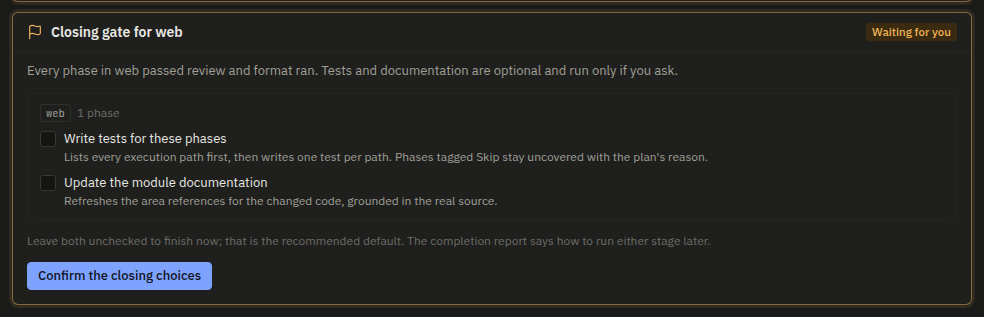

## Tests: analyze in parallel, write in order

The test stage covers each passed phase whose test policy is `Required`, or the whole change when there was no
plan (Rule T4).

1. One `execution-path-analyzer` (EPA) runs per covered phase, all at once. Each reads the implementer's report,
   traces every execution path through the changed public functions, and writes an EPA report.
2. When every EPA is done, `write-test` runs one phase at a time, in phase order, with its own review loop.
   Writing serially keeps two test writers from editing the same test files.

A test loop is the same `WorkLoop` as the implement loop: reviewed, capped, BLOCKER-aware, and staged when it
passes. Phases marked `Test policy: Skip` are listed as uncovered in the completion report with the plan's
rationale.

## Module documentation

After the test stage (or directly, when tests were declined), one `module-documentation` agent per project reads
every passed phase's implementer report and updates the area reference files under the project's module hub.
It does not run while any BLOCKER finding is open in that project (Hard rule 21).

## The completion report

When nothing is running and no gate other than a pending permission ask is open, the Completion judge writes
the report. It lists what was built, each phase and its outcome, what the fact-checks and reviews established,
every stage that did not run and how to run it later (Rule T7), every blocked phase with its findings and
ledger path, and under YOLO a "Decided for you" list. The engine then marks the session complete.

The report never comes before every created project's init has ended. The engine appends a "Projects created"
section to it, listing each project the session created, its folder and stack, and whether it was initialized;
one that was not tells the user to initialize it from the project list before its next session.

A completion report names the stages that did not run and how to run them, and lists what YOLO decided:

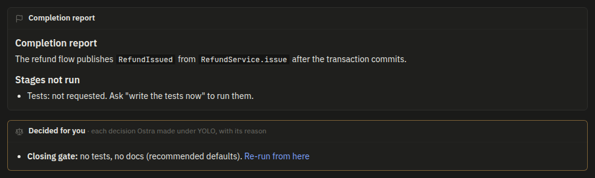

## Fan-out caps and limits

| Limit | Value | Where |
| --- | --- | --- |
| Concurrent executions per workspace | `limits.max_parallel_executions` | Slot limiter in `runner.rs` |
| Session spend | `limits.session_budget_usd` | Budget gate in `Planner::push` |
| Implement pipelines per project | 1 | Rule M2, `Planner::phases` |
| Sufficiency rounds | 3 | `SUFFICIENCY_ROUNDS` |
| Consecutive fact-check FAILs before a gate | 3 | `FACTCHECK_RECURRING_LIMIT` |
| Review passes per loop | 3, or 10 under YOLO | `REVIEW_CAP`, `YOLO_REVIEW_BUDGET` |
| Automatic retries after an error | 1 | `ERROR_RETRIES` |
| Failing builds before build commands are refused | 5 | `DENY_THRESHOLD` in `build.rs` |
| Init scouts | 6 | `init::MAX_SCOUTS` |
| Skills generated by default at init | 8 | `init::MAX_DEFAULT_GENERATE` |
| Attached files per request | 50 | `MAX_CONTEXT_FILES` |
| Uploads per request | 20, 25 MB each | `uploads.rs` |

Every spawn passes the budget check. Once the session has spent its budget (plus any raises), the planner
emits a budget gate instead of the spawn. Running executions finish, and nothing new starts until the user
raises the budget or stops the session.

## Why the planner cannot start the same step twice

The planner runs after every event, so it often proposes a step that is already running. Each `Step` has a
`key()`: a spawn's key is its purpose (for example "review phase 2, iteration 3"), a gate's key is its kind
plus the thing it is about. The runner keeps the keys of in-flight steps and skips any repeat. This is why the
planner can stay a pure function of state: it describes what should be happening, and the runner starts only
what is not already happening.

The conformance fixtures test the planner exactly this way: an event history in, the list of step summaries
out. This one checks that research fans out and that the spec waits for the last explore:

```rust
#[test]
fn d2_spec_waits_for_running_explore() {
    let mut h = H::new(&["a", "b"], SessionOptions::default());
    h.classify("IMPLEMENT", &["a", "b"]);
    // Rule M1: both explores fan out at once.
    assert_eq!(
        h.summaries(),
        vec!["spawn explore explore#0", "spawn explore explore#1"]
    );
    h.run("spawn explore explore#0", explore_submit(0, &[]));
    h.start("spawn explore explore#1");
    assert_eq!(h.summaries(), Vec::<String>::new());
}
```

The last assertion is Rule D2: one explore is still running, so nothing new starts, and the spec waits.

## The init flow

Setting up a project is a session of its own kind with a shorter pipeline (HANDOVER 8.4). The same flow also
runs inside a pipeline session for a project that session created, as described under Phases:

```
detect → scout ×N (parallel, max 6) → propose → skill approval (gate)
→ generate-skill ×N (parallel) → generate-inventory → done
```

Detect looks at existing skills, instruction files, and any earlier `project.toml` before planning scouts, so
component types an existing skill already covers are only counted (Rule I1). Each scout studies one slice of the
codebase. The proposal defaults to generating at most eight skills and dropping the rest, which the user can
change at the approval gate. Every generated skill goes to `.agents/skills/` (Rule I2).

The skill approval gate of an init session lists each proposed skill with the exemplar files it was grounded in and
a decision per skill:

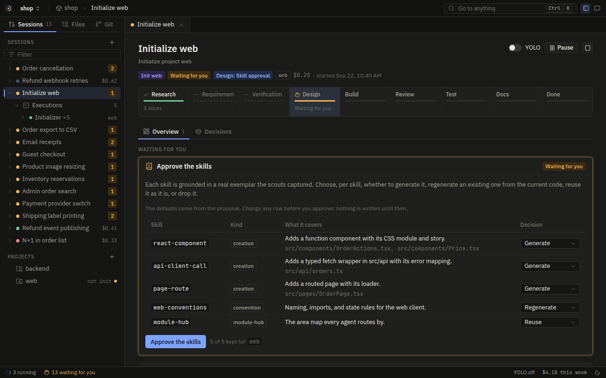
