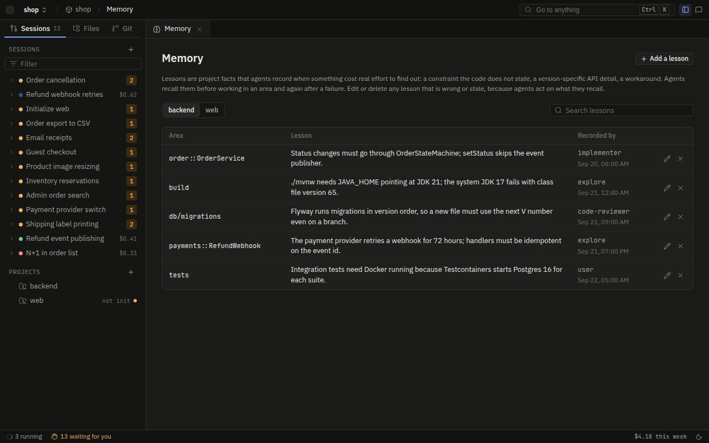
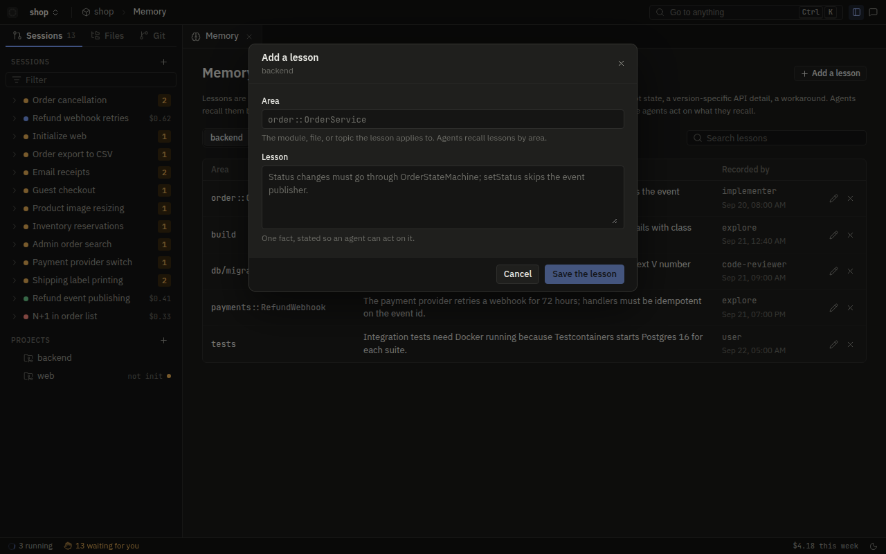

# Project memory

Every project in a workspace has a store of lessons. A lesson is a short, durable fact that one run learned.
Without the lesson, a later run spends money to find the same fact again. Examples:

- "Refund requires an ownership check that the handler does not show."
- "The `orders` tests need `TZ=UTC` or the date fixtures shift."
- "`cargo build` fails with E0599 on `Order::builder` until the `derive` feature is on."

Agents record lessons when they work, and recall lessons before they start. The engine also sends lessons to an
agent when a build failure stops it. After a fix that took many failures, the engine does not let the agent
finish until it records what fixed the failure. This page describes these topics:

- The store.
- The two memory tools.
- The build streak and the lesson gate, which connect memory to failures.
- What goes from one session to the next.

The store is `crates/ostra-store/src/memory.rs`. Its schema and its ranking follow Ultracode's
`mcp/lib/memory.js`.

## The store

Each project keeps its lessons in one SQLite file, `<project>/.ostra/memory/knowledge.sqlite3`. The file is in
the project folder, not in the data directory of Ostra. Thus the lessons belong to the code that they describe.
They stay with the project when it moves to a different workspace.

Each lesson has four fields:

| Field | Meaning |
| --- | --- |
| `area` | The module that the lesson applies to, for example `orders` or `orders::Service` |
| `lesson` | One line: the fact, not the story of how the agent found it |
| `source` | Who recorded it: the agent and the execution by default, or `user` after an edit in the browser |
| `created_at` | The time of the record or of the last confirmation |

The table has a unique key on `(area, lesson)`. When an agent records the same lesson again, the store updates
the source and the time of the lesson, and does not add a copy. Thus a lesson that many runs confirm becomes
more recent, and the store does not fill with duplicates. A full-text index (SQLite FTS5) on `area` and
`lesson` supports every search. Triggers keep the index equal to the table.

The store has no maximum size, and it never deletes lessons because of their age. A lesson leaves the store only
when someone removes it. Two removals exist: the user in the Memory screen, or an exact `forget` of a lesson
that someone confirmed to be stale.

Each call opens its own connection with a busy timeout of 5 seconds. Thus parallel executions in the same
project wait on the file lock of SQLite, and do not share a handle.

## Recording a lesson

Agents that learn about the code have the `Memory` tool. These agents are explore, implementer, and write-test:

```json
{"area": "orders::Service", "lesson": "cancel() must check ownership; the route guard does not cover it"}
```

The tool description sets the rule for what goes into memory. These facts go into memory:

- A constraint that the code does not state.
- Behavior that is different from what a name says.
- An API detail that is specific to a version.
- An invariant that spans files.
- How the agent fixed a build failure.

These facts do not go into memory: a fact that the code makes clear, the current task, and a lesson that recall
already returned. The explore prompt gives the reason. A store full of clear facts is worse than an empty store,
because each clear fact adds cost to every future recall.

Agents have no other way to write the database. The memory store is engine-owned state under the state ownership
guard. Thus the guard refuses a `Write`, an `Edit`, or a shell command that names the store. For the same reason,
the file editor of the browser shows the store as read-only. The Memory tool is the only path into the store.
Thus every lesson follows the schema and has no duplicate.

This Memory call is from an implementer run. The agent recorded it after a failed check and its fix:


## Recalling lessons

`MemoryRecall` takes an optional `area`, an optional `query`, and a `limit`. The default `limit` is 8 and the
maximum is 50. The tool fills its answer from buckets in this order, and skips a lesson that it already listed:

1. Lessons in `area` or in one of its sub-scopes (`orders` also matches `orders::Service`). BM25 against the
   query sets their rank. With no query, recency sets their rank.
2. Lessons from any area that match the query, ranked by BM25. These fill the slots that remain.
3. With no area and no query, the most recent lessons from all areas.

The tool splits the query into words, puts quotes around each word, and joins the words with OR. Thus an error
message used as a query matches lessons that share one or more of its words. Also, punctuation cannot break the
search syntax.

The prompts tell each agent when to recall:

- **explore** recalls before it explores anything. It uses the area that it will read as the area, and the topic
  as the query. It uses a recalled lesson as evidence that it must verify against the current code. It cites the
  lessons that it used in its research document. The `lessons` field holds them, each with a statement of whether
  the current code confirmed it.
- **implementer** and **write-test** recall when they get a failure. They use the diagnostic text as the query
  and the affected module as the area. Their report tells which lesson they applied.
- **quick-answer**, the agent of the side panel, can recall but cannot record.

## Lessons and build failures

Memory is most important when a build fails again and again. Ostra monitors every build and test command that
an execution runs (`crates/ostra-policy/src/build.rs`). For each execution, it counts the streak of consecutive
failures. It also keeps a signature of the cause of each failure. The signature is the first line of output that
looks like a diagnostic. In that line, Ostra replaces paths, line numbers, and version numbers. Thus the same
error in two files gives the same signature.

| Consecutive failures | What happens |
| --- | --- |
| 2 | The engine appends a maximum of 5 lessons that match the signature of the failure to the tool result |
| 3 and 4 | A warning tells the agent to state the root cause and what it will change before the next attempt |
| 5 | The guard refuses build and test commands, and tells the agent to return `STUCK:` |

At two failures, the agent does not have to remember to recall. The engine searches the store for the agent and
puts the result in front of it, under "Lessons recorded for failures like this one". Here a lesson from a
session of the past week saves its cost.

At five failures, the guard refuses the build. This Codex run then returned STUCK with its diagnostic:


### The lesson gate

The lesson gate makes sure that the agent records the fix. A build that passes after 3 or more consecutive
failures is a verified recovery. The agent learned a real fact, and the next run will get the same diagnostic.
The engine tells the agent immediately:

> Record what fixed this now, with the Memory tool: that passed after 3 consecutive failures on "...". Use area
> = the affected module and a one-line lesson naming the diagnostic and the fix ...

Until the agent records the lesson, the lesson gate refuses its `Report` call. It also refuses each `submit_*`
call with status `ok`. Two things clear the gate:

- a successful `Memory` call, or
- a `Report` call with a `reason` that states that the fix was specific to this case and teaches nothing that
  another run can use.

The gate is a Layer 1 guard. No permission rule, user answer, or YOLO setting overrides it. Its denial starts
with the correction. The denial of every guard does the same:

```rust
"Record the lesson with the Memory tool before submitting {what}: you recovered from {} consecutive build \
 failures on \"{}\" and have not recorded what fixed it. ..."
```

The streak and the gate apply to one execution. A new execution starts with a streak of zero. It gets from
earlier executions only the lessons that they recorded.

## The Memory screen

The Memory screen of the console lists the lessons of each project, newest first, with full-text search. The
user can edit a lesson, and its source then becomes `user`. The user can also delete a lesson. Use this screen
to remove a lesson that became stale after a refactor, because agents only record and recall.

| Endpoint | What it does |
| --- | --- |
| `GET /api/workspaces/:ws/projects/:key/memory` | Lists lessons, with an optional filter by a search query |
| `PATCH /api/workspaces/:ws/projects/:key/memory` | Changes the area and the text of one lesson |
| `DELETE /api/workspaces/:ws/projects/:key/memory` | Deletes one lesson |



Add a lesson opens a form for the area and the lesson text:



## What carries over between sessions

A session is one request through the pipeline. Most of what a session makes stays with that session. Some
things stay after the session ends.

**Carried over, per project:**

- The lessons in the memory store.
- `.ostra/INVENTORY.md` and `.ostra/project.toml`. These hold the stack, the commands, the module map, and the
  review rules. The initializer writes them, and the user can edit them. They supply the repo brief at the top of
  the first message of every execution.
- Skills in `.agents/skills/`, which include the convention skill.
- The instruction files of the project (`CLAUDE.md`, `AGENTS.md`, `AGENT.md`). They go into the first message
  of every execution, after the repo brief.

**Carried over, per workspace:** settings, routing, permissions, custom instructions, and MCP servers. Ostra
reads all of them again for each execution.

**Kept with the session only:** its event log, research, spec, plan, reports, review ledger, and the build
streak of each execution. Session files are in `.ostra/sessions/` of the workspace. Ostra ignores this folder in
git.

Thus a new session knows what the project is and what earlier runs learned about it. But it does not know the
goal of an earlier session. If a later session needs that goal, give it the spec or the plan as input.

## Where to read next

- [Agents](agents.md): which agents have the memory tools and how their prompts use them.
- [Tools](tools.md): the full tool set, including `Memory` and `MemoryRecall`.
- [Agent containment](../security/agent-containment.md): the Layer 1 guards, including state ownership and the
  lesson gate.
- [Storage](../architecture/storage.md): where every database and file Ostra keeps lives.
