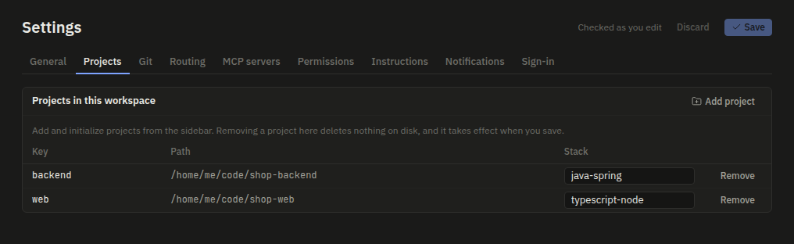
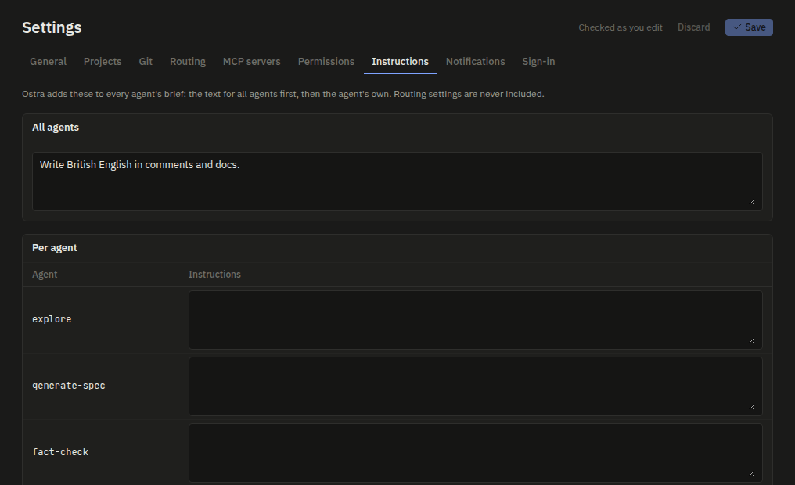
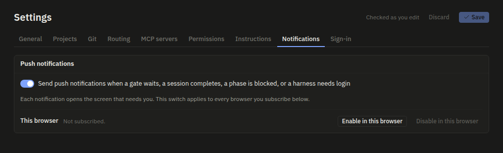
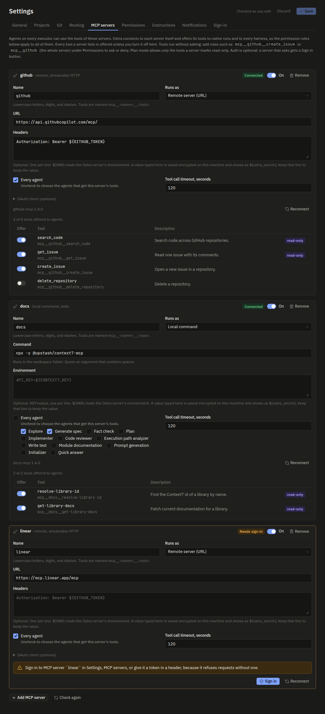
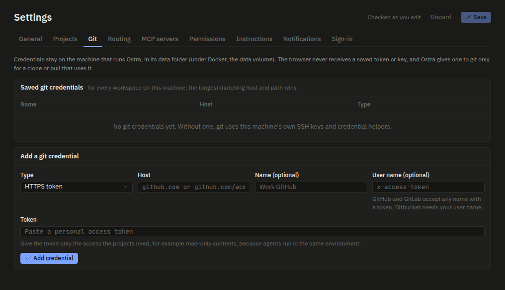
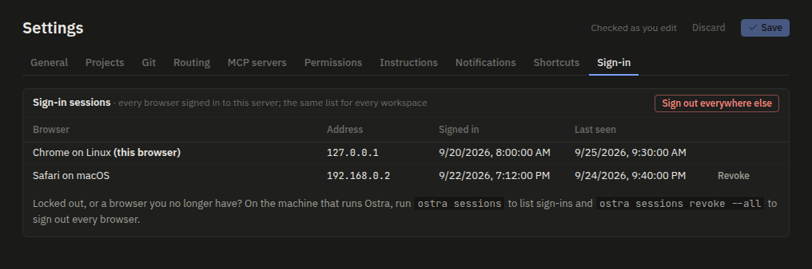
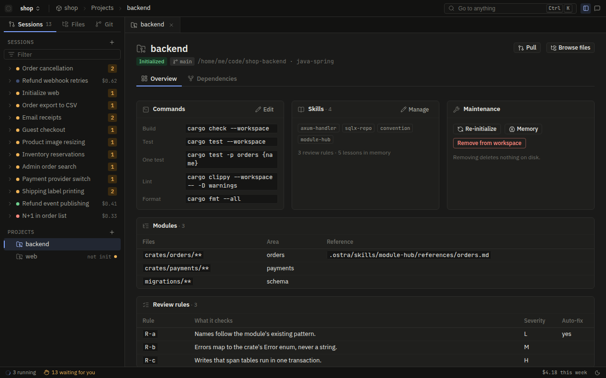
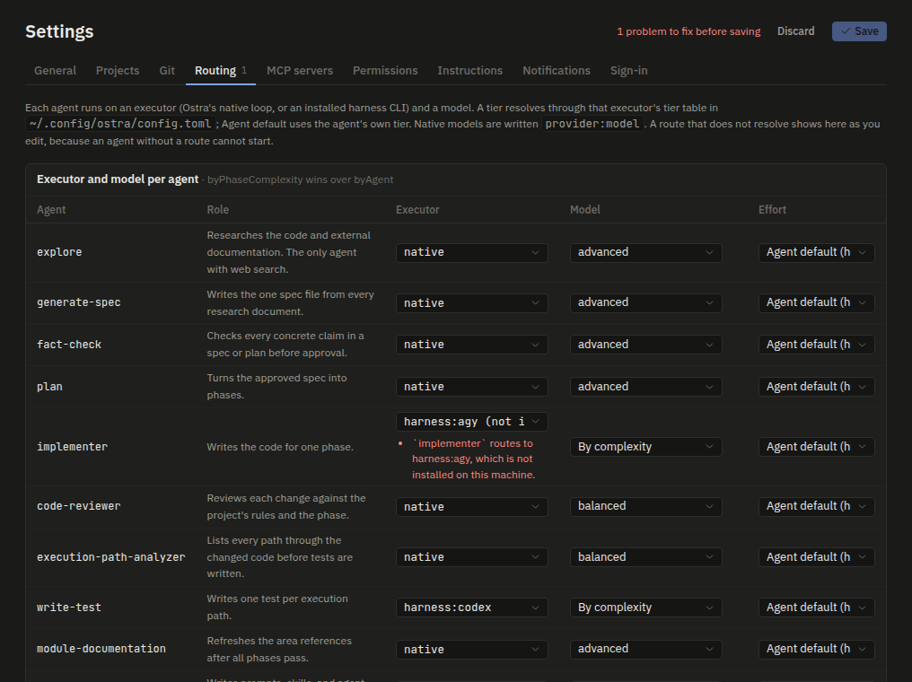

# Settings and routing

Every execution Ostra starts has to answer three questions before it can run: which executor runs it (Ostra's
own agent loop or one of the vendor CLIs), which model it talks to, and how hard that model should think. Ostra
answers them from settings, and it answers them again for every execution. This page explains where those
settings live, how a route turns into a concrete model, what Ostra checks when you save, and why some settings
are kept out of the files in your repository.

## Where settings live

Settings come from three files and one database. Each has a different owner and a different level of trust.

| Where | Path | Written by | Holds |
| --- | --- | --- | --- |
| Global config | `$OSTRA_CONFIG`, else `config.toml` in the OS config folder (`~/.config/ostra/` on Linux, `~/Library/Application Support/ostra/` on macOS) | You, by hand | Provider credential sources, the tier tables, harness commands, machine-wide permission rules, tool enforcement, the server's bind address and port, the sandbox |
| Workspace settings | `<workspace>/.ostra/workspace.toml` | The Settings screen, or you | Projects, routing, custom instructions, permission rules, notifications, MCP servers |
| Project profile | `<project>/.ostra/project.toml` | The init flow, then you | The project's stack, its build, test, and format commands, the module map, skills, and review rules |
| Registry | `registry.db` in the data folder (`$OSTRA_DATA_DIR`, else `~/.local/share/ostra/` on Linux) | Ostra | Per workspace: the permission mode, the YOLO default, the spend limits, the sandbox mode, network choice, and extra allowed hosts, and the approvals of folder-file commands. Machine-wide: provider keys and base URLs saved from the browser |

The global config belongs to the machine. It never travels with a repository, and it is the one place where
the model names behind each tier are written down. The workspace and project files sit inside folders that a
`git pull` or an agent's edit can change, which is why the registry exists.

## Why some settings stay out of the folder

A workspace file can arrive from someone else. If Ostra obeyed everything in it, cloning a repository could
raise your budget, turn off your sandbox, switch you to YOLO, or start a program of the author's choosing.
Two rules close that gap.

**Rule A2: control settings live in the registry.** The permission mode, the YOLO default, the spend limits,
the workspace's tool enforcement, and the workspace's sandbox mode, network choice, extra allowed hosts, decoy files, and macOS loopback settings are read from the registry
and never from `workspace.toml`. The overlay that
enforces it is short enough to quote
([`crates/ostra-workspace/src/trust.rs`](../../crates/ostra-workspace/src/trust.rs)):

```rust
// Rule A2: the permission mode, YOLO, spend limits, tool enforcement, and the sandbox mode,
// network, hosts, decoys, and loopback choice come from the registry, never from a folder file,
// because a repository could otherwise lift its own budget, turn off its own guards, open its own
// sandbox, or plant decoys that pause every session.
pub fn overlay(registry: &RegistryDb, root: &Path, s: &mut WorkspaceSettings) {
    let a = access(registry, root);
    s.permissions.mode = a.mode;
    s.yolo.default = a.yolo;
    s.limits = a.limits.unwrap_or_default();
    s.sandbox_mode = a.sandbox_mode;
    s.tool_enforcement = a.tool_enforcement;
    s.sandbox_network = a.sandbox_network;
    s.sandbox_allowed_hosts = a.sandbox_allowed_hosts;
    s.sandbox_decoys = a.sandbox_decoys;
    s.sandbox_loopback = a.sandbox_loopback;
    s.sandbox_blocked_ports = a.sandbox_blocked_ports;
}
```

A `[limits]` table, a `yolo` table, a `tool_enforcement`, `sandbox_mode`, `sandbox_network`, `sandbox_allowed_hosts`, `sandbox_decoys`, `sandbox_loopback`, or `sandbox_blocked_ports` key, or a `permissions.mode` key written into
`workspace.toml` by hand is ignored, and Ostra removes them the next time it saves the file. Change them on
the Settings screen.

**Rule A1: commands start only after you approved them.** The parts of a folder file that name a program are
held back until the registry records your approval of that exact content, by hash. In `workspace.toml` these
are the MCP servers, each project's `code_provider` and `language_servers`, and `permissions.allow`. In
`project.toml` it is `commands.format`, the only project command Ostra runs itself rather than through an
agent. While a file waits for approval:

- no MCP server, language server, or code provider starts,
- its allow rules do not apply (its deny and ask rules still do, because they only restrict),
- projects that point outside the workspace folder are dropped from the effective settings,
- a format step is recorded as skipped, with no exit code.

The Settings screen shows the exact commands, the names of the environment variables and headers they use
(never the values), and an Approve button. The approval carries the hash the browser showed, so if the file
changed between showing and clicking, the approval is refused. Saves made through Ostra keep an approved file
approved with its new content, so your own edits never ask again. A save of a file that is still waiting
keeps it waiting, so saving cannot approve commands you were not shown. See
[the threat model](../security/threat-model.md) for the wider picture.

The General tab edits two of the controls Rule A2 keeps in the registry, YOLO and the limits. The Permissions tab
holds the rest: the permission mode, and the sandbox's mode, network choice, allowed hosts, and decoy files. It also
sets the workspace's tool enforcement: enabled, disabled, or the global `tool_enforcement` key, whose value the
option names (`global_tool_enforcement` in the workspace response). See
[tool enforcement](../security/agent-containment.md#tool-enforcement) for what it turns on. The General tab:


## The global config

A fresh machine runs with built-in defaults, so the file is optional. The defaults, from
`GlobalConfig::default()` in [`crates/ostra-core/src/config.rs`](../../crates/ostra-core/src/config.rs), are:

- **Providers.** `anthropic` reads `ANTHROPIC_API_KEY`, `ANTHROPIC_AUTH_TOKEN`, and `ANTHROPIC_BASE_URL`.
  `openai` reads `OPENAI_API_KEY` and `OPENAI_BASE_URL`. A key can also come from the OS keychain
  (`keychain_service`) or from the browser, where it is kept in the registry and never shown again. The key
  is looked up in the environment first, then the saved key, then the keychain. The base URL comes from
  `base_url` in this file, then `base_url_env`, then the saved URL.
- **Tier tables.** One table per executor, described below.
- **Harness commands.** `claude`, `codex`, `grok`, and `agy`, found on `PATH`. `command` points at another
  binary and `args` adds arguments to every launch.
- **Permissions.** One deny rule, `Bash(rm -rf /*)`. Rules here merge with the workspace's rules.
- **Server.** `127.0.0.1` on a free port. `bind`, `port`, `allowed_hosts`, and `use_ip_host` change that.
- **Sandbox.** `mode = "required"`: an execution that cannot be sandboxed does not start. See
  [OS compatibility](../platforms/os-compatibility.md) for what each platform supports, and
  [Agent containment](../security/agent-containment.md) for what the sandbox does.

Write whole tables. A top-level table you write, such as `[tiers.*]` or `[providers.*]`, replaces that
default table as a whole, and Ostra does not merge it entry by entry. A file with only `[tiers.native]`
leaves the harness executors with no tier table, so a workspace that routes an agent to Codex fails
validation. A `[providers.anthropic]` table that sets only `api_key_env` no longer reads
`ANTHROPIC_AUTH_TOKEN` or `ANTHROPIC_BASE_URL`, and the default `openai` entry is gone. Harness commands are
the exception in practice: a harness missing from `[harness.*]` still launches by its own name.

Ostra reads the global config again every time it needs it. If the file fails to parse, or a sandbox path
in it is relative, Ostra keeps using the last version that worked and logs a warning to the server log. A
typo therefore never switches your machine back to defaults halfway through a session.

## Workspace settings

`workspace.toml` is the file the Settings screen edits. Its tables:

- `name` and `[[projects]]`: each project has a `key` (lowercase letters, digits, and dashes) and an absolute
  `path`. Optional `code_provider` and `[[projects.language_servers]]` feed code navigation in the Files view.
- `[routing.*]`: executor, model, and effort per agent, covered in the next section.
- `[instructions]`: `all` is given to every agent, and `agents.<name>` to one agent. Both are added to the
  agent's spawn block, after the rules the prompt already carries. Type `@` in either field to tag a project
  file or a workspace artifact; each agent gets its absolute path under the instruction. A tag that names a
  hidden or missing artifact fails at save time.
- `[permissions]`: `allow`, `ask`, and `deny` lists in Claude Code's rule syntax, such as `Bash(npm run test *)`.
  They merge with the global rules, global first. Each rule is parsed at save time.
- `[notifications]`: `push = true` sends Web Push for open gates and finished sessions.
- `[[mcp_servers]]`: external MCP servers, local (`command`) or remote (`url`), with per-server
  `disabled_tools`, an `agents` list, and a per-call `timeout_secs` from 1 to 600. Header and environment
  values may name a variable as `${VAR}` so that secrets stay out of the file.

The Settings screen has a tab for each part. Projects lists each project's key, path, and stack:



Instructions holds the text for all agents and for each agent:



Permissions holds the mode, the sandbox, and the rules, with the global rules shown read-only:


Notifications turns Web Push on and subscribes this browser:



MCP servers edits `[[mcp_servers]]`, with each server's live state and a switch per tool ([MCP servers](mcp.md)):



Two tabs hold state for the whole machine rather than `workspace.toml`. Git saves credentials for clones and pulls:



Sign-in lists every browser signed in to this server:



## The project profile

`project.toml` is written by the init flow's inventory step and describes one repository: its stack, its
commands (`build`, `test`, `test_one`, `format`, `lint`, `typecheck`, `run`), its test types, a module map,
its skills, its conventions, and its review rules. You can edit it by hand afterwards.

Two details matter for behavior. First, only `commands.format` is run by Ostra itself, after an implement
step, so only that command needs approval. The other commands are run by agents, through the policy and the
sandbox. Second, a review rule marked `auto_fixable` lets the engine apply a reviewer's fix for that rule
without another implement pass, unless its ID starts with `SEC-BLOCK` or `PHASE-REQ`. Those never qualify,
whatever the file says (`ProjectProfile::auto_fixable_ids`).

Because models write this file, its parser is built to explain itself. When the initializer submits a
`project.toml` that does not parse, `check_profile` answers with the fix first, then the parser's text:

```text
Fix /repo/.ostra/project.toml with the edit tool, then submit again, because Ostra cannot parse it.
Line 4: TOML has no null. Omit `test_framework` instead of writing `null`.
Line 9: `conventions` is one table. Write `[conventions]`, not `[[conventions]]`.
```

The fixes come first because some harnesses clip a long tool error, and the parser's own message is the
least useful part.

The project screen shows the profile: its commands, skills, modules, and review rules:



## Routing: from agent to model

A route is looked up by **route key**: the agent's name (`explore`, `plan`, `implementer`, and so on) or
`judge` for the small structured calls the engine makes itself. Ostra resolves three things per key.

The Routing tab of Settings has one row per agent, the phase complexity table, and the native provider keys:


### Tiers are the indirection

Workspace settings rarely name a model. They name a **tier**: `fast`, `balanced`, `advanced`, or `frontier`.
The global config maps each tier to a model once per executor, because each executor names models differently:

| Executor | Tier table | Default `fast` / `balanced` / `advanced` / `frontier` |
| --- | --- | --- |
| `native` | `[tiers.native]` | `anthropic:claude-haiku-4-5-20251001` / `anthropic:claude-sonnet-5-5` / `anthropic:claude-opus-5-5` / `anthropic:claude-fable-5-1` |
| `harness:claude` | `[tiers.claude]` | `haiku` / `sonnet` / `opus` / `fable` |
| `harness:codex` | `[tiers.codex]` | `gpt-5.6-luna` / `gpt-5.6-terra` / `gpt-5.6-sol` / `gpt-5.6-sol` |
| `harness:grok` | `[tiers.grok]` | `grok-4.5` for every tier |
| `harness:agy` | `[tiers.agy]` | `flash` for every tier |

Native entries are `provider:model`, and the native providers are `anthropic` and `openai`. Harness entries
are the CLI's own model slug. So `plan = "advanced"` means Opus when the planner runs natively and
`gpt-5.6-sol` when it runs in Codex, and you can move an agent between executors without touching its model
route.

### Executor

`[routing.executor]` picks what runs the agent: `native` or `harness:<claude|codex|grok|agy>`. An agent with
no entry runs natively. Two keys cannot be routed to a harness at all: `judge`, because a judge call is a
single structured request from the engine and not an agent execution, and `quick-answer`, the side panel's
agent.

### Model

`[routing.model]` gives each route key one of four value forms:

| Form | Example | Meaning |
| --- | --- | --- |
| Tier | `plan = "advanced"` | Look the tier up in the executor's tier table |
| `default` | `plan = "default"` | Use the `default_tier` from the agent's `agent.toml` |
| Concrete model | `plan = "anthropic:claude-opus-5-5"` | Use this model as written, on whatever executor runs the agent |
| Per executor | `plan = { native = "advanced", codex = "gpt-5.6-sol" }` | Pick the entry for the executor that runs the agent; each entry is a tier or a model |

Every route key needs a model route. A new workspace is seeded with one for each
(`WorkspaceSettings::seeded`), taken from Ultracode's inventory profile: research, spec, plan, fact-check,
module documentation, prompt generation, and the advisor on `advanced`; review, execution-path analysis, the initializer,
and quick answers on `balanced`; judges on `advanced`, because a wrong route costs more than the call.

A workspace saved before an agent existed has no route for it, so an Ostra update that adds an agent (the
advisor, for example) leaves that workspace with a validation problem, and the Settings screen refuses to save
until it is fixed. Ostra does not fill the gap on its own, because the route is the user's choice. It offers
the fix instead: the workspace detail lists, under `fixes`, a `default` route for each route key that has none
(`keys_without_route` in `crates/ostra-core/src/config.rs`), and `default` resolves to the agent's own default
tier. The dashboard's settings banner has a button that applies them through
`POST /api/workspaces/:ws/settings/fix`, which writes only those routes and leaves any other problem for the
user. On the Settings screen the same fix is a button next to the problem, and it changes the form, so it is
saved with the rest of the edits.

### Effort

`[routing.effort]` sets reasoning effort: `low`, `medium`, `high`, `xhigh`, or `max`. An agent with no entry
keeps the effort its `agent.toml` gives for that executor. The implementer's `agent.toml`, for example, asks
for `high` on every executor. Each executor translates the level into whatever its model or CLI accepts.

### Phase complexity

Two agents run once per plan phase: the implementer and write-test. Each phase file carries a
`**Complexity:**` line, and these two agents can be routed by it under `byPhaseComplexity`, for executor,
model, and effort alike. `byPhaseComplexity` wins over `byAgent`. Work with no phase file, such as a quick
change, counts as `low`. The seeded settings run both agents on `fast` for `low` and `medium` phases and on
`balanced` for `high` ones, so the model grows with the phase instead of every phase paying for the largest
model.

### Overrides the engine applies

Settings are not the only input. The engine forces a few choices, and each one is recorded so the session
can show why:

- **Generate-skill runs on `advanced`.** The initializer's generate-skill mode forces the tier, whatever the
  initializer's own route says. The route sets the initializer's other modes.
- **Harness failures can fall back to native.** When a harness execution fails, its gate offers a `native`
  answer. Choosing it records the agent in the session's `native_fallback` set, and every later execution of
  that agent in the session runs natively.
- **Quick changes and quick answers run natively**, because a harness start-up costs more than the change.

### A worked resolution

Take this workspace excerpt and an implementer spawn for a phase marked `**Complexity:** high`:

```toml
[routing.executor.byAgent]
implementer = "harness:codex"

[routing.executor.byPhaseComplexity.implementer]
high = "native"

[routing.model.byPhaseComplexity.implementer]
low = "fast"
medium = "fast"
high = "balanced"
```

1. **Executor.** `byPhaseComplexity.implementer.high` exists and says `native`, so it wins over the
   `byAgent` entry. Low and medium phases would have gone to Codex.
2. **Model.** `byPhaseComplexity.implementer.high` says `balanced`, a tier.
3. **Tier table.** The executor is native, so Ostra reads `[tiers.native].balanced`:
   `anthropic:claude-sonnet-5-5`.
4. **Check.** A native model must be `anthropic:<model>` or `openai:<model>`. It is.
5. **Effort.** No effort route, so the implementer's `agent.toml` value for `native` applies: `high`.

The result is a `ResolvedRoute { executor: native, model: "anthropic:claude-sonnet-5-5", tier: balanced }`.
This is `resolve_route` in [`config.rs`](../../crates/ostra-core/src/config.rs), and the same function runs at
save time and at spawn time.

## Validation at save time

A route that does not resolve is a validation error when you save, never a silent fallback when an agent
starts. `validate_workspace` is where that is enforced. A
save goes through `PATCH /api/workspaces/{ws}`; the Settings screen also calls `POST /api/workspaces/{ws}/validate`
as you type. Either returns every problem at once, each with the dotted path of the field it belongs to:

```json
{
  "error": "...",
  "issues": [
    { "path": "routing.model.byAgent.plan",
      "message": "`plan` routes to tier `frontier` on `harness:grok`, but `[tiers.grok]` in the global config has no `frontier` entry" }
  ]
}
```

What is checked:

- **Every route key resolves, on every complexity it can run at.** The implementer and write-test are
  resolved three times, once per complexity, because a gap in the `high` row would otherwise only show up
  when a high phase arrived.
- **The executor exists on this machine.** A route to a harness whose CLI is not installed is an error.
- **The provider has a key.** A native route to `openai:...` with no usable OpenAI key is an error.
- **Keys name real agents.** A typo such as `implementor` under `byAgent` is reported, not ignored.
  `byPhaseComplexity` effort entries are accepted only for the two agents that run per phase.
- **Forbidden routes.** `judge` and `quick-answer` cannot be sent to a harness.
- **Projects.** Keys are well formed and unique, paths are absolute and are folders, a stack name is valid,
  code providers and language servers name a program, each language has at most one server, and timeouts are
  from 1 to 120 seconds.
- **Permission rules parse** (`ostra_policy::validate_rule`).
- **MCP servers** have unique, valid names, exactly one of `command` or `url`, and a timeout in range.
- **Limits.** `max_parallel_executions` is at least 1, and `session_budget_usd` is a finite amount of 0 or
  more. See [Spend and limits](spend-and-limits.md).

If any issue remains, nothing is written. The file is saved atomically, through a temporary file and a
rename, so a crash during a save never leaves half a file.

The Settings screen runs the same checks as you edit. Here the implementer routes to a harness that is not
installed, so the row shows the issue and the header counts the problems left before saving:



### What save-time validation cannot see

Validation checks the settings against the machine as it is at the moment you save. The machine can change
afterwards: you edit the global config by hand, uninstall a CLI, or unset an API key. Ostra does not then
guess a substitute. The spawn resolves its route, fails, and is recorded as a denied execution with the
reason, for example ``route: `plan` has no model route`` or `The harness:codex executor is not available.`
The session shows that failure where you can act on it, instead of quietly running on a model you did not
choose.

One case falls back rather than failing: if `workspace.toml` itself stops parsing, the engine runs with the
seeded defaults for that workspace until the file parses again. Fix the file, or save from the Settings
screen, which rewrites it.

## Read fresh, every execution

Ostra has no settings cache that needs a restart. The engine reaches settings only through its `Services`
trait, and the server's implementation reads the files each time it is asked:

- `Services::workspace()` loads `workspace.toml` and applies the registry overlay and the approval filter.
- `Services::global()` loads the global config, with the last-good fallback described above.
- Each spawn reads `project.toml` and the project inventory from disk while it builds the agent's input.
- The planner reads the session budget on every planning pass, and the slot limiter reads the parallel
  limit every time a spawn waits.

An edit therefore applies to the next execution, not to the one already running. A running execution keeps
the route it started with, and its record shows the executor and model it actually used. The one thing that
does not follow a settings change is anything already recorded in the session's event log: a gate answer, a
fallback to native, or a raised budget stays as it was recorded, because the session's state is a fold over
its log. See [The event log](event-log.md).

## An annotated example

The two files below parse with Ostra's own types and pass `validate_workspace` on a machine with Codex
installed and an Anthropic key set. The global file writes only the tier tables this workspace uses, so a
route to Claude Code, Grok Build, or Antigravity would need their tables too. It also replaces the
`providers` table, so OpenAI models are not available with it.

```toml
# ~/.config/ostra/config.toml

[providers.anthropic]
api_key_env = "ANTHROPIC_API_KEY"   # the environment wins over a key saved in the browser
base_url_env = "ANTHROPIC_BASE_URL" # for a gateway; unset means api.anthropic.com

# Tier names used by the workspace resolve here, per executor.
[tiers.native]
fast = "anthropic:claude-haiku-4-5-20251001"
balanced = "anthropic:claude-sonnet-5-5"
advanced = "anthropic:claude-opus-5-5"
frontier = "anthropic:claude-fable-5-1"

[tiers.codex]
fast = "gpt-5.6-luna"
balanced = "gpt-5.6-terra"
advanced = "gpt-5.6-sol"
frontier = "gpt-5.6-sol"

[harness.codex]
command = "/opt/codex/bin/codex"    # a binary that is not on PATH

[permissions]
deny = ["Bash(rm -rf /*)", "Bash(git push --force *)"]  # applies to every workspace

[sandbox]
mode = "required"                   # refuse to run an execution that cannot be sandboxed
network = "allowlist"               # registries, source hosts, model APIs, and allowed_hosts
allowed_hosts = ["mirror.corp.example"]
extra_hidden = ["~/.aws"]           # absolute or ~/ only; a relative path is rejected
```

```toml
# /home/me/shop/.ostra/workspace.toml
name = "shop"

[[projects]]
key = "backend"
path = "/home/me/shop/backend"

# Codex builds low and medium phases; high phases run natively.
[routing.executor.byAgent]
implementer = "harness:codex"

[routing.executor.byPhaseComplexity.implementer]
high = "native"

[routing.model.byAgent]
explore = "advanced"
generate-spec = "advanced"
plan = { native = "frontier", codex = "gpt-5.6-sol" }  # per executor
fact-check = "advanced"
code-reviewer = "balanced"
execution-path-analyzer = "balanced"
module-documentation = "default"    # the agent.toml default tier
prompt-generation = "advanced"
initializer = "balanced"
judge = "advanced"
quick-answer = "balanced"

[routing.model.byPhaseComplexity.implementer]
low = "fast"
medium = "fast"
high = "balanced"

[routing.model.byPhaseComplexity.write-test]
low = "fast"
medium = "fast"
high = "balanced"

[routing.effort.byAgent]
plan = "high"

[routing.effort.byPhaseComplexity.implementer]
high = "xhigh"

[instructions]
all = "Write British English in comments and docs."

[instructions.agents]
implementer = "Keep functions under 40 lines."

[permissions]
allow = ["Bash(npm run test *)"]    # waits for approval if this file changed outside Ostra
deny = ["Bash(git push *)"]
```

Things this example leaves out on purpose: the permission mode, YOLO, limits, and the workspace's sandbox mode
and hosts. They are set
on the Settings screen and kept in the registry (Rule A2).

## Where to look in the code

| What | Where |
| --- | --- |
| Settings types, defaults, `resolve_route`, `validate_workspace`, `check_profile` | [`crates/ostra-core/src/config.rs`](../../crates/ostra-core/src/config.rs) |
| Tiers, effort levels, complexity | [`crates/ostra-core/src/model.rs`](../../crates/ostra-core/src/model.rs) |
| Executor names and parsing | [`crates/ostra-core/src/executor.rs`](../../crates/ostra-core/src/executor.rs) |
| Registry overlay and approvals (Rules A1, A2) | [`crates/ostra-workspace/src/trust.rs`](../../crates/ostra-workspace/src/trust.rs) |
| Extra checks beyond `validate_workspace` | [`crates/ostra-workspace/src/settings.rs`](../../crates/ostra-workspace/src/settings.rs) |
| Machine facts for validation | `WorkspaceHost::environment` in [`crates/ostra-server/src/app.rs`](../../crates/ostra-server/src/app.rs) |
| Saving settings | `save_settings` in [`crates/ostra-workspace/src/runtime.rs`](../../crates/ostra-workspace/src/runtime.rs) |
| Route resolution at spawn time | `perform_spawn` in [`crates/ostra-engine/src/runner.rs`](../../crates/ostra-engine/src/runner.rs) |
| Effort and instructions reaching the agent | [`crates/ostra-engine/src/factory.rs`](../../crates/ostra-engine/src/factory.rs) |
| The design brief for settings | [HANDOVER section 7](../../HANDOVER.md#7-settings) |
