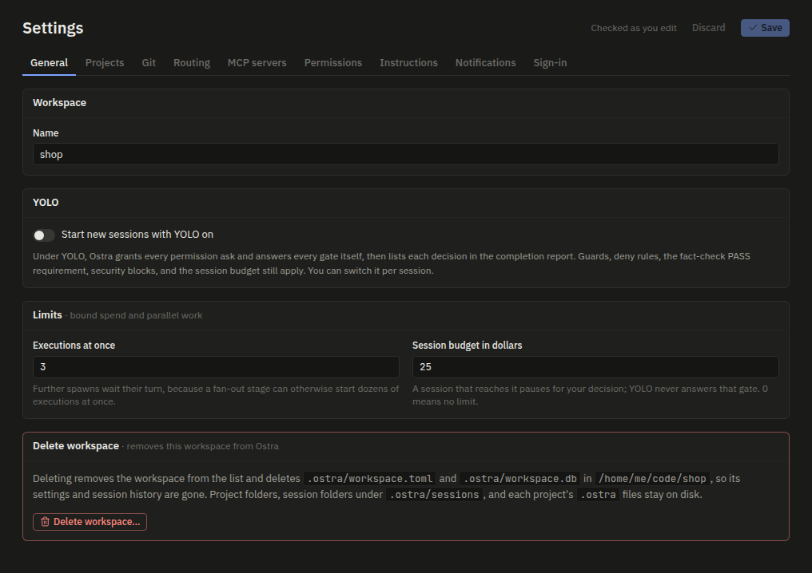
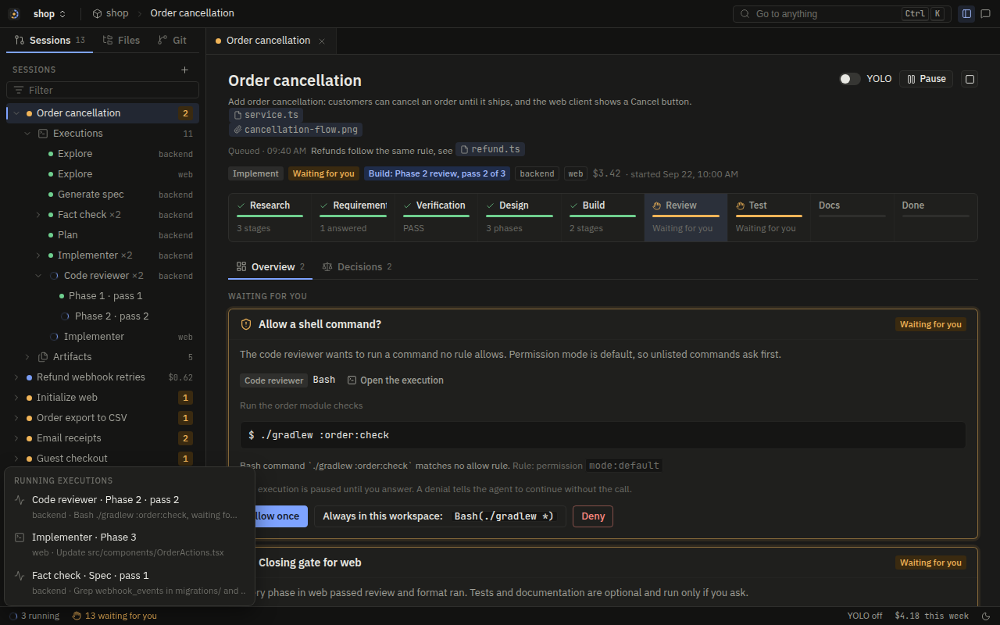
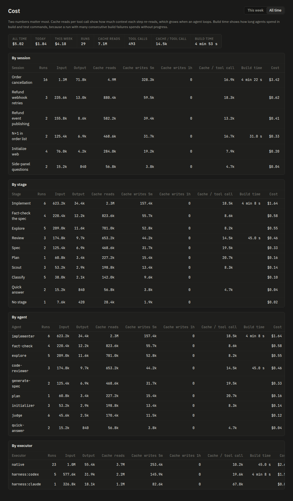
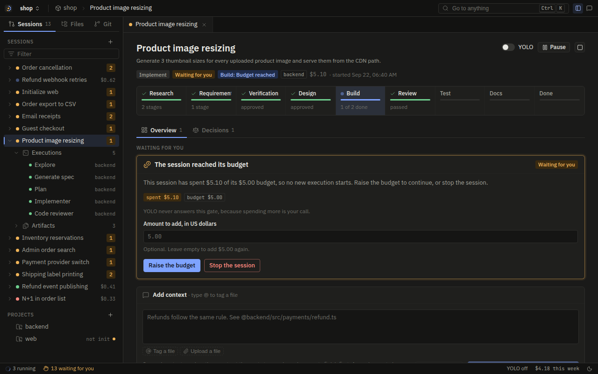

# Spend and limits

One Ostra session can start many executions: several explores in parallel, a spec writer and a fact-checker,
a planner, then an implementer and a reviewer for every phase, and more for tests and docs. Init can start six
scouts at once. Each execution can run on a top-tier model. Left alone, a fan-out stage could start dozens of
expensive executions in a minute. This page explains the controls that stop that: a limit on how many
executions run at once, a spend budget per session, caps on each fan-out, and the ways to stop a session that
is spending more than you want.

## The two limits

Both live under `limits` in the workspace settings and are set on the Settings screen.

| Setting | Default | Meaning |
| --- | --- | --- |
| `limits.max_parallel_executions` | `3` | Executions that may run at once in this workspace, across all its sessions. Further spawns wait their turn. |
| `limits.session_budget_usd` | `25.0` | Dollars one session may spend before it pauses for your decision. `0` means no limit. |

Save-time validation rejects a parallel limit of 0 and a budget that is negative or not a number.

Both values are kept in the registry, not in `workspace.toml` (Rule A2). A `[limits]` table in the file is
ignored and removed at the next save, because a repository you cloned could otherwise raise its own budget.
[Settings and routing](settings-and-routing.md#why-some-settings-stay-out-of-the-folder) explains the rule.

Both limits are on the General tab of Settings:



## Parallel executions: the slot limiter

Every agent execution needs a slot before it starts. The limiter is a counter and a notifier on the
workspace's engine, in [`crates/ostra-engine/src/runner.rs`](../../crates/ostra-engine/src/runner.rs):

```rust
/// Wait for a slot under the workspace's parallelism limit, re-read each time so a settings
/// change applies to waiting spawns.
async fn acquire_slot(self: &Arc<Self>) -> Slot {
    loop {
        let limit = self.services.workspace().limits.max_parallel_executions.max(1) as usize;
        {
            let mut n = lock(&self.slots);
            if *n < limit {
                *n += 1;
                return Slot(self.clone());
            }
        }
        let _ = tokio::time::timeout(Duration::from_secs(2), self.slot_free.notified()).await;
    }
}
```

The slot is a value whose `Drop` gives it back and wakes the waiters, so it is released however the execution
ends: success, failure, cancellation, or a panic in the executor. A waiting spawn checks again when a slot
frees, and at least every two seconds, reading the limit from settings each time. Raising the limit lets
waiting spawns start within two seconds, without a restart. Lowering it never cancels anything: executions
already running finish, and new ones wait until the count is under the new limit.

What holds a slot and what does not:

- **Holds a slot:** every agent execution a session spawns, on any executor, native or harness. The limit is
  per workspace, so two sessions in the same workspace share it.
- **Gives its slot back while it waits:** a harness run that asked another subagent a question and waits with its
  process alive (Rule H2). It takes a slot again before the answer is typed in. A native run that asks ends
  instead, so it holds nothing while it waits. Without this, a limit of one would leave the asker holding the only
  slot and the helper it waits for unable to start.
- **Does not hold a slot:** judge calls, which are single structured requests the engine makes between steps,
  and side-panel quick answers, which run outside any session. Both are short and run on the `fast` or
  `balanced` tier by default.

After a spawn gets its slot it reads the session's state again. If the session was paused or ended while the
spawn waited, it gives the slot back and starts nothing.

The status bar counts the running executions, and clicking the count lists them:



## How cost is counted

Every execution records its token usage as it runs: input tokens, output tokens, cache reads, cache writes
(with the part written at the one-hour cache lifetime kept apart, because it costs more), tool calls, and
build time. Cost in dollars is computed from that usage and a price table, in
[`crates/ostra-core/src/pricing.rs`](../../crates/ostra-core/src/pricing.rs):

```rust
pub fn cost(model: &str, usage: &Usage, web_searches: u64) -> f64 {
    let Some(p) = price(model) else { return 0.0 };
    let r = p.rates(usage.input_tokens + usage.cache_read_tokens + usage.cache_write_tokens);
    // input, output, cache reads, 5-minute writes, 1-hour writes, plus $0.01 per web search
    ...
}
```

The Cost screen shows the totals and the same metrics per session, stage, agent, and executor, for this week or all
time:



### Where prices come from

Prices come from the public [models.dev](https://models.dev) catalog. The server keeps a copy in the data folder
as `models-dev.json`, installs it at start-up, and refreshes it once a day in the background. If a refresh
fails it keeps the cached prices and tries again an hour later. `OSTRA_MODELS_DEV_URL` points the fetch at
another copy of the catalog, and an empty value turns fetching off, for machines without network access.

When resellers list the same model at different prices, the first-party provider's listing wins. Models whose
price changes above a prompt size, a context-length tier, are priced per request at the rate for that
request's size.

A model the catalog does not list costs $0 in Ostra's records, and so does every model before any catalog was
installed: on a machine that has never fetched the catalog and has no cached copy, every execution counts as
free and the budget never pauses a session. Check the session's cost on its board after the first execution to
confirm prices are in place.

### Native and harness executions

- **Native executions** get usage from each provider response, and the provider client prices every response
  as it arrives. Each response's own cost is also written to the Activity feed as a `turn` delta, emitted after
  the response's thinking and before its tool calls run. The execution screen shows it on that response's
  thinking summary, and gives each tool call the response made an equal share of it, marked with `~` because
  a response is billed as a whole: its prompt, thinking, and every call it wrote. A response with no thinking
  and no calls, such as a compaction, gets a line of its own.
- **Harness executions** get usage from the CLI's own transcript, which Ostra follows while the CLI runs:
  - Claude Code writes usage per assistant message. Ostra keeps the last usage seen for each message id, so a
    message streamed in parts is counted once.
  - Codex writes running totals. Ostra prices the difference since the last total it saw.
  - Grok Build reports its own cost with each finished turn, and Ostra uses that figure.
  - Antigravity's transcript carries no usage, so its executions are recorded at $0.

### Stored as it runs

Each usage update is written to the execution's record as it arrives, and the session list's cost updates
live. That is why a server crash does not lose spend: when recovery marks an interrupted execution, it keeps
the usage already stored. Stopping a session offline does the same. See
[The event log](event-log.md#crash-recovery).

The workspace's spend over time is available from `GET /api/workspaces/{ws}/cost`, optionally with
`?since=<RFC 3339 time>`.

## The session budget

### When the budget is checked

The budget is enforced by the planner, not by the executors. Every time the planner is about to emit a spawn,
it first compares what the session has spent with its limit, in `Planner::push` in
[`crates/ostra-engine/src/plan.rs`](../../crates/ostra-engine/src/plan.rs):

```rust
// Budget guard: once the session has spent its budget, no new execution starts until
// the user raises it. Running executions finish.
if matches!(step, Step::Spawn(_)) && let Some(budget) = self.ctx.budget_usd {
    let limit = budget + self.s.budget_raised;
    let spent = self.s.spent_usd();
    if spent >= limit {
        // open one "The session reached its budget" gate instead of the spawn
        ...
        return;
    }
}
```

Three details decide how this behaves in practice.

- **Spent means finished.** `SessionState::spent_usd` adds up the cost of executions that have finished. A
  running execution is counted when it ends. The budget is therefore a ceiling that Ostra checks between
  executions: executions that are already running when the limit is reached run to the end, and a spawn that
  was already waiting for a slot still starts. A session can finish somewhat above its budget, by at most what
  those executions spend.
- **Judge calls are not counted against it.** The budget covers agent executions. Judge calls appear in the
  session's displayed cost but do not trip the gate, because they are small and the session cannot make
  progress without them.
- **The setting is read on every planning pass.** The runner puts `session_budget_usd` into the planner's
  context each time it plans (`plan_ctx`), so a budget you change on the Settings screen applies to running
  sessions at their next step. Setting it to 0 removes the limit.

The planner stays a pure function: the budget reaches it only through `PlanCtx`, and the spend and any raises
come from the session's event log.

### The budget gate

When the check fails, the spawn becomes a gate titled "The session reached its budget", with the amount spent
and the limit:

> This session has spent $26.40 of its $25.00 budget, so no new execution starts. Raise the budget to continue,
> or stop the session.

It has two answers.

- **Raise**, with an amount in dollars. The session's `budget_raised` grows by that amount plus whatever the
  session had already spent above the limit, so the new ceiling is what you have spent plus the amount you
  entered. With no amount, the raise is the budget again (at least $1), so the session may spend as much once
  more before the next pause. In the example above, raising by $10 lets it continue until $36.40.
- **Stop**. The session ends as failed with "Stopped at the session budget after spending $26.40." Nothing it
  already did is undone.

The raise is recorded in the session's event log as the gate answer, so it survives restarts and applies only
to that session. Other sessions keep the workspace's budget.



### YOLO never answers it

YOLO mode lets the engine answer gates without waiting for you: approvals, open questions, failed
executions. It does not answer this one, and the rule is enforced in two places so that one mistake cannot
lift it. The planner skips budget gates when it emits YOLO answers, and `yolo_plan` in
[`crates/ostra-engine/src/judge_input.rs`](../../crates/ostra-engine/src/judge_input.rs) returns no plan for a
budget gate:

```rust
// Spending more is the user's decision, so YOLO leaves a budget gate open.
GatePayload::BudgetReached { .. } => return None,
```

A YOLO session that reaches its budget waits for you like any other session. With push notifications on, the
open gate sends one.

The conformance fixtures `budget_pauses_spawns_until_raised`, `budget_stop_ends_the_session`, and
`no_budget_means_no_limit` in [`tests/conformance/main.rs`](../../tests/conformance/main.rs) pin this behavior,
the first one with YOLO turned on.

## Fan-out caps

A cap on a fan-out stage limits how many executions a single decision can start, before the budget or the
slot limiter comes into play. The init flow has two:

| Cap | Value | What it limits |
| --- | --- | --- |
| `init::MAX_SCOUTS` | 6 | Scouts that study slices of the repository in parallel. Ultracode allowed 12; Ostra takes the first six slices the detect step returns. |
| `init::MAX_DEFAULT_GENERATE` | 8 | Skills the proposal marks to generate by default. Further recommended skills default to drop, with the note "Dropped by default to limit cost; choose generate to include it." You can still pick them at the approval gate. |

Each generated skill runs on the `advanced` tier, so the second cap bounds the most expensive part of init.
Under YOLO the proposal's defaults are used as they are, so the cap holds there too.

Questions between subagents can start runs too, so they have caps of their own (Rule H4). One run may start at
most three explore helpers (`coord::MAX_HELPERS_PER_RUN`), and a session may ask at most 24 questions
(`coord::MAX_SESSION_ASKS`). A helper cannot start helpers, which keeps the fan-out one level deep. Helpers and the
consult runs that answer a question go through the slot limiter and the budget guard like every other spawn. A
pair loop that continues a conversation is not a new fan-out, but a conversation that reaches six runs
(`coord::MAX_CONVERSATION_RUNS`) starts fresh, because every turn of a long conversation re-sends its whole
history.

The engine has other loop limits that bound spend: a cap on review passes per implement loop, one automatic retry after
an error, three sufficiency rounds for research, and a guard that refuses build commands after five failing
builds in a row. [The pipeline](pipeline.md#fan-out-caps-and-limits) lists every one with its value. Each
agent also has a `timeout_seconds` in its `agent.toml`, which ends an execution that runs too long.

Any new fan-out in Ostra has to come with a cap of its own and go through the slot limiter. That is a
contributor rule, not a setting.

## Stopping a session that spends too much

Choose by how quickly you need spending to stop and whether you want to continue later.

| Action | How | What happens |
| --- | --- | --- |
| Pause | Pause on the session's board, or `POST /api/sessions/{id}/pause` | Running executions are interrupted and nothing new starts, not even a YOLO answer. Continue picks each paused execution up where it stopped, as the same execution, so its cost keeps adding up on one row. |
| Stop | Stop on the session's board, or `POST /api/sessions/{id}/stop` | Every running execution is cancelled, waiting permission asks are denied, and the session ends. A spawn or command that was being set up when the stop arrived does not start, because the runner refuses to record a start once the session has ended. Its work so far stays. |
| Cancel one execution | Cancel on the execution, or `POST /api/executions/{id}/cancel` | That execution ends and its failure gate opens, where you choose retry or abandon. |
| Stop while the server is down | `ostra stop <session-id>` | Marks the session's running executions as cancelled and ends it, so the next server start does not recover and re-run them. |
| Slow a workspace down | Lower `max_parallel_executions` or `session_budget_usd` | Applies at the next spawn. Nothing running is cancelled. |

The last row but one matters after a crash. When the server starts, it recovers every session that was running
and re-runs the executions that were interrupted. If a session was spending more than you wanted when the
server went down, run `ostra stop` on it before you start the server again. `ostra stop` refuses while a server
is running, because the running server holds the session; use the board or the API then.

## Where to look in the code

| What | Where |
| --- | --- |
| `Limits` and their defaults, save-time checks | [`crates/ostra-core/src/config.rs`](../../crates/ostra-core/src/config.rs) |
| Limits kept in the registry (Rule A2) | [`crates/ostra-workspace/src/trust.rs`](../../crates/ostra-workspace/src/trust.rs) |
| Slot limiter, budget in `plan_ctx`, live cost updates, stop and pause | [`crates/ostra-engine/src/runner.rs`](../../crates/ostra-engine/src/runner.rs) |
| Budget guard and the budget gate | `Planner::push` in [`crates/ostra-engine/src/plan.rs`](../../crates/ostra-engine/src/plan.rs) |
| `spent_usd`, `budget_raised`, and how a raise folds | [`crates/ostra-engine/src/state.rs`](../../crates/ostra-engine/src/state.rs) |
| YOLO handling of each gate | `yolo_plan` in [`crates/ostra-engine/src/judge_input.rs`](../../crates/ostra-engine/src/judge_input.rs) |
| Init caps | [`crates/ostra-engine/src/init.rs`](../../crates/ostra-engine/src/init.rs) |
| Prices and the cost formula | [`crates/ostra-core/src/pricing.rs`](../../crates/ostra-core/src/pricing.rs), [`crates/ostra-server/src/prices.rs`](../../crates/ostra-server/src/prices.rs) |
| Harness transcript usage | [`crates/ostra-exec-harness/src/transcript.rs`](../../crates/ostra-exec-harness/src/transcript.rs) |
