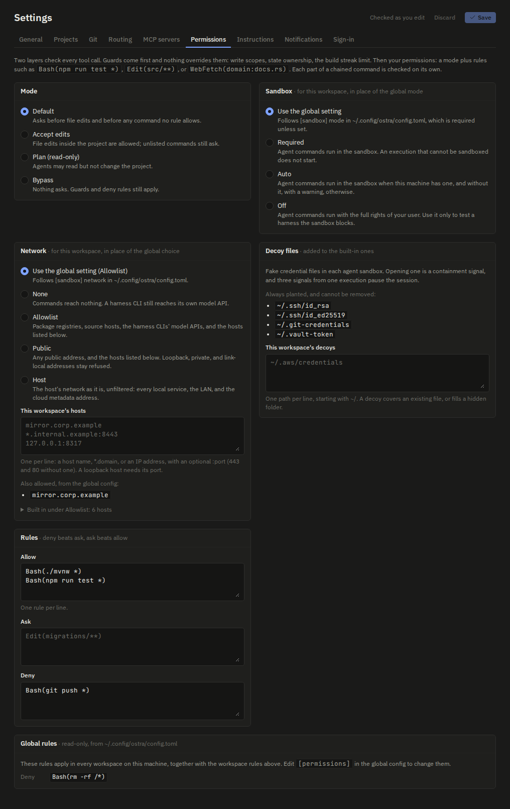
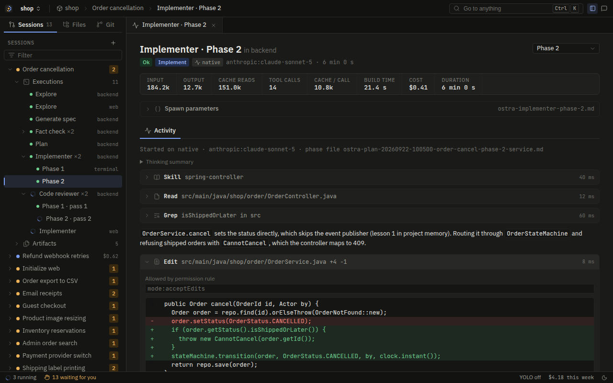
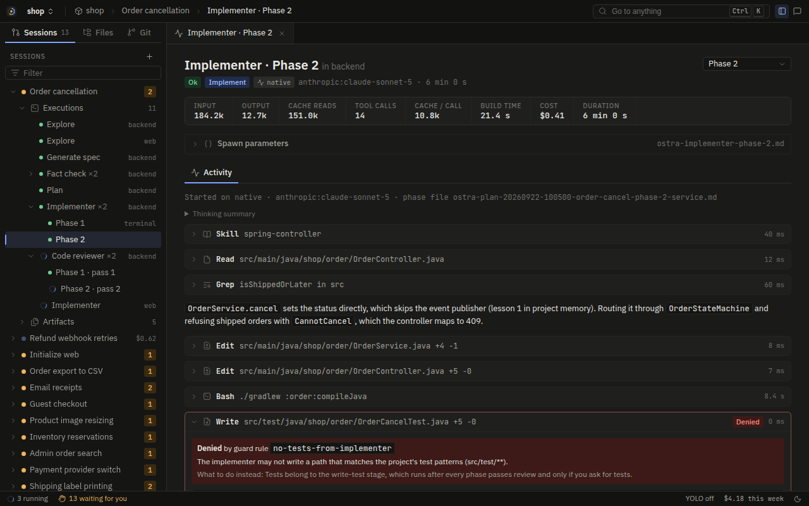
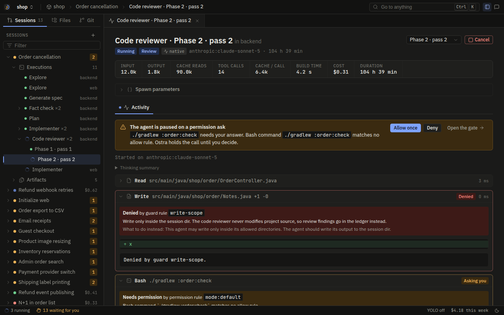
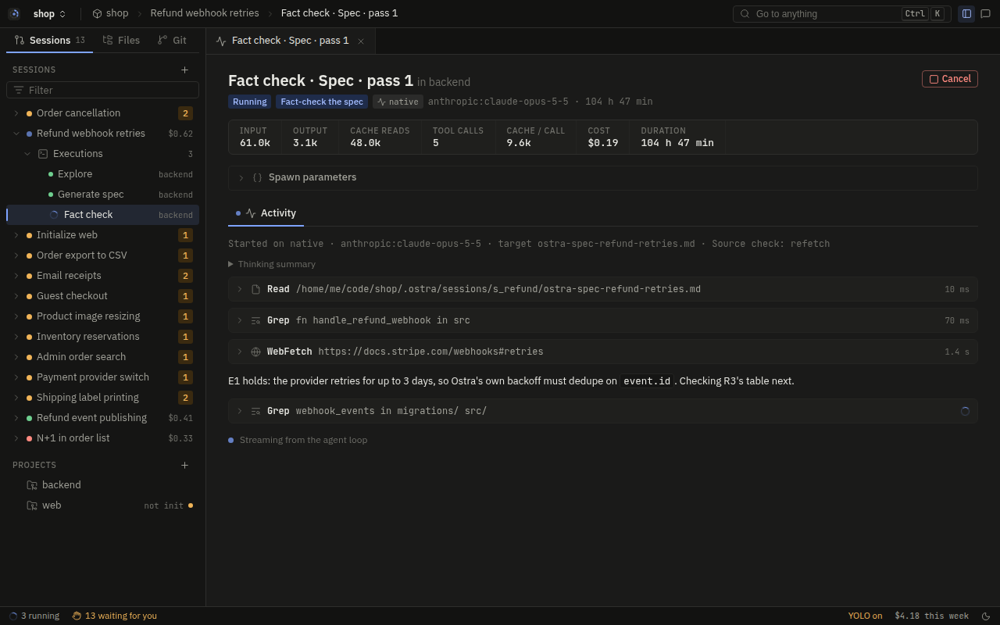
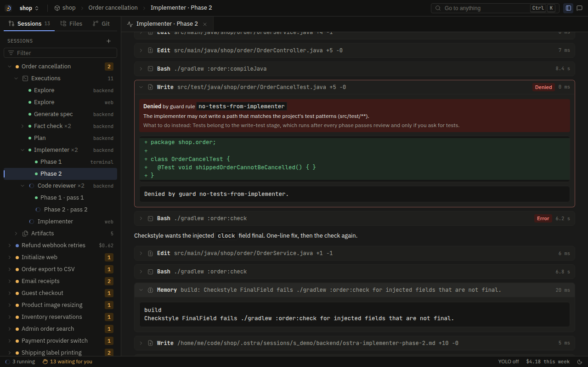

# Tools

A tool is the only way an agent touches anything: a file, the shell, the web, the project's memory, or the
engine. This page describes every tool Ostra gives an agent, what each one does, and how an agent ends up with
the tools it has.

Two ideas shape all of it:

- **The names are Claude Code's.** Ostra's native tools are called `Read`, `Write`, `Edit`, `Bash`, `Grep`,
  `Glob`, `Skill`, `WebSearch`, and `WebFetch`, with the same input fields as Claude Code's tools of those
  names. The agent prompts were written and tuned against those tools, so reusing their shape keeps the prompts
  working on both executors. The policy also judges every call in that shape, whichever executor made it.
- **Tools do the work and the policy decides.** Nothing in `ostra-tools` checks permissions or guards. The
  executor runs `ExecutionPolicy::check` before a tool runs (see [Executors](executors.md)), and a tool is only
  ever called with a call the policy already allowed. That keeps each tool small and puts every rule in one
  place, [Agent containment](../security/agent-containment.md).

## How an agent gets its tools

Agents do not ask for tools by name. Each agent's `agent.toml` lists **capabilities**, and each executor maps a
capability to its own tool:

```toml
# assets/agents/implementer/agent.toml
capabilities = ["read", "edit", "write", "shell", "search_text", "glob", "skill",
                "memory_recall", "memory", "report", "code"]
```

| Capability | Native tool | Claude Code | Codex | Grok Build | Antigravity |
| --- | --- | --- | --- | --- | --- |
| `read` | `Read` | `Read` | `exec_command` | `read_file` | `view_file` |
| `write` | `Write` | `Write` | `apply_patch` | `search_replace` | `write_to_file` |
| `edit` | `Edit` | `Edit` | `apply_patch` | `search_replace` | `replace_file_content` |
| `shell` | `Bash` | `Bash` | `exec_command` | `run_terminal_command` | `run_command` |
| `search_text` | `Grep` | `Grep` | `exec_command` | `grep` | `grep_search` |
| `glob` | `Glob` | `Glob` | `exec_command` | `list_dir` | `find_by_name` |
| `skill` | `Skill` | `Read` on the SKILL.md | `exec_command` on it | `read_file` on it | `view_file` on it |
| `web_search` | `WebSearch` | `WebSearch` | `web_search` | `web_search` | `search_web` |
| `web_fetch` | `WebFetch` | `WebFetch` | `web_search` | `web_fetch` | `read_url_content` |
| `report` | `Report` | `mcp__ostra__report` | `report` | `report` | `report` |
| `document` | `Document` | `mcp__ostra__document` | `document` | `document` | `document` |
| `memory` | `Memory` | `mcp__ostra__memory` | `memory` | `memory` | `memory` |
| `memory_recall` | `MemoryRecall` | `mcp__ostra__memory_recall` | `memory_recall` | `memory_recall` | `memory_recall` |
| `code` | `CodeOutline`, `CodeFind`, ... | `mcp__ostra__code_*` | `code_*` | `code_*` | `code_*` |

The table is `assets/tool-mapping.toml`. The prompt renderer reads it and writes each agent's prompt with the
tool names of the executor it runs on, so an implementer on Codex is told to edit with `apply_patch` and an
implementer on the native loop is told to use `Edit`. For the capabilities a CLI serves differently, the
renderer adds a short instruction, for example how to load a skill in a CLI that has no skill tool.

Two consequences follow from the table:

- **On a harness, the file and shell tools are the CLI's own.** Ostra does not replace Claude Code's `Read` or
  Codex's `apply_patch`. It checks each call through the hook bridge and lets the CLI run it. The adapters turn
  each CLI's call back into the canonical shape before the policy sees it, so `apply_patch` is judged as writes
  to the files the patch touches.
- **Ostra's own tools come from Ostra everywhere.** `Report`, `Document`, `Memory`, `MemoryRecall`, the code
  navigation tools, the submit tool, and the workspace MCP tools are Ostra's code on every executor. The native
  loop calls them directly. A harness reaches them through the `ostra` MCP server.

Capabilities are the upper bound. A reviewer has no `write` capability, so it has no `Write` tool at all, on any
executor. The policy then narrows further what the tools an agent has may touch.

### Who gets what

| Agent | Capabilities |
| --- | --- |
| explore | read, shell, search_text, glob, web_search, web_fetch, memory_recall, memory, document, code |
| generate-spec | read, shell, search_text, glob, web_search, web_fetch, document, code |
| fact-check | read, write, shell, search_text, glob, web_search, web_fetch, code |
| plan | read, shell, search_text, glob, document, code |
| implementer | read, edit, write, shell, search_text, glob, skill, memory_recall, memory, report, code |
| write-test | read, edit, write, shell, search_text, glob, skill, memory_recall, memory, report, code |
| code-reviewer | read, shell, search_text, glob, code |
| execution-path-analyzer | read, shell, write, search_text, glob, report, code |
| module-documentation | read, edit, write, shell, search_text, glob, report, code |
| prompt-generation | read, edit, write, shell, search_text, glob, skill, report, code |
| initializer | read, write, edit, shell, search_text, glob, code |
| quick-answer | read, search_text, glob, web_search, web_fetch, memory_recall, code |

Every agent also gets its own `submit_<agent>` tool and the workspace's MCP tools. [Agents](agents.md) covers
what each agent is for.

## How the policy sees each tool

The permission layer sorts tools into families, and the family decides which rules apply to a call:

| Family | Tools | How a call is judged |
| --- | --- | --- |
| Read | `Read`, `Grep`, `Glob` | Allowed unless a `deny` or `ask` rule names the path. `Read(~/.ssh/**)` style rules apply. |
| Edit | `Write`, `Edit`, and harness equivalents (`MultiEdit`, `NotebookEdit`, `ApplyPatch`) | Each target path is judged. The session dir and the OS temp dir are allowed. Other paths follow the rules, then the permission mode: `acceptEdits` allows edits inside the project. A path that runs code later is judged by the mode even inside the project. |
| Bash | `Bash` | The command is parsed with tree-sitter-bash and each simple command is matched separately, so `npm test && curl evil` does not pass on `Bash(npm test *)`. A command Ostra cannot parse, or one that uses shell syntax it does not model, asks, and plan mode refuses it. |
| Other (opaque shells) | `PowerShell`, `Cmd` (Windows only) | Not parsed. Refused when the text names Ostra's own files, engine state, or a credential store; otherwise matched against `PowerShell(...)` and `Cmd(...)` rules, then the mode, which never allows one unasked. |
| WebFetch | `WebFetch` | Matched against `WebFetch(domain:...)` rules. With no rule, it asks, except in bypass mode. |
| Other | `Skill`, `WebSearch`, `Report`, `Document`, `Memory`, `MemoryRecall`, the code tools, `submit_*`, workspace MCP tools | Ostra's own tools are allowed. `Skill` with a `path` is judged as a Read of that file. Workspace MCP tools are allowed unless a rule says otherwise, and plan mode allows only those their server marks read-only (rule M1). |

The guards (write scope, state ownership, the report path, the lesson gate, the build streak, self-protection)
run before this, on every family. They are on [Agent containment](../security/agent-containment.md).

The Permissions tab of Settings sets the mode, the sandbox (its mode, network choice, allowed hosts, and decoy
files), and the allow, ask, and deny rules, and shows the global rules read-only:



## One call, start to finish

Before the policy sees a call, `ToolEnv::canonical_call` rewrites it into the form the tool will run:

- A relative `file_path` or `path` becomes absolute against the shell's current directory.
- `Bash` gets a `cwd` field set to that directory, replacing any `cwd` the model sent.
- A `WebFetch` URL is replaced with its parsed form.

The policy checks that rewritten call, and the tool runs that same call. Without this step a relative path could
be checked against one directory and written in another after a `cd`, or a URL such as
`https://evil.example\@docs.rs/x` could look like `docs.rs` to a rule and reach `evil.example`.

`execute` then coerces any field the model sent as a JSON string back into the type its schema says, runs the
tool, and times it. Every tool except `Bash` stops at once on cancel. `Bash` handles cancel itself, because it has
a process group to kill.

Expanding a call in the Activity tab shows the policy decision and the change. This Edit was allowed by the
`acceptEdits` permission mode:



## File tools

### Read

Reads a file and returns it numbered like `cat -n`.

| Input | Meaning |
| --- | --- |
| `file_path` | The file. Relative paths resolve against the shell's directory. |
| `offset`, `limit` | The 1-based first line and the number of lines. The default is the first 2000 lines. |

Lines over 2000 characters are cut. Files over 50 MB are refused with a pointer to `head`, `tail`, or `sed -n`.
A binary file returns its size instead of its bytes. A directory is an error that points to `Glob`.

Each successful Read marks the file as read in this execution. That mark is what `Write` and `Edit` check.

### Write

Writes a whole file. Inputs: `file_path`, `content`.

If the file already exists, it must have been read in this execution, or the call fails with "Read it first,
then write it, so you do not overwrite content you have not seen." Parent directories are created. The result
carries a unified diff for the Activity view (capped at 50,000 bytes), so you see what changed without opening
the file.

A Write the policy refused shows the guard rule and what to do instead:



### Edit

Replaces an exact string. Inputs: `file_path`, `old_string`, `new_string`, and `replace_all`.

- The file must have been read in this execution.
- `old_string` must match exactly once. Zero matches fail with advice to re-read the file. Several matches fail
  with the count and advice to add surrounding lines, or to set `replace_all`.
- An empty `old_string` on a file that does not exist creates it.
- `old_string` equal to `new_string` fails, because nothing would change.

The result shows the lines around the change. Requiring an exact, unique match is what makes an edit safe to
apply without a human reading it: the model cannot change a place it did not name.

## Bash

Runs a command in `bash` and returns stdout and stderr together. On Windows that is Git for Windows'
`bin\bash.exe`, found by absolute path (`shells::bash` in [`shells.rs`](../../crates/ostra-core/src/shells.rs)),
never the first `bash` on `PATH`, which is often `C:\Windows\System32\bash.exe`, the WSL launcher, running the
command in a Linux VM with another view of the files. Without Git for Windows the tool fails with a message that
says to install it, and the setup screen shows the same check ("Shell for the Bash tool").

| Input | Meaning |
| --- | --- |
| `command` | The command line. |
| `timeout` | Milliseconds. The default is 120,000 (2 minutes), the maximum 600,000 (10 minutes). |
| `description` | A short label for the Activity view. |

**The working directory persists.** The shell starts at the project root. The command runs through `eval` in a
wrapper script whose exit trap writes the final directory to a file, so a `cd` carries into the next call. Each
call is still a new process: shell variables do not carry over. Under Git Bash the trap writes `pwd -W`, the
Windows form of the directory (`C:/Users/me/repo` rather than `/c/Users/me/repo`), because the other tools resolve
paths against it.

**Output streams and is bounded.** Output reaches the Activity view as the command prints it. In memory, Ostra
keeps the head and tail of very long output, and the model gets at most 30,000 characters, keeping the start and
the end, because a build error is usually at one end or the other.

**Nothing survives the call.** The command runs in its own process group. When it returns, times out, or is
cancelled, the whole group is killed. A server or a watcher started with `&` is stopped when the command
returns, which is why the prompt tells agents not to start one. On Windows the shell starts suspended, joins a
Job Object that kills its processes when its handle closes, and only then runs, so its first child is already in
the job ([`proctree.rs`](../../crates/ostra-core/src/proctree.rs)). The job is closed when the call ends.

**The environment is scrubbed.** Every credential variable that Ostra's config names, every workspace MCP secret,
and every `OSTRA_*` variable is removed before the command starts. `GIT_PAGER` and `PAGER` are set to `cat`,
because a pager would wait for input that never comes. `GIT_EXTERNAL_DIFF` is removed. Stdin is closed.
[Secrets and data](../security/secrets-and-data.md) explains which variables count as credentials.

**It may run in a sandbox.** With the sandbox on, the command runs under bubblewrap on Linux or Seatbelt on
macOS, with the execution's own scratch dir as `/tmp`. The other file tools map `/tmp` the same way, so a path the
shell printed means the same file to `Read`. [OS compatibility](../platforms/os-compatibility.md) covers which
backend each platform uses.

Commands that match the project's configured build and test commands also add their wall time to the
execution's `build_ms`, and their failures count toward the build-streak guard.

A Bash command that no rule allows waits for the user. The same run shows a Write refused by the `write-scope`
guard:



## PowerShell and Cmd

On Windows, the `shell` capability also gives an agent a `PowerShell` tool (Windows PowerShell 5.1,
`powershell.exe` under the system dir) and a `Cmd` tool (`cmd.exe` under the system dir). Linux and macOS builds
do not have them. They take the same inputs as Bash (`command`, `timeout`, `description`) and share its limits: the
same timeouts, the same 30,000-character output bound, and the same scrubbed environment
([`winshell.rs`](../../crates/ostra-tools/src/winshell.rs)).

- **The working directory persists.** PowerShell runs `Set-Location` first and writes `(Get-Location).Path` in a
  `finally` block; cmd runs `cd /d` first and `cd > <file>` last, which leaves the command's `ERRORLEVEL` as the
  exit code.
- **cmd's line is passed raw.** Rust quotes an inner `"` as `\"`, which cmd does not read, so the whole
  `/d /s /c "..."` line reaches cmd unescaped. The command is not wrapped in parentheses, because a `)` in it would
  end the group.
- **Nothing survives the call.** Both start suspended in a Job Object, as Bash does on Windows.
- **Your execution policy applies.** PowerShell runs with `-NoProfile -NonInteractive` and no
  `-ExecutionPolicy` override, so running a `.ps1` script follows the policy set on the machine or by your
  organization. An override was also what made Kaspersky's behavior monitor flag the build as a trojan.

Ostra cannot parse either shell, so the policy never allows one unasked and refuses a command whose text names its
own files or a credential store ([PowerShell and Cmd](../security/agent-containment.md#powershell-and-cmd)). Their
descriptions tell agents to prefer Bash for that reason.

## Search tools

Both use the ripgrep crates (`grep-searcher`, `grep-regex`, `ignore`, `globset`), so they behave like `rg` without
needing it installed.

### Grep

| Input | Meaning |
| --- | --- |
| `pattern` | A Rust regex. |
| `path` | A file or directory. The default is the shell's directory. |
| `glob`, `type` | File filters: `*.ts`, `**/*.{ts,tsx}`, or a type such as `rust` or `py`. |
| `output_mode` | `files_with_matches` (default, newest first), `content`, or `count`. |
| `-i`, `-n`, `-A`, `-B`, `-C` | Case, line numbers, context. |
| `multiline` | Lets `.` match newlines and a pattern span lines. |
| `head_limit` | Caps the lines or files returned. |

Output is capped at 30,000 characters.

### Glob

Finds files by name pattern, such as `src/**/*.ts`. Inputs: `pattern`, `path`. Returns at most 100 paths, newest
first.

Both tools respect `.gitignore` and search hidden files, so `.ostra/` and `.agents/` are visible. Both skip
credential stores and Ostra's own data dir (except its agent assets) even when a search starts from a parent
folder, so a `Grep` from your home folder does not read `~/.ssh`.

## Web tools

### WebSearch

`WebSearch` has no local implementation. When an agent has the `web_search` capability and the provider offers a
server-side search tool (Anthropic and OpenAI both do), the native loop enables it on the request and the provider
runs the search. Each search shows as a status line in the Activity view. On a harness, the CLI's own search tool
is used.

### WebFetch

Fetches a URL and returns it as markdown. Inputs: `url`, and an optional `prompt` saying what to look for.

On Anthropic the provider's own fetch tool is used, and the local tool is not offered. On other providers Ostra
fetches the page itself:

- Only `http` and `https`.
- **Public addresses only.** The resolver refuses names that resolve to loopback, private, link-local, CGNAT,
  unique-local, multicast, or reserved ranges, and it checks the address it connects to, so a name cannot point
  the fetch at your machine or your network by changing its DNS answer between the check and the connect. A
  private IP literal is refused before any lookup. A host named exactly by a `WebFetch(domain:<host>)` allow
  rule is exempt, which is how you let an agent read an internal docs server.
- **Redirects stay on one host.** A redirect to another host is not followed. The model gets the new URL and has
  to fetch it with a new call, which the policy checks. The policy judged only the first URL, so following the
  redirect would skip that check.
- HTML becomes markdown, text types come back as they are, and binary content is refused. The body is capped at
  5 MB and the text at 100,000 characters.



## Skill

Loads a `SKILL.md` and returns its text with the instruction to follow it. Pass `name` or `path`.

With `name`, it looks in the project's `.agents/skills/<name>/SKILL.md`, then the older
`.ostra/skills/<name>/SKILL.md`, then the skills Ostra ships (such as `meta-author`). A name with `/` or `..` is
refused, because a name is not a path. With `path`, it reads that file, and the policy judges it as a `Read` of that
path. The skill file is marked read, so a later `Edit` of it passes the read-first check.

## Ostra's own tools

These have no counterpart in Claude Code. They are how an agent hands work to the engine and to later runs.

### Report

Writes the agent's report to its declared `Report file:` path. Input: `content`, plus an optional `reason`.

The agent never chooses the path. The engine names every report path when it builds the spawn, and later stages
read the report from there. An agent with no declared report file gets an error that says so.

The call is also where the lesson gate applies. If the agent went from a verified failure to a recovery and
recorded no lesson, the report is refused until it records one with `Memory`, or passes a `reason` that says why no
lesson applies. That is a guard, so it lives on the containment page.

### Document

Writes the typed document of explore (research), generate-spec (spec), or plan (plan). The schemas are the structs in
`crates/ostra-core/src/doc`. This tool is agent-specific: each of those three agents sees only its own document
schema.

| Input | Meaning |
| --- | --- |
| `path` | The document's `.md` path in the session dir: `ostra-research-*`, `ostra-spec-*`, or the master `ostra-plan-*`. |
| `document` | The whole document. It replaces what is stored. |
| `update` | A partial revision. Each top-level field it names replaces the stored one, except lists whose items carry an `id`, which merge by id. |
| `remove` | Ids to drop, and plan phases by number. |

The JSON is stored beside the path, and the markdown is rendered from it with the section names the downstream
prompts and the fact-check read. A plan also gets one `-phase-{N}.md` file per phase. Ostra computes the parts code
can compute (the spec's delivery order, traceability tables, and counts; the plan's indexes and step counts), and the
model never writes them.

Every write runs the document checks and returns their results. Errors are things code can decide: a dangling
requirement or criterion id, an uncovered criterion, a cycle between phases, broken `AC{n}.{m}` numbering. Warnings
are judgment calls, such as more than one `SHALL` in a statement. The submit call is refused while an error remains,
so an agent cannot hand the next stage a broken spec.

These files can only be written through `Document`. A `Write`, `Edit`, or shell write to them is refused with the
correction to call `Document`, because the next render would overwrite the change and the browser would not show it.

### Memory and MemoryRecall

`Memory` records one durable lesson in the project's memory database: `area` (a module scope such as
`orders::Service`), `lesson` (one line), and an optional `source`, which defaults to the agent and execution id.
Recording the same area and lesson again updates it.

`MemoryRecall` returns recorded lessons, most relevant first. Inputs: `query`, an optional `area` that narrows to a
module and its sub-scopes, and `limit` (default 8, at most 50).

The database is engine-owned: agents reach it only through these two tools, and no file tool may write it. The build
streak also uses it: after the second failed build in a row, recalled lessons for that failure are appended to the
tool result without the agent asking. [Project memory](project-memory.md) covers how lessons are stored and ranked.

A Memory call expanded in the Activity tab, after a failed check and its fix:



### Code navigation

Eight tools answer questions from the project's code index instead of from file reads:

| Tool | Answers |
| --- | --- |
| `CodeOutline` | A file's imports (with the project file each resolves to) and definitions with line ranges. |
| `CodeFind` | Definitions by name: exact, then prefix, then substring, then initials (`pn` finds `parse_name`). |
| `CodeCallers` | Every use of a symbol, grouped by the enclosing function or type. |
| `CodeCallees` | What one function or type body uses. |
| `CodeImplementations` | What a type implements or extends, and what implements it. |
| `CodeNeighbors` | The files one file uses and the files that use it, with the linking names. |
| `CodeImpact` | What a change can break, hop by hop, for a symbol or a set of files. |
| `CodeMap` | Packages, their dependencies, the most depended-on files, and import cycles. |

They exist because an outline costs a fraction of a file read, and a caller list from the index drops the mentions a
text search cannot tell apart from another definition with the same name. On a harness they are `code_outline`,
`code_find`, and so on, served by the `ostra` MCP server. [The code index](code-index.md) describes how the index is
built.

### The submit tool

Each agent has exactly one: `submit_<agent>`, whose schema is that agent's struct in `crates/ostra-core/src/submit.rs`.
It is the last call of every run, and the engine reads only its payload. It is described with the executors, because
it ends the run rather than doing work: [The submit call](executors.md#the-submit-call).

## Workspace MCP tools

The MCP servers listed in a workspace's `mcp_servers` reach every agent on every executor, because Ostra is the only MCP
client. A tool keeps the canonical name `mcp__<server>__<tool>` in the native loop, in the Activity view, and in
permission rules. A harness sees it as `mcp__ostra__<server>__<tool>`, through Ostra's own MCP server.

The tool list is fixed when an execution opens. A server that cannot be reached adds one Activity line, and the run
continues without it. Results are text: images and binary resources become a one-line note, structured content
becomes JSON, and results are cut at 100 KiB. [MCP servers](mcp.md) covers transports, sign-in, and naming.

## Where to look in the code

| Concern | File |
| --- | --- |
| Dispatch, canonical calls, per-execution state | `crates/ostra-tools/src/lib.rs` |
| Tool descriptions and input schemas | `crates/ostra-tools/src/defs.rs` |
| Read, Write, Edit | `crates/ostra-tools/src/fs.rs` |
| Bash | `crates/ostra-tools/src/bash.rs` |
| Grep, Glob | `crates/ostra-tools/src/search.rs` |
| WebFetch | `crates/ostra-tools/src/web.rs` |
| Skill, Report, Memory, MemoryRecall | `crates/ostra-tools/src/misc.rs` |
| Document | `crates/ostra-tools/src/doc.rs` |
| Capability to tool name per executor | `assets/tool-mapping.toml` |
| Tool families for permissions | `crates/ostra-policy/src/perms.rs` |

Next: [The code index](code-index.md) explains what the code navigation tools read from.
