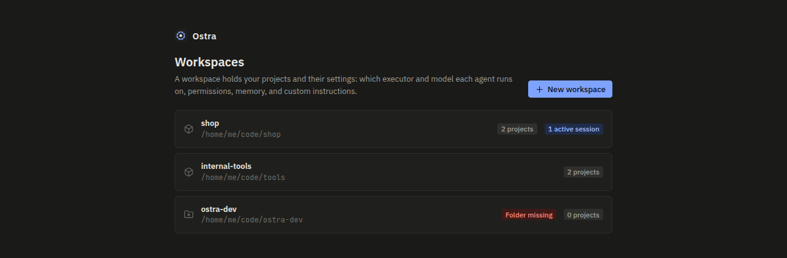
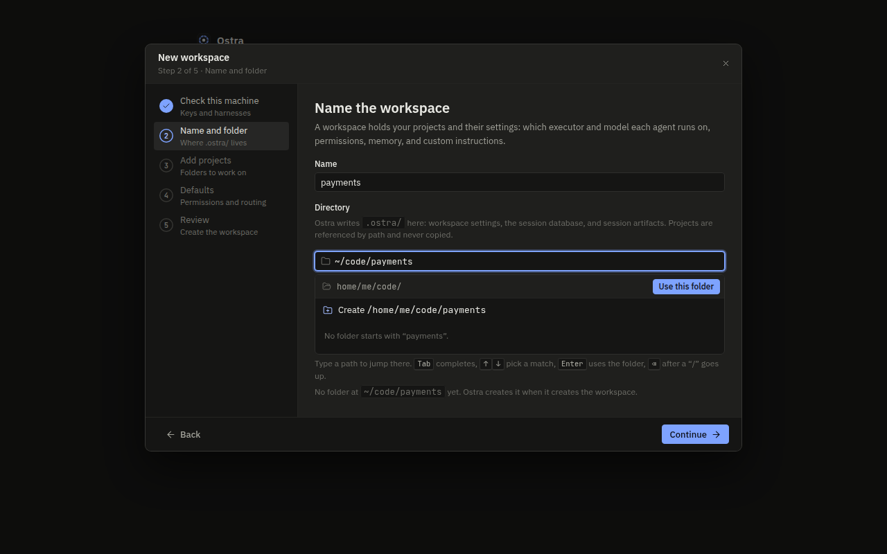
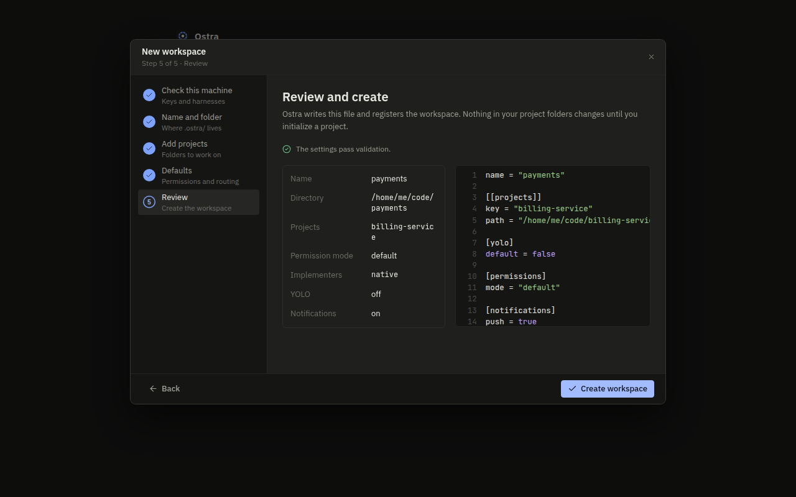
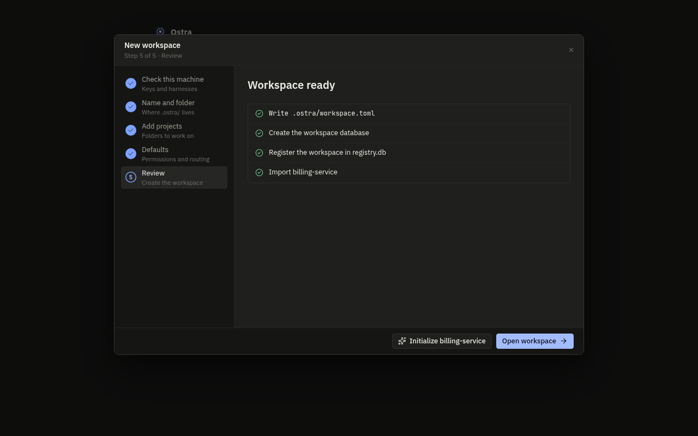
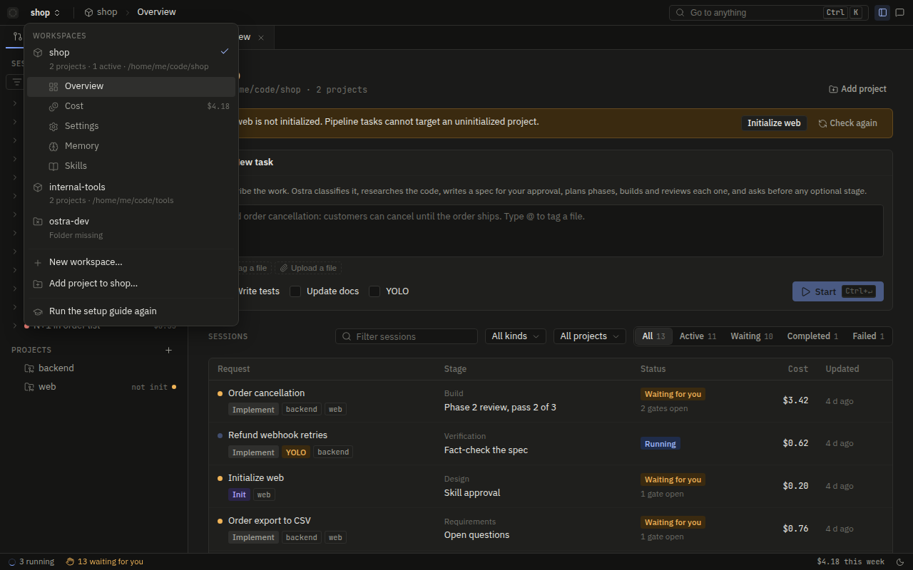
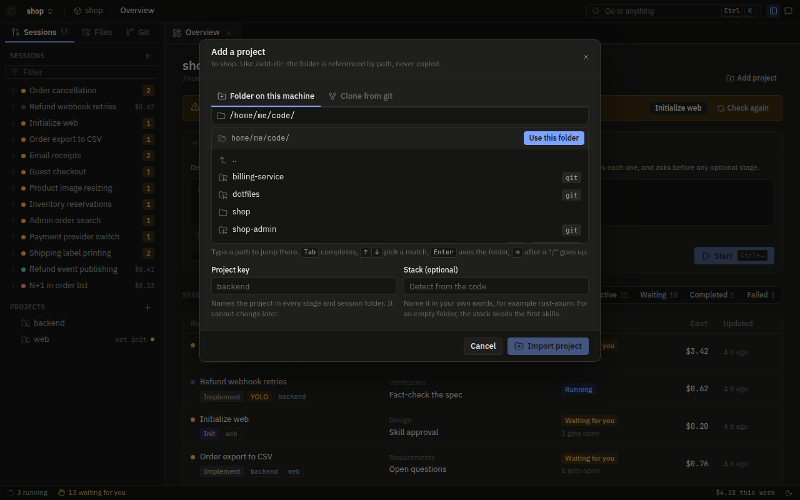
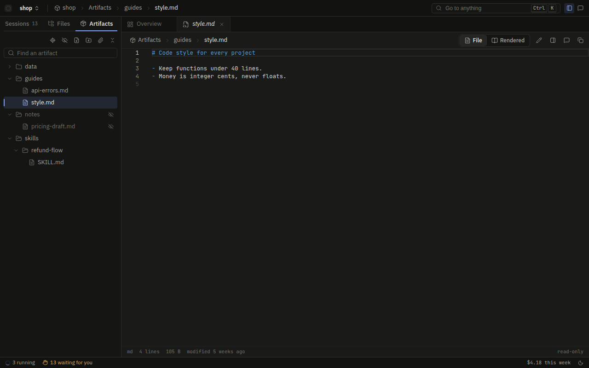
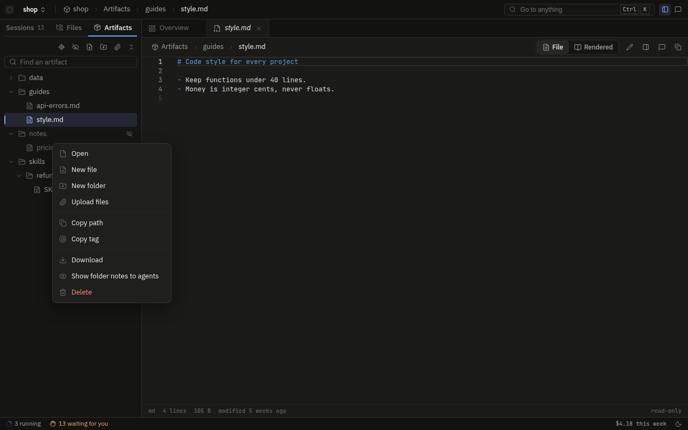
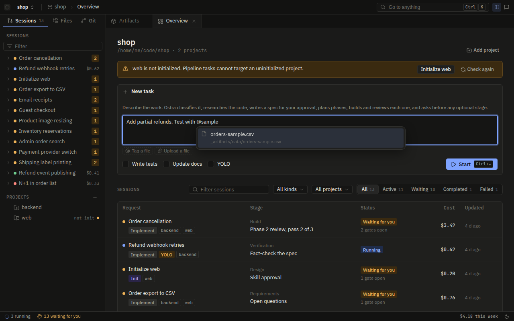

# Workspaces

A workspace is the unit that you create in Ostra. It is a folder that holds `.ostra/workspace.toml`, the
workspace database, and the files of each session that runs in it. It lists its projects by absolute path, and
it never copies them. All other work in Ostra occurs in one workspace:

- A session belongs to one workspace.
- An execution runs with the settings and limits of its workspace.
- The console shows one workspace at a time.

This page tells what a workspace is on disk and in the running server. It tells how you create, open, change,
and delete a workspace, and how Ostra keeps workspaces separate. The features in a workspace have their own
pages:

- [The pipeline](pipeline.md) for sessions.
- [Settings and routing](settings-and-routing.md) for the configuration in `workspace.toml`.
- [Project memory](project-memory.md).
- [The code index](code-index.md).
- [MCP servers](mcp.md).

## What a workspace is

A workspace has three parts, and each part has a different owner.

| Part | Where | What it holds |
| --- | --- | --- |
| The folder | `<workspace>/.ostra/` | `workspace.toml` (settings), `workspace.db` (the event log and the tables that Ostra builds from it), `sessions/` (the spec, plan, reports, and uploads of each session), `uploads/` (files that wait for a session), `artifacts/` (the workspace artifacts that all agents read) |
| The registry row | `registry.db` in the data dir | The id, name, root folder, and creation time of the workspace |
| The registry records | `registry.db`, keyed by the root folder | The permission mode, the YOLO default, the spend limits, the sandbox mode, command approvals, and sealed MCP header and env values |

The folder does not need to hold code. In a usual layout, the workspace is next to its projects:

```
/home/me/code/shop/             the workspace
  .ostra/workspace.toml
  .ostra/workspace.db
  .ostra/sessions/
/home/me/code/shop-backend/     a project, referenced by path
/home/me/code/shop-web/         another project
```

The registry makes a folder a workspace. If a folder has a `workspace.toml` but no registry row, Ostra does
not open it. The console lists the registry rows. The folder and the registry are separate for a reason. Each
person or process that can write to the folder can change it, for example a `git pull`, a teammate, or an agent.
These writers cannot change the registry. Thus the settings that can increase your budget or decrease your
sandbox protection are in the registry, not in the folder. Rules A1 and A2 enforce this. For the explanation,
see [Why some settings stay out of the folder](settings-and-routing.md#why-some-settings-stay-out-of-the-folder).

A workspace id is `ws_` followed by a UUIDv7 (`crates/ostra-core/src/ids.rs`). Thus a sort of the ids also
sorts the workspaces by creation time. Ostra writes the id into the `meta` table of the database each time
that it opens the workspace.

The first time that Ostra opens `workspace.db`, it writes `.ostra/.gitignore` if this file does not exist.
The file lists `workspace.db*`, `sessions/`, and `uploads/`. The event log keeps all tool output. Thus, if
the workspace is also a repository, a `git add -A` must not publish the log. The file does not list
`workspace.toml`, so a team can commit it.

### Workspaces and projects

A project is a folder that the workspace imports under a project key. A project key is a lowercase slug, for
example `backend`. The workspace records only the key and the absolute path in `[[projects]]`. The facts
about the project itself are in the `.ostra/` folder of the project. These facts are its inventory, its
commands, its skills, and its lessons. Thus two workspaces that import the same folder share these facts.

One task can include many projects. For this reason, the session state is in the workspace and not in one
project. Reports for one project go to `sessions/<session-id>/<project-key>/`. Artifacts for more than one
project, for example the spec and the plan, go to `sessions/<session-id>/`.

## Creating a workspace



`/` lists the registered workspaces. If a machine has no workspace and did not complete setup, `/` opens the
setup guide. On other machines, **New workspace** opens the same steps in a dialog, without the welcome page.
The steps are:

1. The machine check (provider keys and harness CLIs).
2. The name and folder.
3. The projects.
4. The defaults.
5. The review.



You can select a folder that does not exist. Ostra creates the folder when it creates the workspace. Until you
type a name, the name follows the folder that you select.

On Windows, the picker accepts `C:\...` and `C:/...` paths, and also `~\` and `~/`. Windows has no single
root. Thus `/` lists the drives, and `C:` opens the root of that drive. If you go up from a drive root, the
picker shows the drive list again. The picker does not show folders that Windows marks as hidden or system,
for example `$Recycle.Bin`. It also does not show dot folders
([`browse.rs`](../../crates/ostra-server/src/files/browse.rs)).



When you get to the review step, the dialog sends the full request to `POST /api/workspaces/validate`.
**Create workspace** sends it to `POST /api/workspaces`. Both endpoints run the same function, `create::draft`
in `crates/ostra-workspace/src/create.rs`. This function builds the full `WorkspaceSettings` from the request
and checks it as one unit. It writes nothing. It refuses these problems:

- An empty or relative folder, a path that is a file, and a folder that is already a registered workspace.
- An empty name.
- A project folder that does not exist. A project folder that is already in the request or in the existing
  file of the folder. A project folder inside the `.ostra/` folder of the workspace.
- A permission mode or routing preset that it does not know.
- All the problems that `validate_workspace` refuses for a saved workspace: bad project keys, relative project
  paths, a route that does not resolve, a harness that is not installed, a provider with no key, and a
  permission rule that does not parse
  ([Validation at save time](settings-and-routing.md#validation-at-save-time)).

Each problem has the path of its request field. Thus the dialog can show the problem on the correct step. The
check covers the full request. Thus, if a route names a model that no provider serves, Ostra finds this
before any file exists, not during the first session.

If the request passes, `setup::create` does these steps in this order:

1. It creates the folder and resolves it to its canonical path. Thus a user cannot register one folder two
   times under two spellings.
2. It writes `.ostra/workspace.toml`. It removes the permission mode, YOLO, limits, and sandbox mode from the
   file and writes them to the registry (Rule A2). It moves literal MCP header and env values into the sealed
   registry and leaves a marker in the file. The preview in the dialog shows `[yolo]` and `permissions.mode`,
   but the file on disk does not have them.
3. It records the commands of the file as approved, because you wrote them yourself (Rule A1).
4. It adds the registry row with a new id.
5. It opens the workspace (next section) and marks the machine as onboarded.



A workspace with no projects is valid. Ostra clones the repositories that you asked for after the workspace
exists, because the clone endpoint belongs to a workspace. A project that you add is not initialized. The
dialog offers to start its init session. No pipeline task can target the project until init writes its
`.ostra/INVENTORY.md`.

### Registering a folder again

The folder can already hold a `workspace.toml`, for example because the registry is lost or a colleague gave
you the folder. In this case, the request starts from that file and not from the seeded defaults. Ostra keeps
the routing, instructions, projects, and MCP servers of the file. The name in the request replaces the name in
the file. Ostra adds the projects of the request after the projects of the file. Ostra does not trust three
things in the file:

- It resets the permission mode, YOLO, limits, and sandbox mode of the file to the defaults. Only the request
  sets them. Without this reset, a repository can register itself with the sandbox off.
- It does not approve any item in the file that starts a program. Thus the MCP servers, language servers, code
  providers, and allow rules of the file wait until you approve them in Settings.
- It reports a problem with one of the existing project entries against the folder, not against a request
  field.

## Opening a workspace

The server opens each registered workspace when it starts (`app::build` in `crates/ostra-server/src/app.rs`).
If the `workspace.toml` of a workspace is missing, the server skips the workspace and writes a warning to the
server log. If a workspace fails to open, the server logs an error. The server does not delete or unregister
these workspaces. The list shows both with **Folder missing** and zero projects, because Ostra did not open
them. You cannot select them. To open such a workspace again, restore the folder and restart the server.

To open a workspace, Ostra runs `WorkspaceRt::open` in `crates/ostra-workspace/src/runtime.rs` and then
`App::attach`. These do the steps that follow:

1. If the workspace was registered before command approvals existed, Ostra approves its current files one
   time. It also copies the mode, YOLO, limits, and sandbox mode of the workspace from the file into the
   registry.
2. It moves all literal MCP header and env values that are still in `workspace.toml` into the sealed registry.
3. It opens `workspace.db`, applies all schema migrations, and writes the workspace id into the database.
4. It starts an engine for the workspace.
5. It copies `[[projects]]` into the `projects` table of the database, with the init status of each project.
6. It runs recovery. Recovery marks the running executions as interrupted. The planner of each unfinished
   session starts again ([The event log](event-log.md)).
7. It sends the notices of the engine to the browser hub, tagged with the workspace id.

Only startup and creation open a workspace. No endpoint opens or closes a workspace when the server runs.

## The workspace in the running server

Each open workspace is a `WorkspaceRt`. A `WorkspaceRt` holds the workspace id, the root folder, the
`WorkspaceDb`, the `Engine`, and the list of clones and pulls in progress. The server keeps them in one map,
keyed by workspace id. `WorkspaceRt` is in the `ostra-workspace` crate. It gets access to the server only
through the `WorkspaceHost` trait. This trait gives these items:

- The registry.
- The global config.
- The machine facts that validation needs.
- The provider and harness status.
- The `Services` of the engine for the workspace.


In the console, all pages under `/w/<workspace-id>/` belong to one workspace. The overview shows these items:

- The root folder and the project count.
- A banner when the settings have validation problems. An agent whose route does not resolve cannot start.
- A banner for each project that is not initialized.
- The New task form.
- The sessions table.

The workspace menu in the title bar changes the workspace and opens the pages of the workspace:

- Overview.
- Cost.
- Settings.
- Memory.
- Skills.
- Documentation.
- Agents: all agents, with the own agents of the workspace. See [Agents](agents.md#the-agent-screen).
- Workflows: the Workflow builder. See [Workflows](workflows.md).



Ostra stores the console layout of each workspace in the `meta` table of the database. The layout is the open
tabs, the focused tab, the left dock tab, and the state (open or closed) of the sidebar and the
quick-question dock. The console uses `GET` and `PATCH /api/workspaces/<id>/ui` for this layout. The limit
is 64 KiB of JSON. Thus another browser opens the workspace with the layout that you left.

### Keyboard shortcuts

By default, the console uses the keys of VS Code:

- ⌘K opens the command palette.
- ⌘/ opens the quick-question dock.
- ⌘B shows or hides the sidebar.
- ⇧⌘E opens the Files tab.
- Ctrl+Tab and Ctrl+Shift+Tab go through the open tabs.

Outside macOS, Ctrl replaces ⌘. New task, Open settings, the theme toggle, and the keyboard lock have no
default key.

You can change each shortcut for each workspace on the **Shortcuts** tab of Settings. The palette also opens
this tab as **Keyboard shortcuts**. To record a shortcut, click **Set** or **Change** on a row and push the
keys. A shortcut is one combination of any modifiers and any key, for example Ctrl+Alt+P or F9. A shortcut can
also be two combinations, one after the other, for example Ctrl+K then S. The recorder takes the first
combination and waits 1.2 seconds for a second one. If the first key is Escape, the recorder stops.
**Remove** removes the key from an action. **Reset** sets the default key again. **Reset all** clears the
changes of the workspace.

The shortcuts are stored only in this browser. Each workspace has its own localStorage entry,
`ostra.shortcuts.<workspace id>`. The entry holds only the actions that the user changed. Thus other
workspaces and other browsers keep their own keys, and no shortcut data goes to the server. Changes apply
immediately in each tab of the browser that has the workspace open. The console reads the entry as untrusted
input. It drops each action or key that it does not recognize (`web/src/lib/shortcuts.ts`).

The console matches a key push by its character when the user does not hold Shift or Alt. Otherwise, it
matches the physical key, because Shift and Alt change the character. For example, Alt+K types ˚ on a Mac. In
a two-step shortcut, the second push must come within 1.5 seconds of the first. Settings does not accept a
collision without a warning. A combination can be in use by another action, or it can start the two-step
shortcut of another action. In these cases, Settings shows which action has the combination. It moves the
combination only after you click **Use it here**. A shortcut can have no Ctrl, Alt, or ⌘ and no function key,
for example a plain letter. Such a shortcut runs only outside text fields, editors, and terminals, because in
those places the key types text.

A browser keeps some combinations for itself, for example Ctrl+Tab, Ctrl+T, Ctrl+W, and Ctrl+N. The operating
system handles other combinations before the browser, for example Alt+Tab or ⌘Space. The page never gets these
combinations. The Shortcuts tab tells you this. It marks these combinations in the list, and it shows a
warning when you record one.

The Shortcuts tab also offers **Install Ostra as an app**. The console has a web app manifest
(`web/public/manifest.webmanifest`). Thus Chromium browsers can install the console into its own window. In
that window, the browser sends most of its own shortcuts to the page. If the browser offered an install dialog,
the button shows it. The console catches `beforeinstallprompt` at startup in `web/src/lib/install.ts`. If not,
the button tells how to install in that browser:

- Safari: Add to Dock or Add to Home Screen.
- Chromium: the install icon in the address bar.
- Firefox: Firefox installs no web apps.

Browsers install apps only from an HTTPS address or localhost. Thus, if you open the console over plain HTTP
on another address, the button tells you that.

In Chromium browsers, the palette offers **Lock keyboard shortcuts in fullscreen**. This command puts the page
in fullscreen and calls `navigator.keyboard.lock()`. This is the Keyboard Lock API that vscode.dev uses. The
command uses fullscreen because the browser applies the lock only in fullscreen. When the lock is on, key
pushes go to the console before the browser. The shortcuts of the console work, and Escape goes to the page.
Thus a harness terminal gets Escape.

The default Close tab shortcut is ⌘W (Ctrl+W). The console uses this shortcut only when the lock is on or Ostra
runs as an installed app. In other conditions, the browser tab keeps it. If you set Close tab to a different
key, that key always works. In a terminal, Ctrl+W stays with the shell, which deletes a word with it. The status
bar shows **Shortcuts locked** for all the time that the lock is on. Each of these actions releases the lock:

- Hold Escape.
- Leave fullscreen.
- Click the **Shortcuts locked** item.
- Run **Release keyboard shortcuts** from the palette.

The code is in `web/src/lib/keyboardLock.ts`. If a browser does not have the API, the palette does not show the
command.

Chrome on Android keeps Ctrl+Tab, Ctrl+Shift+Tab, Ctrl+W, and Ctrl+F4 for itself, also in an installed app.
This includes Samsung DeX with a physical keyboard. The page never gets these combinations. Thus, on Android,
the console makes these changes:

- It goes through the tabs with Ctrl+PageDown and Ctrl+PageUp.
- It gives Close tab no default key.
- The Shortcuts tab marks the four combinations as kept by the browser.

Android also changes an unhandled Escape into Back. Back closes an installed app that has no history. Thus, on
Android, the console marks each Escape as handled (`web/src/main.tsx`). The Escape handlers of the console
still run. The console finds Android from the user agent. Thus, if a browser requests desktop sites, the
console keeps the desktop defaults.

### On a phone

When the viewport is 720 pixels wide or less, the console replaces its tabbed layout with a mobile shell
(`web/src/mobile/`). The change occurs live. If you turn a tablet or make a window narrower, the layout
changes without a reload. The URLs do not change. `/w/<workspace>/s/<session>` opens the same session on the
two layouts. Thus a link from a push notification works on the phone that gets it.

The mobile shell has no tabs. It shows one screen at a time and keeps the stack in the history of the browser.
Thus the Back button in the header and the back gesture of the phone both go to the previous screen. The
header holds these items:

- Back. On the overview, the header shows the Ostra mark in its place.
- The title of the open screen, with a mono subtitle. The subtitle is the workspace root, the status of a
  session, or the path of a file.
- Three buttons: **Search**, **Ask a quick question**, and **Menu**. Each button opens a bottom sheet.

Search runs the same server search and ranking as the desktop command palette. The question sheet runs the
same read-only `quick-answer` agent as the desktop dock. It uses the artifacts of the open session as context.
The menu lists the workspaces, and the pages and actions of this workspace. New workspace, Add project, and the
setup guide open as pushed screens, not as dialogs.

The screens are made for touch, but they run the desktop code for each rule. The session board answers each
gate with the desktop gate cards. Thus an answer has the same structure on a phone. Settings uses the desktop
validation and save code (`useSettingsEditor`). The setup screens use the same wizard steps. A project screen
keeps its tab and open folder in the URL hash (`#files`, `#git`, `#dir=<folder>`). Thus Back goes out of one
folder at a time.

A file opens as its own screen. A skill that you open from Skills gets its own history entry in the same
way. Thus Back goes to the list.

When folder-file commands wait for approval, a warning line shows under the header, the same as the desktop
banner. The warning line opens Settings. The footer shows these items:

- The connection state.
- The number of running executions.
- The number of gates that wait. A tap on this number opens the oldest gate.
- The spend of today.

The mobile shell does not write the saved layout of the desktop. Thus, when you go back to a laptop, the tabs
that you left open are still there.

### Settings are read from disk each time

Ostra keeps no copy of the settings of a workspace in memory. It reads `workspace.toml` each time that it needs
the settings. Then it applies the registry overlay in one of two ways:

- `WorkspaceRt::settings()` gives the settings that the Settings screen edits. These are the file with the
  mode, YOLO, limits, and sandbox mode from the registry.
- `effective_settings()` and the `Services::workspace()` of the engine give the settings that programs run
  with. These are the same settings, with one difference. When the file waits for approval, they contain no
  MCP server, language server, code provider, or allow rule from the file. They also contain no project
  outside the workspace folder.

An edit can come from the Settings screen, a manual change, or a `git pull`. In each case, the edit applies to
the next execution without a restart. If Ostra cannot parse the file, both functions use seeded defaults named
`workspace` with no projects. The first function writes a warning to the server log each time that it reads
the broken file.

### Saving settings

`PATCH /api/workspaces/<id>` takes the full `WorkspaceSettings`. The server validates it. If it finds an
issue, it answers 422 with all the issues and writes nothing. If not, it does these steps:

1. It writes the file.
2. It updates the registry records.
3. It copies the project list into the database again.
4. It renames the registry row if the name changed.

`POST /api/workspaces/<id>/validate` runs the same checks and saves nothing. The Settings screen uses this
endpoint to check the settings when you edit them.

## Adding and removing projects



`POST /api/workspaces/<id>/projects` imports a folder. The key must be a project key that this workspace does
not use. The path must obey these rules:

- It must be absolute.
- It must exist.
- It must be a folder.
- It must not be already imported.
- It must not be in the `.ostra/` folder of the workspace.

Ostra stores the path in canonical form. Each refusal names its field (`key`, `path`, or `stack`).
`POST /api/workspaces/<id>/clone` clones a repository into `<workspace>/<key>` or into a selected empty
folder. Then it imports the folder in the same way (HANDOVER 6.4).

### Projects an agent creates

A session can also create a project, when a request needs a codebase that no project holds. The spec gives the
project a new key, and the plan puts phases in it. After the user approves the plan, the implementer of the
first phase of the project calls `ProjectCreate`. The call has a key, a stack, a purpose, and the base
requirements. The user approves that call from a permission card in all modes except YOLO (rules O1 and O2,
[Tools](tools.md#project-management-tools)).

The folder rules are the same as the rules for a clone, with one more rule. The folder is relative to the
workspace root, and it must stay inside the root after Ostra resolves symlinks. Thus the folder must obey
these rules:

- It must be new or empty.
- It must be outside `.ostra/`.
- It must not be inside another project, and it must not contain another project.

The key must also be free. The server creates the folder. It runs `git init` if the call does not disable it.
Then it imports the folder with its stack, the same as the Add project dialog.

Such a project starts uninitialized. Usually, pipeline sessions refuse uninitialized projects. The session
that created the project is the exception. The project joins the scope of that session. Ostra initializes the
project in that session before any other work runs in the project. Then the phase that created the project
starts again in it ([The pipeline](pipeline.md#a-new-codebase)). The initializer seeds the skills of the
project from the stack and the requirements in the call, because the folder has no code yet. After its init
completes, other sessions see the project as a usual project.

`DELETE /api/workspaces/<id>/projects/<key>` removes the project from `[[projects]]` and from the `projects`
table of the database. It deletes nothing on disk. The project folder, its `.ostra/` files, and the session
folders that mention it stay. Ostra refuses with a 409 when the project has live work, because the removal
leaves that work without its project. Live work is one of these items:

- A running, waiting, or paused session that can use the project. After the Classify judge sets the scope of a
  session, this means that its scope lists the project. Before that, the session can still select each project
  of its starting list. Thus each project in its starting list counts.
- A running execution in the project.
- A clone or pull on the project.
- A request that starts work in the workspace at that moment.

The message names the work that you must stop or wait for. The last case exists because the check and the
removal are two steps. Each workspace has a work lock. These requests hold the lock in shared mode when they
start work:

- Create a session.
- Initialize a project.
- Reopen a harness run.
- Ask a quick question.
- Claim a clone or pull.

A removal tries to get the lock in exclusive mode and does not wait. If it cannot get the lock, it refuses.
Thus no work starts between its check and its write. A session that starts after the removal reads the
settings again and never sees the project.

## Deleting a workspace

The General tab of Settings holds **Delete workspace**. For the tab, see
[Settings and routing](settings-and-routing.md#why-some-settings-stay-out-of-the-folder).
`DELETE /api/workspaces/<id>` first gets two locks in exclusive mode: the lock on the map of open workspaces
and the work lock of the workspace. Then it checks that the workspace is idle. It refuses with 409 in these
conditions:

- A session is running, waiting, or paused, because the deletion loses its state.
- An execution is still running.
- A clone or pull is in progress.
- A request starts work at that moment, because that request holds the work lock.

Before it releases the work lock, it marks the workspace as deleted. A request can find the workspace before
the removal and then wait for the work lock. That request then sees the mark and gets a 404. Thus it does not
start a session in a workspace that does not exist. Then the deletion does these steps:

1. It closes the workspace and removes its registry row, with the push subscriptions for this workspace.
2. It removes the registry records of the workspace: the approval of the commands in `workspace.toml`, the
   mode, YOLO, limits, sandbox mode, sealed MCP values, and MCP sign-ins. Thus, if you register the folder
   again, it starts with no records.
3. It removes its MCP connections and its entries in the Sessions tree and in search.
4. It deletes `workspace.toml`, `workspace.db`, and the `-wal` and `-shm` files of the database.

Project folders, the `.ostra/` files of each project, and the `.ostra/sessions/` folder of the workspace stay
on disk. The session folders keep the specs, plans, and reports. But without the database, the console does
not list those sessions.

## Workspace artifacts

Workspace artifacts are files that you keep for all sessions of a workspace, not for one task. Examples are a
custom skill, a design document, a guideline for all projects, or a sample data set that a test loads. They
are in the Artifacts tab of the left dock, next to Sessions, Files, and Git.

The tab is the file tree of the Files tab, set to the artifacts folder. Thus it has the same behavior:

- Folders open only when you expand them.
- "Find an artifact" searches all paths.
- You can drag a row into a task or addition as a tag. You can also drag it onto another folder to move it
  there. If you drop it onto empty space, it moves to the top.
- A click opens the artifact in the file editor, with its pencil, save, and conflict check.

Only the actions are different. The header and the right-click menu add Upload files, Download, Hide from
agents or Show to agents, and Delete. Files that you drag in from the computer upload into the folder where you
drop them.





This works because the Files endpoints use `_artifacts` as one more root. These operations on `_artifacts`
read the visible folder and then the hidden folder: a tree listing, a file read, a save, a new folder, and the
file index. Thus a hidden artifact still shows in the tree, with a crossed-out eye. It opens the same as other
files. The file editor refuses edits under `.ostra/`, because that folder is the state of Ostra. The artifacts
folder is the exception, because it belongs to the user. An artifact has no git history. Thus its diff and
"Changed by sessions" are empty.

### Where they are stored, and why hidden ones move

A visible artifact is a plain file in `<workspace>/.ostra/artifacts/`. The `.gitignore` of the folder does not
list it. Thus, if a team commits the workspace folder, the team shares its artifacts in the same way as
`workspace.toml`.

Hiding applies to a folder or a file as one unit (Rule W2). Ostra records each hidden unit in
`<data dir>/hidden-artifacts/<workspace id>.units.json`. A hidden unit is the folder or file that you hid. A
path is hidden when the path or a folder above it is a unit. Thus a hidden folder hides all its contents. This
includes files that you create, upload, or move into it later: the new file is hidden. You cannot show a file
in a hidden folder by itself. Its menu offers to show the folder. If you hide a file, Ostra hides only that
file, not the folder that holds it.

The units set where Ostra stores each file. Each file in a unit is under
`<data dir>/hidden-artifacts/<workspace id>/`, at the same relative path. All other files are in
`.ostra/artifacts/`. Each change keeps this true:

- Hide moves the files of the unit into the hidden folder.
- Show moves them back.
- A move or an upload puts each file in the correct location for its new path.

Agents already have no access to the data dir. The `secret-read` guard refuses each file tool and each
path-like word of a shell command that points into the data dir. The Bash sandbox mounts nothing there. Thus
no path gives access to a hidden artifact, for native and harness executors. This starts when the change
returns, and no reader must check a flag. The disadvantage is that hidden artifacts stay on this machine. They
do not go with the folder or with a `git push`.

That protection against shell commands needs the sandbox. The sandbox can be off, or set to `auto` on a
machine without a sandbox. In these cases, the file tools still refuse hidden artifacts. But a shell command
that reads the full disk, for example `find ~`, can read them. The Artifacts tab then shows a warning with a
link to the Sandbox setting. The setting lists all other functions that stop
([Agent containment](../security/agent-containment.md)).

### How agents find and read them

Agents read visible artifacts and never change them (Rule W1):

- **The brief lists them.** The first message of each execution names the folder after the instruction files of
  the project. It lists up to 40 artifacts with their sizes and then the count of the other artifacts. The
  agent finds the other artifacts with Glob. The agent reads the artifacts that apply to its task with Read,
  the same as a project file.
- **Custom skills load by name.** `skills/<name>/SKILL.md` answers `Skill(name)` after the
  `.agents/skills/` of the project. Thus you can keep one copy of a skill for all projects of the workspace.
  Harness CLIs load the skill by the path in the brief.
- **Harnesses can read the folder.** Claude Code and Antigravity get it with `--add-dir`. The Bash sandbox
  mounts it read-only for all executors.
- **Nothing writes there.** The `workspace-artifacts` guard refuses each write, move, or delete under the
  folder. This applies in all permission modes and in YOLO. A command that only reads an artifact is allowed,
  for example `python3 load.py .ostra/artifacts/data/orders.csv`.

### Tagging an artifact

Type `@` in a new task, an addition, or an instruction field. The list then shows visible artifacts next to
project files. You can also drag a row from the Artifacts tab onto the field. A selected artifact becomes the
tag `@_artifacts/<path>` (Rule W3). `_artifacts` cannot be the same as a project key, because a project key
starts with a letter or digit.

In a task or addition, the tag works the same as a tagged project file. The engine checks that the artifact
exists and is visible. The agents get its absolute path in the request. In an instruction, Ostra adds one line
for each tag under the instruction text, with the absolute path. A tag of a project file (`@web/docs/api.md`)
resolves in the same way.



The list never shows hidden artifacts. Ostra refuses a request that tags a hidden artifact. If an instruction
tags a hidden or missing artifact, the save of the settings fails with an issue on that field. Thus Ostra finds
an old tag at save time. The tag does not get to an agent as a path that does not exist. If a session tagged
an artifact before you hid it, the session still names the old path. That path no longer holds a file.

### Deleting and moving

You can delete or move an artifact only in these conditions (Rule W4):

- No session in the workspace is running, waiting, stalled, or paused.
- No execution is running.

The reason is that an agent can read the artifact at its current path, and both operations change that path.
Delete asks for confirmation first. If a session is still live, the server refuses the delete or the move. The
tab shows the reason under its header and names the session to stop. Both operations take the work lock of
the workspace. This is the same lock that the removal of a project takes. Thus no session can start between
the check and the change.

A folder moves with all its contents. Hidden artifacts in the folder stay hidden. A move does not change tags.
Thus an instruction that tagged the old path fails validation at the next save, and the issue names the tag to
fix. You can hide, edit, and upload at any time.

## How workspaces are kept apart

Each workspace has its own database, its own engine, and its own settings file. The engine holds the live
sessions, the running executions, and the execution slots of the workspace. It reads settings only from the
`workspace.toml` of its own workspace.

- **Parallel executions.** Each engine counts `limits.max_parallel_executions` separately, so the limit
  applies to one workspace. Two workspaces with the default of 3 can run 6 executions at the same time. Ostra
  reads the limit again each time that a spawn waits for a slot. Thus a lower limit applies to the spawns that
  already wait ([Spend and limits](spend-and-limits.md)).
- **Settings and approvals.** The registry records are keyed by the canonical root folder. Thus the approvals,
  mode, and sealed values of one workspace never apply to a different workspace.
- **Live updates.** Browser messages about a workspace go to the `workspace:<id>` channel. Session summaries
  also go to `home` for the workspace list ([The server](../architecture/server.md)).
- **Lookups by id.** A request can name a session, gate, execution, or decision without a workspace. Ostra
  then asks the database of each open workspace for it. Thus ids do not need a workspace prefix in URLs, for
  example `/s/<id>`.

The workspaces share the parts that apply to the full machine:

- The global config.
- The registry.
- The provider clients.
- The native executor.
- The harness runtime.
- The Web Push notifier.
- The MCP gateway, which keeps its connections separate by workspace root.

A project folder that two workspaces import is one folder. Both workspaces see the same inventory, skills, and
lessons. The write scope of the policy decides what an agent can change, not the workspace
([Agent containment](../security/agent-containment.md)).

`ostra stop <session-id>` runs when the server is down. It looks for the session in the database of each
registered workspace, because the command line does not know which workspace holds the session.

## Where to look in the code

| What | Where |
| --- | --- |
| Create request validation and registration | [`crates/ostra-workspace/src/create.rs`](../../crates/ostra-workspace/src/create.rs) |
| `WorkspaceRt`: open, settings, projects, busy check, `retire`, `unregister` | [`crates/ostra-workspace/src/runtime.rs`](../../crates/ostra-workspace/src/runtime.rs) |
| Import checks, the folder checks for a created project (`create_target`), and the git branch in the project list | [`crates/ostra-workspace/src/projects.rs`](../../crates/ostra-workspace/src/projects.rs) |
| What a workspace asks of the server | [`crates/ostra-workspace/src/host.rs`](../../crates/ostra-workspace/src/host.rs) |
| The stored console layout | [`crates/ostra-workspace/src/ui_state.rs`](../../crates/ostra-workspace/src/ui_state.rs) |
| Opening at startup, `attach`, `delete_workspace`, the `WorkspaceHost` implementation | [`crates/ostra-server/src/app.rs`](../../crates/ostra-server/src/app.rs) |
| Registry overlay, approvals, and the values that the file does not keep | [`crates/ostra-workspace/src/trust.rs`](../../crates/ostra-workspace/src/trust.rs) |
| The `workspaces` table | [`crates/ostra-store/src/registry/workspaces.rs`](../../crates/ostra-store/src/registry/workspaces.rs) |
| `workspace.db` and its `.gitignore` | [`crates/ostra-store/src/workspace/mod.rs`](../../crates/ostra-store/src/workspace/mod.rs) |
| All workspace paths | [`crates/ostra-core/src/paths.rs`](../../crates/ostra-core/src/paths.rs) |
| `WorkspaceSettings`, `seeded`, `validate_workspace` | [`crates/ostra-core/src/config.rs`](../../crates/ostra-core/src/config.rs) |
| Execution slots | `acquire_slot` in [`crates/ostra-engine/src/runner.rs`](../../crates/ostra-engine/src/runner.rs) |
| Workspace artifacts: paths, tags, listing | [`crates/ostra-core/src/artifacts.rs`](../../crates/ostra-core/src/artifacts.rs) |
| Workspace artifacts: upload, save, hide, delete | [`crates/ostra-server/src/artifacts.rs`](../../crates/ostra-server/src/artifacts.rs) |
| The design brief | [HANDOVER section 6](../../HANDOVER.md#6-workspaces-and-projects) |
