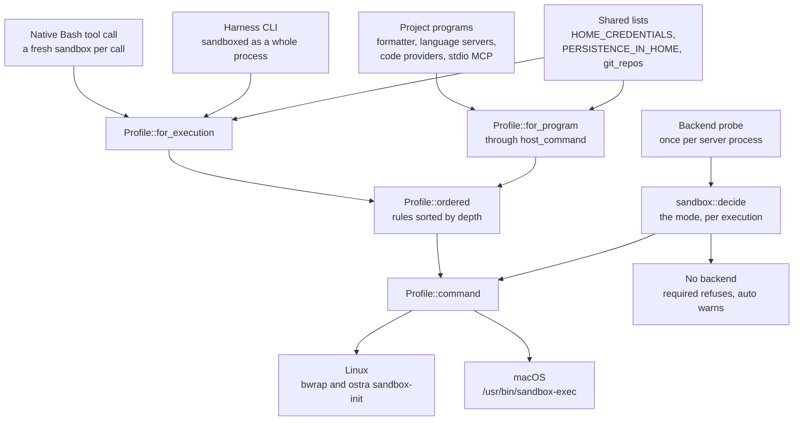
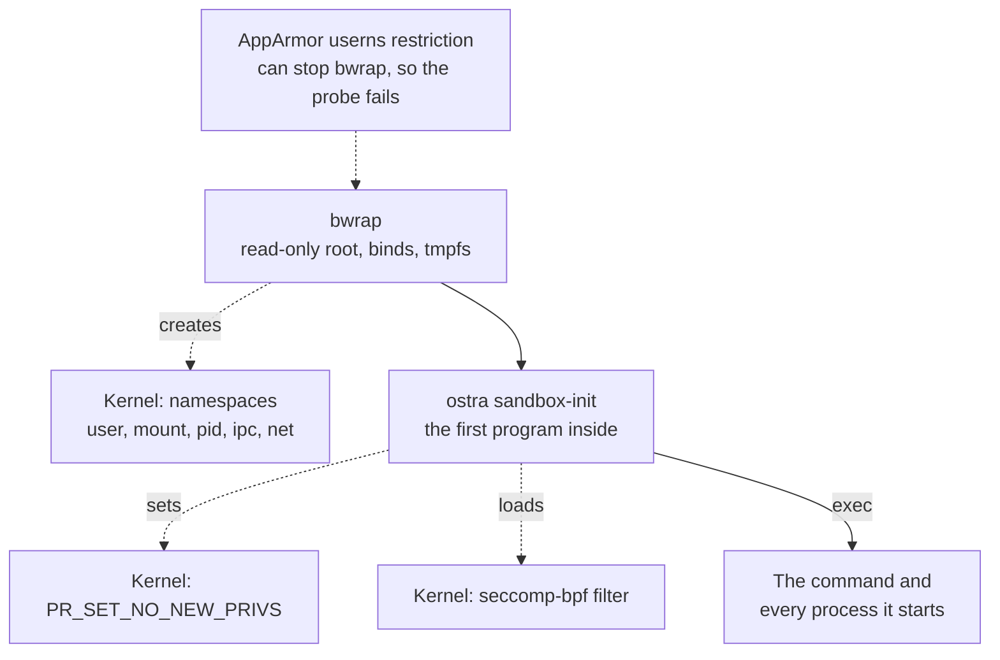
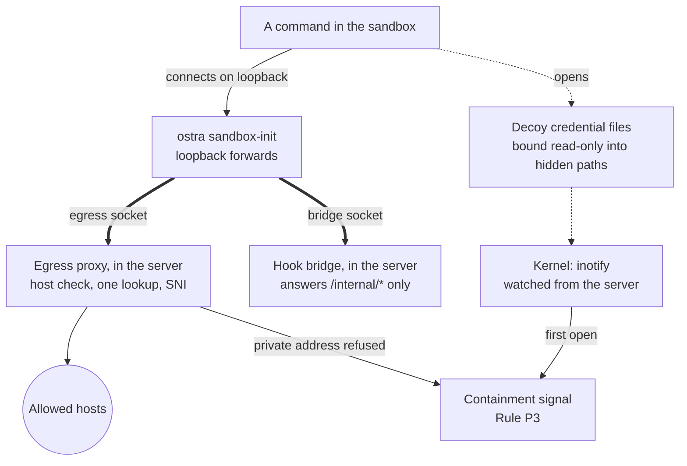
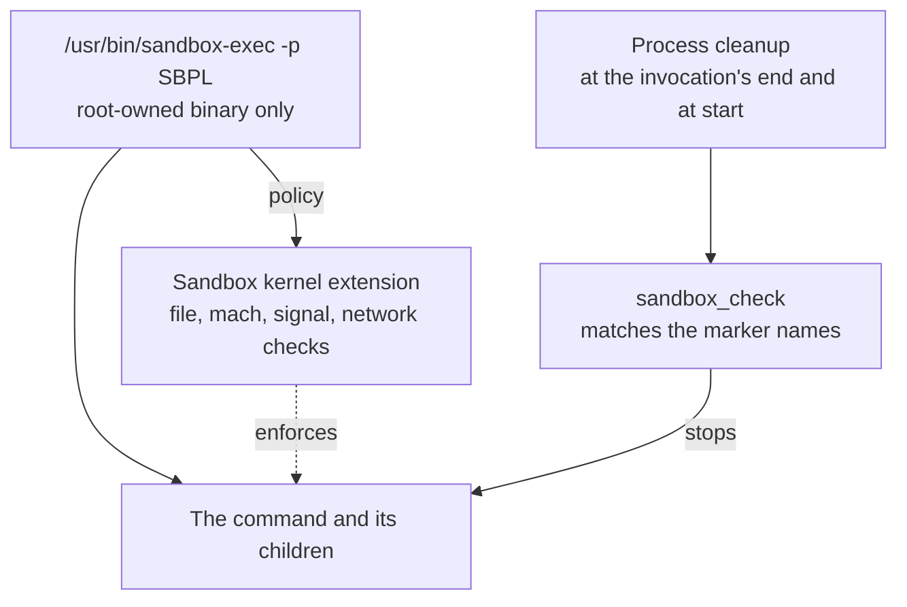

# Sandboxing

The sandbox makes it safe for agents to run real commands on your machine. These commands include builds, tests,
package installs, and complete harness CLIs such as Claude Code and Codex. Each of these processes starts inside
an OS sandbox (bubblewrap on Linux, Seatbelt on macOS). The kernel enforces the sandbox, not the agent or the CLI.
Thus the guarantees below apply, whatever a command does. Windows has no sandbox backend yet, so none of these
guarantees apply on Windows. [When there is no sandbox](#when-there-is-no-sandbox) tells what applies there.

The sandbox gives these guarantees:

- **Your secrets stay out of reach.** The sandbox hides SSH and GPG keys, cloud and registry credentials, browser
  profiles, the keychain, the sign-ins of other CLIs, and Ostra's own data dir. A command that walks the disk
  with `find ~` does not see them.
- **No program stays behind to run later.** Shell startup files, login and autostart entries, `.git/config`, and
  git hooks are read-only. Thus an agent cannot add a program that runs the next time you open a terminal or run
  git.
- **Writes stay in the workspace.** The repo, the session, a private `/tmp`, and the tool caches of the session
  are writable. The rest of the machine is read-only, and this includes your own `~/.cargo` and `~/.npm`.
- **Network access is limited to hosts you allow.** A sandboxed command reaches the outside only through its own
  proxy. The proxy lets through package registries, source hosts, model APIs, and the hosts you list. On Linux,
  the command has its own network, and local services, the LAN, and the cloud metadata address are out of reach.
  On macOS, the LAN and the metadata address are also out of reach. But the services on the Mac itself are open
  by default. You can block their ports, or you can use a setting that closes them.
- **Your session stays closed.** The sandbox hides or unsets the desktop bus, the SSH agent, the display, and the
  Docker and Podman sockets. A command cannot send a signal to a process outside its sandbox.
- **It is on by default and fails closed.** On Linux and macOS, the default mode is `required`. This mode refuses
  to start an execution if the machine cannot sandbox it. A repository cannot turn its own sandbox off.
- **It needs no container or VM.** macOS includes Seatbelt, and Linux needs only the `bubblewrap` package. You do
  not maintain an image, and the toolchain that you use on the host also compiles inside the sandbox.

## Why a sandbox as well as the policy

The policy engine reads each tool call before the call runs (see [agent containment](agent-containment.md)). But
a tool call shows only what an agent asked for. A `Bash` call named `npm test` can run a postinstall script, a
build macro, or a test that opens `~/.ssh/id_ed25519`. None of these actions appear in the call that the policy
approved. A harness CLI can also do an action and not report a hook for it.

The sandbox covers what the policy cannot read. Ostra starts each agent command, each harness CLI, and each
program that it runs for a project inside an OS sandbox profile. The kernel then refuses each action that the
profile does not allow, whatever the program does.

This page explains these topics:

- Which processes run in the sandbox.
- What the profile lets them read and write.
- How one profile renders for bubblewrap on Linux and for Seatbelt on macOS.
- How Ostra chooses the mode, and why a folder cannot change it.
- What happens when no sandbox is available.
- What the sandbox does not cover.

The code is in its own crate, [`ostra-sandbox`](../../crates/ostra-sandbox/src/lib.rs), and in the harness
wrapper in [`crates/ostra-exec-harness/src/sandbox.rs`](../../crates/ostra-exec-harness/src/sandbox.rs). Each
crate that starts a process depends on `ostra-sandbox`: the tools, both executors, the code index, the engine, and
the server. `ostra-sandbox` depends only on `ostra-core`.

The crate keeps each OS difference in one place. It has three layers:

- **The profile** ([`profile.rs`](../../crates/ostra-sandbox/src/profile.rs)) describes the boundary of one
  execution and does not name a backend. It gives what is writable, read-only, and hidden, the environment, the
  egress policy, and the decoys. Where the backends differ, the profile asks the backend and does not match on it.
- **The backends** ([`bwrap.rs`](../../crates/ostra-sandbox/src/bwrap.rs) and
  [`seatbelt.rs`](../../crates/ostra-sandbox/src/seatbelt.rs)) each implement one `Enforcer` trait
  ([`backend.rs`](../../crates/ostra-sandbox/src/backend.rs)). The trait gives how a command reaches the proxy and
  the forwarded ports, where decoys can go, and how to wrap a command. Both backends are plain code that compiles
  on each OS. Thus a Linux machine tests the Seatbelt policy text, and a Mac tests the bubblewrap arguments.
- **The OS layer** ([`sys/`](../../crates/ostra-sandbox/src/sys/mod.rs)) is the only code that calls the kernel.
  It holds the probe, the `sandbox-init` helper and its seccomp filter, Unix sockets, the search for the
  processes of a Seatbelt sandbox, the decoy watchers, and the startup environment scrub. Each OS implements one
  `Os` trait in its own file: `sys/linux/`, `sys/macos/`, and `sys/other.rs` for Windows and the other systems,
  where each call refuses. `sys/mod.rs` is the one place that picks the implementation.

## Architecture

The diagrams follow one process from the component that starts it to the kernel mechanisms that confine it.
Solid arrows are calls and data flow. Dotted arrows point at a kernel mechanism. Thick arrows are the Unix
sockets, which are the only way out of a Linux sandbox.

Each process that Ostra starts for an agent or a project goes through one profile and one mode decision. Then the
profile renders for the backend that the machine has:



On Linux, bubblewrap creates the namespaces, and `ostra sandbox-init` restricts the process before the command
starts:



The command then reaches the network and the hook bridge only through sockets into the Ostra server. A decoy file
that the command opens raises a signal:



On macOS, the Seatbelt module of the kernel enforces the policy. Ostra finds the processes to stop by the marker
names in the policy:



On Linux, Ostra loads no Linux security module of its own. The confinement comes from namespaces and from a
seccomp filter. Bubblewrap creates the namespaces from an unprivileged user namespace. `ostra sandbox-init`
installs the seccomp filter and `no_new_privs`. AppArmor is important only because its user namespace restriction
can stop bubblewrap from starting. In that case, the probe reports that the machine cannot sandbox.

On macOS, Seatbelt is the sandbox policy module of the kernel. `sandbox-exec` gives the SBPL policy to it, and the
kernel checks each file, mach, signal, and network call against the policy. The sections below describe each box.

## Policy and sandbox

The policy and the sandbox answer different questions:

| | Policy (`ostra-policy`) | Sandbox (`ostra-sandbox`) |
| --- | --- | --- |
| Sees | One canonical `ToolCall` before it runs | Each syscall of the process tree after it starts |
| Decides on | Paths and commands that the call names | Paths, sockets, and processes that the process tree asks the kernel for |
| Can explain | Yes: a denial contains the correction | No: a program gets `EPERM`, `EROFS`, or an empty dir |
| Covers | Native tools and harness hooks | Native Bash, harness CLIs, project programs |

Both read the same lists. `paths::HOME_CREDENTIALS` is the one list of credential stores
([`crates/ostra-core/src/paths.rs`](../../crates/ostra-core/src/paths.rs)). The policy refuses a tool call that
names a credential store. Grep and Glob skip the credential stores when they walk a folder. The sandbox hides
them. Thus, if the policy refuses a path by name, a shell command also cannot reach that path when it walks the
disk.

The sandbox does not replace the policy. Write scope, state ownership, the report path, and the other guards
depend on which agent runs and on its stage. The sandbox profile knows neither of these facts.
[Tool enforcement](agent-containment.md#tool-enforcement) is disabled by default. When it is disabled, the
sandbox is what limits a script whose paths the policy cannot read.

The profile has a narrower job. It keeps each process that Ostra starts in these limits:

- Inside the workspace.
- Away from the secrets and the session of the user.
- Unable to leave a program behind that runs later.

## What runs sandboxed

There are two profile builders: one for agents and one for the programs of the project.

**Agent executions** use `Profile::for_execution`:

- **Native Bash.** Each `Bash` tool call starts a new sandbox (a new `bwrap` or `sandbox-exec` process) around
  `bash -c`. The native executor builds the profile one time for each execution
  ([`sandbox_for`](../../crates/ostra-exec-native/src/lib.rs)). The tool wraps each command in that profile
  ([`crates/ostra-tools/src/bash.rs`](../../crates/ostra-tools/src/bash.rs)).
- **Harness CLIs.** Claude Code, Codex, Grok, and Antigravity start inside the sandbox as a complete process.
  Thus the shell tool of the CLI and each process that the CLI starts inherit the sandbox
  ([`sandbox::wrap`](../../crates/ostra-exec-harness/src/sandbox.rs)). For this reason, the sandbox covers
  actions that a harness never reports to a hook.

**Programs that Ostra starts for a project** use `Profile::for_program` through `sandbox::host_command`:

| Program | Started by | Writable roots |
| --- | --- | --- |
| Format command | the runner, after the user approved it (Rule A1) | the project root |
| Language servers | the code index ([`lsp/mod.rs`](../../crates/ostra-code/src/lsp/mod.rs)) | the project root |
| Code providers | the code index ([`provider.rs`](../../crates/ostra-code/src/provider.rs)) | the project root |
| Stdio MCP servers | the workspace MCP pool ([`mcp.rs`](../../crates/ostra-server/src/mcp.rs)) | the workspace root |

These programs run in the sandbox because each one runs code from the repository:

- A language server runs build scripts and macros.
- A format command is the command that the project configured.
- An MCP server is the workspace's own program.

A workspace file that is not approved starts none of these programs (see [workspaces](../internals/workspaces.md)).

Ostra's own git operations run outside the sandbox. These operations are the staging after the build stage, and
the commits and pushes from the console. They run outside because they are Ostra's code with fixed arguments.
They also need `.git/config` and the data dir, which the profile closes. HTTP MCP servers are not local
processes, so no sandbox applies to them. Ostra's own HTTP client connects to them.

## What an agent can reach

The profile is a list of path rules. Each rule has one of four kinds: writable, read-only, hidden, or link. Only
bubblewrap uses links. Everything starts read-only, because the base of the profile is the complete filesystem,
mounted read-only. Thus an agent can read the toolchain, the system headers, and the dependencies of the repo
without a rule for each one.

### Writable

- The workspace root, the repo root, the session root, and the session dir of the execution.
- On bubblewrap, each dir between a writable root and a rule inside it, bound writable onto itself. These dirs
  are `.git`, the repo dir that holds it, and each dir above that up to the root. A mount point cannot be
  renamed. Thus no process can move a protected path away from its rule (see [git](#git-stays-usable-and-closed)).
- A private `/tmp` (see [temporary files](#temporary-files)).
- The per-workspace tool caches (see [tool caches](#tool-caches)).
- Each entry of `[sandbox] extra_writable`.

### Read-only

- Each path that the profile does not name, and this includes the rest of the home folder.
- **Shell startup and autostart files** (`PERSISTENCE_IN_HOME`): `.bashrc`, `.profile`, `.zshrc`, `.zshenv` and the
  other shell rc files, `.config/fish/`, `.gitconfig` and `.config/git/`, `.config/autostart/`,
  `.config/systemd/`, `.config/environment.d/`, `.pam_environment`, `.xprofile`, `.npmrc`, `.local/bin/`,
  `.cargo/bin/`, `.cargo/config(.toml)`, and on macOS `Library/LaunchAgents/`, `Library/Preferences/`,
  `Library/Scripts/`, `Library/Services/`, and iTerm2 scripts. These files are read-only even inside a writable
  dir. Each one runs a program the next time the user opens a shell or logs in. Thus an agent that can write one
  of them can leave a program behind for the user.
- **Git's executable config**: `.git/config`, `.git/hooks/`, `.git/info/`, and the same three paths in each
  submodule gitdir under `.git/modules/`.
- **Ostra's own state**: `.ostra/workspace.toml` and the workspace db, the project memory db (with its `-wal`,
  `-shm`, and `-journal` files), the `.state` dir of the session, and each path that the execution lists as
  protected.
- **Workspace artifacts**: `.ostra/artifacts/` is read-only, because agents read workspace artifacts and never
  write them (Rule W1).
- **The user's own caches**: `~/.cargo`, `~/.npm`, `~/.cache`, and `~/Library/Caches` stay read-only, because
  the user's builds on the host run what those caches hold.
- `<data dir>/assets` is read-only. The profile reveals it inside the hidden data dir, because agents read skills
  and references from it. The advisor also reads the rendered instructions of other agents from it.

A protected file that does not exist yet must also stay impossible to create. Otherwise, an agent can create
`.git/hooks/pre-commit` or `~/.zshenv` where there was none. On bubblewrap, Ostra creates a placeholder on the
host and binds it read-only. The placeholder is an empty file or `{}` for a `.json` file, with mode 0600, or an
empty dir. Ostra does this only where the parent is a writable dir that the sandbox already exposes. A missing
path under a read-only parent needs no placeholder.

On Seatbelt, a deny rule refuses the creation of the path directly, in any letter case. The rule is `literal` for
a file and `subpath` for a dir. Thus Ostra writes no placeholder.

### Hidden

Hidden paths are not readable. On bubblewrap, a hidden dir is an empty tmpfs, and a hidden file is `/dev/null`.
On Seatbelt, both return `EPERM`.

- **Ostra's data dir**: the registry, the secret store, the server log, the session databases, and the hidden
  workspace artifacts (Rule W2). Ostra also puts the temporary SSH key for pushes in this dir, for the same reason.
- **Ostra's config dir** and the master key file (`OSTRA_MASTER_KEY_FILE`). When `OSTRA_CONFIG` is set, only the
  file that it points at is hidden, not the config dir.
- **Credential stores** (`HOME_CREDENTIALS`): `.ssh`, `.gnupg`, `.aws`, `.azure`, `.config/gcloud`, `.kube`,
  `.docker`, `.netrc`, `.git-credentials`, the `gh` and `hub` tokens, cargo and PyPI credentials, `.vault-token`,
  Terraform credentials, keyrings, `.password-store`, `.Xauthority`, browser profiles, and on macOS
  `Library/Keychains`, cookies, Safari, Mail, Messages, the TCC database, and app containers. The Windows stores
  under `AppData` (DPAPI keys, Credential Manager, browser profiles, the PowerShell history) are on the list for
  the Windows backend that is not built yet. Today, the policy enforces them on Windows. Harness sign-in files
  (`.claude/.credentials.json`, `.codex/auth.json`, `.grok/auth.json`, `.gemini/oauth_creds.json`) are also on
  the list. A harness execution keeps only its own sign-in file visible. Thus Claude Code cannot read the Codex
  login.
- **The user session**: `$XDG_RUNTIME_DIR` (or `/run/user/<uid>`). This dir holds the D-Bus session bus, the
  Wayland socket, and agent sockets.
- **Container sockets**: `/run/docker.sock`, `/var/run/docker.sock`, the Podman socket, and the OrbStack, Colima,
  Rancher Desktop, and Podman machine sockets. These sockets are hidden, not read-only, because a read-only file
  does not stop `connect`. Access to a Docker socket gives root access on the host.
- **Other sessions**: `.ostra/sessions/` is hidden, and the profile binds the running session back below it. Thus
  an agent cannot read or edit the reports of another session.
- **The harness dirs of other executions**: `.state/harness/` is hidden, because each harness dir holds the bridge
  token of its execution.
- Each entry of `[sandbox] extra_hidden`.

A credential store is hidden unless the user lets agents read it (see
[readable credentials](#readable-credentials)). These paths are hidden in all cases: Ostra's data dir, config dir,
and master key file, the user session, and the container sockets.

Ostra cleans the environment in the same way. It unsets `SSH_AUTH_SOCK`, `DBUS_SESSION_BUS_ADDRESS`, `DISPLAY`,
`WAYLAND_DISPLAY`, `XAUTHORITY`, `DOCKER_HOST`, and `GPG_AGENT_INFO`, because each one points at a service that
acts with the user's rights. Native Bash commands also lose provider keys, bridge tokens, MCP OAuth client
secrets, and each `OSTRA_*` variable. Project programs lose provider keys, bridge tokens, and each `OSTRA_*`
variable. A harness CLI inherits Ostra's environment without the credential variables, except its own sign-in
key. It also gets new bridge variables for its own execution (see [secrets and data](secrets-and-data.md)).

#### Readable credentials

Some builds sign in with a file in the home folder. Examples:

- A private Maven repository through `~/.m2/settings.xml`.
- A package index through `~/.netrc` or `~/.pypirc`.
- A container registry through `~/.docker/config.json`.
- A cargo registry through `~/.cargo/credentials.toml`.

When that file is hidden, the build fails with an authentication error. An agent then usually tries other
approaches until its time limit ends, because no change that it can make shows the file. List such files to let
agents read them:

- `[sandbox] extra_readable` in `config.toml` applies to every workspace.
- `sandbox_readable` adds entries for one workspace. It is on the Settings screen, on the Permissions tab, under
  "Readable credentials". Ostra keeps it in the registry, never in `.ostra/workspace.toml` (Rule A2). Otherwise,
  a repository can give its own agents the user's credentials.

Each entry is a file or a dir, as an absolute path or a path that starts with `~/`. An entry opens only the path
that it names. For example, if `~/.docker/config.json` is listed, the rest of `~/.docker` stays hidden. A listed
path is read-only for agents, also inside a writable root. The three layers apply the list together:

- The sandbox removes the path from the hidden list. If the path is inside a hidden dir, the sandbox binds it back
  read-only (bubblewrap), or allows reads of it after the deny rule of the dir (Seatbelt).
- The `secret-read` guard lets a tool call or a Bash command read the path. The guard still refuses Ostra's data
  dir and master key file, whatever the list contains.
- Ostra plants no decoy on the path, built-in or workspace. On Linux, a decoy replaces the file. A decoy on a
  listed path thus gives fake contents to the build, and each read of it counts as a containment signal. If a
  workspace lists one path both as a decoy and as readable, Ostra gives a validation error.

Ostra refuses to save an entry if one of these conditions is true:

- The entry is relative.
- The entry names the home folder, `/`, or a dir above the home folder.
- The entry overlaps Ostra's data dir, config dir, or master key file.

A list with more than 32 entries is also an error, because each entry is a mount in each sandbox. When the sandbox
builds a profile, it drops each entry that reaches one of those paths, the user session dir, or a container
socket, for the same reasons. If a path does not exist when the execution starts, the sandbox skips it.

A readable credential can leave the machine through each host that the network choice allows. Under `allowlist`,
these hosts are the built-in hosts and the hosts in `allowed_hosts`. Thus, list only the credentials that the
builds of an agent need.

Grep and Glob still skip each credential store when they walk a folder. To search a listed file, give it as the
path, or read it.

#### Decoy credential files

An agent execution also finds decoy files at some hidden paths. These are credential files that an agent has no
reason to open. An open of a decoy is a containment signal (Rule P3). The reason is that the `secret-read` guard
sees only reads through a tool. Without decoys, the sandbox refuses a `cat ~/.ssh/id_rsa` in Bash or in a script,
and the refusal leaves no trace.

On Linux, a decoy is a fake file. On macOS, it is the real file, which the sandbox refuses and reports
([below](#decoys-on-macos)).

| Decoy | Planted on Linux when |
| --- | --- |
| `~/.ssh/id_rsa`, `~/.ssh/id_ed25519` | `~/.ssh` exists or the execution belongs to a harness CLI, and no SSH port is reachable: the network choice is `none` or `allowlist`, and no allowed host names port 22 |
| `~/.git-credentials` | the file exists, or the execution belongs to a harness CLI |
| `~/.vault-token` | the file exists, or the execution belongs to a harness CLI |

The SSH keys depend on the network because `ssh` opens its keys by itself when it authenticates. Without this
condition, a build that gets a dependency over SSH raises a signal. `~/.netrc` gets no decoy, because Python
`requests` (and thus `pip`) and Go module downloads read it on each fetch.

A workspace can add its own decoys (`sandbox_decoys`), such as `~/.aws/credentials` or a token file that only your
team uses. The built-in list always applies. A workspace adds to it and does not remove an entry. Each entry is a
file path that starts with `~/`. Ostra refuses to save these entries:

- A sign-in file of a harness CLI is a validation error, because a decoy there signs that CLI out in the sandbox.
- More than 32 entries is also an error, because each decoy is a watched file and a mount in each agent sandbox.

Ostra keeps the list in the registry, never in `.ostra/workspace.toml` (Rule A2). Otherwise, a repository can
plant decoys at paths that agents read all the time, and pause each session. If a workspace decoy is under
`~/.ssh/` and its file name starts with `id_`, Ostra treats it as an SSH key, and the same port 22 condition
applies.

The Settings screen shows the list on the Permissions tab under "Decoy files". The built-in decoys show above it
as fixed entries. Some servers cannot plant decoys: a server with no sandbox, or a macOS server on an account that
is not an admin. On such a server, the field is disabled and links to this section. `GET /api/workspaces/<id>`
reports this state as `sandbox.decoys`, and the built-in list as `sandbox.builtin_decoys`.

Each execution gets its own decoys with new random contents. Ostra writes them to `<data dir>/decoys/<16 hex>/`,
which the sandbox hides, and binds them read-only into place. Ostra never writes to the host to make room for a
decoy. Thus a decoy goes in one of two places:

- Where the file exists, Ostra binds the decoy over it. This also hides the real file, and it covers the
  `/dev/null` bind of a hidden file.
- Where the file does not exist, the decoy goes only inside the tmpfs of a hidden dir (or the disposable home of a
  harness). Bubblewrap creates the missing folders there. Thus `~/.aws/sso/cache/x.json` works when `~/.aws`
  exists.

Ostra skips a path that fits neither place.

Ostra watches each file with inotify from outside the sandbox. inotify follows the file, not the path. Thus the
watch sees an open through the bind mount in the mount namespace of the sandbox. Only an open counts: `ls ~/.ssh`
and `stat` do not count. Each decoy reports its first open, and then Ostra stops the watch of that decoy. Thus one
decoy raises at most one signal for each execution.

A native execution shares one set of decoys across its Bash calls. A harness execution keeps its set for the life
of the CLI. Ostra removes the decoys when the execution ends. At server start, it also removes the decoys that a
crashed server left.

Project programs (formatters, language servers, code providers, MCP servers) get no decoys, because their
signals have no session to pause.

##### Decoys on macOS

Seatbelt has no bind mounts, so it cannot put a fake file in place. On macOS, a decoy is a file that already
exists at one of the decoy paths, such as your real `~/.ssh/id_rsa`. The sandbox hides this file in all cases. The
policy refuses reads of its contents with a rule that has its own message. The message is a random
`dev.ostra.decoy.<16 hex>` for each file and execution:

```
(deny file-read-data (literal "/Users/you/.ssh/id_rsa") (with message "dev.ostra.decoy.5f0c2a9e81d34b7a"))
```

The Sandbox extension of the kernel logs each refusal to the system log with that message. One `log stream`
process for each server ([`sys/macos/log.rs`](../../crates/ostra-sandbox/src/sys/macos/log.rs)) reads the records.
It reads only records from the kernel (process 0, sender `Sandbox`) that contain a decoy message, because each
process can log its own text. It reports the first refusal of the file. The rule covers only `file-read-data`, so
`stat` and `ls ~/.ssh` raise nothing. The same port 22 condition applies to SSH keys.

The server starts the reader at startup. The first decoy counts only after `log stream` is attached. Thus the
reader sees a command that starts immediately after. In a measurement, a report arrived within milliseconds, and
1,000 other refusals before it did not suppress it.

macOS sets two limits on this:

- **An admin account only.** macOS lets only admin accounts run `log stream` ("Must be admin to run 'stream'
  command"). On another account, `sandbox.decoys` is false, the Settings field is disabled, and no decoy counts.
- **Existing files only.** An open of a file that does not exist fails with `ENOENT` before Seatbelt checks it,
  and macOS logs nothing. Thus a missing decoy path gets no rule. The Linux sandbox plants `~/.git-credentials`
  in a hidden dir, but macOS covers this path only when you have the file.

### A deeper rule overrides a shallower one

Rules overlap. For example, the repo is writable, `.git/hooks` inside it is read-only, and
`.ostra/sessions/<this session>` is writable inside a hidden dir. `Profile::ordered` sorts each rule by path
depth. Thus Ostra applies a deeper rule after its parent, and the deeper rule wins. When two rules name the same
path, Ostra keeps only the most restrictive one, in the order writable, read-only, hidden.

Bubblewrap applies the list as mounts in that order. For Seatbelt, Ostra writes the list as SBPL rules in that
order, and a later rule overrides an earlier one. One order serves both backends.

Ostra removes one case on purpose. A read-only bind below a hidden dir exposes that path again. Thus the plan
drops such a bind unless the rule is marked as a reveal. Only `<data dir>/assets` is a reveal.

Ostra canonicalizes paths first, because bubblewrap mounts real paths and Seatbelt matches real paths. If
`~/work` is a symlink, a rule for `~/work/repo` applies to the target.

The test `deeper_rules_win_and_git_stays_usable` in `sandbox.rs` runs this order in a live sandbox. In the test,
the harness dir of the execution is writable, another session is hidden, a commit succeeds, and the sandbox
refuses `git config` and hook writes.

### Git stays usable and closed

An agent needs git to examine history and to commit. The pipeline also stages changes with `git add -A` after
each build stage. Git reads programs to run from its config: `core.fsmonitor`, `core.sshCommand`, hook scripts,
and filters. The profile keeps git usable and closed:

- `.git` is writable, so objects, refs, and the index can change.
- `.git/config`, `.git/config.worktree`, `.git/hooks/`, and `.git/info/` are read-only in each repo and each
  submodule gitdir. Thus an agent cannot add a hook or an fsmonitor command that runs later outside the sandbox,
  when the user or Ostra runs git. If `config.worktree` is missing, it gets an empty read-only placeholder. Git
  ignores this file unless `config` turns on `extensions.worktreeConfig`. The
  `.git/worktrees/<name>/config.worktree` file of each linked worktree is also read-only, for a repo that turns
  that extension on.
- A `.git` file is read-only. Submodule checkouts and linked worktrees have such a file. Thus an agent cannot
  point it at a git dir that the agent wrote. The git dir that the file names gets the same read-only paths as a
  `.git` dir. For a linked worktree, which uses the config of its main repo, that is only its `config.worktree`.
- `.git/commondir` cannot get a placeholder, because git refuses to open a repository whose `commondir` is empty.
  A `commondir` makes git load the `config` of another folder. Thus Ostra undoes a planted `commondir`
  ([`repair_git_dirs`](../../crates/ostra-sandbox/src/git.rs)). It removes a `commondir` from the own git dir of a
  repository, where git never writes one. It restores the `commondir` of a linked worktree if it no longer names
  `../..`.

  Ostra does this check after each native Bash call, every 2 seconds during a harness CLI run, and one time when
  the CLI exits. It also checks before Ostra's own staging, commits, pulls, and pushes. The agent reads the
  correction in its tool result (native). Ostra records each repair as a refusal by the `git-metadata` guard,
  which counts as a containment signal. Between the write and the check, a git command that the user runs in that
  repository can read the planted config.
- No process can rename a protected path away. A bind-mount point cannot be renamed, but the dirs above it can.
  Thus `mv repo r && git init repo` can leave the protected `.git` under `r` and put a new, writable config where
  the user runs git. On bubblewrap, [`Profile::plan`](../../crates/ostra-sandbox/src/bwrap.rs) thus binds each dir
  between a writable root and a rule inside it onto itself: `.git`, the repo dir, and each dir above it. A rename
  across two of those binds fails with `EXDEV`, and `mv` then copies.

  Seatbelt has no mounts. On Seatbelt, a `file-write-unlink` deny on each ancestor of a protected path inside a
  writable dir does the same job.
- Each git process that a sandboxed command starts gets `core.fsmonitor=false`, `safe.bareRepository=explicit`,
  and `protocol.ext.allow=never` through `GIT_CONFIG_COUNT`. Thus a malicious repo config that the agent did not
  write still cannot start a program ([`crates/ostra-core/src/git.rs`](../../crates/ostra-core/src/git.rs)).
- Each git command that Ostra runs on the host (status, diffs, staging, commits, pulls, pushes) gets
  `core.fsmonitor=false`, `protocol.ext.allow=never`, and an empty `core.askPass` as `-c` options. It also blanks
  the filter drivers of each submodule in the index, at any depth
  ([`filter_overrides`](../../crates/ostra-core/src/git.rs)).

  A status, a diff, `git add`, or a commit runs `git status` inside each populated submodule. That `git status`
  reads the own config of that repository, and `-c` options reach those child processes. Without the blanking, a
  repository that the agent created and staged runs its clean filter the next time Ostra lists changes. The agent
  can stage it with its own `git add`, or Ostra's staging can stage it. Git hashes a file again through the filter
  when its size is unchanged and its time is changed.

  Status, diffs, and staging also blank the drivers of the root repo, except git-lfs. A commit, pull, or push that
  you ask for keeps them. Thus a filter such as git-crypt still applies to what you commit. The search reads at
  most 256 repositories.

The covered repos are all dirs under the workspace root and the repo root that hold a `.git` dir or file, at any
depth. Ostra finds them when the execution starts ([`git_repos`](../../crates/ostra-sandbox/src/git.rs)). The
walk goes breadth first. It does not enter symlinks, `node_modules`, or dirs tagged as caches with a
`CACHEDIR.TAG` (Cargo tags `target/`), because those dirs hold build output, not the user's repos. The walk stops
after 20,000 dirs or 128 repos and logs where it stopped. This limit bounds the mounts and the time that the walk
adds: about 90 ms for 12,000 dirs, measured on Ostra's own tree.

The `commondir` checks of an execution cover the repos that Ostra found at its start. Ostra's staging and git
commands walk again. A repo that the agent creates during the execution belongs to the agent, as a repo that it
clones does. Its config is writable.

The sandbox draws this line on purpose. It keeps agents in their limits, and it does not guard the git that you
run yourself. When Ostra runs git on the host, git does not start the fsmonitor command or the filter drivers that
such a config names. These two are what a status, diff, or staging reaches. When an agent runs git inside the
sandbox, git can start them, but there the agent can start any program anyway. Git that you run in a terminal or
a desktop app reads that config, as it reads the config of each repository that you clone.

Examine a submodule that an agent added before you run git in it. A plain `git status` enters a submodule that an
agent staged in your repo. The [threat model](threat-model.md#risks-ostra-accepts) lists this as an accepted risk.

### Temporary files

Other programs keep sockets, lock files, and build output in the shared `/tmp`. Thus the sandbox does not share
`/tmp`.

- **Native Bash.** Each execution gets its own scratch dir, `$TMPDIR/ostra-scratch-<uuid>` (mode 0700). On
  bubblewrap, this dir is mounted at `/tmp`. It stays across the Bash calls of the execution, and Ostra removes it
  when the execution ends. Read and Write map a `/tmp/...` path to the scratch dir on the host
  (`Profile::to_host`). Thus a file that the shell wrote in `/tmp` is the file that the Read tool opens.
- **Harness CLIs.** `/tmp` is `<harness dir>/tmp`, and Ostra removes it with the execution.
- **Project programs.** An empty tmpfs on bubblewrap, and the cache `tmp/` of the workspace on Seatbelt.

Seatbelt cannot remount `/tmp`. On Seatbelt, the policy thus denies `/private/tmp`, `/private/var/tmp`, and the
user's Darwin temp dir. It sets `TMPDIR` (and `TMPPREFIX` for zsh heredocs) to the scratch dir. Programs that obey
`TMPDIR` work. A program that hard-codes `/tmp` fails with `EPERM`.

### Tool caches

A build inside the sandbox must download crates and packages. But it must not write to the user's own caches,
because the user's host builds then run what an agent put there. For the same reason, one session must not write
the caches that a later session builds from. Otherwise, an agent that a README convinced to plant a package
reaches each later session. Thus the sandbox gives each session its own caches under
`~/.cache/ostra/sandbox/session-<id>/` (or `$OSTRA_SANDBOX_CACHE/session-<id>`), created with mode 0700, and
points the tools at them.

All agent executions in the session share these caches. The engine removes them when the session ends
(completed, failed, or stopped), because an ended session runs no more tools. A server start removes each cache
that an ended session left, in case a removal failed. It touches only the sessions of its own data dir, because
other data dirs share the cache root.

A run outside a session, such as a side-panel run, uses a cache keyed by a hash of its workspace root. Project
programs (formatters, language servers, code providers, stdio MCP servers) hash their first root: the project
root, or the workspace root for a stdio MCP server. Thus they keep a cache that no agent writes.

| Variable | Cache dir |
| --- | --- |
| `CARGO_HOME` | `cargo` |
| `npm_config_cache` | `npm` |
| `npm_config_store_dir` | `pnpm-store` |
| `XDG_CACHE_HOME` | `xdg` |
| `GOMODCACHE`, `GOCACHE` | `go-mod`, `go-build` |
| `PIP_CACHE_DIR` | `pip` |
| `YARN_CACHE_FOLDER` | `yarn` |
| `YARN_GLOBAL_FOLDER` | `yarn-berry` |
| `UV_CACHE_DIR` | `uv` |
| `CLANG_MODULE_CACHE_PATH` | `clang-modules` |

`YARN_GLOBAL_FOLDER` is the folder that Yarn 2 and later (Berry) use for their global cache (`<folder>/cache`),
their package metadata, and their index. Without it, Berry writes to `~/.yarn/berry`, which is read-only in the
sandbox, and each install fails. `YARN_CACHE_FOLDER` does not move that cache. Berry reads it only as
`cacheFolder`, which applies when the global cache is off.

Ostra links the user's `~/.cargo/config.toml` and `~/.cargo/config` into the sandbox `CARGO_HOME`. Thus registry
mirrors and build settings carry over. The credentials file of cargo does not carry over.

This has two results. The first build in each session downloads its dependencies again. An agent's build and the
user's build do not share compiled dependencies. Also, `~/.rustup` stays read-only. Thus a toolchain that the
project pins but that the user did not install fails inside the sandbox. Install that toolchain on the host one
time.

### Network

`[sandbox] network` sets what a sandboxed command can reach. It applies to native Bash, harness CLIs, and the
programs that Ostra starts for a project. A workspace can set its own choice in place of the global one
(`sandbox_network`). Ostra keeps this choice in the registry, as it keeps the mode of the workspace, so a
repository cannot change it.

| Choice | A sandboxed command reaches |
| --- | --- |
| `none` | Nothing. A harness CLI still reaches its own model API and Ostra's hook bridge. |
| `allowlist` (default) | The built-in hosts below, the hosts in `allowed_hosts`, and, for a harness, the model endpoints that you configured for it |
| `public` | Any public address, and the hosts in `allowed_hosts`. Loopback, private, and link-local addresses stay refused. |
| `host` | The host's network as it is: each local service, the LAN, and the cloud metadata address |

The built-in hosts ([`DEFAULT_ALLOWED_HOSTS`](../../crates/ostra-sandbox/src/egress.rs)) are the package
registries and source hosts that builds fetch from:

- crates.io and its index.
- npm and Yarn.
- PyPI.
- The Go module proxy.
- GitHub, with raw files and release downloads.
- Maven Central, Gradle, and Google's Maven.
- RubyGems.
- NuGet.

The model API and sign-in hosts of all four harness CLIs are also built in (`egress::model_hosts`). Thus a test or
a tool that calls a model API works under `allowlist`. A built-in host must resolve to a public address. Thus the
proxy refuses a DNS answer that points a built-in host at your LAN.

#### How a command gets out on Linux

Under each choice except `host`, bubblewrap gives the sandbox its own network namespace (`--unshare-net`). Its
only interface is its own loopback. Thus a test that starts a server on `127.0.0.1` and connects to it works.
Nothing on the host's loopback, the LAN, or the host's abstract Unix sockets is reachable. The only ways out are
Unix sockets that Ostra binds into that namespace, one for each purpose:

```
sandbox (own network namespace)                        Ostra server (host network)
  curl https://registry.npmjs.org/...
    │ HTTPS_PROXY=http://127.0.0.1:<free port>
    ▼
  ostra sandbox-init ── <data dir>/egress/<id>.sock ──> egress proxy ── policy ──> registry.npmjs.org:443
    127.0.0.1:<bridge port> ── bridge-<id>.sock ─────> hook bridge (/internal/* only)
    127.0.0.1:<listed port> ── <id>.sock ────────────> 127.0.0.1:<listed port> on the host
```

The first program in the sandbox is the Ostra helper, `ostra sandbox-init`
([`init.rs`](../../crates/ostra-sandbox/src/init.rs) and
[`sys/linux/helper.rs`](../../crates/ostra-sandbox/src/sys/linux/helper.rs)). It listens on the loopback of the
sandbox and forwards each connection to one of the sockets. The egress proxy of the execution is on a free port.
The hook bridge and each loopback host that you listed are on fixed ports. The helper sets these variables:

- `HTTP_PROXY`, `HTTPS_PROXY`, and `ALL_PROXY` (and their lowercase forms) to the proxy.
- `NO_PROXY` to `localhost,127.0.0.1,::1`.
- `NODE_USE_ENV_PROXY=1`, so that the built-in `fetch` of Node also uses the proxy.
- `YARN_HTTP_PROXY` and `YARN_HTTPS_PROXY`, because Yarn 2 and later ignore the standard variables. Without them,
  Yarn resolves registry hosts directly, which a private network cannot do.

Seatbelt sets the same variables on macOS. Then the helper loads the seccomp filter and starts the command.

The egress proxy runs in the Ostra server, on its own runtime. Under `allowlist` and `public`, each execution gets
one proxy. A harness CLI under `none` also gets one. All Bash calls of a native execution share the proxy, and so
does each process that a harness CLI starts. Native Bash under `none` gets no proxy and no way out.

The socket of the proxy is at `<data dir>/egress/<16 hex>.sock`, in a dir that only you can open. Ostra removes it
when the execution ends. If a server stopped and did not remove its sockets, Ostra removes them at the next start.
The data dir is hidden from each sandbox, and each socket is bound only into its own sandbox. Thus no execution can
reach the proxy of another execution.

The proxy uses HTTP/1.1. It accepts `CONNECT host:port`, which carries HTTPS and each other TCP protocol. It also
accepts plain HTTP in absolute form (`GET http://host/path`). It sends plain HTTP on in origin form, with
`Connection: close` and without `Proxy-*` headers. For each request, the proxy does these steps:

1. It checks the host by name against the policy. It never looks up a name that is not listed, so the proxy leaks
   no DNS query for it. It also never looks up a local-only name that you did not list (`localhost`, `.local`,
   `.internal`, `.lan`, `.home.arpa`, a single label). It refuses such a name immediately, because the name can
   only point at this machine or the LAN, and its lookup goes out on the LAN.
2. It resolves the name itself and connects to the address that it checked, never with a second lookup. Thus a
   DNS answer that changes between the check and the connection cannot move the connection to another address.
3. For a `CONNECT` to a host name, it reads the TLS ClientHello and compares its server name (SNI) with the host.
   If the names are different, the proxy closes the tunnel. Otherwise, a CDN that routes by server name can carry
   an allowed tunnel to each site that the CDN serves. A tunnel without TLS passes. A tunnel where the destination
   sends first (an SSH banner) also passes.

The proxy has these limits:

- A request head of 8 KiB.
- 256 open connections at a time for each execution. The proxy closes a connection over the cap without an
  answer.
- 30 seconds to send the head.
- 10 seconds to connect.

A refusal answers `403` with the correction first. For example:

```
Add `evil.example` to `[sandbox] allowed_hosts` in config.toml, or set `[sandbox] network = "public"`, to let
sandboxed commands reach it, because the sandbox lets traffic through only to listed hosts.
```

Ostra records the first allowed connection and the first refusal of each host and port with the activity of the
execution, as an `egress` item. The console does not show these items yet. A refusal of a loopback, private, or
link-local destination is also a containment signal. Three of these signals from one execution pause the session
(see [agent containment](agent-containment.md#containment-signals-pause-the-session)).

#### Allowed hosts

Each entry of `allowed_hosts` has one of these forms, each with an optional `:port`:

- A host name.
- `*.domain`: each name below `domain`, but not `domain` itself.
- An IPv4 address.
- An IPv6 address in brackets.

An entry without a port allows 443 and 80. A host that you list can resolve to any address, also a private one,
because it is often a mirror or a model gateway on your LAN.

A loopback entry needs a port (`127.0.0.1:8317`, `localhost:8317`). If you save a loopback entry without a port,
Ostra gives a validation error. Programs connect to loopback directly, not through the proxy (`NO_PROXY`). Thus,
on Linux, Ostra forwards each listed loopback port from the sandbox's loopback to the host's loopback. On macOS,
the policy allows that port.

The global list is `[sandbox] allowed_hosts` in `config.toml`. Each workspace can add its own list
(`sandbox_allowed_hosts`). Ostra keeps it in the registry, never in `.ostra/workspace.toml`. It adds to the global
and built-in hosts and does not remove a host (Rule A2). A change to either list or to the network choice applies
to the next execution. It also replaces a running language server on its next use and reconnects a stdio MCP
server.

The Settings screen sets both in the Network panel on the Permissions tab. The panel has the four choices and
"Use the global setting", which names the global choice. Below them is a field for the workspace's hosts, one on
each line. Under the field, the panel lists the global hosts and, in a folded section, the built-in hosts. Under
`none` or `host`, the field stays editable, and its hint says that the choice ignores the hosts. On macOS, the
panel also has the loopback choice and the blocked ports
([how a command gets out on macOS](#how-a-command-gets-out-on-macos)).

The server checks each host when you edit it and again at save. A host that does not parse shows its issue on the
field. `GET /api/workspaces/<id>` contains what the panel shows: `global_sandbox` (the global `network` and
`allowed_hosts`) and `sandbox.builtin_hosts`.

#### An upstream proxy

If a machine reaches the internet only through an HTTP proxy, set
`[sandbox] upstream_proxy = "http://proxy.example:3128"`. The egress proxy still checks each host by name. Then it
opens a `CONNECT` tunnel through the upstream, or sends plain HTTP to the upstream in absolute form. It gives a name
that does not resolve on this machine to the upstream as a name. The exception is a local-only name that you did
not list (`printer.local`, a single label).

Ostra connects directly to a listed host that resolves to a private address, because an internal mirror is rarely
behind the corporate proxy. Through the upstream, the upstream resolves the name. Thus the address check and the
single lookup above apply only to direct connections. The upstream takes no credentials. If the upstream answers a
`CONNECT` with a status other than `200`, the proxy returns a `502` that contains that answer. The upstream's
answer to plain HTTP passes through unchanged.

#### What the proxy changes

- **Only HTTP and HTTPS clients that obey the proxy variables reach the network.** A program that ignores them gets
  no network. Git over SSH does not work under `none`, `allowlist`, or `public`. Use HTTPS remotes.
- **Project programs also reach only allowed hosts.** If a formatter, language server, code provider, or stdio MCP
  server calls its own service, that host must be in `allowed_hosts`.
- **A harness CLI's own web tools reach only allowed hosts.** Ostra's native `WebFetch` runs in the server, not in
  the sandbox, and has its own address checks ([tools](../internals/tools.md)).
- **A harness reaches the model endpoints that you chose for it.** Ostra adds these hosts:
  - The host of each `*_BASE_URL` variable in the launch environment of the CLI or in Ostra's own environment.
  - The host of `env.*_BASE_URL` in Claude Code's `settings.json`.
  - The host of `model_providers.*.base_url` in Codex's `config.toml`.

  These hosts can resolve to any address, as a host that you listed can.

#### How a command gets out on macOS

macOS has no network namespaces. Thus each Seatbelt sandbox shares the host's loopback, where your local services
listen. A Seatbelt rule filters a connection only by its remote address and port, `localhost:<port>` or
`localhost:*`. There, `localhost` means each address of this Mac, and this includes its LAN address (measured).
Thus Ostra gives each execution its own ports on `127.0.0.1`. The workspace sets what else on this Mac its
commands can connect to:

```
Seatbelt sandbox (host loopback)                       Ostra server
  curl https://registry.npmjs.org/...
    │ HTTPS_PROXY=http://127.0.0.1:<proxy port>
    ▼
  127.0.0.1:<proxy port> ──────────────────────────> egress proxy ── policy ──> registry.npmjs.org:443
  127.0.0.1:<bridge port> (OSTRA_URL) ─────────────> bridge-<id>.sock ──> hook bridge (/internal/* only)
  127.0.0.1:<listed port> ─────────────────────────> the service you listed, directly
```

| Loopback setting | A command on macOS connects to |
| --- | --- |
| Every port but the blocked ones (`open`, default) | Each service on this Mac, so tests reach the servers that they start. Never a blocked port or Ostra's own server port. |
| Only listed ports (`listed`) | Its proxy, its bridge port, and the loopback ports in `allowed_hosts`, but not the blocked ones |

The setting applies under `allowlist` and `public`. Under `none`, a command connects only to its proxy and bridge
port (those of a harness CLI), because `none` reaches nothing. Other machines on the LAN stay out of reach in both
settings. A command reaches them only through the proxy, which refuses private addresses that you did not list.
This is the policy for the default, with port 5432 blocked:

```
(allow network-inbound (local ip "localhost:*"))
(allow network-bind (local ip "localhost:*"))
(allow network-outbound (remote ip "localhost:*"))
(allow network-outbound (remote ip "localhost:8317"))
(deny network-outbound (remote ip "localhost:5432"))
(deny network-outbound (remote ip "localhost:7878"))
(allow network-outbound (remote ip "localhost:52114"))
(allow network-outbound (remote ip "localhost:52117"))
```

Seatbelt applies the last matching rule, so the order is important. The order is:

1. Each port, or the listed ports.
2. The blocked ports and Ostra's server port (7878 here, recorded when the server starts).
3. The execution's own ports, which no rule overrides.

Blocked ports win over `allowed_hosts`. This is also true on Linux, where Ostra does not forward a blocked port.

Under each choice except `host`:

- **The proxy is the same one, on a port and not a socket.** The proxy of each execution listens on a free port of
  `127.0.0.1` (`egress::loopback_proxy`). The command gets the same proxy variables as on Linux
  (`egress::proxy_env`). Where the loopback is open, a sandbox can connect to the proxy port of another execution.
  Thus each loopback proxy requires its own credential, which its URL contains
  (`http://ostra:<32 hex>@127.0.0.1:<port>`). Without the credential, the proxy answers
  `407 Proxy Authentication Required`. No other sandbox can read the credential, because the policy refuses reads
  of the environment of another process ([below](#seatbelt-on-macos)).

  In measurements, these clients send the credential: curl, git, Node `fetch`, npm, Python `urllib`, pip, Go,
  cargo, Claude Code, Codex, and Grok. Git sends it after the `407`.
- **The hook bridge gets its own port**, which splices to the server's bridge socket (`egress::loopback_splice`).
  `OSTRA_URL` names this port. Thus the sandbox cannot reach the API of the console.
- **Commands reach a listed loopback host directly,** because programs skip the proxy for loopback (`NO_PROXY`).
  For example, `127.0.0.1:8317` in `allowed_hosts` adds `localhost:8317` to the policy.
- **Only the proxy resolves names.** The policy does not allow the socket of the DNS resolver (`mDNSResponder`),
  because a lookup carries data out in the name itself. `localhost` still resolves, from `/etc/hosts`.
- **A command can always listen on loopback.** Under `listed`, the policy refuses a test that starts a server on a
  random port and connects to it. The reason is that the policy cannot tell that server from your other local
  services.
- **Unix sockets** are allowed only inside writable dirs, whatever the setting. They are denied everywhere else.

Under `host`, the policy allows all outbound IP and the DNS resolver, as before. Claude Code, Codex, and Grok work
in this way under `allowlist` in both loopback settings, with a model gateway on the LAN. Real `harness_probe` runs
(`PROBE_HARDEN=1`) measured this. Under `listed`, the services of this Mac are unreachable. Under `open`, they are
reachable on loopback and on its LAN address. In both settings, other LAN hosts, the metadata address, and DNS are
unreachable, and the refusals of the proxy match Linux.

The workspace keeps both settings in the registry (Rule A2): `sandbox_loopback` (`open` or `listed`) and
`sandbox_blocked_ports` (at most 64 ports). There is no global setting. On macOS, the Settings screen shows them in
the Network panel on the Permissions tab. A change applies to the next execution. It also restarts a language
server or a stdio MCP server the next time that server is used.

## Harness CLIs in the sandbox

A harness CLI is a larger program than a shell command. It has its own state dirs, its own sign-in, and in two
cases its own sandbox. [`sandbox::wrap`](../../crates/ostra-exec-harness/src/sandbox.rs) adds what each CLI needs
to `Profile::for_execution`:

- **Its state dir is writable, and its instruction files are not.** Each CLI writes session history and caches
  under its home dir, so that dir is writable. Some files in that dir run in the user's own later sessions of that
  CLI. These files stay read-only, because a hook or instruction written there can reach outside Ostra.

  | Harness | Writable | Read-only inside it |
  | --- | --- | --- |
  | Claude Code | `$CLAUDE_CONFIG_DIR` or `~/.claude`, and `~/.local/state/claude` | `settings.json`, `settings.local.json`, `CLAUDE.md`, `commands/`, `agents/`, `skills/`, `plugins/`, `hooks/`, `output-styles/` |
  | Codex | `$CODEX_HOME` or `~/.codex` | `config.toml`, `AGENTS.md`, `hooks.json`, `rules/` |
  | Grok | `$GROK_HOME` or `~/.grok` | `config.toml`, `trusted_folders.toml`, `hooks/` |
  | Antigravity | `~/.gemini` | `settings.json`, `GEMINI.md`, `config/plugins/` |

- **The home folder is disposable on bubblewrap.** The home of the CLI is a tmpfs, and Ostra binds each existing
  entry back read-only. Thus a new file at the top of home goes into the tmpfs and is removed when the execution
  ends. Claude Code rewrites `~/.claude.json` through a temp file and a rename, which a read-only home refuses.
  Thus Ostra copies the real file into the dir of the execution (mode 0600) and links it in. Ostra never changes
  the real file.

  Seatbelt has no mounts and no disposable home. There, the rest of home is read-only, and a top-level write
  fails. The CLIs continue without it.
- **The PTY stays the controlling terminal.** Native Bash runs with `--new-session`, which blocks `TIOCSTI` input
  injection into the terminal that started Ostra. A harness runs in a PTY that must be its controlling terminal,
  so that flag is off. On bubblewrap, the seccomp filter refuses `TIOCSTI` in its place. On Seatbelt, the policy
  allows exactly the device of that PTY (`-D TTY=<path>`), and each other terminal stays denied.
- **The CLI's own sandbox is off inside Ostra's sandbox.** When Ostra runs Claude Code in the sandbox, it writes
  `"sandbox": {"enabled": false}` into the settings of the execution. The reason is that macOS cannot nest
  Seatbelt sandboxes, and Ostra's profile already covers the CLI. Codex always runs with
  `--dangerously-bypass-approvals-and-sandbox`, because Ostra's hooks and sandbox replace its approvals. Ostra
  passes this flag also when its own sandbox is not active. Thus a Codex execution in mode `off` has no sandbox.
- **Its model API and the hook bridge stay reachable.** Under each network choice, the CLI reaches its own model
  and sign-in hosts and the model endpoints that you configured for it (see [network](#network)). Under each choice
  except `host`, the CLI reaches the hook bridge through the server's bridge socket, which answers only
  `/internal/*`. Thus a command in the sandbox cannot reach Ostra's API, even with a stolen cookie. On bubblewrap,
  the helper forwards the bridge port inside the network namespace to that socket. On Seatbelt, a new port of
  `127.0.0.1` splices to it.

  `OSTRA_URL` becomes `http://127.0.0.1:<port>` for that port. The URL in each config file that the launch wrote
  also changes, because Grok's config passes it to the MCP server that Grok starts. Under `host`, the CLI calls the
  server's own address, as a CLI without a sandbox does.
- **Only its own sign-in is visible.** The CLI keeps its own sign-in file and its own API key variables (for
  example, `ANTHROPIC_API_KEY` for Claude Code and `OPENAI_API_KEY` for Codex). Ostra hides or removes the sign-in
  of each other harness and each other provider key. The agent's own shell commands inside that CLI can read the
  key of the CLI, because they run in the same process tree.

When the execution ends, Ostra does these steps:

1. It stops the process group (SIGTERM, then SIGKILL after 3 seconds).
2. It releases the process marker of the sandbox.
3. It removes the `~/.claude.json` copy, the Grok config that holds the bridge token, and the scratch `tmp/`.

[Executors](../internals/executors.md) gives the details for each harness.

## One profile, two backends

A `Profile` describes rules, not mounts. `Profile::command` renders it for the backend that the machine has.

### Bubblewrap on Linux

Bubblewrap builds a new mount namespace from the rules:

1. `--ro-bind / /`, `--dev /dev`, `--proc /proc`: the read-only base, a new `/dev`, and a `/proc` for the new
   pid namespace.
2. `/tmp` bound to the scratch dir, or a tmpfs.
3. The ordered rules: `--bind` for writable, `--ro-bind` for read-only, `--tmpfs` for a hidden dir,
   `--ro-bind /dev/null` for a hidden file, `--symlink` for links.
4. `--unsetenv` for the session variables and `--setenv` for the cache and temp variables.
5. `--unshare-pid --unshare-ipc`, and `--unshare-net` under each network choice except `host`.
6. `--die-with-parent`, and `--new-session` outside a PTY.
7. The program itself is `ostra sandbox-init`. It binds the forwards and the proxy port that
   [network](#network) describes, loads the seccomp filter below, starts the command, and exits with the status
   of the command.

Because of the pid namespace, a sandboxed command sees only its own processes. Thus it cannot read the environment
or the command line of another process, or send it a signal. Because of `--die-with-parent`, each process in the
sandbox ends when Ostra stops the command. This includes a process that detached.

#### Kernel calls a sandboxed command cannot make

Before `ostra sandbox-init` starts the command, it loads a seccomp filter
(`crates/ostra-sandbox/src/sys/linux/seccomp.rs`). The kernel keeps a filter across `fork` and `exec` and never
removes it. Thus the filter covers each process that the command starts. The helper loads the filter when it still
has one thread, because a filter applies only to the thread that loads it and to what that thread starts after.
The helper sets `no_new_privs` first. Thus no program inside can get privileges through a setuid bit.

| Refused | Answer | Why |
| --- | --- | --- |
| `unshare` and `clone` with `CLONE_NEWUSER` | `EPERM` | A new user namespace gives the command every capability inside it. The capabilities give new mount and network namespaces: a large part of the kernel that an unprivileged program otherwise cannot reach. |
| `clone3` | `ENOSYS` | Its flags are in memory that a filter cannot read. Thus the filter makes glibc fall back to `clone`, whose flags the filter can read. |
| `io_uring_setup`, `io_uring_enter`, `io_uring_register` | `ENOSYS` | io_uring bypasses the filter for each call and has a long record of kernel bugs. libuv and other programs fall back to ordinary calls. |
| `bpf`, `userfaultfd`, `perf_event_open` | `EPERM` | Builds and tests do not need them, and each one was a common way into the kernel |
| `keyctl`, `add_key`, `request_key` | `EPERM` | The user's sessions share the kernel keyring |
| `kexec_load`, `kexec_file_load`, `init_module`, `finit_module`, `delete_module`, `open_by_handle_at` | `EPERM` | Kernel replacement, modules, and file handles that step outside a mount namespace |
| `ioctl` with `TIOCSTI` or `TIOCLINUX` | `EPERM` | Input into a terminal. `--new-session` already blocks this outside a PTY. The filter also covers a harness in its PTY. |

The filter answers with an error and does not end the process. Thus a program that probes for a feature falls
back. The filter checks the architecture first. It ends a process that makes calls of another architecture, such
as 32-bit x86 calls on x86_64, because those calls have other numbers. On x86_64, it also refuses the x32 numbers,
which reach the same calls.

The filter exists for x86_64 and aarch64. On other Linux machines, commands run without it, and the sandbox status
reports this as a known gap.

This changes what an agent command can run:

- **A sandbox inside the sandbox fails,** because each of these starts with a new user namespace: `bwrap`,
  `unshare -U`, rootless Podman, Flatpak, and Chromium's own sandbox. Puppeteer needs `--no-sandbox`, and
  Playwright already passes it. Harness CLIs keep their own sandbox off inside Ostra's sandbox (see
  [harness CLIs in the sandbox](#harness-clis-in-the-sandbox)). Thus they are not affected.
- **Ostra's own sandbox tests cannot run inside an Ostra agent,** for the same reason.

Ostra calls `bwrap` from `PATH` and does a test run of it at startup. The test run creates a new pid and network
namespace, and the helper runs `true` inside it. The run fails where unprivileged user namespaces are blocked. This
is the case in many containers and on Ubuntu 24.04 with its AppArmor default. The message names the fix.

The helper also loads the filter in that run. Thus, if a kernel refuses the filter, the sandbox is unavailable, and
no command runs in a sandbox without its filter. On x86_64 and aarch64, Ostra reports no known gaps for bubblewrap
(`known_gaps`). The limits under [what the sandbox does not cover](#what-the-sandbox-does-not-cover) still apply.

### Seatbelt on macOS

Seatbelt applies a policy to a process and its children without a mount namespace. Ostra writes an SBPL policy
and runs the program through `/usr/bin/sandbox-exec -p <policy>`. Ostra calls that absolute path, because the user
can write to a Homebrew prefix on `PATH`. It refuses a binary that root does not own, or that the group or others
can write.

The policy starts from `(deny default)` and allows these operations:

- Process exec and fork.
- File reads.
- A measured list of `sysctl` reads.
- POSIX semaphores and shared memory.
- Preference reads.
- A short list of system mach services: directory lookup, the notification center, logging, `trustd`, `configd`,
  `cfprefsd`, and `dirhelper`.
- Signals and process info, only for processes in the same sandbox.

All other operations stay denied. These include the keychain, the pasteboard, Apple Events, LaunchServices
(`open -a`), `launchctl submit`, the window server, TCC, and preference writes (`defaults write`). Because Apple
Events are denied, `osascript` cannot control another app. Then the ordered rules follow. `file-write*` is allowed
for writable paths and denied for read-only paths. `file-read*` and `file-write*` are both denied for hidden paths.

Seatbelt has two differences from bubblewrap that change what a program sees:

- **A hidden path returns `EPERM`,** not an empty dir. A program that walks home reports the error and continues.
- **`/tmp` is denied, not private,** and `TMPDIR` points at the scratch dir.

Seatbelt matches paths as strings. Thus the policy covers the other names of a path. Rules match in any letter
case, because APFS is case-insensitive and `.SSH` is `.ssh`. The tests cover hard links and the
`/System/Volumes/Data` firmlink. Ostra quotes each path into the policy and refuses a path with a control
character or non-UTF-8 bytes. Thus a folder name cannot rewrite the policy.

**Process lifetime.** macOS has no pid namespace or `--die-with-parent`. Thus Ostra marks each invocation. Each
policy allows the lookup of two mach names that no service registers. One name is unique to the invocation. Each
sandbox of this data dir shares the other name. When the invocation ends, Ostra lists the user's processes and asks
the kernel (`sandbox_check`) which of them have a sandbox policy that allows its name. Then it kills them, and
this includes processes that called `setsid` or double-forked.

At startup, when no other server runs, Ostra kills each process that still has the shared name of the data dir.
This cleans up after a server that crashed ([`kill_leftovers`](../../crates/ostra-server/src/app.rs)).

**Other processes' arguments and environment.** On macOS, a program reads the arguments and startup environment of
another process with `sysctl(KERN_PROCARGS2)`. Tokens that a shell profile exports are in this environment. The
kernel allows the call when one of two checks passes: `sysctl-read` of `kern.procargs2`, or `process-info-pidinfo`
on the process. `(deny default)` does not cover the second check (measured on macOS 26). Thus the policy closes
both:

- `sysctl-read` is a list of names, not every name. The list has the `hw.` and `machdep.cpu.` families, 13
  `kern.` names (such as `osrelease`, `ostype`, `version`, `hostname`, and `argmax`), the interface list that
  `getifaddrs` reads (`net.routetable.0.0.3.0`), and `security.mac.lockdown_mode_state`. These are the names
  that git, cargo, npm, node, go, python, clang through `xcrun`, and the four harness CLIs read. Ostra measured
  them with the reports of Seatbelt.
- `(deny process-info*)` comes before `(allow process-info* (target same-sandbox))`. Thus a command reads the info
  of its own children and nothing else. A narrower `(deny process-info-pidinfo)` also refuses a process its own
  info, and then dyld aborts each program at start.

`ps` does not start in the sandbox either, because it is setuid. `pgrep` asks `sysmond`, which stays denied. Ostra
still clears its own startup environment at the start of `main` (`scrub_startup_env`). The reason is that agent
commands in mode `off` run without a sandbox and can read it. With both checks closed, Ostra reports no known gaps
for Seatbelt (`known_gaps`). The limits under [what the sandbox does not cover](#what-the-sandbox-does-not-cover)
still apply.

Seatbelt cannot start inside another Seatbelt sandbox. If Ostra itself runs in a sandbox, for example from the
terminal of a sandboxed app, the probe detects `sandbox_apply: Operation not permitted`. It then tells you to start
Ostra outside that sandbox.

Windows has no backend yet. On Windows, the probe answers "The Windows sandbox is not built yet." and names WSL 2
or Docker. Other systems get "The sandbox needs Linux or macOS."
[OS compatibility](../platforms/os-compatibility.md) gives the platform specifics, container setups, and WSL.

## Modes

`[sandbox] mode` in `config.toml` sets the default. Each workspace can set its own mode in its settings (Settings,
Permissions tab, Sandbox panel).

| Mode | With a backend | Without one |
| --- | --- | --- |
| `required` (default on Linux and macOS) | Sandboxed | The execution does not start. The error gives the reason and the fix. |
| `auto` (default on Windows) | Sandboxed | Runs unsandboxed and shows a warning |
| `off` | Unsandboxed | Unsandboxed |

`required` is the default on Linux and macOS for this reason: a machine can lose its sandbox and give no message.
For example, a kernel update can block user namespaces, or a container can drop a capability. Without `required`,
such a machine continues to run agents with the user's full rights. Windows has no backend, so `required` refuses
each execution there. Thus the Windows default is `auto` (`SandboxMode::default` in
[`config.rs`](../../crates/ostra-core/src/config.rs)).

If you set `required` on Windows, Ostra refuses the execution with a reason that names WSL 2 or Docker for a
sandboxed setup. The effective default reaches the console as `SandboxStatus.default_mode`. The workspace Sandbox
panel shows it for "Use the global setting". Choose `off` only on purpose, for example in a disposable VM, or to
test a harness that the sandbox blocks.

Ostra decides the mode for each execution (`sandbox::decide`) from the global config, read fresh, and the mode of
the workspace. Thus a change applies to the next execution with no restart. When the mode of the workspace
changes, Ostra replaces a running language server on its next request. A stdio MCP server reconnects, because the
mode is part of its connection fingerprint. A change to the global mode reaches these servers when they next
start. Ostra probes the backend one time for each server process.

### The mode is stored in the registry

Ostra keeps the mode of the workspace in the registry, never in `.ostra/workspace.toml` (Rule A2). The reason is
that a file in the folder travels with the repository, and a repository can then turn its own sandbox off. A saved
`workspace.toml` never contains the field. When Ostra adopts a folder whose file sets the field, it ignores the
field. The one exception is a workspace that was registered before approvals existed: Ostra moves its old file
values into the registry one time. See [settings and routing](../internals/settings-and-routing.md) for the rest of
Rule A2.

A workspace can set its mode and network choice and add allowed hosts. Ostra keeps all of these in the registry,
so only you change them, never a file in the repository. `upstream_proxy`, `extra_writable`, and `extra_hidden`
come from the global config for each workspace. Thus a workspace cannot widen the paths that an agent can write.

### Settings

```toml
[sandbox]
mode = "required"                          # "required", "auto", or "off"
network = "allowlist"                      # "none", "allowlist", "public", or "host"
allowed_hosts = ["mirror.corp.example", "*.internal.example:8443", "127.0.0.1:8317"]
upstream_proxy = "http://proxy.corp.example:3128"   # optional
extra_writable = ["~/.config/my-lsp"]      # absolute, or starting with ~/
extra_hidden = ["~/work/other-client"]
```

Each path in `extra_writable` and `extra_hidden` must be absolute or start with `~/`, because a relative path
depends on where an execution starts. An invalid path stops the server at startup. If the config changes during a
server run and the re-read is invalid, Ostra logs the error and keeps the last valid config. `extra_writable` is
the fix for a language server or MCP server that keeps its login or cache in a dir under home. Without it, the
sandbox leaves that dir read-only. `extra_hidden` closes other paths that the default list does not know, such as
the checkout of another client.

`OSTRA_SANDBOX_CACHE` moves the tool-cache root. The test suites set it.

## When there is no sandbox

Ostra reports a missing sandbox in these places:

- **At startup,** for the global mode, the log names the backend (`agent commands run in the bubblewrap sandbox`)
  and each known gap. When the mode wants a sandbox and none is available, stderr shows
  `WARNING: agent commands run WITHOUT a sandbox, with your user's full rights.` With mode `off`, the log says that
  the sandbox is off.
- **On the setup screen,** the "Agent command sandbox" check shows the backend and the mode, or the reason and the
  fix (`GET /api/environment`).
- **In each execution,** in mode `auto` without a backend, a native execution shows the status line
  `Bash runs without a sandbox.` with the reason. A harness execution shows
  `<harness> runs without a sandbox.` Mode `off` shows no status line, and mode `required` fails the execution with
  the reason.
- **In the workspace settings,** the Sandbox panel lists what is lost when the chosen mode runs commands without a
  sandbox. The list comes from the unsaved value of the form, so it shows before the save.
- **In the Artifacts tab,** a warning says that shell commands can read hidden artifacts. The warning has a button
  to the setting.

All of these places read the status `SandboxStatus` ([`api.rs`](../../crates/ostra-core/src/api.rs)). Its fields
are `mode`, `default_mode`, `available`, `backend`, `active`, `message`, `gaps`, `decoys`, `builtin_decoys`, and
`builtin_hosts`. The workspace detail contains the workspace's own status: the global config with the mode,
network choice, and hosts of the workspace in place. Next to it is `global_sandbox`, which has only the global
choice and hosts. The Network panel needs `global_sandbox` because the merged status no longer shows them.

The screenshot shows the Sandbox, Network, and Decoy files panels on the Permissions tab:


Without the sandbox, the policy still checks each tool call. The file tools still refuse the data dir, the
credential stores, and hidden artifacts. What is lost is each action of a command that its tool call does not name:

- `find ~` reads the credential stores.
- A build script can write anywhere that the user can, and this includes `~/.bashrc` and `.git/hooks`.
- The network choice does not apply, so commands reach each host, and this includes local services.

In that case, the programs that Ostra starts for a project also run without a sandbox, and they show no status
line of their own.

### Windows

Every Windows execution runs without a sandbox today, under the default `auto`. In addition to the losses above,
these gaps are specific to Windows:

- **Persistence outside files.** An agent command can add an HKCU `Run` key, create a scheduled task, or register
  a COM or WMI handler. Each of these runs a program later as you. The policy cannot see into `reg add`,
  `schtasks`, and PowerShell cmdlets, because it reads paths, not registry keys or task definitions. The Startup
  folder and the PowerShell profiles (`Documents\PowerShell`, `Documents\WindowsPowerShell`) are on the
  persistence list. But only a sandbox enforces that list, so the list waits for the Windows backend.
- **PowerShell and Cmd commands are not parsed.** The PowerShell and Cmd tools, and the PowerShell commands of a
  harness, reach the policy as opaque shells. The policy never allows them without asking. It refuses them when
  their text names Ostra's files, engine state, or a credential store. But it does not check their writes path by
  path, as it checks the writes of a Bash command. See [PowerShell and Cmd](agent-containment.md#powershell-and-cmd)
  for how the policy judges those tools.
- **Process trees in a PTY.** Bash, PowerShell, Cmd, and stdio MCP servers start suspended and join a Job Object
  before they run. Thus a timeout or stop ends each process that they started. A harness CLI in a terminal starts
  through ConPTY, which picks its own creation flags. Thus the CLI joins its job immediately after it starts, and a
  program that it starts in that first moment can outlive the stop. Without a sandbox, an agent command can also
  leave its tree on purpose, for example through a scheduled task.
- **No decoys, no network choice.** Decoy files and the egress proxy need a backend, so neither applies.
- **Shares and alternate names.** The guards compare drive paths. The policy refuses, and does not compare, a tool
  call that names a UNC share, a device path, a drive-relative path, or an alternate data stream (see
  [Windows paths](agent-containment.md#windows-paths)).
- **A behavior monitor can flag or kill the sandbox runner.** The planned Windows backend is not built yet. It
  will confine a command in three steps: it creates a low-privilege local user, starts the command as that user
  with a restricted token, and installs a network filter for that user. A third-party antivirus behavior monitor
  treats that pattern as malware. On a machine with Kaspersky, the monitor terminated a test probe of the design
  (`tests/windows-probes/`) with the verdict `PDM:Trojan.Win32.Generic`, from the behavior alone. Windows Defender
  did not react to the same behavior.

  A killed runner fails an execution during its setup. Thus, before you can rely on the backend, it needs a
  code-signed binary, and on some products an entry in the trusted zone of the antivirus. Release builds are not
  signed yet.

For the full sandbox on a Windows machine, run Ostra inside WSL 2 or in Docker. Both are Linux and use bubblewrap.

## What the sandbox does not cover

These limits come from the design. The sections above give the reasons:

- **What an allowed host receives.** A command can send what it can read to each host that it can reach. GitHub,
  the registries, and the model APIs all accept uploads. Thus, under `allowlist`, the network can still carry data
  out. The defense is to hide secrets, and `none` is the only closed network.
- **Domain fronting inside TLS.** The proxy compares the TLS server name with the `CONNECT` host, but it does not
  decrypt the tunnel. Thus it cannot see an HTTP `Host` header inside the tunnel that names another site on the
  same CDN.
- **Telemetry.** The proxy refuses CLIs and build tools that report to hosts outside the list. The four harness
  CLIs continued without telemetry when measured. For a tool that does not continue, add the host.
- **This Mac's own services, by default.** With the loopback open, which is the default, a command on macOS
  reaches each service on this Mac that you did not block. These include databases, SSH port forwards (which lead
  to other machines), and IDE and container engine ports. Ostra's own server port and the proxies of other
  executions stay closed. Choose listed ports only where this is important, because this choice breaks tests that
  connect to a server on a random port (see [how a command gets out on macOS](#how-a-command-gets-out-on-macos)).
  A connection that the policy refuses is not a containment signal, because Ostra reads only decoy refusals from
  the log.
- **Repositories past the walk's limits, and new ones.** Git's config is protected in each repo that the walk
  finds when an execution starts. Some repos have a writable `.git/config`: a repo below a skipped dir
  (`node_modules`, a cache), a repo past the walk's 20,000 dirs or 128 repos, and a repo that the agent creates
  during the execution. Ostra's own git does not run their fsmonitor command or filter drivers. Your own git runs
  them, by design (see [Git stays usable and closed](#git-stays-usable-and-closed)).
- **Paths that are not on the hidden list.** A secret in an unusual place, such as a token file in the repo or a
  key in `~/Documents`, is readable unless `extra_hidden` names it.
- **What the agent is allowed to change.** The sandbox lets an agent write the complete workspace. Stage-level
  limits are the policy's write scope, which applies only when tool enforcement is enabled. Examples of these
  limits are a reviewer that must not edit code and a builder confined to its paths.
- **Decoys on macOS** count only on an admin account and only for files that exist (see
  [decoys on macOS](#decoys-on-macos)).
- **Decoys detect a probe, but they do not block access.** This page lists the decoys, so an agent that read it
  can avoid the files. A decoy catches a model that probes for credentials. The hidden list is what keeps the real
  credentials out of reach.

## Where to look in the code

| Topic | File |
| --- | --- |
| `Profile`, the path lists, the environment | [`crates/ostra-sandbox/src/profile.rs`](../../crates/ostra-sandbox/src/profile.rs) |
| `Backend`, the `Enforcer` trait, `decide` | [`crates/ostra-sandbox/src/backend.rs`](../../crates/ostra-sandbox/src/backend.rs) |
| Bubblewrap mounts and arguments | [`crates/ostra-sandbox/src/bwrap.rs`](../../crates/ostra-sandbox/src/bwrap.rs) |
| The Seatbelt policy | [`crates/ostra-sandbox/src/seatbelt.rs`](../../crates/ostra-sandbox/src/seatbelt.rs) |
| The `Os` trait and which OS implements it | [`crates/ostra-sandbox/src/sys/mod.rs`](../../crates/ostra-sandbox/src/sys/mod.rs) |
| The probes, one for each OS | [`sys/linux/mod.rs`](../../crates/ostra-sandbox/src/sys/linux/mod.rs), [`sys/macos/mod.rs`](../../crates/ostra-sandbox/src/sys/macos/mod.rs) |
| Git dirs: the walk, the protected paths, `repair_git_dirs` | [`crates/ostra-sandbox/src/git.rs`](../../crates/ostra-sandbox/src/git.rs) |
| `host_command` for programs that Ostra starts | [`crates/ostra-sandbox/src/host.rs`](../../crates/ostra-sandbox/src/host.rs) |
| The processes of a Seatbelt sandbox and their end | [`crates/ostra-sandbox/src/members.rs`](../../crates/ostra-sandbox/src/members.rs) |
| The helper inside each bubblewrap sandbox | [`crates/ostra-sandbox/src/init.rs`](../../crates/ostra-sandbox/src/init.rs), [`sys/linux/helper.rs`](../../crates/ostra-sandbox/src/sys/linux/helper.rs) |
| The egress proxy, host rules, built-in hosts, the SNI check, the upstream proxy | [`crates/ostra-sandbox/src/egress.rs`](../../crates/ostra-sandbox/src/egress.rs) |
| The hook bridge socket | `serve_bridge_socket` in [`crates/ostra-server/src/bridge.rs`](../../crates/ostra-server/src/bridge.rs) |
| The seccomp filter | [`crates/ostra-sandbox/src/sys/linux/seccomp.rs`](../../crates/ostra-sandbox/src/sys/linux/seccomp.rs) |
| Decoy credential files | [`crates/ostra-sandbox/src/decoy.rs`](../../crates/ostra-sandbox/src/decoy.rs) |
| Their inotify watch, and the macOS log reader | [`sys/linux/inotify.rs`](../../crates/ostra-sandbox/src/sys/linux/inotify.rs), [`sys/macos/log.rs`](../../crates/ostra-sandbox/src/sys/macos/log.rs) |
| `HOME_CREDENTIALS` and the data dir | [`crates/ostra-core/src/paths.rs`](../../crates/ostra-core/src/paths.rs) |
| `SandboxConfig`, `SandboxMode` | [`crates/ostra-core/src/config.rs`](../../crates/ostra-core/src/config.rs) |
| The check of the sandbox settings at save time | [`crates/ostra-sandbox/src/validate.rs`](../../crates/ostra-sandbox/src/validate.rs) |
| `SandboxStatus` and the code that fills it in | [`crates/ostra-core/src/api.rs`](../../crates/ostra-core/src/api.rs), [`crates/ostra-sandbox/src/status.rs`](../../crates/ostra-sandbox/src/status.rs) |
| The native Bash wrapper, scratch `/tmp`, env scrub | [`crates/ostra-tools/src/bash.rs`](../../crates/ostra-tools/src/bash.rs) |
| The profile for each native execution | [`crates/ostra-exec-native/src/lib.rs`](../../crates/ostra-exec-native/src/lib.rs) |
| The harness wrapper and state dirs | [`crates/ostra-exec-harness/src/sandbox.rs`](../../crates/ostra-exec-harness/src/sandbox.rs) |
| CLI flags that turn a harness's own sandbox off | [`crates/ostra-exec-harness/src/launch.rs`](../../crates/ostra-exec-harness/src/launch.rs) |
| The mode in the registry (Rule A2) | [`crates/ostra-workspace/src/trust.rs`](../../crates/ostra-workspace/src/trust.rs) |
| Startup status and leftover cleanup | [`crates/ostra-server/src/app.rs`](../../crates/ostra-server/src/app.rs) |
