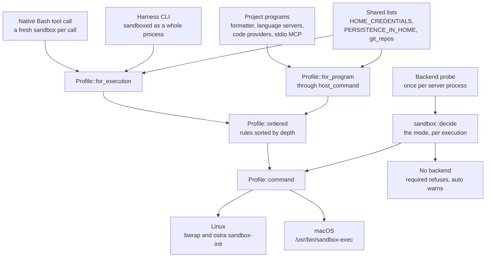
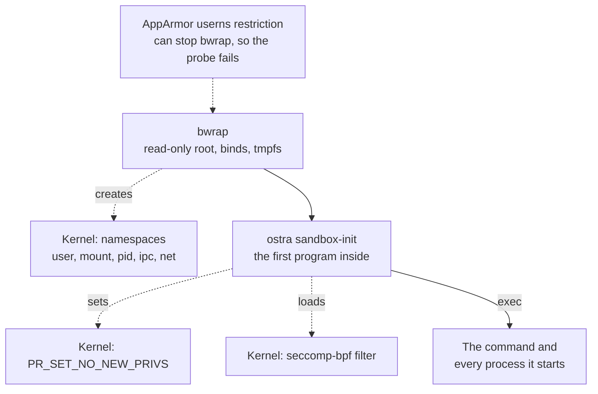
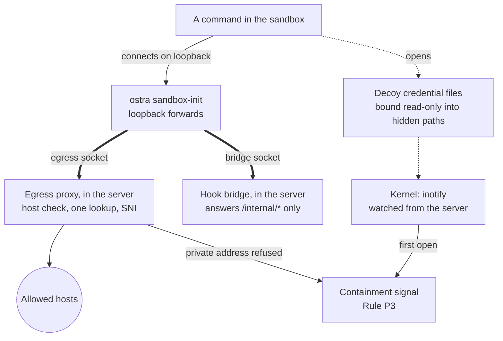
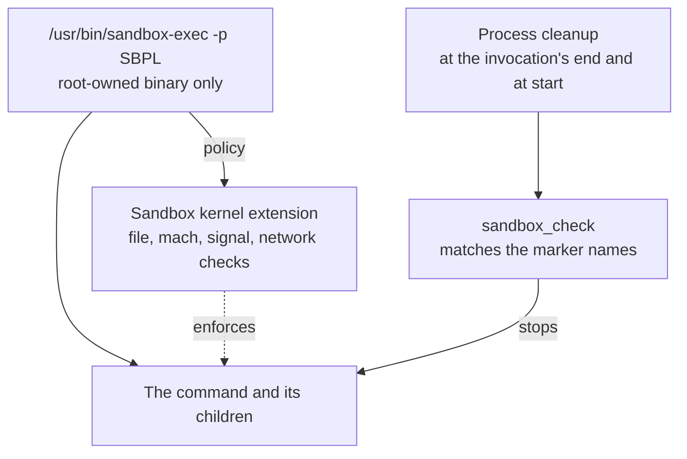

# Sandboxing

Sandboxing is a very powerful feature of Ostra. It makes it safe to let agents run real commands on your machine:
builds, tests, package installs, and whole harness CLIs such as Claude Code and Codex. Every one of those processes
starts inside an OS sandbox (bubblewrap on Linux, Seatbelt on macOS). The kernel enforces it, not the agent or the
CLI, so these guarantees hold whatever a command turns out to do. Windows has no sandbox backend yet, so none of
them hold there; [When there is no sandbox](#when-there-is-no-sandbox) says what does:

- **Your secrets stay out of reach.** SSH and GPG keys, cloud and registry credentials, browser profiles, the
  keychain, other CLIs' sign-ins, and Ostra's own data dir are hidden. A command that walks the disk with `find ~`
  does not see them.
- **Nothing is left behind to run later.** Shell startup files, login and autostart entries, and `.git/config` and
  hooks are read-only, so an agent cannot plant a program that runs the next time you open a terminal or run git.
- **Writes stay in the workspace.** The repo, the session, a private `/tmp`, and the session's own tool caches
  are writable; the rest of the machine is read-only, your own `~/.cargo` and `~/.npm` included.
- **Network access is limited to hosts you allow.** A sandboxed command reaches the outside only through its
  own proxy, which lets through package registries, source hosts, model APIs, and the hosts you list. On Linux
  the command has a network of its own, and local services, the LAN, and the cloud metadata address stay out of
  reach. On macOS the LAN and the metadata address stay out of reach too, while the services on the Mac itself
  are open by default, with ports you can block or a setting that closes them.
- **Your session stays closed.** The desktop bus, the SSH agent, the display, and Docker and Podman sockets are
  hidden or unset, and a command cannot signal a process outside its sandbox.
- **It is on by default and fails closed.** On Linux and macOS the default mode, `required`, refuses to start an
  execution the machine cannot sandbox, and a repository cannot turn its own sandbox off.
- **It needs no container or VM.** macOS ships Seatbelt, and Linux needs only the `bubblewrap` package. There is
  no image to maintain, and the toolchain you build with on the host builds inside it.

## Why a sandbox as well as the policy

The policy engine reads every tool call before it runs (see [agent containment](agent-containment.md)), but a
tool call is only what an agent asked for. A `Bash` call named `npm test` can run a postinstall script, a build
macro, or a test that opens `~/.ssh/id_ed25519`, and none of that appears in the call the policy approved. A
harness CLI can also act without reporting a hook for it. The sandbox is the layer that covers what the policy
cannot read: Ostra starts every agent command, every harness CLI, and every program it runs for a project inside
an OS sandbox profile, so the kernel refuses what the profile does not allow, whatever the program does.

This page explains which processes run sandboxed, what the profile lets them read and write, how one profile
renders for bubblewrap on Linux and Seatbelt on macOS, how the mode is chosen and why a folder cannot change it,
what happens when no sandbox is available, and what the sandbox does not cover.

The code is one module, [`crates/ostra-core/src/sandbox.rs`](../../crates/ostra-core/src/sandbox.rs), plus the
harness wrapping in [`crates/ostra-exec-harness/src/sandbox.rs`](../../crates/ostra-exec-harness/src/sandbox.rs).
It lives in `ostra-core` because every crate that starts a process (the tools, both executors, the code index,
the engine, and the server) depends on it.

## Architecture

The diagrams follow one process from the component that starts it to the kernel mechanisms that confine it.
Solid arrows are calls and data flow, dotted arrows point at a kernel mechanism, and thick arrows are the Unix
sockets that are a Linux sandbox's only way out.

Every process Ostra starts for an agent or a project goes through one profile and one mode decision, then renders
for the backend the machine has:



On Linux, bubblewrap builds the namespaces, and `ostra sandbox-init` locks the process down before the command
starts:



The command then reaches the network and the hook bridge only through sockets into the Ostra server, and a decoy
file it opens raises a signal:



On macOS, the kernel's Seatbelt module enforces the policy, and Ostra finds the processes to stop by the marker
names the policy carries:



On Linux, Ostra loads no Linux security module of its own. Confinement comes from namespaces, which bubblewrap
creates from an unprivileged user namespace, and from the seccomp filter and `no_new_privs` that `ostra
sandbox-init` installs. AppArmor matters only because its user namespace restriction can stop bubblewrap from
starting, and then the probe reports the machine as unable to sandbox. On macOS, Seatbelt is the kernel's own
sandbox policy module: `sandbox-exec` hands it the SBPL policy, and the kernel checks each file, mach, signal, and
network call against it. The sections below describe each box.

## Policy and sandbox

The policy and the sandbox answer different questions:

| | Policy (`ostra-policy`) | Sandbox (`ostra-core::sandbox`) |
| --- | --- | --- |
| Sees | One canonical `ToolCall` before it runs | Every syscall of the process tree after it starts |
| Decides on | Paths and commands the call names | Paths, sockets, and processes the kernel is asked for |
| Can explain | Yes: a denial carries the correction | No: a program gets `EPERM`, `EROFS`, or an empty dir |
| Covers | Native tools and harness hooks | Native Bash, harness CLIs, project programs |

Both read the same lists. `paths::HOME_CREDENTIALS` is the one list of credential stores: the policy refuses a
tool call that names one, Grep and Glob skip them when they walk, and the sandbox hides them
([`crates/ostra-core/src/paths.rs`](../../crates/ostra-core/src/paths.rs)). A path the policy refuses by name is
therefore also a path a shell command cannot reach by walking the disk.

The sandbox does not replace the policy. Write scope, state ownership, the report path, and the other guards
depend on which agent is running and which stage it is in, and the sandbox profile knows neither. The profile's
job is narrower: keep every process Ostra starts inside the workspace, away from the user's secrets and session,
and unable to leave anything behind that runs later.

## What runs sandboxed

There are two profile builders, one for agents and one for the project's own programs.

**Agent executions** use `Profile::for_execution`:

- **Native Bash.** Each `Bash` tool call starts a fresh sandbox (a new `bwrap` or `sandbox-exec` process) around
  `bash -c`. The native executor builds the profile once per execution
  ([`sandbox_for`](../../crates/ostra-exec-native/src/lib.rs)) and the tool wraps each command in it
  ([`crates/ostra-tools/src/bash.rs`](../../crates/ostra-tools/src/bash.rs)).
- **Harness CLIs.** Claude Code, Codex, Grok, and Antigravity start inside the sandbox as a whole process, so the
  CLI's own shell tool and everything it starts inherit it
  ([`sandbox::wrap`](../../crates/ostra-exec-harness/src/sandbox.rs)). This is why the sandbox covers actions a
  harness never reports to a hook.

**Programs Ostra starts for a project** use `Profile::for_program` through `sandbox::host_command`:

| Program | Started by | Writable roots |
| --- | --- | --- |
| Format command | the runner, after the user approved it (Rule A1) | the project root |
| Language servers | the code index ([`lsp/mod.rs`](../../crates/ostra-code/src/lsp/mod.rs)) | the project root |
| Code providers | the code index ([`provider.rs`](../../crates/ostra-code/src/provider.rs)) | the project root |
| Stdio MCP servers | the workspace MCP pool ([`mcp.rs`](../../crates/ostra-server/src/mcp.rs)) | the workspace root |

These run sandboxed because each one executes code from the repository: a language server runs build scripts and
macros, a format command is whatever the project configured, and an MCP server is the workspace's own program.
An unapproved workspace file starts none of them in the first place (see [workspaces](../internals/workspaces.md)).

Ostra's own git operations (staging after a build, commits and pushes from the console) run outside the sandbox, because they are
Ostra's code with fixed arguments and they need `.git/config` and the data dir that the profile closes. HTTP MCP
servers are not local processes, so no sandbox applies to them; Ostra's own HTTP client reaches them.

## What an agent can reach

The profile is a list of path rules, each one of four kinds: writable, read-only, hidden, or (on bubblewrap only)
a link. Everything starts read-only: the base of the profile is the whole filesystem mounted read-only, so an
agent can read the toolchain, system headers, and the repo's dependencies without a rule for each one.

### Writable

- The workspace root, the repo root, the session root, and the execution's session dir.
- On bubblewrap, each dir between a writable root and a rule inside it, bound writable onto itself: `.git`, the
  repo dir that holds it, and every dir above that up to the root. A mount point cannot be renamed, so nothing
  protected can be moved out from under its rule (see [git](#git-stays-usable-and-closed)).
- A private `/tmp` (see [temporary files](#temporary-files)).
- The per-workspace tool caches (see [tool caches](#tool-caches)).
- Each entry of `[sandbox] extra_writable`.

### Read-only

- Every path the profile does not name, including the rest of the home folder.
- **Shell startup and autostart files** (`PERSISTENCE_IN_HOME`): `.bashrc`, `.profile`, `.zshrc`, `.zshenv` and the
  other shell rc files, `.config/fish/`, `.gitconfig` and `.config/git/`, `.config/autostart/`,
  `.config/systemd/`, `.config/environment.d/`, `.pam_environment`, `.xprofile`, `.npmrc`, `.local/bin/`,
  `.cargo/bin/`, `.cargo/config(.toml)`, and on macOS `Library/LaunchAgents/`, `Library/Preferences/`,
  `Library/Scripts/`, `Library/Services/`, and iTerm2 scripts. These are named even inside a writable dir,
  because each one runs a program the next time the user opens a shell or logs in, so an agent that could write
  one could leave a program behind for the user.
- **Git's executable config**: `.git/config`, `.git/hooks/`, `.git/info/`, and the same three in every submodule
  gitdir under `.git/modules/`.
- **Ostra's own state**: `.ostra/workspace.toml` and the workspace db, the project memory db (with its `-wal`,
  `-shm`, and `-journal` files), the session's `.state` dir, and every path the execution lists as protected.
- **Workspace artifacts**: `.ostra/artifacts/` is read-only, because agents read workspace artifacts and never
  write them (Rule W1).
- **The user's own caches**: `~/.cargo`, `~/.npm`, `~/.cache`, and `~/Library/Caches` stay read-only, because
  the user's builds on the host run what those caches hold.
- `<data dir>/assets`, revealed read-only inside the hidden data dir, because agents read skills and references
  from it.

A protected file that does not exist yet still needs to stay uncreatable: otherwise an agent could create
`.git/hooks/pre-commit` or `~/.zshenv` where there was none. On bubblewrap, Ostra creates a placeholder on the
host (an empty file, or `{}` for a `.json` file, mode 0600, or an empty dir) and binds it read-only, but only where
the parent is a writable dir the sandbox already exposes; a missing path under a read-only parent needs nothing.
On Seatbelt a deny rule (`literal` for a file, `subpath` for a dir) refuses creation of the path directly, in any
letter case, so no placeholder is written.

### Hidden

Hidden paths are not readable at all. On bubblewrap a hidden dir is an empty tmpfs and a hidden file is
`/dev/null`; on Seatbelt both return `EPERM`.

- **Ostra's data dir**: the registry, the secret store, the server log, session databases, and hidden workspace
  artifacts (Rule W2). This is also where Ostra puts the temporary SSH key for pushes, for the same reason.
- **Ostra's config dir**, or only the file `OSTRA_CONFIG` points at when it is set, and the master key file
  (`OSTRA_MASTER_KEY_FILE`).
- **Credential stores** (`HOME_CREDENTIALS`): `.ssh`, `.gnupg`, `.aws`, `.azure`, `.config/gcloud`, `.kube`,
  `.docker`, `.netrc`, `.git-credentials`, the `gh` and `hub` tokens, cargo and PyPI credentials, `.vault-token`,
  Terraform credentials, keyrings, `.password-store`, `.Xauthority`, browser profiles, and on macOS
  `Library/Keychains`, cookies, Safari, Mail, Messages, the TCC database, and app containers. The Windows stores
  under `AppData` (DPAPI keys, Credential Manager, browser profiles, the PowerShell history) are on the list for
  the Windows backend to come; today the policy enforces them there. Harness sign-in
  files (`.claude/.credentials.json`, `.codex/auth.json`, `.grok/auth.json`, `.gemini/oauth_creds.json`) are on
  the list too; a harness execution keeps only its own sign-in file visible, so Claude Code cannot read the
  Codex login.
- **The user session**: `$XDG_RUNTIME_DIR` (or `/run/user/<uid>`), which holds the D-Bus session bus, the Wayland
  socket, and agent sockets.
- **Container sockets**: `/run/docker.sock`, `/var/run/docker.sock`, the Podman socket, and the OrbStack, Colima,
  Rancher Desktop, and Podman machine sockets. They are hidden, not read-only, because a read-only file does not
  stop `connect`, and access to a Docker socket is root on the host.
- **Other sessions**: `.ostra/sessions/` is hidden, and the running session is bound back below it, so an agent
  cannot read or edit another session's reports.
- **Other executions' harness dirs**: `.state/harness/` is hidden, because each harness dir holds that
  execution's bridge token.
- Each entry of `[sandbox] extra_hidden`.

The environment is cleaned the same way. `SSH_AUTH_SOCK`, `DBUS_SESSION_BUS_ADDRESS`, `DISPLAY`,
`WAYLAND_DISPLAY`, `XAUTHORITY`, `DOCKER_HOST`, and `GPG_AGENT_INFO` are unset, because each one points at a
service that acts with the user's rights. Native Bash commands also lose provider keys, bridge tokens, MCP OAuth
client secrets, and every `OSTRA_*` variable, and project programs lose provider keys, bridge tokens, and every
`OSTRA_*` variable. A harness CLI inherits Ostra's environment minus every credential variable except its own
sign-in key, and gets fresh bridge variables for its own execution (see [secrets and data](secrets-and-data.md)).

#### Decoy credential files

An agent execution also finds decoy files at some hidden paths: credential files an agent has no reason to
open. Opening one is a containment signal (Rule P3), because the `secret-read` guard sees only reads made
through a tool, and a `cat ~/.ssh/id_rsa` in Bash or in a script would otherwise be refused and leave no trace.
On Linux a decoy is a fake file; on macOS it is the real file, refused and reported
([below](#decoys-on-macos)).

| Decoy | Planted on Linux when |
| --- | --- |
| `~/.ssh/id_rsa`, `~/.ssh/id_ed25519` | `~/.ssh` exists, or the execution is a harness CLI's, and no SSH port is reachable: the network choice is `none` or `allowlist` and no allowed host names port 22 |
| `~/.git-credentials` | the file exists, or the execution is a harness CLI's |
| `~/.vault-token` | the file exists, or the execution is a harness CLI's |

The SSH keys depend on the network because `ssh` opens its keys on its own when it authenticates, and a build
that fetches a dependency over SSH would raise a signal. `~/.netrc` gets no decoy, because Python `requests`
(and so `pip`) and Go module downloads read it on every fetch.

A workspace can add its own decoys (`sandbox_decoys`), such as `~/.aws/credentials` or a token file only your
team uses. The built-in list always applies, and a workspace adds to it without removing any entry. Each entry
is a file path starting with `~/`. Saving a harness CLI's sign-in file is a validation error, because a decoy
there would sign that CLI out in the sandbox. More than 32 entries is one too, because each decoy is a watched
file and a mount in every agent sandbox. The list is kept in the registry, never in `.ostra/workspace.toml`
(Rule A2), because a repository could otherwise plant decoys at paths agents read all the time and pause every
session. A workspace decoy whose file name starts with `id_` under `~/.ssh/` is treated as an SSH key, and the
same port 22 condition applies.

The Settings screen shows the list on the Permissions tab under "Decoy files", with the built-in decoys listed
above it as fixed entries. On a server that cannot plant decoys (no sandbox, or macOS on an account that is not
an admin), the field is disabled and links to this section. `GET /api/workspaces/<id>` reports that as `sandbox.decoys`, and the
built-in list as `sandbox.builtin_decoys`.

Each execution gets its own decoys with fresh random contents, written to `<data dir>/decoys/<16 hex>/`, which
the sandbox hides, and bound read-only into place. Ostra never writes the host to make room for one, so a decoy
is planted in one of two places. Where the file exists, the decoy is bound over it, which also hides the real
file, and covers a hidden file's `/dev/null` bind. Where it does not, the decoy goes only inside a hidden dir's
tmpfs (or a harness's disposable home), where bubblewrap creates the missing folders, so `~/.aws/sso/cache/x.json`
works when `~/.aws` exists. A path that fits neither is skipped.

Ostra watches each file with inotify from outside the sandbox. inotify follows the file, not the path, so the watch sees an open through the bind mount in the
sandbox's mount namespace. Only an open counts: `ls ~/.ssh` and `stat` do not. Each decoy reports its first open
and then stops being watched, so one decoy raises at most one signal per execution. A native execution shares
one set of decoys across its Bash calls; a harness execution keeps its set for the life of the CLI. The decoys
are removed when the execution ends, and at server start any a crashed server left behind.

Project programs (formatters, language servers, code providers, MCP servers) get no decoys, because their
signals have no session to pause.

##### Decoys on macOS

Seatbelt has no bind mounts, so it cannot put a fake file in place. A decoy there is a file that already exists
at one of the decoy paths, such as your real `~/.ssh/id_rsa`, which the sandbox hides anyway. The policy refuses
reading its contents with a rule that carries a message of its own, a random `dev.ostra.decoy.<16 hex>` per file
and execution:

```
(deny file-read-data (literal "/Users/you/.ssh/id_rsa") (with message "dev.ostra.decoy.5f0c2a9e81d34b7a"))
```

The kernel's Sandbox extension logs each refusal to the system log with that message. One `log stream` process
per server ([`decoy.rs`](../../crates/ostra-core/src/decoy.rs)) reads only records from the kernel (process 0,
sender `Sandbox`) that carry a decoy message, because any process may log text of its own, and reports the
file's first refusal. The rule covers `file-read-data` alone, so `stat` and `ls ~/.ssh` raise nothing. The same
port 22 condition applies to SSH keys. The server starts the reader at startup, and it waits until `log stream`
is attached before the first decoy counts, so a command that starts right after is seen; measured, a report
arrives within milliseconds, and a thousand other refusals in front of it did not suppress it.

This has two limits that macOS sets:

- **An admin account only.** macOS lets only admin accounts run `log stream` ("Must be admin to run 'stream'
  command"). On another account `sandbox.decoys` is false, the Settings field is disabled, and no decoy counts.
- **Existing files only.** Opening a file that does not exist fails with `ENOENT` before Seatbelt checks it, and
  nothing is logged, so a missing decoy path gets no rule. Where the Linux sandbox plants `~/.git-credentials` in
  a hidden dir, macOS covers it only when you have one.

### A deeper rule overrides a shallower one

Rules overlap: the repo is writable, `.git/hooks` inside it is read-only, and `.ostra/sessions/<this session>`
is writable inside a hidden dir. `Profile::ordered` sorts every rule by path depth, so a deeper rule is applied
after its parent and wins. When two rules name the same path, only the most restrictive one is kept, in the order
writable, read-only, hidden. Bubblewrap applies the list as mounts in that order, and Seatbelt emits it as SBPL
rules in that order, where a later rule overrides an earlier one. One ordering serves both backends.

One case is removed on purpose. A read-only bind below a hidden dir would expose that path again, so the plan drops
it unless the rule is marked as a reveal, which only `<data dir>/assets` is.

Paths are canonicalized first, because bubblewrap mounts real paths and Seatbelt matches real paths. A rule for
`~/work/repo` where `~/work` is a symlink applies to the target.

The test `deeper_rules_win_and_git_stays_usable` in `sandbox.rs` runs this ordering in a live sandbox: the
execution's own harness dir is writable, another session is hidden, a commit succeeds, and `git config` and hook
writes are refused.

### Git stays usable and closed

An agent needs git to inspect history and commit, and the pipeline stages changes with `git add -A` after every
build. Git also reads
programs to run from its config: `core.fsmonitor`, `core.sshCommand`, hook scripts, and filters. The profile keeps
both properties:

- `.git` is writable, so objects, refs, and the index can change.
- `.git/config`, `.git/config.worktree`, `.git/hooks/`, and `.git/info/` are read-only in each repo and each
  submodule gitdir, so an agent cannot plant a hook or an fsmonitor command that runs later outside the sandbox,
  when the user or Ostra runs git. A missing `config.worktree` gets an empty read-only placeholder, which git
  ignores unless `config` turns on `extensions.worktreeConfig`. Each linked worktree's own
  `.git/worktrees/<name>/config.worktree` is read-only too, for a repo that turns that extension on.
- A `.git` file, as a submodule checkout or a linked worktree has, is read-only, so it cannot be pointed at a git
  dir the agent wrote. The git dir it names gets the same read-only paths as a `.git` dir; for a linked worktree,
  whose config is its main repo's, that is only its `config.worktree`.
- `.git/commondir` cannot get a placeholder, because git refuses to open a repository whose `commondir` is empty.
  A `commondir` makes git load another folder's `config`, so Ostra undoes one instead
  ([`repair_git_dirs`](../../crates/ostra-core/src/sandbox.rs)): it removes a `commondir` from a repository's own
  git dir, where git never writes one, and restores a linked worktree's `commondir` that no longer names `../..`.
  It checks after every native Bash call, every 2 seconds while a harness CLI runs and once when it exits, and
  before Ostra's own staging, commits, pulls, and pushes. The agent reads the correction in its tool result
  (native), and each repair is recorded as a refusal by the `git-metadata` guard, which counts as a containment
  signal. Between the write and the check, a git command the user runs in that repository would read the planted
  config.
- Nothing protected can be renamed away. A bind-mount point cannot be renamed, but the dirs above one can, so
  `mv repo r && git init repo` would leave the protected `.git` under `r` and put a fresh, writable config where
  the user runs git. On bubblewrap, [`Profile::plan`](../../crates/ostra-core/src/sandbox.rs) therefore binds every
  dir between a writable root and a rule inside it onto itself: `.git`, the repo dir, and each dir above it. A
  rename across two of those binds fails with `EXDEV`, which `mv` handles by copying. On Seatbelt, which has no
  mounts, a `file-write-unlink` deny on every ancestor of a protected path inside a writable dir does the same
  job.
- Every git process a sandboxed command starts gets `core.fsmonitor=false`, `safe.bareRepository=explicit`, and
  `protocol.ext.allow=never` through `GIT_CONFIG_COUNT`, so a malicious repo config the agent did not write still
  cannot start a program ([`crates/ostra-core/src/git.rs`](../../crates/ostra-core/src/git.rs)).
- Every git command Ostra runs on the host (status, diffs, staging, commits, pulls, pushes) gets
  `core.fsmonitor=false`, `protocol.ext.allow=never`, and an empty `core.askPass` as `-c` options, and blanks the
  filter drivers of every submodule in the index, at any depth
  ([`filter_overrides`](../../crates/ostra-core/src/git.rs)). A status, a diff, `git add`, or a commit runs
  `git status` inside each populated submodule, which reads that repository's own config, and `-c` options reach
  those child processes. Without the blanking, a repository the agent created and staged (by its own `git add`
  or Ostra's staging) would run its clean filter the next time Ostra listed changes: git hashes a file again
  through the filter when its size is unchanged and its time is not. Status, diffs, and staging also blank the
  root repo's drivers except git-lfs; a commit, pull, or push you ask for keeps them, so a filter such as
  git-crypt still applies to what you commit. The search reads at most 256 repositories.

The repos covered are every dir under the workspace root and the repo root that holds a `.git` dir or file, at any
depth, found when the execution starts
([`git_repos`](../../crates/ostra-core/src/sandbox.rs)). The walk goes breadth first and does not enter symlinks,
`node_modules`, or dirs tagged as caches with a `CACHEDIR.TAG` (Cargo tags `target/`), because those hold build
output, not the user's repos. It stops after 20,000 dirs or 128 repos and logs where it stopped, which bounds the
mounts and the time it adds (about 90 ms for 12,000 dirs, measured on Ostra's own tree). An execution's
`commondir` checks cover the repos found at its start; Ostra's staging and git commands walk again. A repo the
agent creates during the execution is its own, like a repo it clones: its config is writable.

This is the line the sandbox draws on purpose: it keeps agents from going further than they should, and it does
not guard the git you run yourself. Git that Ostra runs on the host starts neither the fsmonitor command nor the
filter drivers such a config names, the two that a status, diff, or staging reaches. Git an agent runs inside
the sandbox may start them, where the agent could start any program anyway. Git you run in a terminal or a
desktop app reads that config, as it reads the config of any repository you clone, and a plain `git status`
enters a submodule an agent staged in your repo. Review a submodule an agent added before you run git there.
The [threat model](threat-model.md#risks-ostra-accepts) lists this as an accepted risk.

### Temporary files

The shared `/tmp` is where other programs leave sockets, lock files, and build output, so it is not shared.

- **Native Bash.** Each execution gets its own scratch dir, `$TMPDIR/ostra-scratch-<uuid>` (mode 0700), mounted at
  `/tmp` on bubblewrap. It persists across the execution's Bash calls and is removed when the execution ends.
  Read and Write map a `/tmp/...` path to the scratch dir on the host (`Profile::to_host`), so a file the shell
  wrote in `/tmp` is the file the Read tool opens.
- **Harness CLIs.** `/tmp` is `<harness dir>/tmp`, removed with the execution.
- **Project programs.** An empty tmpfs on bubblewrap, and the workspace's cache `tmp/` on Seatbelt.

On Seatbelt, which cannot remount `/tmp`, the policy denies `/private/tmp`, `/private/var/tmp`, and the user's
Darwin temp dir, and sets `TMPDIR` (and `TMPPREFIX` for zsh heredocs) to the scratch dir instead. Programs that
honor `TMPDIR` work; a program that hard-codes `/tmp` fails with `EPERM`.

### Tool caches

A build inside the sandbox needs to download crates and packages, but it must not write the user's own caches,
because the user's host builds would then run what an agent put there. For the same reason one session must not
write the caches a later session builds from: an agent that a README talked into planting a package would
otherwise reach every session after it. So the sandbox gives each session its own caches under
`~/.cache/ostra/sandbox/session-<id>/` (or `$OSTRA_SANDBOX_CACHE/session-<id>`), created 0700, and points the
tools at them. Every agent execution in the session shares them, and the engine removes them when the session
ends (completed, failed, or stopped), because an ended session runs no more tools. A server start removes any
cache an ended session left behind, for a removal that failed; it touches only its own data dir's sessions,
because other data dirs share the cache root. A run outside a session, such as a side-panel
run, uses a cache keyed by a hash of its workspace root. Project programs (formatters, language servers, code
providers, stdio MCP servers) hash their first root, the project root or, for a stdio MCP server, the workspace
root, so they keep a cache that no agent writes.

| Variable | Cache dir |
| --- | --- |
| `CARGO_HOME` | `cargo` |
| `npm_config_cache` | `npm` |
| `npm_config_store_dir` | `pnpm-store` |
| `XDG_CACHE_HOME` | `xdg` |
| `GOMODCACHE`, `GOCACHE` | `go-mod`, `go-build` |
| `PIP_CACHE_DIR` | `pip` |
| `YARN_CACHE_FOLDER` | `yarn` |
| `UV_CACHE_DIR` | `uv` |
| `CLANG_MODULE_CACHE_PATH` | `clang-modules` |

The user's `~/.cargo/config.toml` and `~/.cargo/config` are linked into the sandbox `CARGO_HOME`, so registry mirrors and build settings
carry over, and cargo's credentials file is not.

Two consequences follow. The first build in every session downloads its dependencies again, and an agent's build
and the user's build do not share compiled dependencies. `~/.rustup` stays read-only, so a toolchain the project
pins but the user has not installed fails inside the sandbox; install it on the host once.

### Network

`[sandbox] network` chooses what a sandboxed command can reach. It applies to native Bash, harness CLIs, and
the programs Ostra starts for a project alike. A workspace can choose its own in place of the global one
(`sandbox_network`), kept in the registry like its mode, so a repository cannot change it.

| Choice | A sandboxed command reaches |
| --- | --- |
| `none` | Nothing. A harness CLI still reaches its own model API and Ostra's hook bridge. |
| `allowlist` (default) | The built-in hosts below, the hosts in `allowed_hosts`, and, for a harness, the model endpoints you configured for it |
| `public` | Any public address, and the hosts in `allowed_hosts`. Loopback, private, and link-local addresses stay refused. |
| `host` | The host's network as it is: every local service, the LAN, and the cloud metadata address |

The built-in hosts ([`DEFAULT_ALLOWED_HOSTS`](../../crates/ostra-core/src/egress.rs)) are the package registries
and source hosts that builds fetch from: crates.io and its index, npm and Yarn, PyPI, the Go module proxy,
GitHub (including raw files and release downloads), Maven Central, Gradle, Google's Maven, RubyGems, and NuGet.
The model API and sign-in hosts of all four harness CLIs are built in too (`egress::model_hosts`), so a test or a
tool that calls a model API works under `allowlist`. A built-in host must resolve to a public address, so a DNS
answer that points one at your LAN is refused.

#### How a command gets out on Linux

Under every choice but `host`, bubblewrap gives the sandbox its own network namespace (`--unshare-net`). Its only
interface is its own loopback, so a test that starts a server on `127.0.0.1` and connects to it works, and
nothing on the host's loopback, the LAN, or the host's abstract Unix sockets is reachable. The only ways out are
Unix sockets Ostra binds into that namespace, one per purpose:

```
sandbox (own network namespace)                        Ostra server (host network)
  curl https://registry.npmjs.org/...
    │ HTTPS_PROXY=http://127.0.0.1:<free port>
    ▼
  ostra sandbox-init ── <data dir>/egress/<id>.sock ──> egress proxy ── policy ──> registry.npmjs.org:443
    127.0.0.1:<bridge port> ── bridge-<id>.sock ─────> hook bridge (/internal/* only)
    127.0.0.1:<listed port> ── <id>.sock ────────────> 127.0.0.1:<listed port> on the host
```

The first program in the sandbox is Ostra's helper, `ostra sandbox-init`
([`sandbox_init.rs`](../../crates/ostra-core/src/sandbox_init.rs)). It listens on the sandbox's loopback and
forwards each connection to one of the sockets: the execution's egress proxy on a free port, and fixed ports for
the hook bridge and for each loopback host you listed. It sets `HTTP_PROXY`, `HTTPS_PROXY`, and `ALL_PROXY` (and
their lowercase forms) to the proxy, `NO_PROXY` to `localhost,127.0.0.1,::1`, and `NODE_USE_ENV_PROXY=1` so that
Node's built-in `fetch` uses the proxy too. Then it loads the seccomp filter and starts the command.

The egress proxy runs in the Ostra server, on a runtime of its own. Under `allowlist` and `public` each execution
gets one, and so does a harness CLI under `none`: every Bash call of a native execution shares it, and so does
everything a harness CLI starts. Native Bash under `none` gets no proxy and no way out. Its socket lives at
`<data dir>/egress/<16 hex>.sock`, in a dir only you can open, and is removed when the execution ends; a server
that stopped without removing its sockets has them removed at the next start. The data dir is hidden from every
sandbox and each socket is bound only into its own sandbox, so no execution can reach another's proxy.

The proxy speaks HTTP/1.1. It accepts `CONNECT host:port`, which carries HTTPS and any other TCP protocol, and
plain HTTP in absolute form (`GET http://host/path`), which it sends on in origin form with `Connection: close`
and without `Proxy-*` headers. For each request it:

1. Checks the host by name against the policy. An unlisted name is never looked up, so the proxy leaks no DNS
   query for it. Neither is a local-only name you did not list (`localhost`, `.local`, `.internal`, `.lan`,
   `.home.arpa`, a single label), which is refused at once, because it can only point at this machine or the LAN
   and its lookup goes out on the LAN.
2. Resolves the name itself and connects to the address it checked, never a second lookup, so a DNS answer that
   changes between the check and the connection cannot move it to another address.
3. For a `CONNECT` to a host name, reads the TLS ClientHello and compares its server name (SNI) with the host.
   A different name closes the tunnel, because a CDN that routes by server name would otherwise carry an allowed
   tunnel to any site it serves. A tunnel without TLS, or one where the destination speaks first (an SSH banner),
   passes.

Limits: a request head of 8 KiB, 256 open connections at a time per execution (a connection over the cap is
closed without an answer), 30 seconds to send the head, and 10 seconds to connect.

A refusal answers `403` with the correction first, for example:

```
Add `evil.example` to `[sandbox] allowed_hosts` in config.toml, or set `[sandbox] network = "public"`, to let
sandboxed commands reach it, because the sandbox lets traffic through only to listed hosts.
```

The first allowed connection and the first refusal of each host and port are recorded with the execution's
activity as an `egress` item; the console does not display them yet. A refusal of a loopback, private, or
link-local destination is also a containment signal, and three of those from one execution pause the session
(see [agent containment](agent-containment.md#containment-signals-pause-the-session)).

#### Allowed hosts

Each entry of `allowed_hosts` is a host name, `*.domain` (every name below `domain`, not `domain` itself), an
IPv4 address, or an IPv6 address in brackets, each with an optional `:port`. Without a port an entry allows 443
and 80. A host you list may resolve to any address, including a private one, because it is often a mirror or a
model gateway on your LAN.

A loopback entry needs a port (`127.0.0.1:8317`, `localhost:8317`), and saving one without is a validation error.
Programs connect to loopback directly instead of through the proxy (`NO_PROXY`), so on Linux Ostra forwards each
listed loopback port from the sandbox's loopback to the host's, and on macOS the policy allows that port.

The global list is `[sandbox] allowed_hosts` in `config.toml`. Each workspace can add its own
(`sandbox_allowed_hosts`), which is kept in the registry, never in `.ostra/workspace.toml`, and adds to the global
and built-in hosts without removing any (Rule A2). A change to either list or to the network choice applies to
the next execution, replaces a running language server on its next use, and reconnects a stdio MCP server.

The Settings screen sets both on the Permissions tab, in the Network panel: the four choices plus "Use the global
setting", which names the global choice, then the workspace's hosts, one per line. Under the field the panel
lists the global hosts and, folded, the built-in ones. Under `none` or `host` the field stays editable, and its
hint says the choice ignores the hosts. On macOS the panel also has the loopback choice and the blocked ports
([how a command gets out on macOS](#how-a-command-gets-out-on-macos)). The server checks every host as you edit and again at
save, and a host that does not parse shows its issue on the field. `GET /api/workspaces/<id>` carries what the panel shows:
`global_sandbox` (the global `network` and `allowed_hosts`) and `sandbox.builtin_hosts`.

#### An upstream proxy

On a machine that reaches the internet only through an HTTP proxy, set `[sandbox] upstream_proxy =
"http://proxy.example:3128"`. The egress proxy still checks every host by name. It then opens a `CONNECT` tunnel
through the upstream (or sends plain HTTP to it in absolute form), passing a name that does not resolve on this
machine to the upstream as a name, unless it is a local-only name you did not list (`printer.local`, a single
label). A host you listed that resolves to a private address is reached directly, because an internal mirror is
rarely behind the corporate proxy. Through the upstream, the upstream resolves the name, so the address check
and the single lookup above apply only to direct connections. The upstream takes no credentials. An upstream
answer other than `200` to a `CONNECT` becomes a `502` with that answer in it; its answer to plain HTTP passes
through unchanged.

#### What the proxy changes

- **Only HTTP and HTTPS clients that honor the proxy variables reach the network.** A program that ignores them
  gets no network at all. Git over SSH does not work under `none`, `allowlist`, or `public`; use HTTPS remotes.
- **Project programs reach only allowed hosts too.** A formatter, language server, code provider, or stdio MCP
  server that calls its own service needs that host in `allowed_hosts`.
- **A harness CLI's own web tools reach only allowed hosts.** Ostra's native `WebFetch` runs in the server, not in
  the sandbox, and has its own address checks ([tools](../internals/tools.md)).
- **A harness reaches the model endpoints you chose for it.** Ostra adds the host of every `*_BASE_URL` variable
  in the CLI's launch environment or in Ostra's own, of `env.*_BASE_URL` in Claude Code's `settings.json`, and of
  `model_providers.*.base_url` in Codex's `config.toml`. Those may resolve anywhere, like a host you listed.

#### How a command gets out on macOS

macOS has no network namespaces, so every Seatbelt sandbox shares the host's loopback, where your local services
listen. A Seatbelt rule filters a connection by its remote address and port only, `localhost:<port>` or
`localhost:*`, and `localhost` there means every address of this Mac, its LAN address included (measured). So
Ostra gives each execution ports of its own on `127.0.0.1`, and the workspace chooses what else on this Mac its
commands may connect to:

```
Seatbelt sandbox (host loopback)                       Ostra server
  curl https://registry.npmjs.org/...
    │ HTTPS_PROXY=http://127.0.0.1:<proxy port>
    ▼
  127.0.0.1:<proxy port> ──────────────────────────> egress proxy ── policy ──> registry.npmjs.org:443
  127.0.0.1:<bridge port> (OSTRA_URL) ─────────────> bridge-<id>.sock ──> hook bridge (/internal/* only)
  127.0.0.1:<listed port> ─────────────────────────> the service you listed, directly
```

| Loopback setting | A command on macOS connects to |
| --- | --- |
| Every port but the blocked ones (`open`, default) | Every service on this Mac, so tests reach the servers they start; never a blocked port or Ostra's own server port |
| Only listed ports (`listed`) | Its proxy, its bridge port, and loopback ports in `allowed_hosts`, minus blocked ones |

The setting applies under `allowlist` and `public`. Under `none` a command connects to its proxy and bridge port
only (a harness CLI's), because `none` reaches nothing. Other machines on the LAN stay out of reach either way:
a command reaches them only through the proxy, which refuses private addresses you did not list. The policy for
the default, with port 5432 blocked:

```
(allow network-inbound (local ip "localhost:*"))
(allow network-bind (local ip "localhost:*"))
(allow network-outbound (remote ip "localhost:*"))
(allow network-outbound (remote ip "localhost:8317"))
(deny network-outbound (remote ip "localhost:5432"))
(deny network-outbound (remote ip "localhost:7878"))
(allow network-outbound (remote ip "localhost:52114"))
(allow network-outbound (remote ip "localhost:52117"))
```

Seatbelt applies the last matching rule, so the order matters: every port or the listed ones, then the blocked
ports and Ostra's server port (7878 here, recorded when the server starts), then the execution's own ports, which
nothing overrides. Blocked ports win over `allowed_hosts`, on Linux too, where a blocked port is not forwarded.

Under every choice but `host`:

- **The proxy is the same one, on a port instead of a socket.** Each execution's proxy listens on a free port of
  `127.0.0.1` (`egress::loopback_proxy`), and the command gets the same proxy variables as on Linux
  (`sandbox::proxy_env`). Where the loopback is open, a sandbox can connect to another execution's proxy port,
  so each loopback proxy requires a credential of its own, carried in its URL
  (`http://ostra:<32 hex>@127.0.0.1:<port>`), and answers `407 Proxy Authentication Required` without it. No
  other sandbox can read the credential, because the policy refuses reading another process's environment
  ([below](#seatbelt-on-macos)). Measured: curl, git, Node `fetch`, npm, Python `urllib`, pip, Go, cargo, Claude
  Code, Codex, and Grok send it (git after the `407`).
- **The hook bridge gets a port of its own** that splices to the server's bridge socket
  (`egress::loopback_splice`), and `OSTRA_URL` names it, so the console's API is not reachable from the sandbox.
- **A listed loopback host is reached directly,** because programs skip the proxy for loopback (`NO_PROXY`):
  `127.0.0.1:8317` in `allowed_hosts` adds `localhost:8317` to the policy.
- **Nothing resolves names but the proxy.** The policy does not allow the DNS resolver's socket
  (`mDNSResponder`), because a lookup carries data out in the name itself. `localhost` still resolves, from
  `/etc/hosts`.
- **A command may always listen on loopback.** Under `listed`, a test that starts a server on a random port and
  connects to it is refused, because the policy cannot tell that server from your other local services.
- **Unix sockets** are allowed only inside writable dirs, whatever the setting, and denied everywhere else.

Under `host` the policy allows all outbound IP and the DNS resolver, as before. Measured with real
`harness_probe` runs (`PROBE_HARDEN=1`), Claude Code, Codex, and Grok work this way under `allowlist` in both
loopback settings, a model gateway on the LAN included. Under `listed`, this Mac's services are unreachable;
under `open` they are reachable on loopback and on its LAN address. In both, other LAN hosts, the metadata
address, and DNS are unreachable, and the proxy's refusals match Linux.

The workspace keeps both settings in the registry (Rule A2): `sandbox_loopback` (`open` or `listed`) and
`sandbox_blocked_ports` (at most 64 ports). There is no global setting. On macOS the Settings screen shows them
in the Network panel, on the Permissions tab. A change applies to the next execution, and restarts a language
server or a stdio MCP server the next time it is used.

## Harness CLIs in the sandbox

A harness CLI is a larger program than a shell command, with its own state dirs, its own sign-in, and in two
cases its own sandbox. [`sandbox::wrap`](../../crates/ostra-exec-harness/src/sandbox.rs) adds what each one needs
to `Profile::for_execution`:

- **Its state dir is writable, and its instruction files are not.** Each CLI writes session history and caches
  under its home dir, so that dir is writable. The files in it that run in the user's own later sessions of that
  CLI stay read-only: a hook or instruction written there would reach outside Ostra.

  | Harness | Writable | Read-only inside it |
  | --- | --- | --- |
  | Claude Code | `$CLAUDE_CONFIG_DIR` or `~/.claude`, and `~/.local/state/claude` | `settings.json`, `settings.local.json`, `CLAUDE.md`, `commands/`, `agents/`, `skills/`, `plugins/`, `hooks/`, `output-styles/` |
  | Codex | `$CODEX_HOME` or `~/.codex` | `config.toml`, `AGENTS.md`, `hooks.json`, `rules/` |
  | Grok | `$GROK_HOME` or `~/.grok` | `config.toml`, `trusted_folders.toml`, `hooks/` |
  | Antigravity | `~/.gemini` | `settings.json`, `GEMINI.md`, `config/plugins/` |

- **The home folder is disposable on bubblewrap.** The CLI's home is a tmpfs with each existing entry bound back
  read-only, so a new file at the top of home lands in the tmpfs and is gone when the execution ends. Claude Code
  rewrites `~/.claude.json` through a temp file and a rename, which a read-only home refuses, so Ostra copies the
  real file into the execution's dir (mode 0600) and links it in; the real file is never changed. Seatbelt has
  no mounts and no disposable home, so the rest of home is read-only there and a top-level write fails; the CLIs
  continue without it.
- **The PTY stays the controlling terminal.** Native Bash runs with `--new-session`, which blocks `TIOCSTI` input
  injection into the terminal Ostra was started from. A harness runs in a PTY that must be its controlling
  terminal, so that flag is off. On bubblewrap the seccomp filter refuses `TIOCSTI` instead, and on Seatbelt the
  policy allows exactly that PTY's device (`-D TTY=<path>`) and every other terminal stays denied.
- **The CLI's own sandbox is off inside Ostra's.** When Ostra runs Claude Code sandboxed, it writes
  `"sandbox": {"enabled": false}` into the execution's settings, because macOS cannot nest Seatbelt sandboxes and
  Ostra's profile already covers the CLI. Codex always runs with `--dangerously-bypass-approvals-and-sandbox`,
  because Ostra's hooks and sandbox take the place of its approvals; this flag is passed whether or not Ostra's
  sandbox is active, so a Codex execution in mode `off` has no sandbox at all.
- **Its model API and the hook bridge stay reachable.** Under every network choice the CLI reaches its own
  model and sign-in hosts and the model endpoints you configured for it (see [network](#network)). Under every
  choice but `host`, the hook bridge is reached through the server's bridge socket, which answers only
  `/internal/*`, so a command in the sandbox cannot reach Ostra's API even with a stolen cookie. On bubblewrap
  the helper forwards the bridge's own port inside the network namespace to that socket; on Seatbelt a fresh
  port of `127.0.0.1` splices to it. `OSTRA_URL` becomes `http://127.0.0.1:<port>` for that port, and so does the
  URL in any config file the launch wrote, because Grok's config passes it to the MCP server it starts. Under
  `host` the CLI calls the server's own address, as an unsandboxed one does.
- **Only its own sign-in is visible.** The CLI keeps its own sign-in file and its own API key variables (for
  example `ANTHROPIC_API_KEY` for Claude Code, `OPENAI_API_KEY` for Codex). Every other harness's sign-in and
  every other provider key is hidden or removed. The agent's own shell commands inside that CLI can read the
  CLI's key, because they run in the same process tree.

When the execution ends, Ostra stops the process group (SIGTERM, then SIGKILL after 3 seconds), releases the
sandbox's process marker, and removes the `~/.claude.json` copy, the Grok config that holds the bridge token, and
the scratch `tmp/`. The per-harness details are in [executors](../internals/executors.md).

## One profile, two backends

A `Profile` describes rules, not mounts. `Profile::command` renders it for whichever backend the machine has.

### Bubblewrap on Linux

Bubblewrap builds a new mount namespace from the rules:

1. `--ro-bind / /`, `--dev /dev`, `--proc /proc`: the read-only base, a fresh `/dev`, and a `/proc` for the new
   pid namespace.
2. `/tmp` bound to the scratch dir, or a tmpfs.
3. The ordered rules: `--bind` for writable, `--ro-bind` for read-only, `--tmpfs` for a hidden dir,
   `--ro-bind /dev/null` for a hidden file, `--symlink` for links.
4. `--unsetenv` for the session variables and `--setenv` for the cache and temp variables.
5. `--unshare-pid --unshare-ipc`, and `--unshare-net` under every network choice but `host`.
6. `--die-with-parent`, and `--new-session` outside a PTY.
7. The program itself is `ostra sandbox-init`, which binds the forwards and the proxy port described under
   [network](#network), loads the seccomp filter below, starts the command, and exits with its status.

The pid namespace means a sandboxed command sees only its own processes, so it cannot read another process's
environment or command line, or send it a signal. `--die-with-parent` means every process in the sandbox ends
when Ostra stops the command, including one that detached.

#### Kernel calls a sandboxed command cannot make

Before it starts the command, `ostra sandbox-init` loads a seccomp filter (`crates/ostra-core/src/seccomp.rs`). The
kernel keeps a filter across `fork` and `exec` and never removes it, so it covers everything the command starts.
The helper loads it while it still has one thread, because a filter applies only to the thread that loads it and
to what that thread starts afterwards. It sets `no_new_privs` first, so no program inside can gain privileges
through a setuid bit either.

| Refused | Answer | Why |
| --- | --- | --- |
| `unshare` and `clone` with `CLONE_NEWUSER` | `EPERM` | A new user namespace gives the command every capability inside it, and with them new mount and network namespaces, a large part of the kernel an unprivileged program can otherwise not reach |
| `clone3` | `ENOSYS` | Its flags sit in memory a filter cannot read, so the filter makes glibc fall back to `clone`, whose flags it can |
| `io_uring_setup`, `io_uring_enter`, `io_uring_register` | `ENOSYS` | io_uring bypasses per-call filtering and has a long record of kernel bugs; libuv and others fall back to ordinary calls |
| `bpf`, `userfaultfd`, `perf_event_open` | `EPERM` | Builds and tests do not need them, and each has been a common way into the kernel |
| `keyctl`, `add_key`, `request_key` | `EPERM` | The kernel keyring is shared across the user's sessions |
| `kexec_load`, `kexec_file_load`, `init_module`, `finit_module`, `delete_module`, `open_by_handle_at` | `EPERM` | Kernel replacement, modules, and file handles that step outside a mount namespace |
| `ioctl` with `TIOCSTI` or `TIOCLINUX` | `EPERM` | Typing into a terminal. `--new-session` already blocks this outside a PTY; the filter also covers a harness in its PTY |

The filter answers with an error instead of ending the process, so a program that probes for a feature falls
back. It checks the architecture first and ends a process that makes calls of another one, such as 32-bit x86
calls on x86_64, because those have other numbers; on x86_64 it also refuses the x32 numbers, which reach the
same calls. The filter exists for x86_64 and aarch64. On other Linux machines commands run without it, and the
sandbox status reports that as a known gap.

This changes what an agent command can run:

- **A sandbox inside the sandbox fails,** because every one of them starts with a new user namespace:
  `bwrap`, `unshare -U`, rootless Podman, Flatpak, and Chromium's own sandbox. Puppeteer needs
  `--no-sandbox` (Playwright passes it already). Harness CLIs keep their own sandbox off inside Ostra's (see
  [harness CLIs in the sandbox](#harness-clis-in-the-sandbox)), so they are not affected.
- **Ostra's own sandbox tests cannot run inside an Ostra agent,** for the same reason.

Ostra calls `bwrap` from `PATH` and test-runs it at startup: a new pid and network namespace, with the helper
inside it running `true`. The run fails where unprivileged user namespaces are blocked, which is the case in many
containers and on Ubuntu 24.04 with its AppArmor default; the message names the fix. Because the helper loads the
filter in that run too, a kernel that refuses it also makes the sandbox unavailable, so no command runs in a
sandbox without its filter. On x86_64 and aarch64 Ostra reports no known gaps for bubblewrap (`known_gaps`); the
limits under [what the sandbox does not cover](#what-the-sandbox-does-not-cover) still apply.

### Seatbelt on macOS

Seatbelt applies a policy to a process and its children with no mount namespace. Ostra writes an SBPL policy and
runs the program through `/usr/bin/sandbox-exec -p <policy>`. It calls that absolute path, because a Homebrew
prefix on `PATH` is writable by the user, and it refuses a binary that is not owned by root or that group or
others can write.

The policy starts from `(deny default)` and allows process exec and fork, reading files, a measured list of
`sysctl` reads, POSIX semaphores and shared memory, preference reads, a short list of system mach services
(directory lookup, the notification center, logging, `trustd`, `configd`, `cfprefsd`, and `dirhelper`), and
signals and process info only for processes in the same sandbox. Everything else stays denied, including the keychain, the pasteboard, Apple
Events (so `osascript` cannot drive another app), LaunchServices (`open -a`), `launchctl submit`, the window
server, TCC, and preference writes (`defaults write`). The ordered rules follow: `file-write*` allowed for
writable paths, denied for read-only paths, and `file-read*` and `file-write*` both denied for hidden paths.

Seatbelt has two differences from bubblewrap that change what a program sees:

- **A hidden path returns `EPERM`,** not an empty dir. A program that walks home reports the error and continues.
- **`/tmp` is denied, not private,** and `TMPDIR` points at the scratch dir.

Seatbelt matches paths as strings, so the policy covers the ways to name a path twice: rules match in any letter
case (APFS is case-insensitive, so `.SSH` is `.ssh`), and the tests cover hard links and the
`/System/Volumes/Data` firmlink. Ostra quotes every path into the policy and refuses a path with a control
character or non-UTF-8 bytes, so a folder name cannot rewrite the policy.

**Process lifetime.** macOS has no pid namespace or `--die-with-parent`, so Ostra marks each invocation instead.
Each policy allows the lookup of two mach names that no service registers: one unique to the invocation and one
shared by every sandbox of this data dir. When the invocation ends, Ostra lists the user's processes and asks the
kernel (`sandbox_check`) which ones are sandboxed with a policy that allows its name, then kills them, including
processes that called `setsid` or double-forked. At startup, when no other server is running, Ostra kills every
process that still carries the data dir's shared name, which cleans up after a server that crashed
([`kill_leftovers`](../../crates/ostra-server/src/app.rs)).

**Other processes' arguments and environment.** On macOS a program reads another process's arguments and
startup environment with `sysctl(KERN_PROCARGS2)`, where tokens exported in a shell profile sit. The kernel
allows it when either of two checks passes, `sysctl-read` of `kern.procargs2` or `process-info-pidinfo` on the
process, and `(deny default)` does not cover the second (measured on macOS 26). So the policy closes both:

- `sysctl-read` is a list of names instead of every name: the `hw.` and `machdep.cpu.` families, a few `kern.`
  names (`osrelease`, `ostype`, `version`, `hostname`, `argmax`, and the like), the interface list that
  `getifaddrs` reads (`net.routetable.0.0.3.0`), and `security.mac.lockdown_mode_state`. It is what git, cargo,
  npm, node, go, python, clang through `xcrun`, and the four harness CLIs read when measured with Seatbelt's
  reports.
- `(deny process-info*)` comes before `(allow process-info* (target same-sandbox))`, so a command reads its own
  children and nothing else. A narrower `(deny process-info-pidinfo)` also refuses a process its own, and dyld
  aborts every program at start.

`ps` does not start in the sandbox either, because it is setuid, and `pgrep` asks `sysmond`, which stays denied.
Ostra still clears its own startup environment first thing in `main` (`scrub_startup_env`), because agent
commands in mode `off` run unsandboxed and could read it. With both closed, Ostra reports no known gaps for
Seatbelt (`known_gaps`); the limits under [what the sandbox does not cover](#what-the-sandbox-does-not-cover)
still apply.

Seatbelt cannot start inside another Seatbelt sandbox. If Ostra itself runs sandboxed (for example, from inside a
sandboxed app's terminal), the probe detects `sandbox_apply: Operation not permitted` and says to start Ostra
outside it.

Windows has no backend yet; the probe answers "The Windows sandbox is not built yet." and names WSL 2 or Docker,
and other systems get "The sandbox needs Linux or macOS." Platform specifics, container setups, and WSL are in [OS compatibility](../platforms/os-compatibility.md).

## Modes

`[sandbox] mode` in `config.toml` sets the default, and each workspace can set its own mode in its settings
(Settings, Permissions tab, Sandbox panel).

| Mode | With a backend | Without one |
| --- | --- | --- |
| `required` (default on Linux and macOS) | Sandboxed | The execution does not start, and the error says why and how to fix it |
| `auto` (default on Windows) | Sandboxed | Runs unsandboxed, with a warning |
| `off` | Unsandboxed | Unsandboxed |

`required` is the default on Linux and macOS because a machine that silently loses its sandbox (a kernel update
that blocks user namespaces, a container that drops a capability) would otherwise keep running agents with the
user's full rights. Windows has no backend, so `required` there would refuse every execution; its default is
`auto` instead (`SandboxMode::default` in [`config.rs`](../../crates/ostra-core/src/config.rs)). Setting
`required` on Windows gives the refusal, with a reason that names WSL 2 or Docker for a sandboxed setup. The
effective default reaches the console as `SandboxStatus.default_mode`, which the workspace Sandbox panel shows for
"Use the global setting". Choose `off` only on purpose, for example in a disposable VM, or to test a harness the
sandbox blocks.

The mode is decided per execution (`sandbox::decide`), from the global config read fresh and the workspace's
mode, so a change applies to the next execution with no restart. When the workspace's own mode changes, a running
language server is replaced on its next request, and a stdio MCP server reconnects, because the mode is part of
its connection fingerprint. A change to the global mode reaches those servers when they next start. The backend itself is probed once per server process.

### The mode is stored in the registry

The workspace's mode is kept in the registry, never in `.ostra/workspace.toml` (Rule A2), because a file in the
folder travels with the repository and a repository could otherwise turn its own sandbox off. A saved
`workspace.toml` never carries the field, and adopting a folder whose file sets it ignores it. The one exception
is a workspace registered before approvals existed: its old file values move into the registry once. See
[settings and routing](../internals/settings-and-routing.md) for the rest of Rule A2.

A workspace can set its mode and network choice and add allowed hosts, all kept in the registry, so only you
change them, never a file in the repository. `upstream_proxy`, `extra_writable`, and `extra_hidden` come from
the global config for every workspace, so a workspace cannot widen the paths an agent can write.

### Settings

```toml
[sandbox]
mode = "required"                          # "required", "auto", or "off"
network = "allowlist"                      # "none", "allowlist", "public", or "host"
allowed_hosts = ["mirror.corp.example", "*.internal.example:8443", "127.0.0.1:8317"]
upstream_proxy = "http://proxy.corp.example:3128"   # optional
extra_writable = ["~/.config/my-lsp"]      # absolute, or starting with ~/
extra_hidden = ["~/work/other-client"]
```

Each path in `extra_writable` and `extra_hidden` must be absolute or start with `~/`, because a relative path
would depend on where an execution starts. An invalid path stops the server at startup; when the config changes
while the server runs, an invalid re-read is logged and the last valid config stays in effect.
`extra_writable` is the fix for a language server or MCP server that keeps its login or cache in a dir under home,
which the sandbox otherwise leaves read-only. `extra_hidden` closes other paths the default list does not know,
such as another client's checkout.

`OSTRA_SANDBOX_CACHE` moves the tool-cache root; the test suites set it.

## When there is no sandbox

Ostra reports it in these places:

- **At startup,** for the global mode, the log names the backend (`agent commands run in the bubblewrap sandbox`)
  and any known gaps. When a sandbox is wanted and missing, stderr carries `WARNING: agent commands run WITHOUT a
  sandbox, with your user's full rights.` With mode `off`, the log says the sandbox is off.
- **On the setup screen,** the "Agent command sandbox" check shows the backend and mode, or the reason and the fix
  (`GET /api/environment`).
- **In each execution,** in mode `auto` without a backend, a native execution shows the status line
  `Bash runs without a sandbox.` with the reason, and a harness execution shows `<harness> runs without a
  sandbox.` Mode `off` shows no status line, and mode `required` fails the execution with the reason.
- **In the workspace settings,** the Sandbox panel lists what is lost while the chosen mode runs commands
  unsandboxed, from the form's unsaved value, so the list appears before the save.
- **In the Artifacts tab,** a warning says shell commands can read hidden artifacts, with a button to the setting.

The status all of these read is `SandboxStatus` ([`api.rs`](../../crates/ostra-core/src/api.rs)): `mode`,
`default_mode`, `available`, `backend`, `active`, `message`, `gaps`, `decoys`, `builtin_decoys`, and
`builtin_hosts`. The
workspace detail carries the workspace's own status, the global config with the workspace's mode, network choice,
and hosts in place, and next to it `global_sandbox`, the global choice and hosts alone, which the Network panel
needs because the merged status no longer shows them.

The screenshot shows the Sandbox, Network, and Decoy files panels on the Permissions tab:


Without the sandbox, the policy still checks every tool call, and the file tools still refuse the data dir, the
credential stores, and hidden artifacts. What is lost is everything a command does that its tool call does not
name: `find ~` reads the credential stores, a build script can write anywhere the user can, including `~/.bashrc`
and `.git/hooks`, and the network choice does not apply, so commands reach every host, local services
included. Programs Ostra starts for a project run
unsandboxed in that case too, without a status line of their own.

### Windows

Every Windows execution runs unsandboxed today, under the default `auto`. On top of the losses above, these gaps
are specific to Windows:

- **Persistence outside files.** An agent command can add an HKCU `Run` key, create a scheduled task, or register
  a COM or WMI handler, each of which runs a program later as you. `reg add`, `schtasks`, and PowerShell cmdlets
  are opaque to the policy, which reads paths, not registry keys or task definitions. The Startup folder and the
  PowerShell profiles (`Documents\PowerShell`, `Documents\WindowsPowerShell`) are on the persistence list, but
  only a sandbox enforces that list, so it waits for the Windows backend.
- **PowerShell and Cmd commands are not parsed.** The PowerShell and Cmd tools, and a harness's own PowerShell
  commands, reach the policy as opaque shells: never allowed without asking, and refused when their text names
  Ostra's files, engine state, or a credential store, but their writes are not checked path by path the way a
  Bash command's are. See [PowerShell and Cmd](agent-containment.md#powershell-and-cmd) for how those tools are judged.
- **Process trees in a PTY.** Bash, PowerShell, Cmd, and stdio MCP servers start suspended and join a Job Object
  before they run, so a timeout or stop ends everything they started. A harness CLI in a terminal starts through
  ConPTY, which picks its own creation flags, so it joins its job right after it starts; a program it starts in
  that first moment would outlive the stop. Unsandboxed, an agent command can also leave its tree on purpose, for
  example through a scheduled task.
- **No decoys, no network choice.** Decoy files and the egress proxy need a backend, so neither applies.
- **Shares and alternate names.** The guards compare drive paths. A tool call that names a UNC share, a device
  path, a drive-relative path, or an alternate data stream is refused rather than compared (see
  [Windows paths](agent-containment.md#windows-paths)).
- **A behavior monitor can flag or kill the sandbox runner.** The Windows backend confines a command by creating
  a low-privilege local user, spawning the command as that user with a restricted token, and installing a
  per-user network filter. A third-party antivirus behavior monitor treats that pattern as malware: on a machine
  with Kaspersky, a probe that exercised it was terminated with the verdict `PDM:Trojan.Win32.Generic`, from the
  behavior alone and without the `-ExecutionPolicy Bypass` flag that triggered an earlier detection. Windows
  Defender did not react to the same behavior. Because a killed runner fails an execution while it is being set
  up, the Windows backend needs a code-signed binary, and on some products an entry in the antivirus trusted
  zone, before it can be relied on. Release builds are not signed yet.

For the full sandbox on a Windows machine, run Ostra inside WSL 2 or in Docker, which are Linux and use
bubblewrap.

## What the sandbox does not cover

These limits follow from the design, and the sections above give the reasons:

- **What an allowed host receives.** A command can send what it can read to any host it may reach. GitHub,
  the registries, and the model APIs all accept uploads, so under `allowlist` the network still carries data
  out; hiding secrets is the defense, and `none` the only closed network.
- **Domain fronting inside TLS.** The proxy compares the TLS server name with the `CONNECT` host, but it does not
  decrypt the tunnel, so it cannot see an HTTP `Host` header inside it that names another site on the same CDN.
- **Telemetry.** CLIs and build tools that report to hosts outside the list are refused. The four harness CLIs
  continued without it when measured; add the host for a tool that does not.
- **This Mac's own services, by default.** With the loopback open, the default, a command on macOS reaches every
  service on this Mac that you did not block: databases, SSH port forwards (which lead on to other machines),
  IDE and container engine ports. Ostra's own server port and other executions' proxies stay closed. Choose
  listed ports only where that matters, which breaks tests that connect to a server on a random port (see
  [how a command gets out on macOS](#how-a-command-gets-out-on-macos)). A connection the policy refuses is not a
  containment signal, because Ostra reads only decoy refusals from the log.
- **Repositories past the walk's limits, and new ones.** Git's config is protected in every repo the walk finds when
  an execution starts. A repo below a skipped dir (`node_modules`, a cache), past the walk's 20,000 dirs or 128
  repos, or created by the agent during the execution has a writable `.git/config`. Ostra's own git does not run
  its fsmonitor command or filter drivers; your own git does, by design (see
  [Git stays usable and closed](#git-stays-usable-and-closed)).
- **Paths that are not on the hidden list.** A secret in an unusual place, such as a token file in the repo or a
  key in `~/Documents`, is readable unless `extra_hidden` names it.
- **What the agent is allowed to change.** The sandbox lets an agent write the whole workspace. Stage-level limits
  (a reviewer that must not edit code, a builder confined to its paths) are the policy's write scope.
- **Decoys on macOS** count only on an admin account and only for files that exist (see
  [decoys on macOS](#decoys-on-macos)).
- **Decoys are a tripwire, not a wall.** The decoy list is in this page, so an agent that has read it can avoid
  the files. A decoy catches a model probing for credentials, and the hidden list is what keeps the real ones
  out of reach.

## Where to look in the code

| Topic | File |
| --- | --- |
| `Profile`, both backends, the lists, `decide`, `host_command`, the probe | [`crates/ostra-core/src/sandbox.rs`](../../crates/ostra-core/src/sandbox.rs) |
| The helper inside each bubblewrap sandbox | [`crates/ostra-core/src/sandbox_init.rs`](../../crates/ostra-core/src/sandbox_init.rs) |
| The egress proxy, host rules, built-in hosts, the SNI check, the upstream proxy | [`crates/ostra-core/src/egress.rs`](../../crates/ostra-core/src/egress.rs) |
| The hook bridge socket | `serve_bridge_socket` in [`crates/ostra-server/src/bridge.rs`](../../crates/ostra-server/src/bridge.rs) |
| The seccomp filter | [`crates/ostra-core/src/seccomp.rs`](../../crates/ostra-core/src/seccomp.rs) |
| Decoy credential files, their inotify watch, and the macOS log reader | [`crates/ostra-core/src/decoy.rs`](../../crates/ostra-core/src/decoy.rs) |
| `HOME_CREDENTIALS` and the data dir | [`crates/ostra-core/src/paths.rs`](../../crates/ostra-core/src/paths.rs) |
| `SandboxConfig`, `SandboxMode`, `validate_sandbox` | [`crates/ostra-core/src/config.rs`](../../crates/ostra-core/src/config.rs) |
| `SandboxStatus` | [`crates/ostra-core/src/api.rs`](../../crates/ostra-core/src/api.rs) |
| Native Bash wrapping, scratch `/tmp`, env scrub | [`crates/ostra-tools/src/bash.rs`](../../crates/ostra-tools/src/bash.rs) |
| The profile per native execution | [`crates/ostra-exec-native/src/lib.rs`](../../crates/ostra-exec-native/src/lib.rs) |
| Harness wrapping and state dirs | [`crates/ostra-exec-harness/src/sandbox.rs`](../../crates/ostra-exec-harness/src/sandbox.rs) |
| CLI flags that turn a harness's own sandbox off | [`crates/ostra-exec-harness/src/launch.rs`](../../crates/ostra-exec-harness/src/launch.rs) |
| The mode in the registry (Rule A2) | [`crates/ostra-server/src/trust.rs`](../../crates/ostra-server/src/trust.rs) |
| Startup status and leftover cleanup | [`crates/ostra-server/src/app.rs`](../../crates/ostra-server/src/app.rs) |
